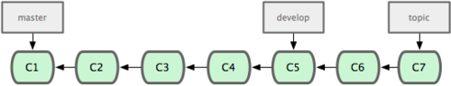
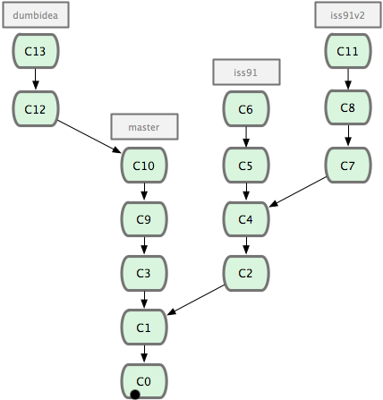

# Git 基本用法

## 1. 查看帮助

```shell
$ git help <verb>
$ git <verb> --help
$ man git-<verb>
```

## 2. 取得项目的 Git 仓库

1. 新建仓库 `git init`  
要对现有的某个项目开始用 Git 管理，只需到此项目所在的目录执行：`git init`
2. 从现有仓库克隆 `git clone <url>`  
克隆仓库的命令格式为 `git clone <url>`，`url` 为要克隆的项目地址
> Git 支持许多数据传输协议。你可以用 git://，http(s):// 或者 user@server:/path.git 表示的 SSH 传输协议。

## 3. 记录每次更新到仓库

1. 检查当前文件状态 `git status`  
Git 不会自动将之纳入跟踪范围，除非你使用命令添加，以下为一次查看状态时的输出：
```shell
$ git status
On branch master # 当前分支（master）
Changes to be committed: # 缓存区文件
  (use "git reset HEAD <file>..." to unstage)

        new file:   README
        modified:   benchmarks.rb

Changes not staged for commit: # 未跟踪文件
  (use "git add <file>..." to update what will be committed)
  (use "git checkout -- <file>..." to discard changes in working directory)

        modified:   benchmarks.rb
```
2. 跟踪新文件 `git add <file>...` `<file>` 为文件名/目录名，为目录名时表示递归跟踪该目录下所有的文件

3. 忽略某些文件  
我们总会有些文件无需纳入 Git 的管理，也不希望它们总出现在未跟踪文件列表。通常都是些自动生成的文件，比如日志文件，或者编译过程中创建的临时文件等。可以创建一个名为 `.gitignore` 的文件，列出要忽略的文件模式。  

**文件 `.gitignore` 的格式规范如下：**
* 所有空行或者以注释符号 ＃ 开头的行都会被 Git 忽略。
* 可以使用标准的 `glob 模式` 匹配。
* 匹配模式最后跟反斜杠（/）说明要忽略的是目录。
* 要忽略指定模式以外的文件或目录，可以在模式前加上惊叹号（!）取反。 

** `glob 模式`（ shell 所使用的简化了的正则表达式）：**  
* 星号（`*`）匹配零个或多个任意字符
* `[<要匹配的字符>]` 匹配任何一个列在方括号中的字符（`[abc]` 表示a\b\c任意一个均可）
* 问号（`?`）只匹配一个任意字符
* 如果在方括号中使用短划线（`-`）分隔两个字符，表示所有在这两个字符范围内的都可以匹配（比如 [0-9] 表示匹配所有 0 到 9 的数字）
```
# 此为注释 – 将被 Git 忽略
# 忽略所有 .a 结尾的文件
*.a
# 但 lib.a 除外
!lib.a
# 仅仅忽略项目根目录下的 TODO 文件，不包括 subdir/TODO
/TODO
# 忽略 build/ 目录下的所有文件
build/
# 会忽略 doc/notes.txt 但不包括 doc/server/arch.txt
doc/*.txt
# ignore all .txt files in the doc/ directory
doc/**/*.txt
```

4. 查看已暂存和未暂存的更新 `git diff`  
此命令比较的是 **工作目录中当前文件和暂存区域快照之间的差异**，也就是 **修改之后还没有暂存起来的变化内容**。若要看 **已经暂存起来的文件和上次提交时的快照之间的差异**，可以用 `git diff --cached` 命令。（Git 1.6.1 及更高版本还允许使用 `git diff --staged`，效果是相同的，但更好记些。）

## 4. 提交更新

1. 提交更新 `git commit`  
在此之前，请一定要确认还有什么修改过的或新建的文件还没有 `git add` 过，否则提交的时候不会记录这些还没暂存起来的变化。所以，每次准备提交前，先用 `git status` 看下，是不是都已暂存起来了，然后再运行提交命令 `git commit`
```shell
$ git commit
```
这种方式会启动文本编辑器以便输入本次提交的说明。
编辑器会显示类似下面的文本信息：  
```
# Please enter the commit message for your changes. Lines starting
# with '#' will be ignored, and an empty message aborts the commit.
# On branch master
# Changes to be committed:
#       new file:   README
#       modified:   benchmarks.rb
#
~
~
~
".git/COMMIT_EDITMSG" 10L, 283C
```
默认的提交消息包含最后一次运行 `git status` 的输出，放在注释行里，另外开头还有一空行，供你输入提交说明。你完全可以去掉这些注释行，不过留着也没关系，多少能帮你回想起这次更新的内容有哪些。（如果觉得这还不够，可以用 `-v` 选项将修改差异的每一行都包含到注释中来。）退出编辑器时，Git 会丢掉注释行，将说明内容和本次更新提交到仓库。
```shell
$ git commit -m "Story 182: Fix benchmarks for speed"
[master 463dc4f] Story 182: Fix benchmarks for speed
 2 files changed, 3 insertions(+)
 create mode 100644 README
```
现在你已经创建了第一个提交！可以看到，提交后它会告诉你，当前是在哪个分支（`master`）提交的，本次提交的完整 SHA-1 校验和是什么（`463dc4f`），以及在本次提交中，有多少文件修订过，多少行添改和删改过。  

提交时记录的是放在暂存区域的快照，任何还未暂存的仍然保持已修改状态，可以在下次提交时纳入版本管理。每一次运行提交操作，都是对你项目作一次快照，以后可以回到这个状态，或者进行比较。

2. 跳过使用暂存区域 `git commit -a`  
Git 提供了一个跳过使用暂存区域的方式，只要在提交的时候，给 `git commit` 加上 `-a` 选项，Git 就会自动把所有已经跟踪过的文件暂存起来一并提交，从而跳过 `git add` 步骤

3. 移除文件 `git rm`  
要从 Git 中移除某个文件，就必须要从已跟踪文件清单中移除（确切地说，是从暂存区域移除），然后提交。可以用 `git rm` 命令完成此项工作，并连带 **从工作目录中删除指定的文件**，这样以后就不会出现在未跟踪文件清单中了。

如果只是简单地从工作目录中手工删除文件，运行 `git status` 时就会在 “Changes not staged for commit” 部分（也就是未暂存清单）
然后再运行 `git rm` 记录此次移除文件的操作
最后提交的时候，该文件就不再纳入版本管理了。如果删除之前修改过并且已经放到暂存区域的话，则必须要用强制删除选项 `-f`（译注：即 force 的首字母），以防误删除文件后丢失修改的内容。  

把文件从 Git 仓库中删除（亦即从暂存区域移除），但仍然希望保留在当前工作目录中。用 `--cached` 选项即可：
```shell
# <file> 文件名/目录，也可使用 glob 模式
$ git rm --cached <file>
# 删除所有 log/ 目录下扩展名为 .log 的文件。
$ git rm log/\*.log
# 递归删除当前目录及其子目录中所有 ~ 结尾的文件
$ git rm \*~
```
4. 移动文件 `git mv file_from file_to`  
运行 `git mv` 就相当于运行了下面三条命令：
```shell
# 如此分开操作，Git 也会意识到这是一次改名
$ mv README.txt README
$ git rm README.txt
$ git add README
```

## 5. 查看提交历史
`git log`  
会按提交时间列出所有的更新，最近的更新排在最上面。每次更新都有一个 SHA-1 校验和、作者的名字和电子邮件地址、提交时间，最后缩进一个段落显示提交说明。  
1. `-p` 展开显示每次提交的内容差异  
        * `--word-diff` 单词层面的对比  

        ```shell
        $ git log -U1 --word-diff
        commit ca82a6dff817ec66f44342007202690a93763949
        Author: Scott Chacon <schacon@gee-mail.com>
        Date:   Mon Mar 17 21:52:11 2008 -0700

            changed the version number

        diff --git a/Rakefile b/Rakefile
        index a874b73..8f94139 100644
        --- a/Rakefile
        +++ b/Rakefile
        @@ -7,3 +7,3 @@ spec = Gem::Specification.new do |s|
            s.name      =   "simplegit"
            s.version   =   [-"0.1.0"-]{+"0.1.1"+}
            s.author    =   "Scott Chacon"
        ```
        
        这里并没有平常看到的添加行或者删除行的信息。这里的对比显示在行间。新增加的单词被 `{+ +}` 括起来，被删除的单词被 `[- -]` 括起来。在进行单词层面的对比的时候，你可能希望上下文（ context ）行数从默认的 3 行，减为 1 行，那么可以使用 `-U1` 选项。上面的例子中，我们就使用了这个选项。
        * `-2` 仅显示最近的两次更新  
        * `--stat` 仅显示简要的增改行数统计，每个提交都列出了修改过的文件，以及其中添加和移除的行数，并在最后列出所有增减行数小计  

2. `--pretty` 指定使用完全不同于默认格式的方式展示提交历史
    * `oneline` 将每个提交放在一行显示
    * `format` 可以定制要显示的记录格式  

`format` 常用的格式占位符写法及其代表的意义

| 选项   | 说明
| :---- | :----------------------------- |
| %H	| 提交对象（`commit`）的完整哈希字串
| %h	| 提交对象的简短哈希字串
| %T	| 树对象（`tree`）的完整哈希字串
| %t	| 树对象的简短哈希字串
| %P	| 父对象（`parent`）的完整哈希字串
| %p	| 父对象的简短哈希字串
| %an	| 作者（`author`）的名字
| %ae	| 作者的电子邮件地址
| %ad	| 作者修订日期（可以用`-date=`定制格式）
| %ar	| 作者修订日期，按多久以前的方式显示
| %cn	| 提交者(`committer`)的名字
| %ce	| 提交者的电子邮件地址
| %cd	| 提交日期
| %cr	| 提交日期，按多久以前的方式显示
| %s	| 提交说明

```shell
$ git log --pretty=format:"%h - %an, %ar : %s"
ca82a6d - Scott Chacon, 11 months ago : changed the version number
085bb3b - Scott Chacon, 11 months ago : removed unnecessary test code
a11bef0 - Scott Chacon, 11 months ago : first commit
```
用 `oneline` 或 `format` 时结合 `--graph` 选项，可以看到开头多出一些 ASCII 字符串表示的简单图形，形象地展示了每个提交所在的分支及其分化衍合情况。在我们之前提到的 Grit 项目仓库中可以看到：
```
$ git log --pretty=format:"%h %s" --graph
* 2d3acf9 ignore errors from SIGCHLD on trap
*  5e3ee11 Merge branch 'master' of git://github.com/dustin/grit
|\
| * 420eac9 Added a method for getting the current branch.
* | 30e367c timeout code and tests
* | 5a09431 add timeout protection to grit
* | e1193f8 support for heads with slashes in them
|/
* d6016bc require time for xmlschema
*  11d191e Merge branch 'defunkt' into local
```

`--pretty` 常用的选项及其释义

| 选项	         | 说明
| :------------ | :------------------------ |
| `-p`	        | 按补丁格式显示每个更新之间的差异
| `--word-diff`	| 按 word diff 格式显示差异
| `--stat`	    | 显示每次更新的文件修改统计信息
| `--shortstat`	| 只显示`--stat`中最后的行数修改添加移除统计
| `--name-only`	| 在提交信息后显示已修改的文件清单
| `--name-status`| 显示新增、修改、删除的文件清单
| `--abbrev-commit`| 仅显示`SHA-1`的前几个字符，而非所有的`40`个字符
| `--relative-date`| 使用较短的相对时间显示
| `--graph`	     | 显示`ASCII`图形表示的分支合并历史
| `--pretty`	 | 使用其他格式显示历史提交信息。可用的选项包括 oneline，short，full，fuller 和 format（后跟指定格式）
| `--oneline`	 | `--pretty=oneline --abbrev-commit` 的简化用法

2. 限制输出长度

| 选项	             | 说明
| :-------------------- | :----------------- |
| `-(n)`	            | 仅显示最近的 n 条提交
| `--since, --after`    | 仅显示指定时间之后的提交
| `--until`, `--before` | 仅显示指定时间之前的提交
| `--author`	        | 仅显示指定作者相关的提交
| `--committer`	        | 仅显示指定提交者相关的提交
```shell
# 如果要查看 Git 仓库中，2008 年 10 月期间，Junio Hamano 提交的但未合并的测试脚本（位于项目的 t/ 目录下的文件），可以用下面的查询命令：
$ git log --pretty="%h - %s" --author=gitster --since="2008-10-01" \
   --before="2008-11-01" --no-merges -- t/
5610e3b - Fix testcase failure when extended attribute
acd3b9e - Enhance hold_lock_file_for_{update,append}()
f563754 - demonstrate breakage of detached checkout wi
d1a43f2 - reset --hard/read-tree --reset -u: remove un
51a94af - Fix "checkout --track -b newbranch" on detac
b0ad11e - pull: allow "git pull origin $something:$cur
```

## 6. 撤销操作  

1. 修改最后一次提交  
` git commit --amend` 重新提交，此命令将使用当前的暂存区域快照提交。如果刚才提交完没有作任何改动，直接运行此命令的话，相当于有机会重新编辑提交说明，但将要提交的文件快照和之前的一样。如果刚才提交时忘了暂存某些修改，可以先补上暂存操作，然后再运行 `--amend` 提交。

2. 取消已经暂存的文件  
`git reset HEAD <file>...` 取消暂存

3. 取消对文件的修改  
`git checkout -- <file>...` 回到之前的状态（也就是修改之前的版本）,这条命令有些危险，所有对文件的修改都没有了，因为我们把之前版本的文件复制过来重写了此文件。所以在用这条命令前，请务必确定真的不再需要保留刚才的修改。
> 任何已经提交到 Git 的都可以被恢复，即使文件已经被删除。没有提交过的，对 Git 来说它们就像从未存在过一样不可恢复。

## 7. 远程仓库的使用

要参与任何一个 Git 项目的协作，必须要了解该如何管理远程仓库。远程仓库是指托管在网络上的项目仓库，可能会有好多个，其中有些你只能读，另外有些可以写。同他人协作开发某个项目时，需要管理这些远程仓库，以便推送或拉取数据，分享各自的工作进展。 管理远程仓库的工作，包括添加远程库，移除废弃的远程库，管理各式远程库分支，定义是否跟踪这些分支，等等。

1. 查看当前的远程库  
`git remote` 列出每个远程库的简短名字，在克隆完某个项目后，至少可以看到一个名为 origin 的远程库，Git 默认使用这个名字来标识你所克隆的原始仓库。  
`-v` 选项（`--verbose` 的简写），显示对应的克隆地址

2. 添加远程仓库  
`git remote add [shortname] [url]` 添加一个新的远程仓库，可以指定一个简单的名字，以便将来引用。  

3. 从远程仓库抓取数据  
`git fetch [shortname]/[url]` 抓取数据，此命令会到远程仓库中拉取所有你本地仓库中还没有的数据。如果是克隆了一个仓库，此命令会自动将远程仓库归于 `origin` 名下。所以，`git fetch origin` 会抓取从你上次克隆以来别人上传到此远程仓库中的所有更新（或是上次 fetch 以来别人提交的更新）。有一点很重要，fetch 命令只是将远端的数据拉到本地仓库，并不自动合并到当前工作分支，只有当你确实准备好了，才能手工合并。  
`git pull` 从原始克隆的远端仓库中抓取数据后，合并到工作目录中的当前分支。如果设置了某个分支用于跟踪某个远端仓库的分支，可以使用 `git pull` 命令自动抓取数据下来，然后将远端分支自动合并到本地仓库中当前分支。  

4. 推送数据到远程仓库  
`git push [remote-name] [branch-name]` 将本地仓库中的数据推送到远程仓库。只有在所克隆的服务器上有写权限，或者同一时刻没有其他人在推数据，这条命令才会如期完成任务。如果在你推数据前，已经有其他人推送了若干更新，那你的推送操作就会被驳回。你必须先把他们的更新抓取到本地，合并到自己的项目中，然后才可以再次推送。

5. 查看远程仓库信息  
`git remote show [remote-name]` 查看某个远程仓库的详细信息。  
```shell
$ git remote show origin
* remote origin
  URL: git@github.com:defunkt/github.git
  Remote branch merged with 'git pull' while on branch issues # 运行 git pull 时将自动合并的分支
    issues
  Remote branch merged with 'git pull' while on branch master # 运行 git pull 时将自动合并的分支
    master
  New remote branches (next fetch will store in remotes/origin) # 未同步到本地的远端分支
    caching 
  Stale tracking branches (use 'git remote prune') # 已同步到本地但在远端服务器上已被删除的分支
    libwalker
    walker2
  Tracked remote branches # 处于跟踪状态中的远端分支
    acl
    apiv2
    dashboard2
    issues
    master
    postgres
  Local branch pushed with 'git push' # 运行 git push 时缺省推送的分支是什么
    master:master
```

6. 远程仓库的删除和重命名  
`git remote rename` 修改某个 **远程仓库在本地的简称**   
> 注意，对远程仓库的重命名，也会使对应的分支名称发生变化，
碰到远端仓库服务器迁移，或者原来的克隆镜像不再使用，又或者某个参与者不再贡献代码，那么需要移除对应的远端仓库，可以运行 `git remote rm` 命令。  

## 8. 打标签

Git 也可以对某一时间点上的版本打上标签。我们一起来学习如何列出所有可用的标签，如何新建标签，以及各种不同类型标签之间的差别。

1. 列出已有的标签  
`git tag` 列出现有标签，显示的标签按字母顺序排列，所以标签的先后并不表示重要程度的轻重。可以用特定的搜索模式列出符合条件的标签。

2. 新建标签  
Git 使用的标签有两种类型：轻量级的（lightweight）和含附注的（annotated）。轻量级标签就像是个不会变化的分支，实际上它就是个指向特定提交对象的引用。而含附注标签，实际上是存储在仓库中的一个独立对象，它有自身的校验和信息，包含着标签的名字，电子邮件地址和日期，以及标签说明，标签本身也允许使用 GNU Privacy Guard (GPG) 来签署或验证。一般我们都建议使用含附注型的标签，以便保留相关信息；当然，如果只是临时性加注标签，或者不需要旁注额外信息，用轻量级标签也没问题。
    * 含附注的标签  
    `-a [tag-name]` 创建一个含附注类型的标签，（ annotated 的首字母）  
    `-m` 指定对应的标签说明，Git 会将此说明一同保存在标签对象中。如果没有给出该选项，Git 会启动文本编辑软件供你输入标签说明。  
    `git show [tag-name]` 查看相应标签的版本信息，并连同显示打标签时的提交对象。
    * 签署标签  
    `-s` 如果有自己的私钥，可以用 GPG 来签署标签（signed 的首字母） 
    * 轻量级标签  
    轻量级标签实际上就是一个保存着对应提交对象的校验和信息的文件。  
    `git tag [tag-name]` 新建轻量级标签

3. 验证标签  
`git tag -v [tag-name]` （verify 的首字母）验证已经签署的标签。此命令会调用 GPG 来验证签名，所以你需要有签署者的公钥，存放在 keyring 中才能验证。
```shell
# 若是没有签署者的公钥，会报告类似下面这样的错误：
gpg: Signature made Wed Sep 13 02:08:25 2006 PDT using DSA key ID F3119B9A
gpg: Can't check signature: public key not found
error: could not verify the tag 'v1.4.2.1'
```

4. 后期加注标签  
 `git tag -a [tag-name] [对应提交对象的校验（或前几位字符）]` 在后期对早先的某次提交加注标签

5. 分享标签  
`git push [shortname]/[url] [tagname]`  默认情况下 `git push` 并不会把标签传送到远端服务器上，只有通过显式命令才能分享标签到远端仓库。其命令格式如同推送分支。其他人克隆共享仓库或拉取数据同步后，也会看到这些标签。如果要一次推送所有本地新增的标签上去，可以使用 `--tags` 选项。

## Git 实用技巧

1. 自动补全
如果你用的是 `Bash shel`l，可以试试看 Git 提供的自动补全脚本。下载 Git 的源代码，进入 `contrib/completion` 目录，会看到一个 `git-completion.bash` 文件。将此文件复制到你自己的用户主目录中（译注：按照下面的示例，还应改名加上点：`cp git-completion.bash` `~/.git-completion.bash`），并把下面一行内容添加到你的 `.bashrc` 文件中：
```shell
source ~/.git-completion.bash
```
也可以为系统上所有用户都设置默认使用此脚本。Mac 上将此脚本复制到 `/opt/local/etc/bash_completion.d` 目录中，Linux 上则复制到 `/etc/bash_completion.d/` 目录中。这两处目录中的脚本，都会在 Bash 启动时自动加载。如果在 Windows 上安装了 msysGit，默认使用的 Git Bash 就已经配好了这个自动补全脚本，可以直接使用。

在输入 Git 命令的时候可以敲两次跳格键（`Tab`），就会看到列出所有匹配的可用命令建议

2. Git 命令别名
Git 并不会推断你输入的几个字符将会是哪条命令，不过如果想偷懒，少敲几个命令的字符，可以用 git config 为命令设置别名。
```shell
$ git config --global alias.co checkout
$ git config --global alias.br branch
$ git config --global alias.ci commit
$ git config --global alias.st status
```
```shell
# 使用这种技术还可以创造出新的命令，比方说取消暂存文件时的输入比较繁琐，可以自己设置一下：
$ git config --global alias.unstage 'reset HEAD --'
# 这样一来，下面的两条命令完全等同：
$ git unstage fileA
$ git reset HEAD fileA

# last 命令：
$ git config --global alias.last 'log -1 HEAD'
# 然后要看最后一次的提交信息，就变得简单多了：
$ git last
commit 66938dae3329c7aebe598c2246a8e6af90d04646
Author: Josh Goebel <dreamer3@example.com>
Date:   Tue Aug 26 19:48:51 2008 +0800

    test for current head

    Signed-off-by: Scott Chacon <schacon@example.com>
```
Git 只是简单地在命令中替换了你设置的别名。  
有时候我们希望运行某个外部命令，而非 Git 的子命令，这个好办，只需要在命令前加上 `!` 就行。如果你自己写了些处理 Git 仓库信息的脚本的话，就可以用这种技术包装起来。
```shell
# 我们可以设置用 git visual 启动 gitk：
$ git config --global alias.visual '!gitk'
```
---
到目前为止，你已经学会了最基本的 Git 本地操作：创建和克隆仓库，做出修改，暂存并提交这些修改，以及查看所有历史修改记录。

# Git 分支

> Git 保存的不是文件差异或者变化量，而只是一系列文件快照。  
> 在 Git 中提交时，会保存一个提交（commit）对象，该对象包含一个指向暂存内容快照的指针，包含本次提交的作者等相关附属信息，包含零个或多个指向该提交对象的父对象指针：首次提交是没有直接祖先的，普通提交有一个祖先，由两个或多个分支合并产生的提交则有多个祖先。  
> 
> 当使用 `git commit` 新建一个提交对象前，Git 会先计算每一个子目录的校验和，然后在 Git 仓库中将这些目录保存为树（`tree`）对象。之后 Git 创建的提交对象，除了包含相关提交信息以外，还包含着指向这个树对象（项目根目录）的指针，如此它就可以在将来需要的时候，重现此次快照的内容了。  
> 
> 作些修改后再次提交，那么这次的提交对象会包含一个指向上次提交对象的指针。  
> 
> **Git 中的分支**，其实本质上仅仅是个指向 commit 对象的可变指针。Git 会使用 master 作为分支的默认名字。在若干次提交后，你其实已经有了一个指向最后一次提交对象的 master 分支，它在每次提交的时候都会自动向前移动。  
> 
> Git 又是如何创建一个新的分支的呢？答案很简单，创建一个新的分支指针。
> 
> Git 是如何知道你当前在哪个分支上工作的呢？其实答案也很简单，它保存着一个名为 `HEAD` 的特别指针。请注意它和你熟知的许多其他版本控制系统（比如 Subversion 或 CVS）里的 HEAD 概念大不相同。在 Git 中，它是一个指向你正在工作中的本地分支的指针（译注：将 `HEAD` 想象为当前分支的别名。）。运行 `git branch` 命令，仅仅是建立了一个新的分支，但不会自动切换到这个分支中去，要切换到其他分支，可以执行 `git checkout` 命令。  
> 
> 由于 Git 中的分支实际上仅是一个包含所指对象校验和（40 个字符长度 SHA-1 字串）的文件，所以创建和销毁一个分支就变得非常廉价。说白了，新建一个分支就是向一个文件写入 41 个字节（外加一个换行符）那么简单，当然也就很快了。
> 
> 这和大多数版本控制系统形成了鲜明对比，它们管理分支大多采取备份所有项目文件到特定目录的方式，所以根据项目文件数量和大小不同，可能花费的时间也会有相当大的差别，快则几秒，慢则数分钟。而 Git 的实现与项目复杂度无关，它永远可以在几毫秒的时间内完成分支的创建和切换。同时，因为每次提交时都记录了祖先信息（译注：即 `parent` 对象），将来要合并分支时，寻找恰当的合并基础（译注：即共同祖先）的工作其实已经自然而然地摆在那里了，所以实现起来非常容易。Git 鼓励开发者频繁使用分支，正是因为有着这些特性作保障。

## 1. 分支的基本操作

1. 查看分支  
`git branch` 给出当前所有分支的清单  
```shell
# 前面的 * 代表当前所在分支
$ git branch
  iss53
* master
  testing
```
`-v` 查看各个分支最后一个提交对象的信息  
`--merged` 查看哪些分支已被并入当前分支（哪些分支是当前分支的直接上游）  
`--no-merged`(1.5.6+) 尚未与当前分支合并的分支  

2. 新建分支  
`git branch [branch-name]` 新建分支

3. 切换分支  
`git checkout [branch-name]` 切换分支

4. 新建并切换到该分支   
`git checkout -b [branch-name]` 新建并切换到该分支，相当于同时执行 `git branch [branch-name]`、
`git checkout [branch-name]` 两条命令

5. 删除分支  
`git branch -d [branch-name]` 删除分支，如果要删除的分支包含未合并的内容，Git 会阻止删除，并会报错：
```shell
error: The branch 'testing' is not fully merged.
If you are sure you want to delete it, run 'git branch -D testing'.
```
此时可以使用 `git branch -D [branch-name]` 强制删除（`-D` 大写）

6. 合并分支  
`git merge [branch-name]` 合并分支，合并时会将指定分支（`[branch-name]` 所代表的分支）合并到当前所在的分支，所以在合并之前最好先确定当前所在的分支。  
有时候合并操作并不会如此顺利。如果在不同的分支中都修改了同一个文件的同一部分，Git 就无法干净地把两者合到一起（译注：逻辑上说，这种问题只能由人来裁决。）。  
Git 作了合并，但没有提交，它会停下来等你解决冲突。要看看哪些文件在合并时发生冲突，可以用 `git status` 查阅。任何包含未解决冲突的文件都会以未合并（unmerged）的状态列出。Git 会在有冲突的文件里加入标准的冲突解决标记，可以通过它们来手工定位并解决这些冲突。  

> 如果顺着一个分支走下去可以到达另一个分支的话，那么 Git 在合并两者时，只会简单地把指针右移，因为这种单线的历史分支不存在任何需要解决的分歧，所以这种合并过程可以称为快进（Fast forward）。  
> 值得一提的是 Git 可以自己裁决哪个共同祖先才是最佳合并基础；这和 CVS 或 Subversion（1.5 以后的版本）不同，它们需要开发者手工指定合并基础。所以此特性让 Git 的合并操作比其他系统都要简单不少。

## 2. 利用分支进行开发的流程

1. 长期分支
由于 Git 使用简单的三方合并，你可以同时拥有多个开放的分支，每个分支用于完成特定的任务，随着开发的推进，你可以随时把某个特性分支的成果并到其他分支中。  
许多使用 Git 的开发者都喜欢用这种方式来开展工作，比如仅在 `master` 分支中保留完全稳定的代码，即已经发布或即将发布的代码。与此同时，他们还有一个名为 `develop` 或 `next` 的平行分支，专门用于后续的开发，或仅用于稳定性测试 — 当然并不是说一定要绝对稳定，不过一旦进入某种稳定状态，便可以把它合并到 `master` 里。这样，在确保这些已完成的特性分支能够通过所有测试，并且不会引入更多错误之后，就可以并到主干分支中，等待下一次的发布。  
本质上我们刚才谈论的，是随着提交对象不断右移的指针。稳定分支的指针总是在提交历史中落后一大截，而前沿分支总是比较靠前。  

  

你可以用这招维护不同层次的稳定性。某些大项目还会有个 `proposed`（建议）或 `pu`（`proposed updates`，建议更新）分支，它包含着那些可能还没有成熟到进入 next 或 `master` 的内容。这么做的目的是拥有不同层次的稳定性：当这些分支进入到更稳定的水平时，再把它们合并到更高层分支中去。再次说明下，使用多个长期分支的做法并非必需，不过一般来说，对于特大型项目或特复杂的项目，这么做确实更容易管理。

2. 特性分支
在任何规模的项目中都可以使用特性（Topic）分支。一个特性分支是指一个短期的，用来实现单一特性或与其相关工作的分支。可能你在以前的版本控制系统里从未做过类似这样的事情，因为通常创建与合并分支消耗太大。然而在 Git 中，一天之内建立、使用、合并再删除多个分支是常见的事。  
该技术允许你迅速且完全的进行语境切换 — 因为你的工作分散在不同的流水线里，每个分支里的改变都和它的目标特性相关，浏览代码之类的事情因而变得更简单了。你可以把作出的改变保持在特性分支中几分钟，几天甚至几个月，等它们成熟以后再合并，而不用在乎它们建立的顺序或者进度。  
我们来看一个实际的例子。请看图 3-20，由下往上，起先我们在 master 工作到 C1，然后开始一个新分支 iss91 尝试修复 91 号缺陷，提交到 C6 的时候，又冒出一个解决该问题的新办法，于是从之前 C4 的地方又分出一个分支 iss91v2，干到 C8 的时候，又回到主干 master 中提交了 C9 和 C10，再回到 iss91v2 继续工作，提交 C11，接着，又冒出个不太确定的想法，从 master 的最新提交 C10 处开了个新的分支 dumbidea 做些试验。  

  

现在，假定两件事情：我们最终决定使用第二个解决方案，即 iss91v2 中的办法；另外，我们把 dumbidea 分支拿给同事们看了以后，发现它竟然是个天才之作。所以接下来，我们准备抛弃原来的 iss91 分支（实际上会丢弃 C5 和 C6），直接在主干中并入另外两个分支。  

  

> 这些分支全部都是本地分支，这一点很重要。当你在使用分支及合并的时候，一切都是在你自己的 Git 仓库中进行的 — 完全不涉及与服务器的交互。

## 3. 远程分支

远程分支（remote branch）是对远程仓库中的分支的索引。它们是一些无法移动的本地分支；只有在 Git 进行网络交互时才会更新。远程分支就像是书签，提醒着你上次连接远程仓库时上面各分支的位置。用 `(远程仓库名)/(分支名)` 这样的形式表示远程分支。  

1. 推送本地分支
`git push (远程仓库名) (分支名)`
```shell
# 上传我本地的 serverfix 分支到远程仓库中去，仍旧称它为 serverfix 分支
git push origin serverfix
# 或（两者效果相同，冒号后面为该分支在远程服务器上的名称，可根据需要命名）
git push origin serverfix:serverfix
```

2. 跟踪远程分支
从远程分支 `checkout` 出来的本地分支，称为 跟踪分支 (`tracking branch`)。跟踪分支是一种和某个远程分支有直接联系的本地分支。在跟踪分支里输入 `git push`，Git 会自行推断应该向哪个服务器的哪个分支推送数据。同样，在这些分支里运行 `git pull` 会获取所有远程索引，并把它们的数据都合并到本地分支中来。  
在克隆仓库时，Git 通常会自动创建一个名为 master 的分支来跟踪 origin/master。这正是 git push 和 git pull 一开始就能正常工作的原因。当然，你可以随心所欲地设定为其它跟踪分支，
`git checkout -b [本地分支名] [远程名]/[分支名]`  
或  
`git checkout --track [远程名]/[分支名]`(1.6.2+)

3. 删除远程分支  
`git push [远程名] :[分支名]` 有种方便记忆这条命令的方法：记住我们不久前见过的 `git push [远程名] [本地分支]:[远程分支]` 语法，如果省略 `[本地分支]`，那就等于是在说“在这里提取空白然后把它变成`[远程分支]`”。

## 4. 分支的衍合

把一个分支中的修改整合到另一个分支的办法有两种：`merge` 和 `rebase`（`rebase` 的翻译暂定为“衍合”）  
之前介绍过，最容易的整合分支的方法是 `merge` 命令，它会把两个分支最新的快照（以及二者最新的共同祖先）进行三方合并，合并的结果是产生一个新的提交对象。  
有了 `rebase` 命令，就可以把在一个分支里提交的改变移到另一个分支里重放一遍。你可以把在 分支1 里产生的变化补丁在 分支2 的基础上重新打一遍。在 Git 里，这种操作叫做衍合（rebase）。  
虽然最后整合得到的结果没有任何区别，但衍合能产生一个更为整洁的提交历史。如果视察一个衍合过的分支的历史记录，看起来会更清楚：仿佛所有修改都是在一根线上先后进行的，尽管实际上它们原本是同时并行发生的。  
一般我们使用衍合的目的，是想要得到一个能在远程分支上干净应用的补丁 — 比如某些项目你不是维护者，但想帮点忙的话，最好用衍合：先在自己的一个分支里进行开发，当准备向主项目提交补丁的时候，根据最新的 `origin/master` 进行一次衍合操作然后再提交，这样维护者就不需要做任何整合工作（译注：实际上是把解决分支补丁同最新主干代码之间冲突的责任，化转为由提交补丁的人来解决。），只需根据你提供的仓库地址作一次快进合并，或者直接采纳你提交的补丁。
> 合并结果中最后一次提交所指向的快照，无论是通过衍合，还是三方合并，都会得到相同的快照内容，只不过提交历史不同罢了。衍合是按照每行的修改次序重演一遍修改，而合并是把最终结果合在一起。

> 衍合的风险  
> **一旦分支中的提交对象发布到公共仓库，就千万不要对该分支进行衍合操作**。  
> 如果你遵循这条金科玉律，就不会出差错。  
> 在进行衍合的时候，实际上抛弃了一些现存的提交对象而创造了一些类似但不同的新的提交对象。如果你把原来分支中的提交对象发布出去，并且其他人更新下载后在其基础上开展工作，而稍后你又用 git rebase 抛弃这些提交对象，把新的重演后的提交对象发布出去的话，你的合作者就不得不重新合并他们的工作，这样当你再次从他们那里获取内容时，提交历史就会变得一团糟。  
> 如果把衍合当成一种在推送之前清理提交历史的手段，而且仅仅衍合那些尚未公开的提交对象，就没问题。如果衍合那些已经公开的提交对象，并且已经有人基于这些提交对象开展了后续开发工作的话，就会出现叫人沮丧的麻烦。

---
> 参考链接
> [Pro Git](http://iissnan.com/progit/) 