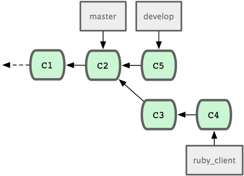

# 分布式 Git  

接下来，我们要学习下如何利用 Git 来组织和完成分布式工作流程。  

## 1. 分布式工作流程  

在 Git 网络中，每个开发者同时扮演着节点和集线器的角色，这就是说，每一个开发者都可以将自己的代码贡献到另外一个开发者的仓库中，或者建立自己的公共仓库，让其他开发者基于自己的工作开始，为自己的仓库贡献代码。于是，Git 的分布式协作便可以衍生出种种不同的工作流程。

### 1. 集中式工作流  

集中式工作流程使用的都是单点协作模型。一个存放代码仓库的中心服务器，可以接受所有开发者提交的代码。所有的开发者都是普通的节点，作为中心集线器的消费者，平时的工作就是和中心仓库同步数据。  

如果两个开发者从中心仓库克隆代码下来，同时作了一些修订，那么只有第一个开发者可以顺利地把数据推送到共享服务器。第二个开发者在提交他的修订之前，必须先下载合并服务器上的数据，解决冲突之后才能推送数据到共享服务器上。在 Git 中这么用也决无问题，这就好比是在用 Subversion（或其他 CVCS）一样，可以很好地工作。

如果你的团队不是很大，或者大家都已经习惯了使用集中式工作流程，完全可以采用这种简单的模式。只需要配置好一台中心服务器，并给每个人推送数据的权限，就可以开展工作了。但如果提交代码时有冲突， Git 根本就不会让用户覆盖他人代码，它直接驳回第二个人的提交操作。这就等于告诉提交者，你所作的修订无法通过快进（fast-forward）来合并，你必须先拉取最新数据下来，手工解决冲突合并后，才能继续推送新的提交。 绝大多数人都熟悉和了解这种模式的工作方式，所以使用也非常广泛。 

### 2. 集成管理员工作流

由于 Git 允许使用多个远程仓库，开发者便可以建立自己的公共仓库，往里面写数据并共享给他人，而同时又可以从别人的仓库中提取他们的更新过来。这种情形通常都会有个代表着官方发布的项目仓库（blessed repository），开发者们由此仓库克隆出一个自己的公共仓库（developer public），然后将自己的提交推送上去，请求官方仓库的维护者拉取更新合并到主项目。维护者在自己的本地也有个克隆仓库（integration manager），他可以将你的公共仓库作为远程仓库添加进来，经过测试无误后合并到主干分支，然后再推送到官方仓库。 

1. 项目维护者可以推送数据到公共仓库 blessed repository
2. 贡献者克隆此仓库，修订或编写新代码。
3. 贡献者推送数据到自己的公共仓库 developer public
4. 贡献者给维护者发送邮件，请求拉取自己的最新修订
5. 维护者在自己本地的 integration manger 仓库中 将贡献者的仓库加为远程仓库，合并更新并做测试
6. 维护者将合并后的更新推送到主仓库 blessed repository  

在 GitHub 网站上使用得最多的就是这种工作流。人们可以复制（fork 亦即克隆）某个项目到自己的列表中，成为自己的公共仓库。随后将自己的更新提交到这个仓库，所有人都可以看到你的每次更新。这么做最主要的优点在于，你可以按照自己的节奏继续工作，而不必等待维护者处理你提交的更新；而维护者也可以按照自己的节奏，任何时候都可以过来处理接纳你的贡献。

### 3. 司令官与副官工作流  

这其实是上一种工作流的变体。一般超大型的项目才会用到这样的工作方式，像是拥有数百协作开发者的 Linux 内核项目就是如此。各个集成管理员分别负责集成项目中的特定部分，所以称为副官（lieutenant）。而所有这些集成管理员头上还有一位负责统筹的总集成管理员，称为司令官（dictator）。司令官维护的仓库用于提供所有协作者拉取最新集成的项目代码。  

1. 一般的开发者在自己的特性分支上工作，并不定期地根据主干分支（dictator 上的 master）衍合。
2. 副官（lieutenant）将普通开发者的特性分支合并到自己的 master 分支中。
3. 司令官（dictator）将所有副官的 master 分支并入自己的 master 分支。
4. 司令官（dictator）将集成后的 master 分支推送到共享仓库 blessed repository 中，以便所有其他开发者以此为基础进行衍合。  

这种工作流程并不常用，只有当项目极为庞杂，或者需要多级别管理时，才会体现出优势。利用这种方式，项目总负责人（即司令官）可以把大量分散的集成工作委托给不同的小组负责人分别处理，最后再统筹起来，如此各人的职责清晰明确，也不易出错（译注：此乃分而治之）。  

## 2. 为项目作贡献  

作为项目贡献者，有哪些常见的工作模式。  
Git 如此灵活，人们的协作方式便可以各式各样，没有固定不变的范式可循，而每个项目的具体情况又多少会有些不同，比如说参与者的规模，所选择的工作流程，每个人的提交权限，以及 Git 以外贡献等等，都会影响到具体操作的细节。  
1. 提交指南  

开始分析特定用例之前，先来了解下如何撰写提交说明。一份好的提交指南可以帮助协作者更轻松更有效地配合。Git 项目本身就提供了一份文档（Git 项目源代码目录中  [Documentation/SubmittingPatches](https://github.com/git/git/blob/master/Documentation/SubmittingPatches)），列数了大量提示，从如何编撰提交说明到提交补丁，不一而足。

1. 请不要在更新中提交多余的白字符（whitespace）。Git 有种检查此类问题的方法，在提交之前，先运行 `git diff --check`，会把可能的多余白字符修正列出来。下面的示例，我已经把终端中显示为红色的白字符用 X 替换掉：
```shell
$ git diff --check
lib/simplegit.rb:5: trailing whitespace.
+    @git_dir = File.expand_path(git_dir)XX
lib/simplegit.rb:7: trailing whitespace.
+ XXXXXXXXXXX
lib/simplegit.rb:26: trailing whitespace.
+    def command(git_cmd)XXXX
```
2. 请将每次提交限定于完成一次逻辑功能。并且可能的话，适当地分解为多次小更新，以便每次小型提交都更易于理解。
请不要在周末穷追猛打一次性解决五个问题，而最后拖到周一再提交。就算是这样也请尽可能利用暂存区域，将之前的改动分解为每次修复一个问题，再分别提交和加注说明。如果针对两个问题改动的是同一个文件，可以试试看 `git add --patch` 的方式将部分内容置入暂存区域。无论是五次小提交还是混杂在一起的大提交，最终分支末端的项目快照应该还是一样的，但分解开来之后，更便于其他开发者复阅。这么做也方便自己将来取消某个特定问题的修复。
3. 提交说明的撰写。写得好可以让大家协作起来更轻松。一般来说，提交说明最好限制在一行以内，50 个字符以下，简明扼要地描述更新内容，空开一行后，再展开详细注解。Git 项目本身需要开发者撰写详尽注解，包括本次修订的因由，以及前后不同实现之间的比较，我们也该借鉴这种做法。另外，提交说明应该用祈使现在式语态，比如，不要说成 “I added tests for” 或 “Adding tests for” 而应该用 “Add tests for”。 下面是来自 tpope.net 的 Tim Pope 原创的提交说明格式模版，供参考：
```
本次更新的简要描述（50 个字符以内）

如果必要，此处展开详尽阐述。段落宽度限定在 72 个字符以内。
某些情况下，第一行的简要描述将用作邮件标题，其余部分作为邮件正文。
其间的空行是必要的，以区分两者（当然没有正文另当别论）。
如果并在一起，rebase 这样的工具就可能会迷惑。

另起空行后，再进一步补充其他说明。

 - 可以使用这样的条目列举式。

 - 一般以单个空格紧跟短划线或者星号作为每项条目的起始符。每个条目间用一空行隔开。
   不过这里按自己项目的约定，可以略作变化。
```

2. 私有的小型团队  

一个私有项目，与你一起协作的还有另外一到两位开发者。这里说私有，是指源代码不公开，其他人无法访问项目仓库。而你和其他开发者则都具有推送数据到仓库的权限。这种情况下，你们可以用 Subversion 或其他集中式版本控制系统类似的工作流来协作。你仍然可以得到 Git 带来的其他好处：离线提交，快速分支与合并等等，但工作流程还是差不多的。主要区别在于，合并操作发生在客户端而非服务器上。  
3. 私有团队间协作  

如果有几个小组分头负责若干特性的开发和集成，那他们之间的协作过程是怎样的。使用典型的集成管理员式工作流，每个组都有一名管理员负责集成本组代码，及更新项目主仓库的 master 分支。所有开发都在代表小组的分支上进行。

4. 公开的小型项目  

要给公开项目作贡献，情况就有些不同了。因为你没有直接更新主仓库分支的权限，得寻求其它方式把工作成果交给项目维护人。下面会介绍两种方法，第一种使用 git 托管服务商提供的仓库复制功能，一般称作 fork，比如 repo.or.cz 和 GitHub 都支持这样的操作，而且许多项目管理员都希望大家使用这样的方式。另一种方法是通过电子邮件寄送文件补丁。但不管哪种方式，起先我们总需要克隆原始仓库，而后创建特性分支开展工作。

5. 公开的大型项目  

许多大型项目都会立有一套自己的接受补丁流程，你应该注意下其中细节。但多数项目都允许通过开发者邮件列表接受补丁。整个工作流程类似上面的情形：为每个补丁创建独立的特性分支，而不同之处在于如何提交这些补丁。不需要创建自己可写的公共仓库，也不用将自己的更新推送到自己的服务器，你只需将每次提交的差异内容以电子邮件的方式依次发送到邮件列表中即可。

## 3. 项目的管理

### 1. 使用特性分支进行工作  

如果想要集成新的代码进来，最好局限在特性分支上做。临时的特性分支可以让你随意尝试，进退自如。比如碰上无法正常工作的补丁，可以先搁在那边，直到有时间仔细核查修复为止。创建的分支可以用相关的主题关键字命名，比如 `ruby_client` 或者其它类似的描述性词语，以帮助将来回忆。Git 项目本身还时常把分支名称分置于不同命名空间下，比如 `sc/ruby_client` 就说明这是 `sc` 这个人贡献的。  
```shell
# 新建临时分支：
$ git branch sc/ruby_client master
# 如果你希望立即转到分支上去工作，可以用 checkout -b：
$ git checkout -b sc/ruby_client master
```
### 2. 采纳来自邮件的补丁  

如果收到一个通过电邮发来的补丁，你应该先把它应用到特性分支上进行评估。有两种应用补丁的方法：`git apply` 或者 `git am`。  

使用 apply 命令应用补丁  

如果收到的补丁文件是用 git diff 或由其它 Unix 的 diff 命令生成，就该用 git apply 命令来应用补丁。假设补丁文件存在 /tmp/patch-ruby-client.patch，可以这样运行：  
```shell
$ git apply /tmp/patch-ruby-client.patch
```
这会修改当前工作目录下的文件，效果基本与运行 `patch -p1` 打补丁一样，但它更为严格，且不会出现混乱。如果是 `git diff` 格式描述的补丁，此命令还会相应地添加，删除，重命名文件。当然，普通的 `patch` 命令是不会这么做的。另外请注意，`git apply` 是一个事务性操作的命令，也就是说，要么所有补丁都打上去，要么全部放弃。所以不会出现 `patch` 命令那样，一部分文件打上了补丁而另一部分却没有，这样一种不上不下的修订状态。所以总的来说，`git apply` 要比 `patch` 严谨许多。因为仅仅是更新当前的文件，所以此命令不会自动生成提交对象，你得手工缓存相应文件的更新状态并执行提交命令。  

在实际打补丁之前，可以先用 `git apply --check` 查看补丁是否能够干净顺利地应用到当前分支中：
```shell
$ git apply --check 0001-seeing-if-this-helps-the-gem.patch
error: patch failed: ticgit.gemspec:1
error: ticgit.gemspec: patch does not apply
```
如果没有任何输出，表示我们可以顺利采纳该补丁。如果有问题，除了报告错误信息之外，该命令还会返回一个非零的状态，所以在 shell 脚本里可用于检测状态。  

使用 am 命令应用补丁  
如果贡献者也用 Git，且擅于制作 `format-patch` 补丁，那你的合并工作将会非常轻松。因为这些补丁中除了文件内容差异外，还包含了作者信息和提交消息。所以请鼓励贡献者用 `format-patch` 生成补丁。对于传统的 `diff` 命令生成的补丁，则只能用 `git apply` 处理。  

对于 `format-patch` 制作的新式补丁，应当使用 `git am` 命令。从技术上来说，`git am` 能够读取 mbox 格式的文件。这是种简单的纯文本文件，可以包含多封电邮，格式上用 `From` 加空格以及随便什么辅助信息所组成的行作为分隔行，以区分每封邮件，就像这样：  
```
From 330090432754092d704da8e76ca5c05c198e71a8 Mon Sep 17 00:00:00 2001
From: Jessica Smith <jessica@example.com>
Date: Sun, 6 Apr 2008 10:17:23 -0700
Subject: [PATCH 1/2] add limit to log function

Limit log functionality to the first 20
```

这是 `format-patch` 命令输出的开头几行，也是一个有效的 `mbox` 文件格式。如果有人用 `git send-email` 给你发了一个补丁，你可以将此邮件下载到本地，然后运行 `git am` 命令来应用这个补丁。如果你的邮件客户端能将多封电邮导出为 `mbox` 格式的文件，就可以用 `git am` 一次性应用所有导出的补丁。  

如果贡献者将 `format-patch` 生成的补丁文件上传到类似 Request Ticket 一样的任务处理系统，那么可以先下载到本地，继而使用 `git am` 应用该补丁：  
```shell
$ git am 0001-limit-log-function.patch
Applying: add limit to log function
```
你会看到它被干净地应用到本地分支，并自动创建了新的提交对象。作者信息取自邮件头 `From` 和 `Date`，提交消息则取自 `Subject` 以及正文中补丁之前的内容  

有时，我们也会遇到打不上补丁的情况。这多半是因为主干分支和补丁的基础分支相差太远，但也可能是因为某些依赖补丁还未应用。这种情况下，`git am` 会报错并询问该怎么做：  
```shell
$ git am 0001-seeing-if-this-helps-the-gem.patch
Applying: seeing if this helps the gem
error: patch failed: ticgit.gemspec:1
error: ticgit.gemspec: patch does not apply
Patch failed at 0001.
When you have resolved this problem run "git am --resolved".
If you would prefer to skip this patch, instead run "git am --skip".
To restore the original branch and stop patching run "git am --abort".
```
Git 会在有冲突的文件里加入冲突解决标记，这同合并或衍合操作一样。解决的办法也一样，先编辑文件消除冲突，然后暂存文件，最后运行 `git am --resolved` 提交修正结果：  
```shell
$ (fix the file)
$ git add ticgit.gemspec
$ git am --resolved
Applying: seeing if this helps the gem
```
如果想让 Git 更智能地处理冲突，可以用 `-3` 选项进行三方合并。如果当前分支未包含该补丁的基础代码或其祖先，那么三方合并就会失败，所以该选项默认为关闭状态。一般来说，如果该补丁是基于某个公开的提交制作而成的话，你总是可以通过同步来获取这个共同祖先，所以用三方合并选项可以解决很多麻烦：  
```shell
$ git am -3 0001-seeing-if-this-helps-the-gem.patch
Applying: seeing if this helps the gem
error: patch failed: ticgit.gemspec:1
error: ticgit.gemspec: patch does not apply
Using index info to reconstruct a base tree...
Falling back to patching base and 3-way merge...
No changes -- Patch already applied.
```
像上面的例子，对于打过的补丁我又再打一遍，自然会产生冲突，但因为加上了 `-3` 选项，所以它很聪明地告诉我，无需更新，原有的补丁已经应用。  

对于一次应用多个补丁时所用的 `mbox` 格式文件，可以用 `am` 命令的交互模式选项 `-i`，这样就会在打每个补丁前停住，询问该如何操作  
```shell
$ git am -3 -i mbox
Commit Body is:
--------------------------
seeing if this helps the gem
--------------------------
Apply? [y]es/[n]o/[e]dit/[v]iew patch/[a]ccept all
```
在多个补丁要打的情况下，这是个非常好的办法，一方面可以预览下补丁内容，同时也可以有选择性的接纳或跳过某些补丁。  

打完所有补丁后，如果测试下来新特性可以正常工作，那就可以安心地将当前特性分支合并到长期分支中去了。  

### 3. 检出远程分支  

如果贡献者有自己的 Git 仓库，并将修改推送到此仓库中，那么当你拿到仓库的访问地址和对应分支的名称后，就可以加为远程分支，然后在本地进行合并。  

比如，Jessica 发来一封邮件，说在她代码库中的 `ruby-client` 分支上已经实现了某个非常棒的新功能，希望我们能帮忙测试一下。我们可以先把她的仓库加为远程仓库，然后抓取数据，完了再将她所说的分支检出到本地来测试：  
```shell
$ git remote add jessica git://github.com/jessica/myproject.git
$ git fetch jessica
$ git checkout -b rubyclient jessica/ruby-client
```
这种做法便于同别人保持长期的合作关系。但前提是要求贡献者有自己的服务器，而我们也需要为每个人建一个远程分支。有些贡献者提交代码补丁并不是很频繁，所以通过邮件接收补丁效率会更高。同时我们自己也不会希望建上百来个分支，却只从每个分支取一两个补丁。但若是用脚本程序来管理，或直接使用代码仓库托管服务，就可以简化此过程。  

使用远程分支的另外一个好处是能够得到提交历史。不管代码合并是不是会有问题，至少我们知道该分支的历史分叉点，所以默认会从共同祖先开始自动进行三方合并，无需 `-3` 选项，也不用像打补丁那样祈祷存在共同的基准点。  

如果只是临时合作，只需用 `git pull` 命令抓取远程仓库上的数据，合并到本地临时分支就可以了。一次性的抓取动作自然不会把该仓库地址加为远程仓库。  
```shell
$ git pull git://github.com/onetimeguy/project.git
From git://github.com/onetimeguy/project
 * branch            HEAD       -> FETCH_HEAD
Merge made by recursive.
```

### 4. 决断代码取舍  

现在特性分支上已合并好了贡献者的代码，是时候决断取舍了。  
一般我们会先看下，特性分支上都有哪些新增的提交。比如在 `contrib` 特性分支上打了两个补丁，仅查看这两个补丁的提交信息，可以用 `--not` 选项指定要屏蔽的分支 `master`，这样就会剔除重复的提交历史：  
```shell
$ git log contrib --not master
commit 5b6235bd297351589efc4d73316f0a68d484f118
Author: Scott Chacon <schacon@gmail.com>
Date:   Fri Oct 24 09:53:59 2008 -0700

    seeing if this helps the gem

commit 7482e0d16d04bea79d0dba8988cc78df655f16a0
Author: Scott Chacon <schacon@gmail.com>
Date:   Mon Oct 22 19:38:36 2008 -0700

    updated the gemspec to hopefully work better
```
还可以查看每次提交的具体修改。请牢记，在 `git log` 后加 `-p` 选项将展示每次提交的内容差异。
看当前分支同其他分支合并时的完整内容差异，
```shell
$ git diff master
```
虽然能得到差异内容，但请记住，结果有可能和我们的预期不同。一旦主干 `master` 在特性分支创建之后有所修改，那么通过 `diff` 命令来比较的，是最新主干上的提交快照。  
比方在 `master` 分支中某个文件里添了一行，然后运行上面的命令，简单的比较最新快照所得到的结论只能是，特性分支中删除了这一行。这个很好理解：如果 `master` 是特性分支的直接祖先，不会产生任何问题；如果它们的提交历史在不同的分叉上，那么产生的内容差异，看起来就像是增加了特性分支上的新代码，同时删除了 `master` 分支上的新代码。实际上我们真正想要看的，是新加入到特性分支的代码，也就是合并时会并入主干的代码。所以，准确地讲，我们应该比较特性分支和它同 `master` 分支的共同祖先之间的差异。  
我们可以手工定位它们的共同祖先，然后与之比较：  
```shell
$ git merge-base contrib master
36c7dba2c95e6bbb78dfa822519ecfec6e1ca649
$ git diff 36c7db
```
但这么做很麻烦，所以 Git 提供了便捷的 `...` 语法。对于 `diff` 命令，可以把 `...` 加在原始分支（拥有共同祖先）和当前分支之间：  
```shell
$ git diff master...contrib
```
现在看到的，就是实际将要引入的新代码。

### 5. 代码集成  

一旦特性分支准备停当，接下来的问题就是如何集成到更靠近主线的分支中。此外还要考虑维护项目的总体步骤是什么。  

**合并流程**  
一般最简单的情形，是在 `master` 分支中维护稳定代码，然后在特性分支上开发新功能，或是审核测试别人贡献的代码，接着将它并入主干，最后删除这个特性分支，如此反复。  
这是最简单的流程，所以在处理大一些的项目时可能会有问题。  

对于大型项目，至少需要维护两个长期分支 `master` 和 `develop`。新代码（`ruby_client`）将首先并入 `develop` 分支（`C8`），经过一个阶段，确认 `develop` 中的代码已稳定到可发行时，再将 `master` 分支快进到稳定点（`C8`）。而平时这两个分支都会被推送到公开的代码库。  

特性分支合并前  
  
特性分支合并后  
  
特性分支发布后   
  

这样，在人们克隆仓库时就有两种选择：既可检出最新稳定版本，确保正常使用；也能检出开发版本，试用最前沿的新特性。 你也可以扩展这个概念，先将所有新代码合并到临时特性分支，等到该分支稳定下来并通过测试后，再并入 `develop` 分支。然后，让时间检验一切，如果这些代码确实可以正常工作相当长一段时间，那就有理由相信它已经足够稳定，可以放心并入主干分支发布。  

**大项目的合并流程**  
Git 项目本身有四个长期分支：用于发布的 `master` 分支、用于合并基本稳定特性的 `next` 分支、用于合并仍需改进特性的 `pu` 分支（`pu` 是 `proposed updates` 的缩写），以及用于除错维护的 `maint` 分支（`maint` 取自 `maintenance`）。维护者可以按照之前介绍的方法，将贡献者的代码引入为不同的特性分支，然后测试评估，看哪些特性能稳定工作，哪些还需改进。稳定的特性可以并入 `next` 分支，然后再推送到公共仓库，以供其他人试用。  

管理复杂的并行贡献  
  

仍需改进的特性可以先并入 `pu` 分支。直到它们完全稳定后再并入 `master`。同时一并检查下 `next` 分支，将足够稳定的特性也并入 `master`。所以一般来说，`master` 始终是在快进，`next` 偶尔做下衍合，而 `pu` 则是频繁衍合，  

将特性并入长期分支  
  

并入 `master` 后的特性分支，已经无需保留分支索引，放心删除好了。Git 项目还有一个 `maint` 分支，它是以最近一次发行版为基础分化而来的，用于维护除错补丁。所以克隆 Git 项目仓库后会得到这四个分支，通过检出不同分支可以了解各自进展，或是试用前沿特性，或是贡献代码。而维护者则通过管理这些分支，逐步有序地并入第三方贡献。  

**衍合与挑拣（cherry-pick）的流程**  
一些维护者更喜欢衍合或者挑拣贡献者的代码，而不是简单的合并，因为这样能够保持线性的提交历史。如果你完成了一个特性的开发，并决定将它引入到主干代码中，你可以转到那个特性分支然后执行衍合命令，好在你的主干分支上（也可能是 `develop` 分支之类的）重新提交这些修改。如果这些代码工作得很好，你就可以快进 `master` 分支，得到一个线性的提交历史。  

另一个引入代码的方法是挑拣。挑拣类似于针对某次特定提交的衍合。它首先提取某次提交的补丁，然后试着应用在当前分支上。如果某个特性分支上有多个 commits，但你只想引入其中之一就可以使用这种方法。也可能仅仅是因为你喜欢用挑拣，讨厌衍合。  

挑拣（cherry-pick）之前的历史  
  

如果你希望拉取 `e43a6` 到你的主干分支，可以这样：
```shell
$ git cherry-pick e43a6fd3e94888d76779ad79fb568ed180e5fcdf
Finished one cherry-pick.
[master]: created a0a41a9: "More friendly message when locking the index fails."
 3 files changed, 17 insertions(+), 3 deletions(-)
```
这将会引入 `e43a6` 的代码，但是会得到不同的SHA-1值，因为应用日期不同。  

挑拣（cherry-pick）之后的历史  
  

现在，你可以删除这个特性分支并丢弃你不想引入的那些 commit。  

### 6. 给发行版签名   
你可以删除上次发布的版本并重新打标签，也可以建立一个新的标签。如果你决定以维护者的身份给发行版签名，应该这样做：  
```shell
$ git tag -s v1.5 -m 'my signed 1.5 tag'
You need a passphrase to unlock the secret key for
user: "Scott Chacon <schacon@gmail.com>"
1024-bit DSA key, ID F721C45A, created 2009-02-09
```
完成签名之后，如何分发PGP公钥（`public key`）是个问题。（译者注：分发公钥是为了验证标签）。还好，Git 的设计者想到了解决办法：可以把 `key`（即公钥）作为 `blob` 变量写入 Git 库，然后把它的内容直接写在标签里。`gpg --list-keys` 命令可以显示出你所拥有的 `key` ：  
```shell
$ gpg --list-keys
/Users/schacon/.gnupg/pubring.gpg
---------------------------------
pub   1024D/F721C45A 2009-02-09 [expires: 2010-02-09]
uid                  Scott Chacon <schacon@gmail.com>
sub   2048g/45D02282 2009-02-09 [expires: 2010-02-09]
```
然后，导出 `key` 的内容并经由管道符传递给 `git hash-object` ，之后钥匙会以 `blob` 类型写入 Git 中，最后返回这个 `blob` 量的 SHA-1 值：  
```shell
$ gpg -a --export F721C45A | git hash-object -w --stdin
659ef797d181633c87ec71ac3f9ba29fe5775b92
```
现在你的 Git 已经包含了这个 `key` 的内容了，可以通过不同的 SHA-1 值指定不同的 `key` 来创建标签。  
```shell
$ git tag -a maintainer-pgp-pub 659ef797d181633c87ec71ac3f9ba29fe5775b92
```
在运行 `git push --tags` 命令之后， `maintainer-pgp-pub` 标签就会公布给所有人。如果有人想要校验标签，他可以使用如下命令导入你的 `key`：  
```shell
$ git show maintainer-pgp-pub | gpg --import
```
人们可以用这个 `key` 校验你签名的所有标签。另外，你也可以在标签信息里写入一个操作向导，用户只需要运行 `git show <tag>` 查看标签信息，然后按照你的向导就能完成校验。  

### 7. 生成内部版本号  

因为 Git 不会为每次提交自动附加类似 'v123' 的递增序列，所以如果你想要得到一个便于理解的提交号可以运行 `git describe` 命令。Git 将会返回一个字符串，由三部分组成：最近一次标定的版本号，加上自那次标定之后的提交次数，再加上一段所描述的提交的 SHA-1 值：  
```shell
$ git describe master
v1.6.2-rc1-20-g8c5b85c
```
这个字符串可以作为快照的名字，方便人们理解。如果你的 Git 是你自己下载源码然后编译安装的，你会发现 `git --version` 命令的输出和这个字符串差不多。如果在一个刚刚打完标签的提交上运行 `describe` 命令，只会得到这次标定的版本号，而没有后面两项信息。

`git describe` 命令只适用于有标注的标签（通过-a或者-s选项创建的标签），所以发行版的标签都应该是带有标注的，以保证 `git describe` 能够正确的执行。你也可以把这个字符串作为 `checkout` 或者 `show` 命令的目标，因为他们最终都依赖于一个简短的 SHA-1 值，当然如果这个 SHA-1 值失效他们也跟着失效。  

### 8. 准备发布  

现在可以发布一个新的版本了。首先要将代码的压缩包归档，方便那些可怜的还没有使用 Git 的人们。可以使用 `git archive`：  
```shell
$ git archive master --prefix='project/' | gzip > `git describe master`.tar.gz
$ ls *.tar.gz
v1.6.2-rc1-20-g8c5b85c.tar.gz
```
这个压缩包解压出来的是一个文件夹，里面是你项目的最新代码快照。你也可以用类似的方法建立一个 zip 压缩包，在 `git archive加上--format=zip` 选项：
```shell
$ git archive master --prefix='project/' --format=zip > `git describe master`.zip
```
现在你有了一个tar.gz压缩包和一个zip压缩包，可以把他们上传到你网站上或者用e-mail发给别人。  

### 9. 制作简报  

是时候通知邮件列表里的朋友们来检验你的成果了。使用 `git shortlog` 命令可以方便快捷的制作一份修改日志（`changelog`），告诉大家上次发布之后又增加了哪些特性和修复了哪些bug。实际上这个命令能够统计给定范围内的所有提交;假如你上一次发布的版本是 v1.0.1，下面的命令将给出自从上次发布之后的所有提交的简介：
```shell
$ git shortlog --no-merges master --not v1.0.1
Chris Wanstrath (8):
      Add support for annotated tags to Grit::Tag
      Add packed-refs annotated tag support.
      Add Grit::Commit#to_patch
      Update version and History.txt
      Remove stray `puts`
      Make ls_tree ignore nils

Tom Preston-Werner (4):
      fix dates in history
      dynamic version method
      Version bump to 1.0.2
      Regenerated gemspec for version 1.0.2
```
这就是自从 v1.0.1 版本以来的所有提交的简介，内容按照作者分组，以便你能快速的发 e-mail 给他们。  

# Git 工具  

## 1. 修订版本（Revision）选择  

Git 允许你通过几种方法来指明特定的或者一定范围内的提交。  

### 1. 单个修订版本  

显然你可以使用给出的 SHA-1 值来指明一次提交，不过也有更加人性化的方法来做同样的事。本节概述了指明单个提交的诸多方法。  

**简短的SHA**  
Git 很聪明，它能够通过你提供的前几个字符来识别你想要的那次提交，只要你提供的那部分 SHA-1 不短于四个字符，并且没有歧义——也就是说，当前仓库中只有一个对象以这段 SHA-1 开头。  
想要查看一次指定的提交，假设你运行 `git log` 命令并找到你增加了功能的那次提交：  
```shell
$ git log
commit 734713bc047d87bf7eac9674765ae793478c50d3
Author: Scott Chacon <schacon@gmail.com>
Date:   Fri Jan 2 18:32:33 2009 -0800

    fixed refs handling, added gc auto, updated tests

commit d921970aadf03b3cf0e71becdaab3147ba71cdef
Merge: 1c002dd... 35cfb2b...
Author: Scott Chacon <schacon@gmail.com>
Date:   Thu Dec 11 15:08:43 2008 -0800

    Merge commit 'phedders/rdocs'

commit 1c002dd4b536e7479fe34593e72e6c6c1819e53b
Author: Scott Chacon <schacon@gmail.com>
Date:   Thu Dec 11 14:58:32 2008 -0800

    added some blame and merge stuff
```
假设是 1c002dd.... 。如果你想 `git show `这次提交，下面的命令是等价的（假设简短的版本没有歧义）：  
```shell
$ git show 1c002dd4b536e7479fe34593e72e6c6c1819e53b
$ git show 1c002dd4b536e7479f
$ git show 1c002d
```
Git 可以为你的 SHA-1 值生成出简短且唯一的缩写。如果你传递 `--abbrev-commit` 给 `git log` 命令，输出结果里就会使用简短且唯一的值；它默认使用七个字符来表示，不过必要时为了避免 SHA-1 的歧义，会增加字符数：  
```shell
$ git log --abbrev-commit --pretty=oneline
ca82a6d changed the version number
085bb3b removed unnecessary test code
a11bef0 first commit
```
通常在一个项目中，使用八到十个字符来避免 SHA-1 歧义已经足够了。  

**关于 SHA-1 的简短说明**  
许多人可能会担心一个问题：在随机的偶然情况下，在他们的仓库里会出现两个具有相同 SHA-1 值的对象。那会怎么样呢？  
如果你真的向仓库里提交了一个跟之前的某个对象具有相同 SHA-1 值的对象，Git 将会发现之前的那个对象已经存在在 Git 数据库中，并认为它已经被写入了。如果什么时候你想再次检出那个对象时，你会总是得到先前的那个对象的数据。  
不过，你应该了解到，这种情况发生的概率是多么微小。SHA-1 摘要长度是 20 字节，也就是 160 位。为了保证有 50% 的概率出现一次冲突，需要 2^80 个随机哈希的对象（计算冲突机率的公式是 `p = (n(n-1)/2) * (1/2^160))`。2^80 是 1.2 x 10^24，也就是一亿亿亿，那是地球上沙粒总数的 1200 倍  

### 2. 分支引用

指明一次提交的最直接的方法要求有一个指向它的分支引用。这样，你就可以在任何需要一个提交对象或者 SHA-1 值的 Git 命令中使用该分支名称了。如果你想要显示一个分支的最后一次提交的对象，例如假设 `topic1` 分支指向 ca82a6d，那么下面的命令是等价的：  
```shell
$ git show ca82a6dff817ec66f44342007202690a93763949
$ git show topic1
```
如果你想知道某个分支指向哪个特定的 SHA，或者想看任何一个例子中被简写的 SHA-1，你可以使用一个叫做 `rev-parse` 的 Git 探测工具，简单来说，`rev-parse` 是为了底层操作而不是日常操作设计的。有时你想看 Git 现在到底处于什么状态时，它可能会很有用。这里你可以对你的分支运执行  `rev-parse`。  
```shell
$ git rev-parse topic1
ca82a6dff817ec66f44342007202690a93763949
```

**引用日志里的简称**  
在你工作的同时，Git 在后台的工作之一就是保存一份引用日志——一份记录最近几个月你的 HEAD 和分支引用的日志。  
你可以使用 `git reflog` 来查看引用日志：  
```shell
$ git reflog
734713b HEAD@{0}: commit: fixed refs handling, added gc auto, updated
d921970 HEAD@{1}: merge phedders/rdocs: Merge made by recursive.
1c002dd HEAD@{2}: commit: added some blame and merge stuff
1c36188 HEAD@{3}: rebase -i (squash): updating HEAD
95df984 HEAD@{4}: commit: # This is a combination of two commits.
1c36188 HEAD@{5}: rebase -i (squash): updating HEAD
7e05da5 HEAD@{6}: rebase -i (pick): updating HEAD
```
每次你的分支顶端因为某些原因被修改时，Git 就会为你将信息保存在这个临时历史记录里面。你也可以使用这份数据来指明更早的分支。如果你想查看仓库中 HEAD 在五次前的值，你可以使用引用日志的输出中的 `@{n}` 引用：  
```shell
$ git show HEAD@{5}
```
你也可以使用这个语法来查看某个分支在一定时间前的位置。例如，想看你的 `master` 分支昨天在哪，你可以输入  
```shell
$ git show master@{yesterday}
```
它就会显示昨天分支的顶端在哪。这项技术只对还在你引用日志里的数据有用，所以不能用来查看比几个月前还早的提交。  

想要看类似于 git log 输出格式的引用日志信息，你可以运行 git log -g：  
```shell
$ git log -g master
commit 734713bc047d87bf7eac9674765ae793478c50d3
Reflog: master@{0} (Scott Chacon <schacon@gmail.com>)
Reflog message: commit: fixed refs handling, added gc auto, updated
Author: Scott Chacon <schacon@gmail.com>
Date:   Fri Jan 2 18:32:33 2009 -0800

    fixed refs handling, added gc auto, updated tests

commit d921970aadf03b3cf0e71becdaab3147ba71cdef
Reflog: master@{1} (Scott Chacon <schacon@gmail.com>)
Reflog message: merge phedders/rdocs: Merge made by recursive.
Author: Scott Chacon <schacon@gmail.com>
Date:   Thu Dec 11 15:08:43 2008 -0800

    Merge commit 'phedders/rdocs'
```
需要注意的是，引用日志信息只存在于本地——这是一个记录你在你自己的仓库里做过什么的日志。其他人拷贝的仓库里的引用日志不会和你的相同；而你新克隆一个仓库的时候，引用日志是空的，因为你在仓库里还没有操作。`git show HEAD@{2.months.ago}` 这条命令只有在你克隆了一个项目至少两个月时才会有用——如果你是五分钟前克隆的仓库，那么它将不会有结果返回。  

**祖先引用**
另一种指明某次提交的常用方法是通过它的祖先。如果你在引用最后加上一个 `^`，Git 将其理解为此次提交的父提交。 假设你的工程历史是这样的：  
```shell
$ git log --pretty=format:'%h %s' --graph
* 734713b fixed refs handling, added gc auto, updated tests
*   d921970 Merge commit 'phedders/rdocs'
|\
| * 35cfb2b Some rdoc changes
* | 1c002dd added some blame and merge stuff
|/
* 1c36188 ignore *.gem
* 9b29157 add open3_detach to gemspec file list
```
那么，想看上一次提交，你可以使用 `HEAD^`，意思是“HEAD 的父提交”：
```shell
$ git show HEAD^
commit d921970aadf03b3cf0e71becdaab3147ba71cdef
Merge: 1c002dd... 35cfb2b...
Author: Scott Chacon <schacon@gmail.com>
Date:   Thu Dec 11 15:08:43 2008 -0800

    Merge commit 'phedders/rdocs'
```
你也可以在 `^` 后添加一个数字——例如，`d921970^2` 意思是 `d921970` 的第二父提交”。这种语法只在合并提交时有用，因为合并提交可能有多个父提交。第一父提交是你合并时所在分支，而第二父提交是你所合并的分支：  
```shell
$ git show d921970^
commit 1c002dd4b536e7479fe34593e72e6c6c1819e53b
Author: Scott Chacon <schacon@gmail.com>
Date:   Thu Dec 11 14:58:32 2008 -0800

    added some blame and merge stuff

$ git show d921970^2
commit 35cfb2b795a55793d7cc56a6cc2060b4bb732548
Author: Paul Hedderly <paul+git@mjr.org>
Date:   Wed Dec 10 22:22:03 2008 +0000

    Some rdoc changes
```
另外一个指明祖先提交的方法是 `~`。这也是指向第一父提交，所以 `HEAD~` 和 `HEAD^` 是等价的。当你指定数字的时候就明显不一样了。`HEAD~2` 是指“第一父提交的第一父提交”，也就是“祖父提交”——它会根据你指定的次数检索第一父提交。例如，在上面列出的历史记录里面，`HEAD~3` 会是  
```shell
$ git show HEAD~3
commit 1c3618887afb5fbcbea25b7c013f4e2114448b8d
Author: Tom Preston-Werner <tom@mojombo.com>
Date:   Fri Nov 7 13:47:59 2008 -0500

    ignore *.gem
```
也可以写成 `HEAD^^^`，同样是第一父提交的第一父提交的第一父提交：  
```shell
$ git show HEAD^^^
commit 1c3618887afb5fbcbea25b7c013f4e2114448b8d
Author: Tom Preston-Werner <tom@mojombo.com>
Date:   Fri Nov 7 13:47:59 2008 -0500

    ignore *.gem
```
你也可以混合使用这些语法——你可以通过 `HEAD~3^2` 指明先前引用的第二父提交（假设它是一个合并提交）。

### 3. 提交范围  

现在你已经可以指明单次的提交，让我们来看看怎样指明一定范围的提交。这在你管理分支的时候尤显重要——如果你有很多分支，你可以指明范围来圈定一些问题的答案。  

1. 双点  

最常用的指明范围的方法是双点的语法。这种语法主要是让 Git 区分出可从一个分支中获得而不能从另一个分支中获得的提交。  

范围选择的提交历史实例  
  

你想要查看你的试验分支上哪些没有被提交到主分支，那么你就可以使用 `master..experiment` 来让 Git 显示这些提交的日志——这句话的意思是“所有可从 `experiment` 分支中获得而不能从 `master` 分支中获得的提交”。为了使例子简单明了，我使用了图标中提交对象的字母来代替真实日志的输出，  
```shell
$ git log master..experiment
D
C
```
另一方面，如果你想看相反的——所有在 `master` 而不在 `experiment` 中的分支——你可以交换分支的名字。`experiment..master` 显示所有可在 `master` 获得而在 `experiment` 中不能的提交：  
```shell
$ git log experiment..master
F
E
```
这在你想保持 `experiment` 分支最新和预览你将合并的提交的时候特别有用。  
这个语法的另一种常见用途是查看你将把什么推送到远程：  
```shell
$ git log origin/master..HEAD
```
这条命令显示任何在你当前分支上而不在远程 `origin` 上的提交。如果你运行 `git push` 并且的你的当前分支正在跟踪 `origin/master`，被 `git log origin/master..HEAD` 列出的提交就是将被传输到服务器上的提交。 你也可以留空语法中的一边来让 Git 来假定它是 HEAD。例如，输入 `git log origin/master..` 将得到和上面的例子一样的结果—— Git 使用 `HEAD` 来代替不存在的一边。  

2. 多点  

双点语法就像速记一样有用；但是你也许会想针对两个以上的分支来指明修订版本，比如查看哪些提交被包含在某些分支中的一个，但是不在你当前的分支上。Git 允许你在引用前使用 `^` 字符或者 `--not` 指明你不希望提交被包含其中的分支。因此下面三个命令是等同的：  
```shell
$ git log refA..refB
$ git log ^refA refB
$ git log refB --not refA
```
它允许你在查询中指定多于两个的引用，而这是双点语法所做不到的。例如，如果你想查找所有从 `refA` 或` refB` 包含的但是不被 `refC` 包含的提交，你可以输入下面中的一个  
```shell
$ git log refA refB ^refC
$ git log refA refB --not refC
```
3. 三点  

最后一种主要的范围选择语法是三点语法，这个可以指定被两个引用中的一个包含但又不被两者同时包含的分支。  
如果你想查看master或者experiment中包含的但不是两者共有的引用，你可以运行  
```shell
$ git log master...experiment
F
E
D
C
```
这个再次给出你普通的log输出但是只显示那四次提交的信息，按照传统的提交日期排列。  
这种情形下，log命令的一个常用参数是--left-right，它会显示每个提交到底处于哪一侧的分支。这使得数据更加有用。  
```shell
$ git log --left-right master...experiment
< F
< E
> D
> C
```
有了以上工具，让Git知道你要察看哪些提交就容易得多了。  

## 2. 交互式暂存

Git 提供了很多脚本来辅助某些命令行任务。这里，你将看到一些交互式命令，它们帮助你方便地构建只包含特定组合和部分文件的提交。在你修改了一大批文件然后决定将这些变更分布在几个各有侧重的提交而不是单个又大又乱的提交时，这些工具非常有用。用这种方法，你可以确保你的提交在逻辑上划分为相应的变更集，以便于供和你一起工作的开发者审阅。如果你运行 `git add` 时加上 `-i` 或者 `--interactive` 选项，Git 就进入了一个交互式的 shell 模式，显示一些类似于下面的信息：  
```shell
$ git add -i
           staged     unstaged path
  1:    unchanged        +0/-1 TODO
  2:    unchanged        +1/-1 index.html
  3:    unchanged        +5/-1 lib/simplegit.rb

*** Commands ***
  1: status     2: update      3: revert     4: add untracked
  5: patch      6: diff        7: quit       8: help
What now>
```
你会看到这个命令以一个完全不同的视图显示了你的暂存区——主要是你通过 `git status` 得到的那些信息但是稍微简洁但信息更加丰富一些。它在左侧列出了你暂存的变更，在右侧列出了未被暂存的变更。  

在这之后是一个命令区。这里你可以做很多事情，包括暂存文件，撤回文件，暂存部分文件，加入未被追踪的文件，查看暂存文件的差别。  

### 1. 暂存和撤回文件  

如果你在 `What now>` 的提示后输入 `2` 或者 `u` ，这个脚本会提示你那些文件你想要暂存：  
```shell
What now> 2
           staged     unstaged path
  1:    unchanged        +0/-1 TODO
  2:    unchanged        +1/-1 index.html
  3:    unchanged        +5/-1 lib/simplegit.rb
Update>>
```
如果想暂存 TODO 和 index.html ，你可以输入相应的编号：  
```shell
Update>> 1,2
           staged     unstaged path
* 1:    unchanged        +0/-1 TODO
* 2:    unchanged        +1/-1 index.html
  3:    unchanged        +5/-1 lib/simplegit.rb
Update>>
```
每个文件旁边的 `*` 表示选中的文件将被暂存。如果你在 `update>>` 提示后直接敲入回车，Git 会替你把所有选中的内容暂存：  
```shell
Update>>
updated 2 paths

*** Commands ***
  1: status     2: update      3: revert     4: add untracked
  5: patch      6: diff        7: quit       8: help
What now> 1
           staged     unstaged path
  1:        +0/-1      nothing TODO
  2:        +1/-1      nothing index.html
  3:    unchanged        +5/-1 lib/simplegit.rb
```
现在你可以看到 TODO 和 index.html 文件被暂存了同时simplegit.rb 文件仍然未被暂存。如果这时你想要撤回 TODO 文件，就使用3或者 `r`（代表`revert`，恢复）选项：  
```shell
*** Commands ***
  1: status     2: update      3: revert     4: add untracked
  5: patch      6: diff        7: quit       8: help
What now> 3
           staged     unstaged path
  1:        +0/-1      nothing TODO
  2:        +1/-1      nothing index.html
  3:    unchanged        +5/-1 lib/simplegit.rb
Revert>> 1
           staged     unstaged path
* 1:        +0/-1      nothing TODO
  2:        +1/-1      nothing index.html
  3:    unchanged        +5/-1 lib/simplegit.rb
Revert>> [enter]
reverted one path
```
再次查看 Git 的状态，你会看到你已经撤回了 TODO 文件  

要查看你暂存内容的差异，你可以使用6或者d（表示 `diff`）命令。它会显示你暂存文件的列表，你可以选择其中的几个，显示其被暂存的差异。这跟你在命令行下指定 `git diff --cached` 非常相似：
```shell
*** Commands ***
  1: status     2: update      3: revert     4: add untracked
  5: patch      6: diff        7: quit       8: help
What now> 6
           staged     unstaged path
  1:        +1/-1      nothing index.html
Review diff>> 1
diff --git a/index.html b/index.html
index 4d07108..4335f49 100644
--- a/index.html
+++ b/index.html
@@ -16,7 +16,7 @@ Date Finder

 <p id="out">...</p>

-<div id="footer">contact : support@github.com</div>
+<div id="footer">contact : email.support@github.com</div>

 <script type="text/javascript">
```

### 2. 暂存补丁  

只让 Git 暂存文件的某些部分而忽略其他也是有可能的。例如，你对 simplegit.rb 文件作了两处修改但是只想暂存其中一个而忽略另一个，在 Git 中实现这一点非常容易。在交互式的提示符下，输入 `5` 或者 `p` （表示 `patch`，补丁）。Git 会询问哪些文件你希望部分暂存；然后对于被选中文件的每一节，他会逐个显示文件的差异区块并询问你是否希望暂存他们：  
```shell
diff --git a/lib/simplegit.rb b/lib/simplegit.rb
index dd5ecc4..57399e0 100644
--- a/lib/simplegit.rb
+++ b/lib/simplegit.rb
@@ -22,7 +22,7 @@ class SimpleGit
   end

   def log(treeish = 'master')
-    command("git log -n 25 #{treeish}")
+    command("git log -n 30 #{treeish}")
   end

   def blame(path)
Stage this hunk [y,n,a,d,/,j,J,g,e,?]?
```
此处你有很多选择。输入 `?` 可以显示列表：  
```shell
Stage this hunk [y,n,a,d,/,j,J,g,e,?]? ?
y - stage this hunk
n - do not stage this hunk
a - stage this and all the remaining hunks in the file
d - do not stage this hunk nor any of the remaining hunks in the file
g - select a hunk to go to
/ - search for a hunk matching the given regex
j - leave this hunk undecided, see next undecided hunk
J - leave this hunk undecided, see next hunk
k - leave this hunk undecided, see previous undecided hunk
K - leave this hunk undecided, see previous hunk
s - split the current hunk into smaller hunks
e - manually edit the current hunk
? - print help
```
如果你想暂存各个区块，通常你会输入 `y` 或者 `n` ，但是暂存特定文件里的全部区块或者暂时跳过对一个区块的处理同样也很有用。如果你暂存了文件的一个部分而保留另外一个部分不被暂存，你的状态输出看起来会是这样：  
```shell
What now> 1
           staged     unstaged path
  1:    unchanged        +0/-1 TODO
  2:        +1/-1      nothing index.html
  3:        +1/-1        +4/-0 lib/simplegit.rb
```
simplegit.rb 的状态非常有意思。它显示有几行被暂存了，有几行没有。你部分地暂存了这个文件。在这时，你可以退出交互式脚本然后运行git commit来提交部分暂存的文件。  

你也可以不通过交互式增加的模式来实现部分文件暂存——你可以在命令行下通过 `git add -p` 或者 `git add --patch` 来启动同样的脚本。  

## 3. 储藏（Stashing）  

当你正在进行项目中某一部分的工作，里面的东西处于一个比较杂乱的状态，而你想转到其他分支上进行一些工作。问题是，你不想提交进行了一半的工作，否则以后你无法回到这个工作点。解决这个问题的办法就是 `git stash` 命令。  
**储藏** 可以获取你工作目录的中间状态——也就是你修改过的被追踪的文件和暂存的变更——并将它保存到一个未完结变更的堆栈中，随时可以重新应用。  

### 1. 储藏你的工作  

你运行 `git status`，你可以看到你的中间状态：  
```shell
$ git status
# On branch master
# Changes to be committed:
#   (use "git reset HEAD <file>..." to unstage)
#
#      modified:   index.html
#
# Changes not staged for commit:
#   (use "git add <file>..." to update what will be committed)
#
#      modified:   lib/simplegit.rb
#
```
现在你想切换分支，但是你还不想提交你正在进行中的工作；所以你储藏这些变更。为了往堆栈推送一个新的储藏，只要运行 `git stash`：  
```shell
$ git stash
Saved working directory and index state \
  "WIP on master: 049d078 added the index file"
HEAD is now at 049d078 added the index file
(To restore them type "git stash apply")
```
你的工作目录就干净了：  
```shell
$ git status
# On branch master
nothing to commit, working directory clean
```
这时，你可以方便地切换到其他分支工作；你的变更都保存在栈上。要查看现有的储藏，你可以使用 `git stash list`：  
```shell
$ git stash list
stash@{0}: WIP on master: 049d078 added the index file
stash@{1}: WIP on master: c264051 Revert "added file_size"
stash@{2}: WIP on master: 21d80a5 added number to log
```
在这个案例中，之前已经进行了两次储藏，所以你可以访问到三个不同的储藏。你可以重新应用你刚刚实施的储藏，所采用的命令就是之前在原始的 `stash` 命令的帮助输出里提示的：`git stash apply`。如果你想应用更早的储藏，你可以通过名字指定它，像这样：`git stash apply stash@{2}`。如果你不指明，Git 默认使用最近的储藏并尝试应用它：  
```shell
$ git stash apply
# On branch master
# Changes not staged for commit:
#   (use "git add <file>..." to update what will be committed)
#
#      modified:   index.html
#      modified:   lib/simplegit.rb
#
```
你可以看到 Git 重新修改了你所储藏的那些当时尚未提交的文件。在这个案例里，你尝试应用储藏的工作目录是干净的，并且属于同一分支；但是一个干净的工作目录和应用到相同的分支上并不是应用储藏的必要条件。你可以在其中一个分支上保留一份储藏，随后切换到另外一个分支，再重新应用这些变更。在工作目录里包含已修改和未提交的文件时，你也可以应用储藏——Git 会给出归并冲突如果有任何变更无法干净地被应用。  
对文件的变更被重新应用，但是被暂存的文件没有重新被暂存。想那样的话，你必须在运行 `git stash apply` 命令时带上一个 `--index` 的选项来告诉命令重新应用被暂存的变更。如果你是这么做的，你应该已经回到你原来的位置：  
```shell
$ git stash apply --index
# On branch master
# Changes to be committed:
#   (use "git reset HEAD <file>..." to unstage)
#
#      modified:   index.html
#
# Changes not staged for commit:
#   (use "git add <file>..." to update what will be committed)
#
#      modified:   lib/simplegit.rb
#
```
apply 选项只尝试应用储藏的工作——储藏的内容仍然在栈上。要移除它，你可以运行 git stash drop，加上你希望移除的储藏的名字：  
```shell
$ git stash list
stash@{0}: WIP on master: 049d078 added the index file
stash@{1}: WIP on master: c264051 Revert "added file_size"
stash@{2}: WIP on master: 21d80a5 added number to log
$ git stash drop stash@{0}
Dropped stash@{0} (364e91f3f268f0900bc3ee613f9f733e82aaed43)
```
你也可以运行 `git stash pop` 来重新应用储藏，同时立刻将其从堆栈中移走。  

### 2. 取消储藏(Un-applying a Stash)  

在某些情况下，你可能想应用储藏的修改，在进行了一些其他的修改后，又要取消之前所应用储藏的修改。Git没有提供类似于 stash unapply 的命令，但是可以通过取消该储藏的补丁达到同样的效果：  
```shell
$ git stash show -p stash@{0} | git apply -R
```
同样的，如果你沒有指定具体的某个储藏，Git 会选择最近的储藏：  
```shell
$ git stash show -p | git apply -R
```
你可能会想要新建一个別名，在你的 Git 里增加一个 `stash-unapply` 命令，这样更有效率。例如：  
```shell
$ git config --global alias.stash-unapply '!git stash show -p | git apply -R'
$ git stash apply
$ #... work work work
$ git stash-unapply
```

### 3. 从储藏中创建分支  

如果你储藏了一些工作，暂时不去理会，然后继续在你储藏工作的分支上工作，你在重新应用工作时可能会碰到一些问题。如果尝试应用的变更是针对一个你那之后修改过的文件，你会碰到一个归并冲突并且必须去化解它。如果你想用更方便的方法来重新检验你储藏的变更，你可以运行 `git stash branch`，这会创建一个新的分支，检出你储藏工作时的所处的提交，重新应用你的工作，如果成功，将会丢弃储藏。
```shell
$ git stash branch testchanges
Switched to a new branch "testchanges"
# On branch testchanges
# Changes to be committed:
#   (use "git reset HEAD <file>..." to unstage)
#
#      modified:   index.html
#
# Changes not staged for commit:
#   (use "git add <file>..." to update what will be committed)
#
#      modified:   lib/simplegit.rb
#
Dropped refs/stash@{0} (f0dfc4d5dc332d1cee34a634182e168c4efc3359)
```
这是一个很棒的捷径来恢复储藏的工作然后在新的分支上继续当时的工作。  

## 4. 重写历史  

Git 的一个卓越之处就是它允许你在最后可能的时刻再作决定。你可以在你即将提交暂存区时决定什么文件归入哪一次提交，你可以使用 `stash` 命令来决定你暂时搁置的工作，你可以重写已经发生的提交以使它们看起来是另外一种样子。这个包括改变提交的次序、改变说明或者修改提交中包含的文件，将提交归并、拆分或者完全删除——这一切在你尚未开始将你的工作和别人共享前都是可以的。  

### 1. 改变最近一次提交  

改变最近一次提交也许是最常见的重写历史的行为。对于你的最近一次提交，你经常想做两件基本事情：改变提交说明，或者改变你刚刚通过增加，改变，删除而记录的快照。  

如果你只想修改最近一次提交说明，这非常简单：  
```shell
$ git commit --amend
```
这会把你带入文本编辑器，里面包含了你最近一次提交说明，供你修改。当你保存并退出编辑器，这个编辑器会写入一个新的提交，里面包含了那个说明，并且让它成为你的新的最近一次提交。  

如果你完成提交后又想修改被提交的快照，增加或者修改其中的文件，你通过修改文件然后对其运行 `git add` 或对一个已被记录的文件运行 `git rm` ，随后的 `git commit --amend` 会获取你当前的暂存区并将它作为新提交对应的快照。  
使用这项技术的时候你必须小心，因为修正会改变提交的 SHA-1 值。这个很像是一次非常小的 rebase ——不要在你最近一次提交被推送后还去修正它。  

### 2. 修改多个提交说明  

要修改历史中更早的提交，必须采用更复杂的工具。Git 没有一个修改历史的工具，但是你可以使用 `rebase` 工具来衍合一系列的提交到它们原来所在的 HEAD 上而不是移到新的上。依靠这个交互式的 `rebase` 工具，你就可以停留在每一次提交后，如果你想修改或改变说明、增加文件或任何其他事情。你可以通过给git `rebase` 增加 `-i` 选项来以交互方式地运行 `rebase` 。你必须通过告诉命令衍合到哪次提交，来指明你需要重写的提交的回溯深度。  
例如，你想修改最近三次的提交说明，或者其中任意一次，你必须给 `git rebase -i` 提供一个参数，指明你想要修改的提交的父提交，例如 `HEAD~2` 或者 `HEAD~3` 。可能记住 `~3` 更加容易，因为你想修改最近三次提交；但是请记住你事实上所指的是四次提交之前，即你想修改的提交的父提交。  
```shell
$ git rebase -i HEAD~3
```
再次提醒这是一个衍合命令—— `HEAD~3..HEAD` 范围内的每一次提交都会被重写，无论你是否修改说明。不要涵盖你已经推送到中心服务器的提交——这么做会使其他开发者产生混乱，因为你提供了同样变更的不同版本。  
运行这个命令会为你的文本编辑器提供一个提交列表，看起来像下面这样  
```
pick f7f3f6d changed my name a bit
pick 310154e updated README formatting and added blame
pick a5f4a0d added cat-file

# Rebase 710f0f8..a5f4a0d onto 710f0f8
#
# Commands:
#  p, pick = use commit
#  e, edit = use commit, but stop for amending
#  s, squash = use commit, but meld into previous commit
#
# If you remove a line here THAT COMMIT WILL BE LOST.
# However, if you remove everything, the rebase will be aborted.
#
```
很重要的一点是你得注意这些提交的顺序与你通常通过 `log` 命令看到的是相反的。如果你运行 `log` ，你会看到下面这样的结果：  
```shell
$ git log --pretty=format:"%h %s" HEAD~3..HEAD
a5f4a0d added cat-file
310154e updated README formatting and added blame
f7f3f6d changed my name a bit
```
请注意这里的倒序。  

你需要修改这个脚本来让它停留在你想修改的变更上。要做到这一点，你只要将你想修改的每一次提交前面的pick改为edit。例如，只想修改第三次提交说明的话，你就像下面这样修改文件：  
```
edit f7f3f6d changed my name a bit
pick 310154e updated README formatting and added blame
pick a5f4a0d added cat-file
```
当你保存并退出编辑器，Git会倒回至列表中的最后一次提交，然后把你送到命令行中，同时显示以下信息：  
```shell
$ git rebase -i HEAD~3
Stopped at 7482e0d... updated the gemspec to hopefully work better
You can amend the commit now, with

       git commit --amend

Once you’re satisfied with your changes, run

       git rebase --continue
```
输入 `$ git commit --amend` 修改提交说明，退出编辑器。然后，运行 `$ git rebase --continue` 这个命令会自动应用其他两次提交，你就完成任务了。  

### 3. 重排提交  

你也可以使用交互式的衍合来彻底重排或删除提交。如果你想删除"added cat-file"这个提交并且修改其他两次提交引入的顺序，你将 rebase 脚本从这个  
```
pick f7f3f6d changed my name a bit
pick 310154e updated README formatting and added blame
pick a5f4a0d added cat-file
```
改为这个：  
```
pick 310154e updated README formatting and added blame
pick f7f3f6d changed my name a bit
```
当你保存并退出编辑器，Git 将分支倒回至这些提交的父提交，应用 `310154e` ，然后 `f7f3f6d` ，接着停止。你有效地修改了这些提交的顺序并且彻底删除了 "added cat-file" 这次提交。  

### 4. 压制(Squashing)提交  

交互式的衍合工具还可以将一系列提交压制为单一提交。脚本在 rebase 的信息里放了一些有用的指示：  
```
#
# Commands:
#  p, pick = use commit
#  e, edit = use commit, but stop for amending
#  s, squash = use commit, but meld into previous commit
#
# If you remove a line here THAT COMMIT WILL BE LOST.
# However, if you remove everything, the rebase will be aborted.
#
```
如果不用 `pick` 或者 `edit` ，而是指定 `squash` ，Git 会同时应用那个变更和它之前的变更并将提交说明归并。因此，如果你想将这三个提交合并为单一提交，你可以将脚本修改成这样：  
```
pick f7f3f6d changed my name a bit
squash 310154e updated README formatting and added blame
squash a5f4a0d added cat-file
```
当你保存并退出编辑器，Git 会应用全部三次变更然后将你送回编辑器来归并三次提交说明。  
```
# This is a combination of 3 commits.
# The first commit's message is:
changed my name a bit

# This is the 2nd commit message:

updated README formatting and added blame

# This is the 3rd commit message:

added cat-file
```
当你保存之后，你就拥有了一个包含前三次提交的全部变更的单一提交。  

### 5. 拆分提交  

拆分提交就是撤销一次提交，然后多次部分地暂存或提交直到结束。  
例如，假设你想将三次提交中的中间一次拆分成两次提交，你可以在rebase -i脚本中修改你想拆分的提交前的指令为 `edit` ：  
```
pick f7f3f6d changed my name a bit
edit 310154e updated README formatting and added blame
pick a5f4a0d added cat-file
```
然后，这个脚本就将你带入命令行，你重置那次提交，提取被重置的变更，从中创建多次提交。当你保存并退出编辑器，Git 倒回到列表中第一次提交的父提交，然后将你带到控制台。那里你可以用 `git reset HEAD^` 对那次提交进行一次混合的重置，这将撤销那次提交并且将修改的文件撤回。此时你可以暂存并提交文件，直到你拥有多次提交，结束后，运行 `git rebase --continue` 。  
```shell
$ git reset HEAD^
$ git add README
$ git commit -m 'updated README formatting'
$ git add lib/simplegit.rb
$ git commit -m 'added blame'
$ git rebase --continue
```
Git 在脚本中应用了最后一次提交（`a5f4a0d`），你的历史看起来就像这样了：  
```shell
$ git log -4 --pretty=format:"%h %s"
1c002dd added cat-file
9b29157 added blame
35cfb2b updated README formatting
f3cc40e changed my name a bit
```
再次提醒，这会修改你列表中的提交的 SHA 值，所以请确保这个列表里不包含你已经推送到共享仓库的提交。

### 6. 核弹级选项: filter-branch  

如果你想用脚本的方式修改大量的提交，还有一个重写历史的选项可以用， 例如，全局性地修改电子邮件地址或者将一个文件从所有提交中删除。这个命令是 `filter-branch` ，这个会大面积地修改你的历史，所以你很有可能不该去用它，除非你的项目尚未公开，没有其他人在你准备修改的提交的基础上工作。尽管如此，这个可以非常有用。  

1. 从所有提交中删除一个文件  

也许你不小心提交了一个包含密码的文件，而你想让你的项目开源。`filter-branch` 大概会是你用来清理整个历史的工具。要从整个历史中删除一个名叫 `password.txt` 的文件，你可以在 `filter-branch` 上使用 `--tree-filter` 选项：
```shell
$ git filter-branch --tree-filter 'rm -f passwords.txt' HEAD
Rewrite 6b9b3cf04e7c5686a9cb838c3f36a8cb6a0fc2bd (21/21)
Ref 'refs/heads/master' was rewritten
```
`--tree-filter` 选项会在每次检出项目时先执行指定的命令然后重新提交结果。在这个例子中，你会在所有快照中删除一个名叫 `password.txt` 的文件，无论它是否存在。如果你想删除所有不小心提交上去的编辑器备份文件，你可以运行类似 `git filter-branch --tree-filter "find * -type f -name '*~' -delete" HEAD` 的命令。  
你可以观察到 Git 重写目录树并且提交，然后将分支指针移到末尾。一个比较好的办法是在一个测试分支上做这些然后在你确定产物真的是你所要的之后，再 `hard-reset` 你的主分支。要在你所有的分支上运行 `filter-branch` 的话，你可以传递一个 `--all` 给命令。  

2. 将一个子目录设置为新的根目录  

假设你完成了从另外一个代码控制系统的导入工作，得到了一些没有意义的子目录（trunk, tags等等）。如果你想让 trunk 子目录成为每一次提交的新的项目根目录， `filter-branch` 也可以帮你做到：  
```shell
$ git filter-branch --subdirectory-filter trunk HEAD
Rewrite 856f0bf61e41a27326cdae8f09fe708d679f596f (12/12)
Ref 'refs/heads/master' was rewritten
```
现在你的项目根目录就是trunk子目录了。Git 会自动地删除不对这个子目录产生影响的提交。  

3. 全局性地更换电子邮件地址  

你可以用 `filter-branch` 来更换多次提交里的电子邮件地址。你必须小心一些，只改变属于你的电子邮件地址，所以你使用 `--commit-filter` ：
```shell
$ git filter-branch --commit-filter '
        if [ "$GIT_AUTHOR_EMAIL" = "schacon@localhost" ];
        then
                GIT_AUTHOR_NAME="Scott Chacon";
                GIT_AUTHOR_EMAIL="schacon@example.com";
                git commit-tree "$@";
        else
                git commit-tree "$@";
        fi' HEAD
```
这个会遍历并重写所有提交使之拥有你的新地址。因为提交里包含了它们的父提交的SHA-1值，这个命令会修改你的历史中的所有提交，而不仅仅是包含了匹配的电子邮件地址的那些。  

## 5. 使用 Git 调试  

Git 同样提供了一些工具来帮助你调试项目中遇到的问题。  

### 1. 文件标注  

如果你在追踪代码中的缺陷想知道这是什么时候为什么被引进来的，文件标注会是你的最佳工具。它会显示文件中对每一行进行修改的最近一次提交。因此，如果你发现自己代码中的一个方法存在缺陷，你可以用git blame来标注文件，查看那个方法的每一行分别是由谁在哪一天修改的。  

下面这个例子使用了-L选项来限制输出范围在第12至22行：  
```shell
$ git blame -L 12,22 simplegit.rb
^4832fe2 (Scott Chacon  2008-03-15 10:31:28 -0700 12)  def show(tree = 'master')
^4832fe2 (Scott Chacon  2008-03-15 10:31:28 -0700 13)   command("git show #{tree}")
^4832fe2 (Scott Chacon  2008-03-15 10:31:28 -0700 14)  end
^4832fe2 (Scott Chacon  2008-03-15 10:31:28 -0700 15)
9f6560e4 (Scott Chacon  2008-03-17 21:52:20 -0700 16)  def log(tree = 'master')
79eaf55d (Scott Chacon  2008-04-06 10:15:08 -0700 17)   command("git log #{tree}")
9f6560e4 (Scott Chacon  2008-03-17 21:52:20 -0700 18)  end
9f6560e4 (Scott Chacon  2008-03-17 21:52:20 -0700 19)
42cf2861 (Magnus Chacon 2008-04-13 10:45:01 -0700 20)  def blame(path)
42cf2861 (Magnus Chacon 2008-04-13 10:45:01 -0700 21)   command("git blame #{path}")
42cf2861 (Magnus Chacon 2008-04-13 10:45:01 -0700 22)  end
```
请注意第一个域里是最后一次修改该行的那次提交的 SHA-1 值。接下去的两个域是从那次提交中抽取的值——作者姓名和日期——所以你可以方便地获知谁在什么时候修改了这一行。在这后面是行号和文件的内容。请注意 ^4832fe2 提交的那些行，这些指的是文件最初提交的那些行。那个提交是文件第一次被加入这个项目时存在的，自那以后未被修改过。  

在 Git 中你不需要显式地记录文件的重命名。它会记录快照然后根据现实尝试找出隐式的重命名动作。这其中有一个很有意思的特性就是你可以让它找出所有的代码移动。如果你在 `git blame` 后加上 `-C` ，Git 会分析你在标注的文件然后尝试找出其中代码片段的原始出处，如果它是从其他地方拷贝过来的话。  

我在将一个名叫 GITServerHandler.m 的文件分解到多个文件中，其中一个是 GITPackUpload.m 。通过对 GITPackUpload.m 执行带 `-C` 参数的 `blame` 命令，我可以看到代码块的原始出处：  
```shell
$ git blame -C -L 141,153 GITPackUpload.m
f344f58d GITServerHandler.m (Scott 2009-01-04 141)
f344f58d GITServerHandler.m (Scott 2009-01-04 142) - (void) gatherObjectShasFromC
f344f58d GITServerHandler.m (Scott 2009-01-04 143) {
70befddd GITServerHandler.m (Scott 2009-03-22 144)         //NSLog(@"GATHER COMMI
ad11ac80 GITPackUpload.m    (Scott 2009-03-24 145)
ad11ac80 GITPackUpload.m    (Scott 2009-03-24 146)         NSString *parentSha;
ad11ac80 GITPackUpload.m    (Scott 2009-03-24 147)         GITCommit *commit = [g
ad11ac80 GITPackUpload.m    (Scott 2009-03-24 148)
ad11ac80 GITPackUpload.m    (Scott 2009-03-24 149)         //NSLog(@"GATHER COMMI
ad11ac80 GITPackUpload.m    (Scott 2009-03-24 150)
56ef2caf GITServerHandler.m (Scott 2009-01-05 151)         if(commit) {
56ef2caf GITServerHandler.m (Scott 2009-01-05 152)                 [refDict setOb
56ef2caf GITServerHandler.m (Scott 2009-01-05 153)
```
通常，你会把你拷贝代码的那次提交作为原始提交，因为这是你在这个文件中第一次接触到那几行。Git可以告诉你编写那些行的原始提交，即便是在另一个文件里。  

### 2. 二分查找  

标注文件在你知道问题是哪里引入的时候会有帮助。如果你不知道，并且自上次代码可用的状态已经经历了上百次的提交，你可能就要求助于 `bisect` 命令了。`bisect` 会在你的提交历史中进行二分查找来尽快地确定哪一次提交引入了错误。  

例如你刚刚推送了一个代码发布版本到产品环境中，对代码为什么会表现成那样百思不得其解。你回到你的代码中，还好你可以重现那个问题，但是找不到在哪里。你可以对代码执行 `bisect` 来寻找。首先你运行 `git bisect start` 启动，然后你用 `git bisect bad` 来告诉系统当前的提交已经有问题了。然后你必须告诉 `bisect` 已知的最后一次正常状态是哪次提交，使用 `git bisect good [good_commit]` ：  
```shell
$ git bisect start
$ git bisect bad
$ git bisect good v1.0
Bisecting: 6 revisions left to test after this
[ecb6e1bc347ccecc5f9350d878ce677feb13d3b2] error handling on repo
```
Git 发现在你标记为正常的提交(v1.0)和当前的错误版本之间有大约 12 次提交，于是它检出中间的一个。在这里，你可以运行测试来检查问题是否存在于这次提交。假设这里是没有错误的，那么你就通过 `git bisect good` 来告诉 Git 然后继续你的旅程：  
```shell
$ git bisect good
Bisecting: 3 revisions left to test after this
[b047b02ea83310a70fd603dc8cd7a6cd13d15c04] secure this thing
```
现在你在另外一个提交上了，在你刚刚测试通过的和一个错误提交的中点处。你再次运行测试然后发现这次提交是错误的，因此你通过 `git bisect bad` 来告诉 Git：  
```shell
$ git bisect bad
Bisecting: 1 revisions left to test after this
[f71ce38690acf49c1f3c9bea38e09d82a5ce6014] drop exceptions table
```
这次提交是好的，那么 Git 就获得了确定问题引入位置所需的所有信息。它告诉你第一个错误提交的 SHA-1 值并且显示一些提交说明以及哪些文件在那次提交里修改过，这样你可以找出缺陷被引入的根源：  
```shell
$ git bisect good
b047b02ea83310a70fd603dc8cd7a6cd13d15c04 is first bad commit
commit b047b02ea83310a70fd603dc8cd7a6cd13d15c04
Author: PJ Hyett <pjhyett@example.com>
Date:   Tue Jan 27 14:48:32 2009 -0800

    secure this thing

:040000 040000 40ee3e7821b895e52c1695092db9bdc4c61d1730
f24d3c6ebcfc639b1a3814550e62d60b8e68a8e4 M  config
```
当你完成之后，你应该运行 `git bisect reset` 来重设你的HEAD到你开始前的地方，  
```shell
$ git bisect reset
```
这是个强大的工具，可以帮助你检查上百的提交，在几分钟内找出缺陷引入的位置。事实上，如果你有一个脚本会在工程正常时返回0，错误时返回非0的话，你可以完全自动地执行 `git bisect` 。首先你需要提供已知的错误和正确提交来告诉它二分查找的范围。你可以通过 `bisect start` 命令来列出它们，先列出已知的错误提交再列出已知的正确提交：  
```shell
$ git bisect start HEAD v1.0
$ git bisect run test-error.sh
```
这样会自动地在每一个检出的提交里运行 `test-error.sh` 直到 Git 找出第一个破损的提交。你也可以运行像 `make` 或者` make tests` 或者任何你所拥有的来为你执行自动化的测试。  

## 6. 子模块  

当你在一个项目上工作时，你需要在其中使用另外一个项目。也许它是一个第三方开发的库或者是你独立开发和并在多个父项目中使用的。这个场景下一个常见的问题产生了：你想将两个项目单独处理但是又需要在其中一个中使用另外一个。  
假设你在开发一个网站，为之创建Atom源。你不想编写一个自己的Atom生成代码，而是决定使用一个库。你可能不得不像CPAN install或者Ruby gem一样包含来自共享库的代码，或者将代码拷贝到你的项目树中。如果采用包含库的办法，那么不管用什么办法都很难去定制这个库，部署它就更加困难了，因为你必须确保每个客户都拥有那个库。把代码包含到你自己的项目中带来的问题是，当上游被修改时，任何你进行的定制化的修改都很难归并。  

Git 通过子模块处理这个问题。子模块允许你将一个 Git 仓库当作另外一个Git仓库的子目录。这允许你克隆另外一个仓库到你的项目中并且保持你的提交相对独立。  


### 1. 子模块初步  

假设你想把 Rack 库（一个 Ruby 的 web 服务器网关接口）加入到你的项目中，可能既要保持你自己的变更，又要延续上游的变更。首先你要把外部的仓库克隆到你的子目录中。你通过 `git submodule add` 将外部项目加为子模块：  
```shell
$ git submodule add git://github.com/chneukirchen/rack.git rack
Initialized empty Git repository in /opt/subtest/rack/.git/
remote: Counting objects: 3181, done.
remote: Compressing objects: 100% (1534/1534), done.
remote: Total 3181 (delta 1951), reused 2623 (delta 1603)
Receiving objects: 100% (3181/3181), 675.42 KiB | 422 KiB/s, done.
Resolving deltas: 100% (1951/1951), done.
```
现在你就在项目里的rack子目录下有了一个 `Rack` 项目。你可以进入那个子目录，进行变更，加入你自己的远程可写仓库来推送你的变更，从原始仓库拉取和归并等等。如果你在加入子模块后立刻运行 `git status` ，你会看到下面两项：  
```shell
$ git status
# On branch master
# Changes to be committed:
#   (use "git reset HEAD <file>..." to unstage)
#
#      new file:   .gitmodules
#      new file:   rack
#
```
首先你注意到有一个.gitmodules文件。这是一个配置文件，保存了项目 URL 和你拉取到的本地子目录  
```shell
$ cat .gitmodules
[submodule "rack"]
      path = rack
      url = git://github.com/chneukirchen/rack.git
```
如果你有多个子模块，这个文件里会有多个条目。很重要的一点是这个文件跟其他文件一样也是处于版本控制之下的，就像你的 `.gitignore` 文件一样。它跟项目里的其他文件一样可以被推送和拉取。这是其他克隆此项目的人获知子模块项目来源的途径。  
`git status` 的输出里所列的另一项目是 `rack` 。如果你在那上面运行 `git diff`，会发现一些有趣的东西：  
```shell
$ git diff --cached rack
diff --git a/rack b/rack
new file mode 160000
index 0000000..08d709f
--- /dev/null
+++ b/rack
@@ -0,0 +1 @@
+Subproject commit 08d709f78b8c5b0fbeb7821e37fa53e69afcf433
```
尽管 `rack` 是你工作目录里的子目录，但 Git 把它视作一个子模块，当你不在那个目录里时并不记录它的内容。取而代之的是，Git 将它记录成来自那个仓库的一个特殊的提交。当你在那个子目录里修改并提交时，子项目会通知那里的 HEAD 已经发生变更并记录你当前正在工作的那个提交；通过那样的方法，当其他人克隆此项目，他们可以重新创建一致的环境。  

这是关于子模块的重要一点：你记录他们当前确切所处的提交。你不能记录一个子模块的 `master` 或者其他的符号引用。  

当你提交时，会看到类似下面的：  
```shell
$ git commit -m 'first commit with submodule rack'
[master 0550271] first commit with submodule rack
 2 files changed, 4 insertions(+), 0 deletions(-)
 create mode 100644 .gitmodules
 create mode 160000 rack
```
注意 rack 条目的 160000 模式。这在Git中是一个特殊模式，基本意思是你将一个提交记录为一个目录项而不是子目录或者文件。  
你可以将 `rack` 目录当作一个独立的项目，保持一个指向子目录的最新提交的指针然后反复地更新上层项目。所有的Git命令都在两个子目录里独立工作：  


### 2. 克隆一个带子模块的项目  

这里你将克隆一个带子模块的项目。当你接收到这样一个项目，你将得到了包含子项目的目录，但里面没有文件：  
```shell
$ git clone git://github.com/schacon/myproject.git
Initialized empty Git repository in /opt/myproject/.git/
remote: Counting objects: 6, done.
remote: Compressing objects: 100% (4/4), done.
remote: Total 6 (delta 0), reused 0 (delta 0)
Receiving objects: 100% (6/6), done.
$ cd myproject
$ ls -l
total 8
-rw-r--r--  1 schacon  admin   3 Apr  9 09:11 README
drwxr-xr-x  2 schacon  admin  68 Apr  9 09:11 rack
$ ls rack/
$
```
`rack` 目录存在了，但是是空的。你必须运行两个命令： `git submodule init` 来初始化你的本地配置文件， `git submodule update` 来从那个项目拉取所有数据并检出你上层项目里所列的合适的提交：  
```shell
$ git submodule init
Submodule 'rack' (git://github.com/chneukirchen/rack.git) registered for path 'rack'
$ git submodule update
Initialized empty Git repository in /opt/myproject/rack/.git/
remote: Counting objects: 3181, done.
remote: Compressing objects: 100% (1534/1534), done.
remote: Total 3181 (delta 1951), reused 2623 (delta 1603)
Receiving objects: 100% (3181/3181), 675.42 KiB | 173 KiB/s, done.
Resolving deltas: 100% (1951/1951), done.
Submodule path 'rack': checked out '08d709f78b8c5b0fbeb7821e37fa53e69afcf433'
```
现在你的 `rack` 子目录就处于你先前提交的确切状态了。如果另外一个开发者变更了 `rack` 的代码并提交，你拉取那个引用然后归并之，将得到稍有点怪异的东西：  
```shell
$ git merge origin/master
Updating 0550271..85a3eee
Fast forward
 rack |    2 +-
 1 files changed, 1 insertions(+), 1 deletions(-)
[master*]$ git status
# On branch master
# Changes not staged for commit:
#   (use "git add <file>..." to update what will be committed)
#   (use "git checkout -- <file>..." to discard changes in working directory)
#
#      modified:   rack
#
```
你归并来的仅仅上是一个指向你的子模块的指针；但是它并不更新你子模块目录里的代码，所以看起来你的工作目录处于一个临时状态：  
```shell
$ git diff
diff --git a/rack b/rack
index 6c5e70b..08d709f 160000
--- a/rack
+++ b/rack
@@ -1 +1 @@
-Subproject commit 6c5e70b984a60b3cecd395edd5b48a7575bf58e0
+Subproject commit 08d709f78b8c5b0fbeb7821e37fa53e69afcf433
```
因为你所拥有的指向子模块的指针和子模块目录的真实状态并不匹配。为了修复这一点，你必须再次运行 `git submodule update` ：  
```shell
$ git submodule update
remote: Counting objects: 5, done.
remote: Compressing objects: 100% (3/3), done.
remote: Total 3 (delta 1), reused 2 (delta 0)
Unpacking objects: 100% (3/3), done.
From git@github.com:schacon/rack
   08d709f..6c5e70b  master     -> origin/master
Submodule path 'rack': checked out '6c5e70b984a60b3cecd395edd5b48a7575bf58e0'
```
每次你从主项目中拉取一个子模块的变更都必须这样做。  

一个常见问题是当开发者对子模块做了一个本地的变更但是并没有推送到公共服务器。然后他们提交了一个指向那个非公开状态的指针然后推送上层项目。当其他开发者试图运行 `git submodule update`，那个子模块系统会找不到所引用的提交，因为它只存在于第一个开发者的系统中。如果发生那种情况，你会看到类似这样的错误：  
```shell
$ git submodule update
fatal: reference isn’t a tree: 6c5e70b984a60b3cecd395edd5b48a7575bf58e0
Unable to checkout '6c5e70b984a60b3cecd395edd5ba7575bf58e0' in submodule path 'rack'
```
你不得不去查看谁最后变更了子模块  
```shell
$ git log -1 rack
commit 85a3eee996800fcfa91e2119372dd4172bf76678
Author: Scott Chacon <schacon@gmail.com>
Date:   Thu Apr 9 09:19:14 2009 -0700

    added a submodule reference I will never make public. hahahahaha!
```

### 3. 上层项目  

有时候，开发者想按照他们的分组获取一个大项目的子目录的子集。  
在 Git 中实现这个的一个好办法是你将每一个子目录都做成独立的 Git 仓库，然后创建一个上层项目的 Git 仓库包含多个子模块。这个办法的一个优势是你可以在上层项目中通过标签和分支更为明确地定义项目之间的关系。  

### 4. 子模块的问题  

使用子模块并非没有任何缺点。首先，你在子模块目录中工作时必须相对小心。当你运行 `git submodule update` ，它会检出项目的指定版本，但是不在分支内。这叫做获得一个分离的头——这意味着 `HEAD` 文件直接指向一次提交，而不是一个符号引用。问题在于你通常并不想在一个分离的头的环境下工作，因为太容易丢失变更了。如果你先执行了一次 `submodule update` ，然后在那个子模块目录里不创建分支就进行提交，然后再次从上层项目里运行 `git submodule update` 同时不进行提交，Git 会毫无提示地覆盖你的变更。技术上讲你不会丢失工作，但是你将失去指向它的分支，因此会很难取到。  
为了避免这个问题，当你在子模块目录里工作时应使用 `git checkout -b work` 创建一个分支。当你再次在子模块里更新的时候，它仍然会覆盖你的工作，但是至少你拥有一个可以回溯的指针。  

切换带有子模块的分支同样也很有技巧。如果你创建一个新的分支，增加了一个子模块，然后切换回不带该子模块的分支，你仍然会拥有一个未被追踪的子模块的目录  
```shell
$ git checkout -b rack
Switched to a new branch "rack"
$ git submodule add git@github.com:schacon/rack.git rack
Initialized empty Git repository in /opt/myproj/rack/.git/
...
Receiving objects: 100% (3184/3184), 677.42 KiB | 34 KiB/s, done.
Resolving deltas: 100% (1952/1952), done.
$ git commit -am 'added rack submodule'
[rack cc49a69] added rack submodule
 2 files changed, 4 insertions(+), 0 deletions(-)
 create mode 100644 .gitmodules
 create mode 160000 rack
$ git checkout master
Switched to branch "master"
$ git status
# On branch master
# Untracked files:
#   (use "git add <file>..." to include in what will be committed)
#
#      rack/
```
你将不得不将它移走或者删除，这样的话当你切换回去的时候必须重新克隆它——你可能会丢失你未推送的本地的变更或分支。  

最后一个需要引起注意的是关于从子目录切换到子模块的。如果你已经跟踪了你项目中的一些文件但是想把它们移到子模块去，你必须非常小心。  
假设你的项目中有一个子目录里放了 `rack` 的文件，然后你想将它转换为子模块。如果你删除子目录然后运行 `submodule add` ，  
```shell
$ rm -Rf rack/
$ git submodule add git@github.com:schacon/rack.git rack
'rack' already exists in the index
```
你必须先将 `rack` 目录撤回。然后你才能加入子模块：  
```shell
$ git rm -r rack
$ git submodule add git@github.com:schacon/rack.git rack
Initialized empty Git repository in /opt/testsub/rack/.git/
remote: Counting objects: 3184, done.
remote: Compressing objects: 100% (1465/1465), done.
remote: Total 3184 (delta 1952), reused 2770 (delta 1675)
Receiving objects: 100% (3184/3184), 677.42 KiB | 88 KiB/s, done.
Resolving deltas: 100% (1952/1952), done.
```
现在假设你在一个分支里那样做了。如果你尝试切换回一个仍然在目录里保留那些文件而不是子模块的分支时——你会得到下面的错误：  
```shell
$ git checkout master
error: Untracked working tree file 'rack/AUTHORS' would be overwritten by merge.
```
你必须先移除 `rack` 子模块的目录才能切换到不包含它的分支，当你切换回来，你会得到一个空的 `rack` 目录。你可以运行 `git submodule update` 重新克隆，也可以将 `/tmp/rack` 目录重新移回空目录。  

## 7. 子树合并  

现在你已经看到了子模块系统的麻烦之处，让我们来看一下解决相同问题的另一途径。当 Git 归并时，它会检查需要归并的内容然后选择一个合适的归并策略。如果你归并的分支是两个，Git使用一个*递归策略*。如果你归并的分支超过两个，Git采用*章鱼策略*。这些策略是自动选择的，因为*递归策略*可以处理复杂的三路归并情况——比如多于一个共同祖先的——但是它只能处理两个分支的归并。*章鱼归并*可以处理多个分支但是但必须更加小心以避免冲突带来的麻烦，因此它被选中作为归并两个以上分支的默认策略。  
实际上，你也可以选择其他策略。其中的一个就是*子树归并*，你可以用它来处理子项目问题。这里你会看到如何换用*子树归并*的方法来实现前一节里所做的 rack 的嵌入。  

**子树归并** 的思想是你拥有两个工程，其中一个项目映射到另外一个项目的子目录中，反过来也一样。当你指定一个子树归并，Git可以聪明地探知其中一个是另外一个的子树从而实现正确的归并。  

首先你将 `Rack` 应用加入到项目中。你将 `Rack` 项目当作你项目中的一个远程引用，然后将它检出到它自身的分支：  
```shell
$ git remote add rack_remote git@github.com:schacon/rack.git
$ git fetch rack_remote
warning: no common commits
remote: Counting objects: 3184, done.
remote: Compressing objects: 100% (1465/1465), done.
remote: Total 3184 (delta 1952), reused 2770 (delta 1675)
Receiving objects: 100% (3184/3184), 677.42 KiB | 4 KiB/s, done.
Resolving deltas: 100% (1952/1952), done.
From git@github.com:schacon/rack
 * [new branch]      build      -> rack_remote/build
 * [new branch]      master     -> rack_remote/master
 * [new branch]      rack-0.4   -> rack_remote/rack-0.4
 * [new branch]      rack-0.9   -> rack_remote/rack-0.9
$ git checkout -b rack_branch rack_remote/master
Branch rack_branch set up to track remote branch refs/remotes/rack_remote/master.
Switched to a new branch "rack_branch"
```
现在在你的 `rack_branch` 分支中就有了 `Rack` 项目的根目录，而你自己的项目在 `master` 分支中。如果你先检出其中一个然后另外一个，你会看到它们有不同的项目根目录：  
```shell
$ ls
AUTHORS	       KNOWN-ISSUES   Rakefile      contrib	       lib
COPYING	       README         bin           example	       test
$ git checkout master
Switched to branch "master"
$ ls
README
```
要将 `Rack` 项目当作子目录拉取到你的 `master` 项目中。你可以在 Git 中用 `git read-tree` 来实现。它读取一个分支的根目录树到当前的暂存区和工作目录。你只要切换回你的 `master` 分支，然后拉取 `rack_branch` 到你主项目的 `master` 分支的 `rack` 子目录：  
```shell
$ git read-tree --prefix=rack/ -u rack_branch
```
当你提交的时候，看起来就像你在那个子目录下拥有 `Rack` 的文件——就像你从一个 `tarball` 里拷贝的一样。有意思的是你可以比较容易地归并其中一个分支的变更到另外一个。因此，如果 `Rack` 项目更新了，你可以通过切换到那个分支并执行拉取来获得上游的变更：  
```shell
$ git checkout rack_branch
$ git pull
```
然后，你可以将那些变更归并回你的 `master` 分支。你可以使用 `git merge -s subtree` ，它会工作的很好；但是 Git 同时会把历史归并到一起，这可能不是你想要的。为了拉取变更并预置提交说明，需要在 `-s subtree` 策略选项的同时使用 `--squash和--no-commit` 选项。  
```shell
$ git checkout master
$ git merge --squash -s subtree --no-commit rack_branch
Squash commit -- not updating HEAD
Automatic merge went well; stopped before committing as requested
```
所有 `Rack` 项目的变更都被归并并且可以进行本地提交。你也可以做相反的事情——在你主分支的 `rack` 目录里进行变更然后归并回 `rack_branch` 分支，然后将它们提交给维护者或者推送到上游。  
为了得到 `rack` 子目录和你 `rack_branch` 分支的区别——以决定你是否需要归并它们——你不能使用一般的 `diff` 命令。而是对你想比较的分支运行 `git diff-tree` ：  
```shell
$ git diff-tree -p rack_branch
```
或者，为了比较你的 `rack` 子目录和服务器上你拉取时的 `master` 分支，你可以运行  
```shell
$ git diff-tree -p rack_remote/master
```

---
> 参考链接
> [Pro Git](http://iissnan.com/progit/) 