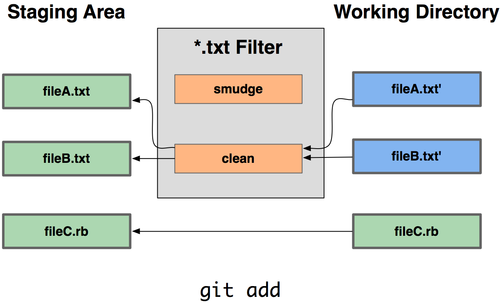

> Git是一个开源的分布式版本控制系统，用于敏捷高效地处理任何或小或大的项目。
Git 是 Linus Torvalds 为了帮助管理 Linux 内核开发而开发的一个开放源码的版本控制软件。
Git 与常用的版本控制工具 CVS, Subversion 等不同，它采用了分布式版本库的方式，不必服务器端软件支持。

# 安装 Git

要使用 Git 就要先安装它，以下我们使用多种方式进行安装，你只需要选择最适合你的方式即可。

## 1. 从源代码安装

若是条件允许，从源代码安装有很多好处，至少可以安装最新的版本。Git 的每个版本都在不断尝试改进用户体验，所以能通过源代码自己编译安装最新版本就再好不过了。有些 Linux 版本自带的安装包更新起来并不及时，所以除非你在用最新的 distro 或者 backports，那么从源代码安装其实该算是最佳选择。

Git 的工作需要调用 curl，zlib，openssl，expat，libiconv 等库的代码，所以需要先安装这些依赖工具。在有 yum 的系统上（比如 Fedora）或者有 apt-get 的系统上（比如 Debian 体系），可以用下面的命令安装：
```sh
$ yum install curl-devel expat-devel gettext-devel \ openssl-devel zlib-devel

$ apt-get install libcurl4-gnutls-dev libexpat1-dev gettext \ libz-dev libssl-dev
```
从下面的 Git 官方站点下载最新版本源代码：  
http://git-scm.com/download

然后编译并安装
```shell
$ tar -zxf git-1.7.2.2.tar.gz
$ cd git-1.7.2.2
$ make prefix=/usr/local all
$ sudo make prefix=/usr/local install
```
现在已经可以用 `git` 命令了.

## 2. 在 Linux 上安装

要在 Linux 上安装预编译好的 Git 安装包，可以直接用系统提供的包管理工具。在 Fedora 上用 yum 安装：
```shell
$ yum install git-core
```
在 Ubuntu 这类 Debian 体系的系统上，可以用 apt-get 安装：
```
$ apt-get install git
```

## 3. 在 Mac 上安装

在 Mac 上安装 Git 有两种方式：
1. 图形化 Git 安装工具  
http://sourceforge.net/projects/git-osx-installer/
2. 命令行安装
    1. [MacPorts](http://www.macports.org) 安装，安装 MacPorts 后，使用 `$ sudo port install git-core +svn +doc +bash_completion +gitweb` 命令安装 Git
    2. [homebrew](https://github.com/mxcl/homebrew) 安装，安装 homebrew 后，使用 `brew install git` 安装 Git  

    使用命令行安装的方法有很多，大家可以根据自己所使用的工具进行安装。
> 目前 Mac 已自带 Git

## 4. 在 Windows 上安装

 Windows 上可以使用 [git for windows](https://gitforwindows.org) 安装 Git 
 > 给 Windows 用户的敬告：你应该在 msysGit 提供的 Unix 风格的 shell 来运行 Git。在 Unix 风格的 shell 中，可以使用本书中提及的复杂多行的命令。对于那些需要在 Windows 命令行中使用 Git 的用户，必须注意：在参数中间有空格的时候，必须使用双引号将参数括起来（在 Linux 中是单引号）；另外，如果扬抑符（^）作为参数的结尾，并且作为这一行的最后一个字符，则这个参数也需要用双引号括起来。因为扬抑符在 Windows 命令行中表示续行（译注：即下一行为这一行命令的继续）。

# 初次运行 Git 前的配置

一般在新的系统上，我们都需要先配置下自己的 Git 工作环境。配置工作只需一次，以后升级时还会沿用现在的配置。当然，如果需要，你随时可以用相同的命令修改已有的配置。

Git 提供了一个叫做 `git config` 的工具,专门用来配置或读取相应的工作环境变量。而正是由这些环境变量，决定了 Git 在各个环节的具体工作方式和行为。这些变量可以存放在以下三个不同的地方：
* `/etc/gitconfig` 文件：系统中对所有用户都普遍适用的配置。若使用 `git config` 时用 `--system` 选项，读写的就是这个文件。
* `~/.gitconfig` 文件：用户目录下的配置文件只适用于该用户。若使用 `git config` 时用 `--global` 选项，读写的就是这个文件。
* 当前项目的 Git 目录中的配置文件（也就是工作目录中的 `.git/config` 文件）：这里的配置仅仅针对当前项目有效。每一个级别的配置都会覆盖上层的相同配置，所以 `.git/config` 里的配置会覆盖 `/etc/gitconfig` 中的同名变量。

## 1. 用户信息

个人的用户名称和电子邮件地址，每次 Git 提交时都会引用这两条信息，说明是谁提交了更新，会随更新内容一起被永久纳入历史记录：
```shell
$ git config --global user.name "<姓名>"
$ git config --global user.email <邮件地址>
```
> 如果不使用 `--global` 则只对当前项目有效

## 2. 文本编辑器

设置默认使用的文本编辑器。Git 需要你输入一些额外消息的时候，会自动调用一个外部文本编辑器给你用，默认会使用操作系统指定的默认编辑器。
```shell
$ git config --global core.editor <文本编辑器>
```
## 3. 差异分析工具

设置差异分析工具，在解决合并冲突时使用哪种差异分析工具。
```shell
$ git config --global merge.tool <差异分析工具>
```
> Git 可以理解 kdiff3，tkdiff，meld，xxdiff，emerge，vimdiff，gvimdiff，ecmerge，和 opendiff 等合并工具的输出信息。当然，你也可以自己开发一套合并工具。

查看配置信息可以使用 `git config --list` 命令
```shell
$ git config --list
```
有时候会看到重复的变量名，那就说明它们来自不同的配置文件，不过最终 Git 实际采用的是最后一个。

也可以直接查阅某个环境变量的设定，只要把特定的名字跟在后面即可，像这样：
```shell
$ git config user.name
```

# Git 基本用法

## 1. 查看帮助

```shell
$ git help <verb>
$ git <verb> --help
$ man git-<verb>
```

## 2. 取得项目的 Git 仓库

1. 新建仓库 `git init`  
要对现有的某个项目开始用 Git 管理，只需到此项目所在的目录执行：`git init`
2. 从现有仓库克隆 `git clone <url>`  
克隆仓库的命令格式为 `git clone <url>`，`url` 为要克隆的项目地址
> Git 支持许多数据传输协议。你可以用 git://，http(s):// 或者 user@server:/path.git 表示的 SSH 传输协议。

## 3. 记录每次更新到仓库

1. 检查当前文件状态 `git status`  
Git 不会自动将之纳入跟踪范围，除非你使用命令添加，以下为一次查看状态时的输出：
```shell
$ git status
On branch master # 当前分支（master）
Changes to be committed: # 缓存区文件
  (use "git reset HEAD <file>..." to unstage)

        new file:   README
        modified:   benchmarks.rb

Changes not staged for commit: # 未跟踪文件
  (use "git add <file>..." to update what will be committed)
  (use "git checkout -- <file>..." to discard changes in working directory)

        modified:   benchmarks.rb
```
2. 跟踪新文件 `git add <file>...` `<file>` 为文件名/目录名，为目录名时表示递归跟踪该目录下所有的文件

3. 忽略某些文件  
我们总会有些文件无需纳入 Git 的管理，也不希望它们总出现在未跟踪文件列表。通常都是些自动生成的文件，比如日志文件，或者编译过程中创建的临时文件等。可以创建一个名为 `.gitignore` 的文件，列出要忽略的文件模式。  

**文件 `.gitignore` 的格式规范如下：**
* 所有空行或者以注释符号 ＃ 开头的行都会被 Git 忽略。
* 可以使用标准的 `glob 模式` 匹配。
* 匹配模式最后跟反斜杠（/）说明要忽略的是目录。
* 要忽略指定模式以外的文件或目录，可以在模式前加上惊叹号（!）取反。 

** `glob 模式`（ shell 所使用的简化了的正则表达式）：**  
* 星号（`*`）匹配零个或多个任意字符
* `[<要匹配的字符>]` 匹配任何一个列在方括号中的字符（`[abc]` 表示a\b\c任意一个均可）
* 问号（`?`）只匹配一个任意字符
* 如果在方括号中使用短划线（`-`）分隔两个字符，表示所有在这两个字符范围内的都可以匹配（比如 [0-9] 表示匹配所有 0 到 9 的数字）
```
# 此为注释 – 将被 Git 忽略
# 忽略所有 .a 结尾的文件
*.a
# 但 lib.a 除外
!lib.a
# 仅仅忽略项目根目录下的 TODO 文件，不包括 subdir/TODO
/TODO
# 忽略 build/ 目录下的所有文件
build/
# 会忽略 doc/notes.txt 但不包括 doc/server/arch.txt
doc/*.txt
# ignore all .txt files in the doc/ directory
doc/**/*.txt
```

4. 查看已暂存和未暂存的更新 `git diff`  
此命令比较的是 **工作目录中当前文件和暂存区域快照之间的差异**，也就是 **修改之后还没有暂存起来的变化内容**。若要看 **已经暂存起来的文件和上次提交时的快照之间的差异**，可以用 `git diff --cached` 命令。（Git 1.6.1 及更高版本还允许使用 `git diff --staged`，效果是相同的，但更好记些。）

## 4. 提交更新
1. 提交更新 `git commit`  
在此之前，请一定要确认还有什么修改过的或新建的文件还没有 `git add` 过，否则提交的时候不会记录这些还没暂存起来的变化。所以，每次准备提交前，先用 `git status` 看下，是不是都已暂存起来了，然后再运行提交命令 `git commit`
```shell
$ git commit
```
这种方式会启动文本编辑器以便输入本次提交的说明。
编辑器会显示类似下面的文本信息：  
```
# Please enter the commit message for your changes. Lines starting
# with '#' will be ignored, and an empty message aborts the commit.
# On branch master
# Changes to be committed:
#       new file:   README
#       modified:   benchmarks.rb
#
~
~
~
".git/COMMIT_EDITMSG" 10L, 283C
```
默认的提交消息包含最后一次运行 `git status` 的输出，放在注释行里，另外开头还有一空行，供你输入提交说明。你完全可以去掉这些注释行，不过留着也没关系，多少能帮你回想起这次更新的内容有哪些。（如果觉得这还不够，可以用 `-v` 选项将修改差异的每一行都包含到注释中来。）退出编辑器时，Git 会丢掉注释行，将说明内容和本次更新提交到仓库。
```shell
$ git commit -m "Story 182: Fix benchmarks for speed"
[master 463dc4f] Story 182: Fix benchmarks for speed
 2 files changed, 3 insertions(+)
 create mode 100644 README
```
现在你已经创建了第一个提交！可以看到，提交后它会告诉你，当前是在哪个分支（`master`）提交的，本次提交的完整 SHA-1 校验和是什么（`463dc4f`），以及在本次提交中，有多少文件修订过，多少行添改和删改过。  

提交时记录的是放在暂存区域的快照，任何还未暂存的仍然保持已修改状态，可以在下次提交时纳入版本管理。每一次运行提交操作，都是对你项目作一次快照，以后可以回到这个状态，或者进行比较。

2. 跳过使用暂存区域 `git commit -a`  
Git 提供了一个跳过使用暂存区域的方式，只要在提交的时候，给 `git commit` 加上 `-a` 选项，Git 就会自动把所有已经跟踪过的文件暂存起来一并提交，从而跳过 `git add` 步骤

3. 移除文件 `git rm`  
要从 Git 中移除某个文件，就必须要从已跟踪文件清单中移除（确切地说，是从暂存区域移除），然后提交。可以用 `git rm` 命令完成此项工作，并连带 **从工作目录中删除指定的文件**，这样以后就不会出现在未跟踪文件清单中了。

如果只是简单地从工作目录中手工删除文件，运行 `git status` 时就会在 “Changes not staged for commit” 部分（也就是未暂存清单）
然后再运行 `git rm` 记录此次移除文件的操作
最后提交的时候，该文件就不再纳入版本管理了。如果删除之前修改过并且已经放到暂存区域的话，则必须要用强制删除选项 `-f`（译注：即 force 的首字母），以防误删除文件后丢失修改的内容。  

把文件从 Git 仓库中删除（亦即从暂存区域移除），但仍然希望保留在当前工作目录中。用 `--cached` 选项即可：
```shell
# <file> 文件名/目录，也可使用 glob 模式
$ git rm --cached <file>
# 删除所有 log/ 目录下扩展名为 .log 的文件。
$ git rm log/\*.log
# 递归删除当前目录及其子目录中所有 ~ 结尾的文件
$ git rm \*~
```
4. 移动文件 `git mv file_from file_to`  
运行 `git mv` 就相当于运行了下面三条命令：
```shell
# 如此分开操作，Git 也会意识到这是一次改名
$ mv README.txt README
$ git rm README.txt
$ git add README
```

## 5. 查看提交历史
`git log`  
会按提交时间列出所有的更新，最近的更新排在最上面。每次更新都有一个 SHA-1 校验和、作者的名字和电子邮件地址、提交时间，最后缩进一个段落显示提交说明。  
1. `-p` 展开显示每次提交的内容差异  
        * `--word-diff` 单词层面的对比  

        ```shell
        $ git log -U1 --word-diff
        commit ca82a6dff817ec66f44342007202690a93763949
        Author: Scott Chacon <schacon@gee-mail.com>
        Date:   Mon Mar 17 21:52:11 2008 -0700

            changed the version number

        diff --git a/Rakefile b/Rakefile
        index a874b73..8f94139 100644
        --- a/Rakefile
        +++ b/Rakefile
        @@ -7,3 +7,3 @@ spec = Gem::Specification.new do |s|
            s.name      =   "simplegit"
            s.version   =   [-"0.1.0"-]{+"0.1.1"+}
            s.author    =   "Scott Chacon"
        ```
        
        这里并没有平常看到的添加行或者删除行的信息。这里的对比显示在行间。新增加的单词被 `{+ +}` 括起来，被删除的单词被 `[- -]` 括起来。在进行单词层面的对比的时候，你可能希望上下文（ context ）行数从默认的 3 行，减为 1 行，那么可以使用 `-U1` 选项。上面的例子中，我们就使用了这个选项。
        * `-2` 仅显示最近的两次更新  
        * `--stat` 仅显示简要的增改行数统计，每个提交都列出了修改过的文件，以及其中添加和移除的行数，并在最后列出所有增减行数小计  

2. `--pretty` 指定使用完全不同于默认格式的方式展示提交历史
    * `oneline` 将每个提交放在一行显示
    * `format` 可以定制要显示的记录格式  

`format` 常用的格式占位符写法及其代表的意义

| 选项   | 说明
| :---- | :----------------------------- |
| %H	| 提交对象（`commit`）的完整哈希字串
| %h	| 提交对象的简短哈希字串
| %T	| 树对象（`tree`）的完整哈希字串
| %t	| 树对象的简短哈希字串
| %P	| 父对象（`parent`）的完整哈希字串
| %p	| 父对象的简短哈希字串
| %an	| 作者（`author`）的名字
| %ae	| 作者的电子邮件地址
| %ad	| 作者修订日期（可以用`-date=`定制格式）
| %ar	| 作者修订日期，按多久以前的方式显示
| %cn	| 提交者(`committer`)的名字
| %ce	| 提交者的电子邮件地址
| %cd	| 提交日期
| %cr	| 提交日期，按多久以前的方式显示
| %s	| 提交说明

```shell
$ git log --pretty=format:"%h - %an, %ar : %s"
ca82a6d - Scott Chacon, 11 months ago : changed the version number
085bb3b - Scott Chacon, 11 months ago : removed unnecessary test code
a11bef0 - Scott Chacon, 11 months ago : first commit
```
用 `oneline` 或 `format` 时结合 `--graph` 选项，可以看到开头多出一些 ASCII 字符串表示的简单图形，形象地展示了每个提交所在的分支及其分化衍合情况。在我们之前提到的 Grit 项目仓库中可以看到：
```
$ git log --pretty=format:"%h %s" --graph
* 2d3acf9 ignore errors from SIGCHLD on trap
*  5e3ee11 Merge branch 'master' of git://github.com/dustin/grit
|\
| * 420eac9 Added a method for getting the current branch.
* | 30e367c timeout code and tests
* | 5a09431 add timeout protection to grit
* | e1193f8 support for heads with slashes in them
|/
* d6016bc require time for xmlschema
*  11d191e Merge branch 'defunkt' into local
```

`--pretty` 常用的选项及其释义

| 选项	         | 说明
| :------------ | :------------------------ |
| `-p`	        | 按补丁格式显示每个更新之间的差异
| `--word-diff`	| 按 word diff 格式显示差异
| `--stat`	    | 显示每次更新的文件修改统计信息
| `--shortstat`	| 只显示`--stat`中最后的行数修改添加移除统计
| `--name-only`	| 在提交信息后显示已修改的文件清单
| `--name-status`| 显示新增、修改、删除的文件清单
| `--abbrev-commit`| 仅显示`SHA-1`的前几个字符，而非所有的`40`个字符
| `--relative-date`| 使用较短的相对时间显示
| `--graph`	     | 显示`ASCII`图形表示的分支合并历史
| `--pretty`	 | 使用其他格式显示历史提交信息。可用的选项包括 oneline，short，full，fuller 和 format（后跟指定格式）
| `--oneline`	 | `--pretty=oneline --abbrev-commit` 的简化用法

2. 限制输出长度

| 选项	             | 说明
| :-------------------- | :----------------- |
| `-(n)`	            | 仅显示最近的 n 条提交
| `--since, --after`    | 仅显示指定时间之后的提交
| `--until`, `--before` | 仅显示指定时间之前的提交
| `--author`	        | 仅显示指定作者相关的提交
| `--committer`	        | 仅显示指定提交者相关的提交
```shell
# 如果要查看 Git 仓库中，2008 年 10 月期间，Junio Hamano 提交的但未合并的测试脚本（位于项目的 t/ 目录下的文件），可以用下面的查询命令：
$ git log --pretty="%h - %s" --author=gitster --since="2008-10-01" \
   --before="2008-11-01" --no-merges -- t/
5610e3b - Fix testcase failure when extended attribute
acd3b9e - Enhance hold_lock_file_for_{update,append}()
f563754 - demonstrate breakage of detached checkout wi
d1a43f2 - reset --hard/read-tree --reset -u: remove un
51a94af - Fix "checkout --track -b newbranch" on detac
b0ad11e - pull: allow "git pull origin $something:$cur
```

## 6. 撤销操作  

1. 修改最后一次提交  
` git commit --amend` 重新提交，此命令将使用当前的暂存区域快照提交。如果刚才提交完没有作任何改动，直接运行此命令的话，相当于有机会重新编辑提交说明，但将要提交的文件快照和之前的一样。如果刚才提交时忘了暂存某些修改，可以先补上暂存操作，然后再运行 `--amend` 提交。

2. 取消已经暂存的文件  
`git reset HEAD <file>...` 取消暂存

3. 取消对文件的修改  
`git checkout -- <file>...` 回到之前的状态（也就是修改之前的版本）,这条命令有些危险，所有对文件的修改都没有了，因为我们把之前版本的文件复制过来重写了此文件。所以在用这条命令前，请务必确定真的不再需要保留刚才的修改。
> 任何已经提交到 Git 的都可以被恢复，即使文件已经被删除。没有提交过的，对 Git 来说它们就像从未存在过一样不可恢复。

## 7. 远程仓库的使用

要参与任何一个 Git 项目的协作，必须要了解该如何管理远程仓库。远程仓库是指托管在网络上的项目仓库，可能会有好多个，其中有些你只能读，另外有些可以写。同他人协作开发某个项目时，需要管理这些远程仓库，以便推送或拉取数据，分享各自的工作进展。 管理远程仓库的工作，包括添加远程库，移除废弃的远程库，管理各式远程库分支，定义是否跟踪这些分支，等等。

1. 查看当前的远程库  
`git remote` 列出每个远程库的简短名字，在克隆完某个项目后，至少可以看到一个名为 origin 的远程库，Git 默认使用这个名字来标识你所克隆的原始仓库。  
`-v` 选项（`--verbose` 的简写），显示对应的克隆地址

2. 添加远程仓库  
`git remote add [shortname] [url]` 添加一个新的远程仓库，可以指定一个简单的名字，以便将来引用。  

3. 从远程仓库抓取数据  
`git fetch [shortname]/[url]` 抓取数据，此命令会到远程仓库中拉取所有你本地仓库中还没有的数据。如果是克隆了一个仓库，此命令会自动将远程仓库归于 `origin` 名下。所以，`git fetch origin` 会抓取从你上次克隆以来别人上传到此远程仓库中的所有更新（或是上次 fetch 以来别人提交的更新）。有一点很重要，fetch 命令只是将远端的数据拉到本地仓库，并不自动合并到当前工作分支，只有当你确实准备好了，才能手工合并。  
`git pull` 从原始克隆的远端仓库中抓取数据后，合并到工作目录中的当前分支。如果设置了某个分支用于跟踪某个远端仓库的分支，可以使用 `git pull` 命令自动抓取数据下来，然后将远端分支自动合并到本地仓库中当前分支。  

4. 推送数据到远程仓库  
`git push [remote-name] [branch-name]` 将本地仓库中的数据推送到远程仓库。只有在所克隆的服务器上有写权限，或者同一时刻没有其他人在推数据，这条命令才会如期完成任务。如果在你推数据前，已经有其他人推送了若干更新，那你的推送操作就会被驳回。你必须先把他们的更新抓取到本地，合并到自己的项目中，然后才可以再次推送。

5. 查看远程仓库信息  
`git remote show [remote-name]` 查看某个远程仓库的详细信息。  
```shell
$ git remote show origin
* remote origin
  URL: git@github.com:defunkt/github.git
  Remote branch merged with 'git pull' while on branch issues # 运行 git pull 时将自动合并的分支
    issues
  Remote branch merged with 'git pull' while on branch master # 运行 git pull 时将自动合并的分支
    master
  New remote branches (next fetch will store in remotes/origin) # 未同步到本地的远端分支
    caching 
  Stale tracking branches (use 'git remote prune') # 已同步到本地但在远端服务器上已被删除的分支
    libwalker
    walker2
  Tracked remote branches # 处于跟踪状态中的远端分支
    acl
    apiv2
    dashboard2
    issues
    master
    postgres
  Local branch pushed with 'git push' # 运行 git push 时缺省推送的分支是什么
    master:master
```

6. 远程仓库的删除和重命名  
`git remote rename` 修改某个 **远程仓库在本地的简称**   
> 注意，对远程仓库的重命名，也会使对应的分支名称发生变化，
碰到远端仓库服务器迁移，或者原来的克隆镜像不再使用，又或者某个参与者不再贡献代码，那么需要移除对应的远端仓库，可以运行 `git remote rm` 命令。  

## 8. 打标签

Git 也可以对某一时间点上的版本打上标签。我们一起来学习如何列出所有可用的标签，如何新建标签，以及各种不同类型标签之间的差别。

1. 列出已有的标签  
`git tag` 列出现有标签，显示的标签按字母顺序排列，所以标签的先后并不表示重要程度的轻重。可以用特定的搜索模式列出符合条件的标签。

2. 新建标签  
Git 使用的标签有两种类型：轻量级的（lightweight）和含附注的（annotated）。轻量级标签就像是个不会变化的分支，实际上它就是个指向特定提交对象的引用。而含附注标签，实际上是存储在仓库中的一个独立对象，它有自身的校验和信息，包含着标签的名字，电子邮件地址和日期，以及标签说明，标签本身也允许使用 GNU Privacy Guard (GPG) 来签署或验证。一般我们都建议使用含附注型的标签，以便保留相关信息；当然，如果只是临时性加注标签，或者不需要旁注额外信息，用轻量级标签也没问题。
    * 含附注的标签  
    `-a [tag-name]` 创建一个含附注类型的标签，（ annotated 的首字母）  
    `-m` 指定对应的标签说明，Git 会将此说明一同保存在标签对象中。如果没有给出该选项，Git 会启动文本编辑软件供你输入标签说明。  
    `git show [tag-name]` 查看相应标签的版本信息，并连同显示打标签时的提交对象。
    * 签署标签  
    `-s` 如果有自己的私钥，可以用 GPG 来签署标签（signed 的首字母） 
    * 轻量级标签  
    轻量级标签实际上就是一个保存着对应提交对象的校验和信息的文件。  
    `git tag [tag-name]` 新建轻量级标签

3. 验证标签  
`git tag -v [tag-name]` （verify 的首字母）验证已经签署的标签。此命令会调用 GPG 来验证签名，所以你需要有签署者的公钥，存放在 keyring 中才能验证。
```shell
# 若是没有签署者的公钥，会报告类似下面这样的错误：
gpg: Signature made Wed Sep 13 02:08:25 2006 PDT using DSA key ID F3119B9A
gpg: Can't check signature: public key not found
error: could not verify the tag 'v1.4.2.1'
```

4. 后期加注标签  
 `git tag -a [tag-name] [对应提交对象的校验（或前几位字符）]` 在后期对早先的某次提交加注标签

5. 分享标签  
`git push [shortname]/[url] [tagname]`  默认情况下 `git push` 并不会把标签传送到远端服务器上，只有通过显式命令才能分享标签到远端仓库。其命令格式如同推送分支。其他人克隆共享仓库或拉取数据同步后，也会看到这些标签。如果要一次推送所有本地新增的标签上去，可以使用 `--tags` 选项。

## Git 实用技巧

1. 自动补全
如果你用的是 `Bash shel`l，可以试试看 Git 提供的自动补全脚本。下载 Git 的源代码，进入 `contrib/completion` 目录，会看到一个 `git-completion.bash` 文件。将此文件复制到你自己的用户主目录中（译注：按照下面的示例，还应改名加上点：`cp git-completion.bash` `~/.git-completion.bash`），并把下面一行内容添加到你的 `.bashrc` 文件中：
```shell
source ~/.git-completion.bash
```
也可以为系统上所有用户都设置默认使用此脚本。Mac 上将此脚本复制到 `/opt/local/etc/bash_completion.d` 目录中，Linux 上则复制到 `/etc/bash_completion.d/` 目录中。这两处目录中的脚本，都会在 Bash 启动时自动加载。如果在 Windows 上安装了 msysGit，默认使用的 Git Bash 就已经配好了这个自动补全脚本，可以直接使用。

在输入 Git 命令的时候可以敲两次跳格键（`Tab`），就会看到列出所有匹配的可用命令建议

2. Git 命令别名
Git 并不会推断你输入的几个字符将会是哪条命令，不过如果想偷懒，少敲几个命令的字符，可以用 git config 为命令设置别名。
```shell
$ git config --global alias.co checkout
$ git config --global alias.br branch
$ git config --global alias.ci commit
$ git config --global alias.st status
```
```shell
# 使用这种技术还可以创造出新的命令，比方说取消暂存文件时的输入比较繁琐，可以自己设置一下：
$ git config --global alias.unstage 'reset HEAD --'
# 这样一来，下面的两条命令完全等同：
$ git unstage fileA
$ git reset HEAD fileA

# last 命令：
$ git config --global alias.last 'log -1 HEAD'
# 然后要看最后一次的提交信息，就变得简单多了：
$ git last
commit 66938dae3329c7aebe598c2246a8e6af90d04646
Author: Josh Goebel <dreamer3@example.com>
Date:   Tue Aug 26 19:48:51 2008 +0800

    test for current head

    Signed-off-by: Scott Chacon <schacon@example.com>
```
Git 只是简单地在命令中替换了你设置的别名。  
有时候我们希望运行某个外部命令，而非 Git 的子命令，这个好办，只需要在命令前加上 `!` 就行。如果你自己写了些处理 Git 仓库信息的脚本的话，就可以用这种技术包装起来。
```shell
# 我们可以设置用 git visual 启动 gitk：
$ git config --global alias.visual '!gitk'
```
---
到目前为止，你已经学会了最基本的 Git 本地操作：创建和克隆仓库，做出修改，暂存并提交这些修改，以及查看所有历史修改记录。

# Git 分支

> Git 保存的不是文件差异或者变化量，而只是一系列文件快照。  
> 在 Git 中提交时，会保存一个提交（commit）对象，该对象包含一个指向暂存内容快照的指针，包含本次提交的作者等相关附属信息，包含零个或多个指向该提交对象的父对象指针：首次提交是没有直接祖先的，普通提交有一个祖先，由两个或多个分支合并产生的提交则有多个祖先。  
> 
> 当使用 `git commit` 新建一个提交对象前，Git 会先计算每一个子目录的校验和，然后在 Git 仓库中将这些目录保存为树（`tree`）对象。之后 Git 创建的提交对象，除了包含相关提交信息以外，还包含着指向这个树对象（项目根目录）的指针，如此它就可以在将来需要的时候，重现此次快照的内容了。  
> 
> 作些修改后再次提交，那么这次的提交对象会包含一个指向上次提交对象的指针。  
> 
> **Git 中的分支**，其实本质上仅仅是个指向 commit 对象的可变指针。Git 会使用 master 作为分支的默认名字。在若干次提交后，你其实已经有了一个指向最后一次提交对象的 master 分支，它在每次提交的时候都会自动向前移动。  
> 
> Git 又是如何创建一个新的分支的呢？答案很简单，创建一个新的分支指针。
> 
> Git 是如何知道你当前在哪个分支上工作的呢？其实答案也很简单，它保存着一个名为 `HEAD` 的特别指针。请注意它和你熟知的许多其他版本控制系统（比如 Subversion 或 CVS）里的 HEAD 概念大不相同。在 Git 中，它是一个指向你正在工作中的本地分支的指针（译注：将 `HEAD` 想象为当前分支的别名。）。运行 `git branch` 命令，仅仅是建立了一个新的分支，但不会自动切换到这个分支中去，要切换到其他分支，可以执行 `git checkout` 命令。  
> 
> 由于 Git 中的分支实际上仅是一个包含所指对象校验和（40 个字符长度 SHA-1 字串）的文件，所以创建和销毁一个分支就变得非常廉价。说白了，新建一个分支就是向一个文件写入 41 个字节（外加一个换行符）那么简单，当然也就很快了。
> 
> 这和大多数版本控制系统形成了鲜明对比，它们管理分支大多采取备份所有项目文件到特定目录的方式，所以根据项目文件数量和大小不同，可能花费的时间也会有相当大的差别，快则几秒，慢则数分钟。而 Git 的实现与项目复杂度无关，它永远可以在几毫秒的时间内完成分支的创建和切换。同时，因为每次提交时都记录了祖先信息（译注：即 `parent` 对象），将来要合并分支时，寻找恰当的合并基础（译注：即共同祖先）的工作其实已经自然而然地摆在那里了，所以实现起来非常容易。Git 鼓励开发者频繁使用分支，正是因为有着这些特性作保障。

## 1. 分支的基本操作

1. 查看分支  
`git branch` 给出当前所有分支的清单  
```shell
# 前面的 * 代表当前所在分支
$ git branch
  iss53
* master
  testing
```
`-v` 查看各个分支最后一个提交对象的信息  
`--merged` 查看哪些分支已被并入当前分支（哪些分支是当前分支的直接上游）  
`--no-merged`(1.5.6+) 尚未与当前分支合并的分支  

2. 新建分支  
`git branch [branch-name]` 新建分支

3. 切换分支  
`git checkout [branch-name]` 切换分支

4. 新建并切换到该分支   
`git checkout -b [branch-name]` 新建并切换到该分支，相当于同时执行 `git branch [branch-name]`、
`git checkout [branch-name]` 两条命令

5. 删除分支  
`git branch -d [branch-name]` 删除分支，如果要删除的分支包含未合并的内容，Git 会阻止删除，并会报错：
```shell
error: The branch 'testing' is not fully merged.
If you are sure you want to delete it, run 'git branch -D testing'.
```
此时可以使用 `git branch -D [branch-name]` 强制删除（`-D` 大写）

6. 合并分支  
`git merge [branch-name]` 合并分支，合并时会将指定分支（`[branch-name]` 所代表的分支）合并到当前所在的分支，所以在合并之前最好先确定当前所在的分支。  
有时候合并操作并不会如此顺利。如果在不同的分支中都修改了同一个文件的同一部分，Git 就无法干净地把两者合到一起（译注：逻辑上说，这种问题只能由人来裁决。）。  
Git 作了合并，但没有提交，它会停下来等你解决冲突。要看看哪些文件在合并时发生冲突，可以用 `git status` 查阅。任何包含未解决冲突的文件都会以未合并（unmerged）的状态列出。Git 会在有冲突的文件里加入标准的冲突解决标记，可以通过它们来手工定位并解决这些冲突。  

> 如果顺着一个分支走下去可以到达另一个分支的话，那么 Git 在合并两者时，只会简单地把指针右移，因为这种单线的历史分支不存在任何需要解决的分歧，所以这种合并过程可以称为快进（Fast forward）。  
> 值得一提的是 Git 可以自己裁决哪个共同祖先才是最佳合并基础；这和 CVS 或 Subversion（1.5 以后的版本）不同，它们需要开发者手工指定合并基础。所以此特性让 Git 的合并操作比其他系统都要简单不少。

## 2. 利用分支进行开发的流程

1. 长期分支
由于 Git 使用简单的三方合并，你可以同时拥有多个开放的分支，每个分支用于完成特定的任务，随着开发的推进，你可以随时把某个特性分支的成果并到其他分支中。  
许多使用 Git 的开发者都喜欢用这种方式来开展工作，比如仅在 `master` 分支中保留完全稳定的代码，即已经发布或即将发布的代码。与此同时，他们还有一个名为 `develop` 或 `next` 的平行分支，专门用于后续的开发，或仅用于稳定性测试 — 当然并不是说一定要绝对稳定，不过一旦进入某种稳定状态，便可以把它合并到 `master` 里。这样，在确保这些已完成的特性分支能够通过所有测试，并且不会引入更多错误之后，就可以并到主干分支中，等待下一次的发布。  
本质上我们刚才谈论的，是随着提交对象不断右移的指针。稳定分支的指针总是在提交历史中落后一大截，而前沿分支总是比较靠前。  

  

你可以用这招维护不同层次的稳定性。某些大项目还会有个 `proposed`（建议）或 `pu`（`proposed updates`，建议更新）分支，它包含着那些可能还没有成熟到进入 next 或 `master` 的内容。这么做的目的是拥有不同层次的稳定性：当这些分支进入到更稳定的水平时，再把它们合并到更高层分支中去。再次说明下，使用多个长期分支的做法并非必需，不过一般来说，对于特大型项目或特复杂的项目，这么做确实更容易管理。

2. 特性分支
在任何规模的项目中都可以使用特性（Topic）分支。一个特性分支是指一个短期的，用来实现单一特性或与其相关工作的分支。可能你在以前的版本控制系统里从未做过类似这样的事情，因为通常创建与合并分支消耗太大。然而在 Git 中，一天之内建立、使用、合并再删除多个分支是常见的事。  
该技术允许你迅速且完全的进行语境切换 — 因为你的工作分散在不同的流水线里，每个分支里的改变都和它的目标特性相关，浏览代码之类的事情因而变得更简单了。你可以把作出的改变保持在特性分支中几分钟，几天甚至几个月，等它们成熟以后再合并，而不用在乎它们建立的顺序或者进度。  
我们来看一个实际的例子。请看图 3-20，由下往上，起先我们在 master 工作到 C1，然后开始一个新分支 iss91 尝试修复 91 号缺陷，提交到 C6 的时候，又冒出一个解决该问题的新办法，于是从之前 C4 的地方又分出一个分支 iss91v2，干到 C8 的时候，又回到主干 master 中提交了 C9 和 C10，再回到 iss91v2 继续工作，提交 C11，接着，又冒出个不太确定的想法，从 master 的最新提交 C10 处开了个新的分支 dumbidea 做些试验。  

  

现在，假定两件事情：我们最终决定使用第二个解决方案，即 iss91v2 中的办法；另外，我们把 dumbidea 分支拿给同事们看了以后，发现它竟然是个天才之作。所以接下来，我们准备抛弃原来的 iss91 分支（实际上会丢弃 C5 和 C6），直接在主干中并入另外两个分支。  

  

> 这些分支全部都是本地分支，这一点很重要。当你在使用分支及合并的时候，一切都是在你自己的 Git 仓库中进行的 — 完全不涉及与服务器的交互。

## 3. 远程分支

远程分支（remote branch）是对远程仓库中的分支的索引。它们是一些无法移动的本地分支；只有在 Git 进行网络交互时才会更新。远程分支就像是书签，提醒着你上次连接远程仓库时上面各分支的位置。用 `(远程仓库名)/(分支名)` 这样的形式表示远程分支。  

1. 推送本地分支
`git push (远程仓库名) (分支名)`
```shell
# 上传我本地的 serverfix 分支到远程仓库中去，仍旧称它为 serverfix 分支
git push origin serverfix
# 或（两者效果相同，冒号后面为该分支在远程服务器上的名称，可根据需要命名）
git push origin serverfix:serverfix
```

2. 跟踪远程分支
从远程分支 `checkout` 出来的本地分支，称为 跟踪分支 (`tracking branch`)。跟踪分支是一种和某个远程分支有直接联系的本地分支。在跟踪分支里输入 `git push`，Git 会自行推断应该向哪个服务器的哪个分支推送数据。同样，在这些分支里运行 `git pull` 会获取所有远程索引，并把它们的数据都合并到本地分支中来。  
在克隆仓库时，Git 通常会自动创建一个名为 master 的分支来跟踪 origin/master。这正是 git push 和 git pull 一开始就能正常工作的原因。当然，你可以随心所欲地设定为其它跟踪分支，
`git checkout -b [本地分支名] [远程名]/[分支名]`  
或  
`git checkout --track [远程名]/[分支名]`(1.6.2+)

3. 删除远程分支  
`git push [远程名] :[分支名]` 有种方便记忆这条命令的方法：记住我们不久前见过的 `git push [远程名] [本地分支]:[远程分支]` 语法，如果省略 `[本地分支]`，那就等于是在说“在这里提取空白然后把它变成`[远程分支]`”。

## 4. 分支的衍合

把一个分支中的修改整合到另一个分支的办法有两种：`merge` 和 `rebase`（`rebase` 的翻译暂定为“衍合”）  
之前介绍过，最容易的整合分支的方法是 `merge` 命令，它会把两个分支最新的快照（以及二者最新的共同祖先）进行三方合并，合并的结果是产生一个新的提交对象。  
有了 `rebase` 命令，就可以把在一个分支里提交的改变移到另一个分支里重放一遍。你可以把在 分支1 里产生的变化补丁在 分支2 的基础上重新打一遍。在 Git 里，这种操作叫做衍合（rebase）。  
虽然最后整合得到的结果没有任何区别，但衍合能产生一个更为整洁的提交历史。如果视察一个衍合过的分支的历史记录，看起来会更清楚：仿佛所有修改都是在一根线上先后进行的，尽管实际上它们原本是同时并行发生的。  
一般我们使用衍合的目的，是想要得到一个能在远程分支上干净应用的补丁 — 比如某些项目你不是维护者，但想帮点忙的话，最好用衍合：先在自己的一个分支里进行开发，当准备向主项目提交补丁的时候，根据最新的 `origin/master` 进行一次衍合操作然后再提交，这样维护者就不需要做任何整合工作（译注：实际上是把解决分支补丁同最新主干代码之间冲突的责任，化转为由提交补丁的人来解决。），只需根据你提供的仓库地址作一次快进合并，或者直接采纳你提交的补丁。
> 合并结果中最后一次提交所指向的快照，无论是通过衍合，还是三方合并，都会得到相同的快照内容，只不过提交历史不同罢了。衍合是按照每行的修改次序重演一遍修改，而合并是把最终结果合在一起。

> 衍合的风险  
> **一旦分支中的提交对象发布到公共仓库，就千万不要对该分支进行衍合操作**。  
> 如果你遵循这条金科玉律，就不会出差错。  
> 在进行衍合的时候，实际上抛弃了一些现存的提交对象而创造了一些类似但不同的新的提交对象。如果你把原来分支中的提交对象发布出去，并且其他人更新下载后在其基础上开展工作，而稍后你又用 git rebase 抛弃这些提交对象，把新的重演后的提交对象发布出去的话，你的合作者就不得不重新合并他们的工作，这样当你再次从他们那里获取内容时，提交历史就会变得一团糟。  
> 如果把衍合当成一种在推送之前清理提交历史的手段，而且仅仅衍合那些尚未公开的提交对象，就没问题。如果衍合那些已经公开的提交对象，并且已经有人基于这些提交对象开展了后续开发工作的话，就会出现叫人沮丧的麻烦。

# 服务器上的 Git

架设一台 Git 服务器并不难。第一步是选择与服务器通讯的协议。远程仓库通常只是一个裸仓库（bare repository） — 即一个没有当前工作目录的仓库。因为该仓库只是一个合作媒介，所以不需要从硬盘上取出最新版本的快照；仓库里存放的仅仅是 Git 的数据。简单地说，裸仓库就是你工作目录中 `.git` 子目录内的内容。

## 1. 协议

Git 可以使用四种主要的协议来传输数据：本地传输，SSH 协议，Git 协议和 HTTP 协议。除了 HTTP 协议外，其他所有协议都要求在服务器端安装并运行 Git。

### 1. 本地协议  

最基本的就是 *本地协议*（Local protocol），所谓的远程仓库在该协议中的表示，就是硬盘上的另一个目录。这常见于团队每一个成员都对一个共享的文件系统（例如 NFS）拥有访问权，或者比较少见的多人共用同一台电脑的情况。后面一种情况并不安全，因为所有代码仓库实例都储存在同一台电脑里，增加了灾难性数据损失的可能性。

如果你使用一个共享的文件系统，就可以在一个本地文件系统中克隆仓库，推送和获取。克隆的时候只需要将远程仓库的路径作为 URL 使用，
```shell
$ git clone /opt/git/project.git
$ git clone file:///opt/git/project.git
```
如果在 URL 开头明确使用 `file://` ，那么 Git 会以一种略微不同的方式运行。如果你只给出路径，Git 会尝试使用硬链接或直接复制它所需要的文件。如果使用了 `file://` ，Git 会调用它平时通过网络来传输数据的工序，而这种方式的效率相对较低。使用 `file://` 前缀的主要原因是当你需要一个不包含无关引用或对象的干净仓库副本的时候 — 一般指从其他版本控制系统导入的，或类似情形。  

要添加一个本地仓库作为现有 Git 项目的远程仓库，可以这样做：
```shell
git remote add local_proj /opt/git/project.git
```
然后就可以像在网络上一样向这个远程仓库推送和获取数据了。

**优点**  
基于文件仓库的优点在于它的简单，同时保留了现存文件的权限和网络访问权限。如果你的团队已经有一个全体共享的文件系统，建立仓库就十分容易了。你只需把一份裸仓库的副本放在大家都能访问的地方，然后像对其他共享目录一样设置读写权限就可以了。  
从别人工作目录中获取工作成果的快捷方法。假如你和你的同事在一个项目中合作，他们想让你检出一些东西的时候，运行类似 `git pull /home/john/project` 通常会比他们推送到服务器，而你再从服务器获取简单得多。  

**缺点**  
与基本的网络连接访问相比，难以控制从不同位置来的访问权限。  
该方法不一定就是最快的，尤其是对于共享挂载的文件系统。本地仓库只有在你对数据访问速度快的时候才快。在同一个服务器上，如果二者同时允许 Git 访问本地硬盘，通过 NFS 访问仓库通常会比 SSH 慢。

### 2. SSH 协议

Git 使用的传输协议中最常见的可能就是 SSH 了。这是因为大多数环境已经支持通过 SSH 对服务器的访问 — 即便还没有，架设起来也很容易。SSH 也是唯一一个同时支持读写操作的网络协议。另外两个网络协议（HTTP 和 Git）通常都是只读的，所以虽然二者对大多数人都可用，但执行写操作时还是需要 SSH。SSH 同时也是一个验证授权的网络协议；而因为其普遍性，一般架设和使用都很容易。
```shell
# 通过 SSH 克隆一个 Git 仓库
$ git clone ssh://user@server/project.git
# 或者不指明某个协议 — 这时 Git 会默认使用 SSH ：
$ git clone user@server:project.git
# 如果不指明用户，Git 会默认使用当前登录的用户名连接服务器。
```
**优点**  
如果你想拥有对网络仓库的写权限，基本上不可能不使用 SSH。  
SSH 架设相对比较简单 — SSH 守护进程很常见，很多网络管理员都有一些使用经验，而且很多操作系统都自带了它或者相关的管理工具。  
通过 SSH 进行访问是安全的 — 所有数据传输都是加密和授权的。  
和 Git 及本地协议一样，SSH 也很高效，会在传输之前尽可能压缩数据。  

**缺点**  
不能通过它实现仓库的匿名访问。即使仅为读取数据，人们也必须在能通过 SSH 访问主机的前提下才能访问仓库，这使得 SSH 不利于开源的项目。  
如果你仅仅在公司网络里使用，SSH 可能是你唯一需要使用的协议。如果想允许对项目的匿名只读访问，那么除了为自己推送而架设 SSH 协议之外，还需要支持其他协议以便他人访问读取。  

### 3. Git 协议

这是一个包含在 Git 软件包中的特殊守护进程； 它会监听一个提供类似于 SSH 服务的特定端口（9418），而无需任何授权。打算支持 Git 协议的仓库，需要先创建 git-daemon-export-ok 文件 — 它是协议进程提供仓库服务的必要条件 — 但除此之外该服务没有什么安全措施。要么所有人都能克隆 Git 仓库，要么谁也不能。这也意味着该协议通常不能用来进行推送。你可以允许推送操作；然而由于没有授权机制，一旦允许该操作，网络上任何一个知道项目 URL 的人将都有推送权限。  

**优点**  
Git 协议是现存最快的传输协议。如果你在提供一个有很大访问量的公共项目，或者一个不需要对读操作进行授权的庞大项目，架设一个 Git 守护进程来供应仓库是个不错的选择。它使用与 SSH 协议相同的数据传输机制，但省去了加密和授权的开销。  

**缺点**  
Git 协议消极的一面是缺少授权机制。用 Git 协议作为访问项目的唯一方法通常是不可取的。一般的做法是，同时提供 SSH 接口，让几个开发者拥有推送（写）权限，其他人通过 `git://` 拥有只读权限。  
Git 协议可能也是最难架设的协议。它要求有单独的守护进程，需要定制 — 我们将在本章的 “Gitosis” 一节详细介绍它的架设 — 需要设定 xinetd 或类似的程序，而这些工作就没那么轻松了。该协议还要求防火墙开放 9418 端口，而企业级防火墙一般不允许对这个非标准端口的访问。大型企业级防火墙通常会封锁这个少见的端口。

### 4. HTTP/S 协议

HTTP 或 HTTPS 协议的优美之处在于架设的简便性。基本上，只需要把 Git 的裸仓库文件放在 HTTP 的根目录下，配置一个特定的 post-update 挂钩（hook）就可以搞定（Git 挂钩的细节见第 7 章）。此后，每个能访问 Git 仓库所在服务器上 web 服务的人都可以进行克隆操作。  
```shell
# 下面的操作可以允许通过 HTTP 对仓库进行读取：
$ cd /var/www/htdocs/
$ git clone --bare /path/to/git_project gitproject.git
$ cd gitproject.git
$ mv hooks/post-update.sample hooks/post-update
$ chmod a+x hooks/post-update
# Git 附带的 post-update 挂钩会默认运行合适的命令（git update-server-info）来确保通过 HTTP 的获取和克隆正常工作。这条命令在你用 SSH 向仓库推送内容时运行；之后，其他人就可以用下面的命令来克隆仓库：
$ git clone http://example.com/gitproject.git
# 在本例中，我们使用了 Apache 设定中常用的 /var/www/htdocs 路径，不过你可以使用任何静态 web 服务 — 把裸仓库放在它的目录里就行。 Git 的数据是以最基本的静态文件的形式提供的。
```
通过 HTTP 进行推送操作也是可能的，不过这种做法不太常见，并且牵扯到复杂的 WebDAV 设定。如果对 HTTP 推送协议感兴趣，不妨打开这个地址看一下操作方法：[http://www.kernel.org/pub/software/scm/git/docs/howto/setup-git-server-over-http.txt]()
通过 HTTP 推送的好处之一是你可以使用任何 WebDAV 服务器，不需要为 Git 设定特殊环境；所以如果主机提供商支持通过 WebDAV 更新网站内容，你也可以使用这项功能。

**优点**  
使用 HTTP 协议：  
易于架设。几条必要的命令就可以让全世界读取到仓库的内容。花费不过几分钟。  
HTTP 协议不会占用过多服务器资源。因为它一般只用到静态的 HTTP 服务提供所有数据，普通的 Apache 服务器平均每秒能支撑数千个文件的并发访问 — 哪怕让一个小型服务器超载都很难。 
使用 HTTPS 协议：  
提供只读的仓库，这意味着你可以加密传输内容；你甚至可以要求客户端使用特定签名的 SSL 证书。一般情况下，如果到了这一步，使用 SSH 公共密钥可能是更简单的方案；不过也存在一些特殊情况，这时通过 HTTPS 使用带签名的 SSL 证书或者其他基于 HTTP 的只读连接授权方式是更好的解决方案。  
HTTP 还有个额外的好处：HTTP 是一个如此常见的协议，以至于企业级防火墙通常都允许其端口的通信。  

**缺点**
相对来说客户端效率更低。克隆或者下载仓库内容可能会花费更多时间。  
HTTP 传输的体积和网络开销比其他任何一个协议都大。  
它没有按需供应的能力 — 传输过程中没有服务端的动态计算 — 因而 HTTP 协议经常会被称为傻瓜（dumb）协议。  

## 2. 在服务器上部署 Git

开始架设 Git 服务器前，需要先把现有仓库导出为裸仓库 — 即一个不包含当前工作目录的仓库。克隆时用 `--bare` 选项即可。裸仓库的目录名一般以 `.git` 结尾，像这样：
```shell
$ git clone --bare my_project my_project.git
Cloning into bare repository 'my_project.git'...
done.
```
其实 clone 操作基本上相当于 `git init` 加 `git fetch`，所以这里出现的其实是 `git init` 的输出，先由它建立一个空目录，而之后传输数据对象的操作并无任何输出，只是悄悄在幕后执行。  

### 1. 把裸仓库移到服务器上

有了裸仓库的副本后，剩下的就是把它放到服务器上并设定相关协议。
```shell
# 假设一个域名为 git.example.com 的服务器已经架设好，并可以通过 SSH 访问，我们打算把所有 Git 仓库储存在 /opt/git 目录下。只要把裸仓库复制过
$ scp -r my_project.git user@git.example.com:/opt/git
# 所有对该服务器有 SSH 访问权限，并可读取 /opt/git 目录的用户都可以用下面的命令克隆该项目：
$ git clone user@git.example.com:/opt/git/my_project.git
# 如果某个 SSH 用户对 /opt/git/my_project.git 目录有写权限，那他就有推送权限。如果到该项目目录中运行 git init 命令，并加上 --shared 选项，那么 Git 会自动修改该仓库目录的组权限为可写（译注：实际上 --shared 可以指定其他行为，只是默认为将组权限改为可写并执行 g+sx，所以最后会得到 rws。）。
$ ssh user@git.example.com
$ cd /opt/git/my_project.git
$ git init --bare --shared
# 这是架设一个少数人具有连接权的 Git 服务的全部 — 只要在服务器上加入可以用 SSH 登录的帐号，然后把裸仓库放在大家都有读写权限的地方。一切都准备停当，无需更多。
```
### 3. 小型安装

如果设备较少或者你只想在小型开发团队里尝试 Git ，那么一切都很简单。架设 Git 服务最复杂的地方在于账户管理。如果需要仓库对特定的用户可读，而给另一部分用户读写权限，那么访问和许可的安排就比较困难。  

1. SSH 连接
如果已经有了一个所有开发成员都可以用 SSH 访问的服务器，架设第一个服务器将变得异常简单，几乎什么都不用做（正如上节中介绍的那样）。如果需要对仓库进行更复杂的访问控制，只要使用服务器操作系统的本地文件访问许可机制就行了。  
如果需要团队里的每个人都对仓库有写权限，又不能给每个人在服务器上建立账户，那么提供 SSH 连接就是唯一的选择了。我们假设用来共享仓库的服务器已经安装了 SSH 服务，而且你通过它访问服务器。  
一个办法是给每个人建立一个账户，直截了当但略过繁琐。反复运行 `adduser` 并给所有人设定临时密码可不是好玩的。  
第二个办法是在主机上建立一个 `git` 账户，让每个需要写权限的人发送一个 `SSH` 公钥，然后将其加入 `git` 账户的 `~/.ssh/authorized_keys` 文件。这样一来，所有人都将通过 `git` 账户访问主机。这丝毫不会影响提交的数据 — 访问主机用的身份不会影响提交对象的提交者信息。  
另一个办法是让 SSH 服务器通过某个 LDAP 服务，或者其他已经设定好的集中授权机制，来进行授权。只要每个人都能获得主机的 shell 访问权，任何可用的 SSH 授权机制都能达到相同效果。

## 3. 生成 SSH 公钥
生成公钥的过程在所有操作系统上都差不多。 首先先确认一下是否已经有一个公钥了。SSH 公钥默认储存在账户的主目录下的 `~/.ssh` 目录。  
```shell
# 查看有没有 SSH 公钥
$ cd ~/.ssh
$ ls
authorized_keys2  id_dsa       known_hosts
config            id_dsa.pub
# 关键是看有没有用 something 和 something.pub 来命名的一对文件，这个 something 通常就是 id_dsa 或 id_rsa。有 .pub 后缀的文件就是公钥，另一个文件则是密钥。假如没有这些文件，或者干脆连 .ssh 目录都没有，可以用 ssh-keygen 来创建。该程序在 Linux/Mac 系统上由 SSH 包提供，而在 Windows 上则包含在 MSysGit 包里：
$ ssh-keygen
Generating public/private rsa key pair.
Enter file in which to save the key (/Users/schacon/.ssh/id_rsa):
Enter passphrase (empty for no passphrase):
Enter same passphrase again:
Your identification has been saved in /Users/schacon/.ssh/id_rsa.
Your public key has been saved in /Users/schacon/.ssh/id_rsa.pub.
The key fingerprint is:
43:c5:5b:5f:b1:f1:50:43:ad:20:a6:92:6a:1f:9a:3a schacon@agadorlaptop.local
# 它先要求你确认保存公钥的位置（.ssh/id_rsa），然后它会让你重复一个密码两次，如果不想在使用公钥的时候输入密码，可以留空。

```
所有做过这一步的用户都得把它们的公钥给你或者 Git 服务器的管理员（假设 SSH 服务被设定为使用公钥机制）。他们只需要复制 .pub 文件的内容然后发邮件给管理员。公钥的样子大致如下：  
```
$ cat ~/.ssh/id_rsa.pub
ssh-rsa AAAAB3NzaC1yc2EAAAABIwAAAQEAklOUpkDHrfHY17SbrmTIpNLTGK9Tjom/BWDSU
GPl+nafzlHDTYW7hdI4yZ5ew18JH4JW9jbhUFrviQzM7xlELEVf4h9lFX5QVkbPppSwg0cda3
Pbv7kOdJ/MTyBlWXFCR+HAo3FXRitBqxiX1nKhXpHAZsMciLq8V6RjsNAQwdsdMFvSlVK/7XA
t3FaoJoAsncM1Q9x5+3V0Ww68/eIFmb1zuUFljQJKprrX88XypNDvjYNby6vw/Pb0rwert/En
mZ+AW4OZPnTPI89ZPmVMLuayrD2cE86Z/il8b+gw3r3+1nKatmIkjn2so1d01QraTlMqVSsbx
NrRFi9wrf+M7Q== schacon@agadorlaptop.local
```
> 关于在多个操作系统上设立相同 SSH 公钥的教程，可以查阅 GitHub 上有关 SSH 公钥的向导：[http://github.com/guides/providing-your-ssh-key]()。

## 4. 架设服务器

现在我们过一边服务器端架设 SSH 访问的流程。本例将使用 `authorized_keys` 方法来给用户授权。我们还将假定使用类似 Ubuntu 这样的标准 Linux 发行版。
```shell
# 首先，创建一个名为 `git` 的用户，并为其创建一个 `.ssh` 目录
$ sudo adduser git
$ su git
$ cd
$ mkdir .ssh
# 把开发者的 SSH 公钥添加到这个用户的 authorized_keys 文件中。只要把它们逐个追加到 authorized_keys 文件尾部即可：
$ cat /tmp/id_rsa.john.pub >> ~/.ssh/authorized_keys
# 现在可以用 --bare 选项运行 git init 来建立一个裸仓库，这会初始化一个不包含工作目录的仓库。
$ cd /opt/git
$ mkdir project.git
$ cd project.git
$ git --bare init
# 这时，Join 就可以把它加为远程仓库，推送一个分支，从而把第一个版本的项目文件上传到仓库里了。
```
```shell
# 每次添加一个新项目都需要通过 shell 登入主机并创建一个裸仓库目录。我们不妨以 gitserver 作为 git 用户及项目仓库所在的主机名。如果在网络内部运行该主机，并在 DNS 中设定 gitserver 指向该主机，那么以下这些命令都是可用的：
# 在 John 的电脑上
$ cd myproject
$ git init
$ git add .
$ git commit -m 'initial commit'
$ git remote add origin git@gitserver:/opt/git/project.git
$ git push origin master
# 其他人的克隆和推送也一样变得很简单：
$ git clone git@gitserver:/opt/git/project.git
$ cd project
$ vim README
$ git commit -am 'fix for the README file'
$ git push origin master
```
用这个方法可以很快捷地为少数几个开发者架设一个可读写的 Git 服务。  
```shell
# 作为一个额外的防范措施，你可以用 Git 自带的 git-shell 工具限制 git 用户的活动范围。只要把它设为 git 用户登入的 shell，那么该用户就无法使用普通的 bash 或者 csh 什么的 shell 程序。编辑 /etc/passwd 文件：
$ sudo vim /etc/passwd
# 在文件末尾，你应该能找到类似这样的行：
git:x:1000:1000::/home/git:/bin/sh
# 把 bin/sh 改为 /usr/bin/git-shell （或者用 which git-shell 查看它的实际安装路径）。该行修改后的样子如下：
git:x:1000:1000::/home/git:/usr/bin/git-shell
# 现在 git 用户只能用 SSH 连接来推送和获取 Git 仓库，而不能直接使用主机 shell。尝试普通 SSH 登录的话，会看到下面这样的拒绝信息：
$ ssh git@gitserver
fatal: What do you think I am? A shell?
Connection to gitserver closed.
```

## 5. 公共访问

或许对小型的配置来说最简单的办法就是运行一个静态 web 服务，把它的根目录设定为 Git 仓库所在的位置，然后开启 `post-update` 挂钩。假设仓库处于 `/opt/git` 目录，主机上运行着 Apache 服务。任何 web 服务程序都可以达到相同效果；作为范例，我们将用一些基本的 Apache 设定来展示大体需要的步骤。
```shell
# 首先，开启挂钩：
$ cd project.git
$ mv hooks/post-update.sample hooks/post-update
$ chmod a+x hooks/post-update
# post-update 挂钩内容大致如下：
$ cat .git/hooks/post-update
#!/bin/sh
#
# An example hook script to prepare a packed repository for use over
# dumb transports.
#
# To enable this hook, rename this file to "post-update".
#

exec git-update-server-info
# 意思是当通过 SSH 向服务器推送时，Git 将运行这个 git-update-server-info 命令来更新匿名 HTTP 访问获取数据时所需要的文件。
# 接下来，在 Apache 配置文件中添加一个 VirtualHost 条目，把文档根目录设为 Git 项目所在的根目录。这里我们假定 DNS 服务已经配置好，会把对 .gitserver 的请求发送到这台主机：
<VirtualHost *:80>
    ServerName git.gitserver
    DocumentRoot /opt/git
    <Directory /opt/git/>
        Order allow, deny
        allow from all
    </Directory>
</VirtualHost>
# 另外，需要把 /opt/git 目录的 Unix 用户组设定为 www-data ，这样 web 服务才可以读取仓库内容，因为运行 CGI 脚本的 Apache 实例进程默认就是以该用户的身份起来的：
$ chgrp -R www-data /opt/git
# 重启 Apache 之后，就可以通过项目的 URL 来克隆该目录下的仓库了。
$ git clone http://git.gitserver/project.git
```
这一招可以让你在几分钟内为相当数量的用户架设好基于 HTTP 的读取权限。另一个提供非授权访问的简单方法是开启一个 Git 守护进程，不过这将要求该进程作为后台进程常驻 — 接下来就要讨论这方面的细节。 

## 6. GitWeb

Git 自带一个叫做 GitWeb 的 CGI 脚本，运行效果可以到 [http://git.kernel.org]() 这样的站点体验下  

如果想看看自己项目的效果，不妨用 Git 自带的一个命令，可以使用类似 `lighttpd` 或 `webrick` 这样轻量级的服务器启动一个临时进程。如果是在 Linux 主机上，通常都预装了 `lighttpd` ，可以到项目目录中键入 `git instaweb` 来启动。如果用的是 Mac ，`Leopard` 预装了 Ruby，所以 `webrick` 应该是最好的选择。如果要用 `lighttpd` 以外的程序来启动 `git instaweb`，可以通过 `--httpd` 选项指定：  
```shell
$ git instaweb --httpd=webrick
[2009-02-21 10:02:21] INFO  WEBrick 1.3.1
[2009-02-21 10:02:21] INFO  ruby 1.8.6 (2008-03-03) [universal-darwin9.0]
```
这会在 1234 端口开启一个 HTTPD 服务，随之在浏览器中显示该页，十分简单。关闭服务时，只需在原来的命令后面加上 --stop 选项就可以了：  
```shell
$ git instaweb --httpd=webrick --stop
```

如果需要为团队或者某个开源项目长期运行 GitWeb，那么 CGI 脚本就要由正常的网页服务来运行。一些 Linux 发行版可以通过 apt 或 yum 安装一个叫做 gitweb 的软件包，不妨首先尝试一下。  
以下介绍手动安装：  
```shell
# 手动安装 GitWeb 的流程
# 首先，你需要 Git 的源码，其中带有 GitWeb，并能生成定制的 CGI 脚本：
$ git clone git://git.kernel.org/pub/scm/git/git.git
$ cd git/
$ make GITWEB_PROJECTROOT="/opt/git" \
        prefix=/usr gitweb
$ sudo cp -Rf gitweb /var/www/
# 注意，通过指定 GITWEB_PROJECTROOT 变量告诉编译命令 Git 仓库的位置。
# 然后，设置 Apache 以 CGI 方式运行该脚本，添加一个 VirtualHost 配置：
<VirtualHost *:80>
    ServerName gitserver
    DocumentRoot /var/www/gitweb
    <Directory /var/www/gitweb>
        Options ExecCGI +FollowSymLinks +SymLinksIfOwnerMatch
        AllowOverride All
        order allow,deny
        Allow from all
        AddHandler cgi-script cgi
        DirectoryIndex gitweb.cgi
    </Directory>
</VirtualHost>
# GitWeb 可以使用任何兼容 CGI 的网页服务来运行；如果偏向使用其他 web 服务器，配置也不会很麻烦。
# 通过 http://gitserver 就可以在线访问仓库了，在 http://git.server 上还可以通过 HTTP 克隆和获取仓库的内容。
```

## 7. Gitosis

把所有用户的公钥保存在 `authorized_keys` 文件的做法，只能凑和一阵子，当用户数量达到几百人的规模时，管理起来就会十分痛苦。每次改删用户都必须登录服务器不去说，这种做法还缺少必要的权限管理 — 每个人都对所有项目拥有完整的读写权限。  
Gitosis 就是一套用来管理 `authorized_keys` 文件和实现简单连接限制的脚本。有趣的是，用来添加用户和设定权限的并非通过网页程序，而只是管理一个特殊的 Git 仓库。你只需要在这个特殊仓库内做好相应的设定，然后推送到服务器上，Gitosis 就会随之改变运行策略。  

```shell
# 用 Linux 服务器架设起来最简单 — 以下例子中，我们使用装有 Ubuntu 8.10 系统的服务器。  
# Gitosis 的工作依赖于某些 Python 工具，所以首先要安装 Python 的 setuptools 包，在 Ubuntu 上称为 python-setuptools：
$ apt-get install python-setuptools
# 接下来，从 Gitosis 项目主页克隆并安装：
$ git clone https://github.com/tv42/gitosis.git
$ cd gitosis
$ sudo python setup.py install
# 这会安装几个供 Gitosis 使用的工具。默认 Gitosis 会把 /home/git 作为存储所有 Git 仓库的根目录，这没什么不好，不过我们之前已经把项目仓库都放在 /opt/git 里面了，所以为方便起见，我们可以做一个符号连接，直接划转过去，而不必重新配置：
$ ln -s /opt/git /home/git/repositories
# Gitosis 将会帮我们管理用户公钥，所以先把当前控制文件改名备份，以便稍后重新添加，准备好让 Gitosis 自动管理 authorized_keys 文件：
$ mv /home/git/.ssh/authorized_keys /home/git/.ssh/ak.bak
# 接下来，如果之前把 git 用户的登录 shell 改为 git-shell 命令的话，先恢复 'git' 用户的登录 shell。改过之后，大家仍然无法通过该帐号登录（译注：因为 authorized_keys 文件已经没有了。），不过不用担心，这会交给 Gitosis 来实现。所以现在先打开 /etc/passwd 文件，把这行：
git:x:1000:1000::/home/git:/usr/bin/git-shell
# 改回:
git:x:1000:1000::/home/git:/bin/sh
# 好了，现在可以初始化 Gitosis 了。你可以用自己的公钥执行 gitosis-init 命令，要是公钥不在服务器上，先临时复制一份：
$ sudo -H -u git gitosis-init < /tmp/id_dsa.pub
Initialized empty Git repository in /opt/git/gitosis-admin.git/
Reinitialized existing Git repository in /opt/git/gitosis-admin.git/
# 这样该公钥的拥有者就能修改用于配置 Gitosis 的那个特殊 Git 仓库了。接下来，需要手工对该仓库中的 post-update 脚本加上可执行权限：
$ sudo chmod 755 /opt/git/gitosis-admin.git/hooks/post-update
# 如果设定过程没出什么差错，现在可以试一下用初始化 Gitosis 的公钥的拥有者身份 SSH 登录服务器，应该会看到类似下面这样：
$ ssh git@gitserver
PTY allocation request failed on channel 0
ERROR:gitosis.serve.main:Need SSH_ORIGINAL_COMMAND in environment.
  Connection to gitserver closed.
# 说明 Gitosis 认出了该用户的身份，但由于没有运行任何 Git 命令，所以它切断了连接。那么，现在运行一个实际的 Git 命令 — 克隆 Gitosis 的控制仓库：
# 在你本地计算机上
$ git clone git@gitserver:gitosis-admin.git
# 这会得到一个名为 gitosis-admin 的工作目录，主要由两部分组成：
$ cd gitosis-admin
$ find .
./gitosis.conf # 设置用户、仓库和权限的控制文件
./keydir # 存所有具有访问权限用户公钥的地方—每人一个
./keydir/scott.pub

# gitosis.conf 文件的内容，它应该只包含与刚刚克隆的 gitosis-admin 相关的信息：
$ cat gitosis.conf
[gitosis]

[group gitosis-admin]
members = scott
writable = gitosis-admin
# 它显示用户 scott — 初始化 Gitosis 公钥的拥有者 — 是唯一能管理 gitosis-admin 项目的人。

# 现在我们来添加一个新项目。为此我们要建立一个名为 mobile 的新段落，在其中罗列手机开发团队的开发者，以及他们拥有写权限的项目。由于 'scott' 是系统中的唯一用户，我们把他设为唯一用户，并允许他读写名为 iphone_project 的新项目：
[group mobile]
members = scott
writable = iphone_project
# 修改完之后，提交 gitosis-admin 里的改动，并推送到服务器使其生效：
$ git commit -am 'add iphone_project and mobile group'
[master 8962da8] add iphone_project and mobile group
 1 file changed, 4 insertions(+)
$ git push origin master
Counting objects: 5, done.
Compressing objects: 100% (3/3), done.
Writing objects: 100% (3/3), 272 bytes | 0 bytes/s, done.
Total 3 (delta 0), reused 0 (delta 0)
To git@gitserver:gitosis-admin.git
   fb27aec..8962da8  master -> master

# 在新工程 iphone_project 里首次推送数据到服务器前，得先设定该服务器地址为远程仓库。但你不用事先到服务器上手工创建该项目的裸仓库— Gitosis 会在第一次遇到推送时自动创建：
$ git remote add origin git@gitserver:iphone_project.git
$ git push origin master
Initialized empty Git repository in /opt/git/iphone_project.git/
Counting objects: 3, done.
Writing objects: 100% (3/3), 230 bytes | 0 bytes/s, done.
Total 3 (delta 0), reused 0 (delta 0)
To git@gitserver:iphone_project.git
 * [new branch]      master -> master
# 请注意，这里不用指明完整路径（实际上，如果加上反而没用），只需要一个冒号加项目名字即可 — Gitosis 会自动帮你映射到实际位置。

# 要和朋友们在一个项目上协同工作，就得重新添加他们的公钥。不过这次不用在服务器上一个一个手工添加到 ~/.ssh/authorized_keys 文件末端，而只需管理 keydir 目录中的公钥文件。文件的命名将决定在 gitosis.conf 中对用户的标识。现在我们为 John，Josie 和 Jessica 添加公钥：
$ cp /tmp/id_rsa.john.pub keydir/john.pub
$ cp /tmp/id_rsa.josie.pub keydir/josie.pub
$ cp /tmp/id_rsa.jessica.pub keydir/jessica.pub
# 然后把他们都加进 'mobile' 团队，让他们对 iphone_project 具有读写权限：
[group mobile]
members = scott john josie jessica
writable = iphone_project
# 如果你提交并推送这个修改，四个用户将同时具有该项目的读写权限。
# Gitosis 也具有简单的访问控制功能。如果想让 John 只有读权限，可以这样做：
[group mobile]
members = scott josie jessica
writable = iphone_project

[group mobile_ro]
members = john
readonly = iphone_project
# 现在 John 可以克隆和获取更新，但 Gitosis 不会允许他向项目推送任何内容。像这样的组可以随意创建，多少不限，每个都可以包含若干不同的用户和项目。甚至还可以指定某个组为成员之一（在组名前加上 @ 前缀），自动继承该组的成员：
[group mobile_committers]
members = scott josie jessica

[group mobile]
members   = @mobile_committers
writable  = iphone_project

[group mobile_2]
members   = @mobile_committers john
writable  = another_iphone_project

# 如果遇到意外问题，试试看把 loglevel=DEBUG 加到 [gitosis] 的段落（译注：把日志设置为调试级别，记录更详细的运行信息。）。如果一不小心搞错了配置，失去了推送权限，也可以手工修改服务器上的 /home/git/.gitosis.conf 文件 — Gitosis 实际是从该文件读取信息的。它在得到推送数据时，会把新的 gitosis.conf 存到该路径上。所以如果你手工编辑该文件的话，它会一直保持到下次向 gitosis-admin 推送新版本的配置内容为止。
```
## 8. Gitolite

最新的[版本](http://sitaramc.github.com/gitolite/progit.html)

Gitolite 是在Git之上的一个授权层，依托 `sshd` 或者 `httpd` 来进行认证。（概括：认证是确定用户是谁，授权是决定该用户是否被允许做他想做的事情）。  
Gitolite允许你定义访问许可而不只作用于仓库，而同样于仓库中的每个branch和tag name。你可以定义确切的人(或一组人)只能push特定的"refs"(或者branches或者tags)而不是其他人。  

**安装**
假设git，perl，和一个openssh兼容的ssh服务器已经装好了。在下面的例子里，我们会用git账户在gitserver进行。  
Gitolite是不同于“服务”的软件 -- 其通过ssh访问, 而且每个在服务器上的userid都是一个潜在的“gitolite主机”。我们在这里描述最简单的安装方法，对于其他方法，请参考其文档。  
```shell
# Gitolite 安装
# 开始，在你的服务器上创建一个名为git的用户，然后以这个用户登录。从你的工作站拷贝你的SSH公钥（也就是你用ssh-keygen默认生成的~/.ssh/id_dsa.pub文件），重命名为<yourname>.pub（我们这里使用scott.pub作为例子）。然后执行下面的命令：
$ git clone git://github.com/sitaramc/gitolite
$ gitolite/install -ln
    # assumes $HOME/bin exists and is in your $PATH
$ gitolite setup -pk $HOME/scott.pub
# 最后一个命令在服务器上创建了一个名为gitolite-admin的Git仓库。

# 最后，回到你的工作站，执行git clone git@gitserver:gitolite-admin。然后你就完成了！Gitolite现在已经安装在了服务器上，在你的工作站上，你也有一个名为gitolite-admin的新仓库。你可用通过更改这个仓库以及推送到服务器上来管理你的Gitolite配置。
```

**定制安装**
有一些定制安装方法如果你用的上的话。一些设置可以通过编辑rc文件来简单地改变，但是如果这个不够，有关于定制Gitolite的文档供参考。  

1. 配置文件和访问规则  

安装结束后，你切换到gitolite-admin仓库（放在你的HOME目录）然后看看都有啥：
```shell
$ cd ~/gitolite-admin/
$ ls
conf/  keydir/
$ find conf keydir -type f
conf/gitolite.conf
keydir/scott.pub
$ cat conf/gitolite.conf

repo gitolite-admin
    RW+                 = scott

repo testing
    RW+                 = @all
```
注意 "scott" ( 之前用 `gl-setup` 命令时候的 `pubkey` 名稱) 有读写权限而且在 `gitolite-admin` 仓库里有一个同名的公钥文件。  

添加用户很简单。为了添加一个名为 `alice` 的用户，获取她的公钥，命名为 `alice.pub`，然后放到在你工作站上的 `gitolite-admin` 克隆的 `keydir` 目录。添加，提交，然后推送更改。这样用户就被添加了。  
`gitolite` 配置文件的语法在 `conf/example.conf` 里，我们只会提到一些主要的。  
你可以给用户或者仓库分组。分组名就像一些宏；定义的时候，无所谓他们是工程还是用户；区别在于你使用“宏”的时候  
```
@oss_repos      = linux perl rakudo git gitolite
@secret_repos   = fenestra pear

@admins         = scott
@interns        = ashok
@engineers      = sitaram dilbert wally alice
@staff          = @admins @engineers @interns
```
你可以控制许可在”ref“级别。在下面的例子里，实习生可以push ”int“分支。工程师可以push任何有"eng-"开头的branch，还有refs/tags下面用"rc"开头的后面跟数字的。而且管理员可以随便更改(包括rewind)对任何参考名。  
```
repo @oss_repos
    RW  int$                = @interns
    RW  eng-                = @engineers
    RW  refs/tags/rc[0-9]   = @engineers
    RW+                     = @admins
```
在 `RW` or `RW+` 之后的表达式是正则表达式(regex)对应着后面的 push 用的参考名字(ref)。所以我们叫它”参考正则“（refex）！当然，一个 refex 可以比这里表现的更强大，所以如果你对 perl 的正则表达式不熟的话就不要改过头。  

同样，你可能猜到了，Gitolite 字头 `refs/heads/` 是一个便捷句法如果参考正则没有用 `refs/` 开头。  

一个这个配置文件语法的重要功能是，所有的仓库的规则不需要在同一个位置。你能报所有普通的东西放在一起，就像上面的对所有 oss_repos 的规则那样，然后建一个特殊的规则对后面的特殊案例，就像：  
```
repo gitolite
    RW+                     = sitaram
```
那条规则刚刚加入规则集的 gitolite 仓库.  

这次你可能会想要知道访问控制规则是如何应用的，我们简要介绍一下。  
在gitolite里有两级访问控制。第一是在仓库级别；如果你已经读或者写访问过了任何在仓库里的参考，那么你已经读或者写访问仓库了。  
第二级，应用只能写访问，通过在仓库里的 branch 或者 tag。用户名如果尝试过访问 (`W`或`+`)，参考名被更新为已知。访问规则检查是否出现在配置文件里，为这个联合寻找匹配 (但是记得参考名是正则匹配的，不是字符串匹配的)。如果匹配被找到了，push 就成功了。不匹配的访问会被拒绝。  

2. 带'拒绝'的高级访问控制  

目前，我们只看过了许可是 `R` , `RW`, 或者RW+这样子的。但是 gitolite 还允许另外一种许可：`-`，代表 ”拒绝“。这个给了你更多的能力，当然也有一点复杂，因为不匹配并不是唯一的拒绝访问的方法，因此规则的顺序变得无关了！  
在前面的情况中，我们想要工程师可以 rewind 任意 branch 除了 master 和 integ 。 这里是如何做到的
```
    RW  master integ    = @engineers
    -   master integ    = @engineers
    RW+                 = @engineers
```
你再一次简单跟随规则从上至下知道你找到一个匹配你的访问模式的，或者拒绝。非rewind push到master或者integ 被第一条规则允许。一个rewind push到那些refs不匹配第一条规则，掉到第二条，因此被拒绝。任何push(rewind或非rewind)到参考或者其他master或者integ不会被前两条规则匹配，即被第三条规则允许。  

3. 通过改变文件限制 push  

此外限制用户push改变到哪条branch的，你也可以限制哪个文件他们可以碰的到。  
可能 Makefile (或者其他哪些程序) 真的不能被任何人做任何改动，你可以告诉 gitolite:  
```
repo foo
    RW                      =   @junior_devs @senior_devs

    -   VREF/NAME/Makefile  =   @junior_devs
```
4. 个人分支  

Gitolite也支持一个叫”个人分支“的功能 (或者叫, ”个人分支命名空间“) 在合作环境里非常有用。  
在 git世界里许多代码交换通过”pull“请求发生。然而在合作环境里，委任制的访问是‘绝不’，一个开发者工作站不能认证，你必须push到中心服务器并且叫其他人从那里pull。  
这个通常会引起一些branch名称簇变成像 VCS里一样集中化，加上设置许可变成管理员的苦差事。  
Gitolite让你定义一个”个人的“或者”乱七八糟的”命名空间字首给每个开发人员(比如， `refs/personal/<devname>/*`)；


5. "通配符" 仓库  

Gitolite 允许你定义带通配符的仓库(其实还是perl正则式), 比如 `assignments/s[0-9][0-9]/a[0-9][0-9]`。 这是一个非常有用的功能，需要通过设置`$GL_WILDREPOS = 1`; 在 rc 文件中启用。允许你安排一个新许可模式("C")允许用户创建仓库基于通配符，自动分配拥有权对特定用户 - 创建者，允许他交出 R和 RW许可给其他合作用户等等。这个功能在`doc/4-wildcard-repositories.mkd` 文档里  

6. 其他功能  

**记录**: Gitolite 记录所有成功的访问。如果你太放松给了别人 rewind 许可 (RW+) 和其他人弄没了 "master"， 记录文件会救你的命，如果其他简单快速的找到 SHA 都不管用。  

**访问权报告**: 另一个方便的功能是你尝试用 ssh 连接到服务器的时候发生了什么。Gitolite 告诉你哪个 repos你访问过，那个访问可能是什么。这里是例子：
```
   hello scott, this is git@git running gitolite3 v3.01-18-g9609868 on git 1.7.4.4

         R     anu-wsd
         R     entrans
         R  W  git-notes
         R  W  gitolite
         R  W  gitolite-admin
         R     indic_web_input
         R     shreelipi_converter
```
**委托**：真正的大安装，你可以把责任委托给一组仓库给不同的人然后让他们独立管理那些部分。这个减少了主管理者的负担，让他瓶颈更小。这个功能在他自己的文档目录里的 doc/下面。

**镜像**: Gitolite 可以帮助你维护多个镜像，如果主服务器挂掉的话在他们之间很容易切换。

## 9. Git 守护进程  

对于提供公共的，非授权的只读访问，我们可以抛弃 HTTP 协议，改用 Git 自己的协议，这主要是出于性能和速度的考虑。Git 协议远比 HTTP 协议高效，因而访问速度也快，所以它能节省很多用户的时间。  
这一点只适用于非授权的只读访问。如果建在防火墙之外的服务器上，那么它所提供的服务应该只是那些公开的只读项目。如果是在防火墙之内的服务器上，可用于支撑大量参与人员或自动系统（用于持续集成或编译的主机）只读访问的项目，这样可以省去逐一配置 SSH 公钥的麻烦。  

但不管哪种情形，Git 协议的配置设定都很简单。基本上，只要以守护进程的形式运行该命令即可：  
```shell
git daemon --reuseaddr --base-path=/opt/git/ /opt/git/
# 这里的 --reuseaddr 选项表示在重启服务前，不等之前的连接超时就立即重启。而 --base-path 选项则允许克隆项目时不必给出完整路径。最后面的路径告诉 Git 守护进程允许开放给用户访问的仓库目录。假如有防火墙，则需要为该主机的 9418 端口设置为允许通信。
```
以守护进程的形式运行该进程的方法有很多，但主要还得看用的是什么操作系统。在 Ubuntu 主机上，可以用 Upstart 脚本达成。编辑该文件：  
```shell
/etc/event.d/local-git-daemon
# 加以下内容
start on startup
stop on shutdown
exec /usr/bin/git daemon \
    --user=git --group=git \
    --reuseaddr \
    --base-path=/opt/git/ \
    /opt/git/
respawn
```
出于安全考虑，强烈建议用一个对仓库只有读取权限的用户身份来运行该进程 — 只需要简单地新建一个名为 `git-ro` 的用户（译注：新建用户默认对仓库文件不具备写权限，但这取决于仓库目录的权限设定。务必确认  `git-ro` 对仓库只能读不能写。），并用它的身份来启动进程。  

这样一来，当你重启计算机时，Git 进程也会自动启动。要是进程意外退出或者被杀掉，也会自行重启。在设置完成后，不重启计算机就启动该守护进程，可以运行：  
```shell
initctl start local-git-daemon
```
而在其他操作系统上，可以用 xinetd，或者 sysvinit 系统的脚本，或者其他类似的脚本 — 只要能让那个命令变为守护进程并可监控。  

我们必须告诉 Gitosis 哪些仓库允许通过 Git 协议进行匿名只读访问。如果每个仓库都设有各自的段落，可以分别指定是否允许 Git 进程开放给用户匿名读取。比如允许通过 Git 协议访问 iphone_project，可以把下面两行加到 gitosis.conf 文件的末尾：  
```
[repo iphone_project]
daemon = yes
```
在提交和推送完成后，运行中的 Git 守护进程就会响应来自 9418 端口对该项目的访问请求。  

如果不考虑 Gitosis，单单起了 Git 守护进程的话，就必须到每一个允许匿名只读访问的仓库目录内，创建一个特殊名称的空文件作为标志：  
```shell
$ cd /path/to/project.git
$ touch git-daemon-export-ok
```
该文件的存在，表明允许 Git 守护进程开放对该项目的匿名只读访问。  

Gitosis 还能设定哪些项目允许放在 `GitWeb` 上显示。先打开 `GitWeb` 的配置文件 `/etc/gitweb.conf`，添加以下四行：  
```
$projects_list = "/home/git/gitosis/projects.list";
$projectroot = "/home/git/repositories";
$export_ok = "git-daemon-export-ok";
@git_base_url_list = ('git://gitserver');
```

接下来，只要配置各个项目在 Gitosis 中的 `gitweb` 参数，便能达成是否允许 GitWeb 用户浏览该项目。比如，要让 iphone_project 项目在 `GitWeb` 里出现，把 repo 的设定改成下面的样子：  
```
[repo iphone_project]
daemon = yes
gitweb = yes
```
在提交并推送过之后，GitWeb 就会自动开始显示 iphone_project 项目的细节和历史。  

## 10. Git 托管服务  

托管服务列表：[https://git.wiki.kernel.org/index.php/GitHosting]()

# 分布式 Git  

接下来，我们要学习下如何利用 Git 来组织和完成分布式工作流程。  

## 1. 分布式工作流程  

在 Git 网络中，每个开发者同时扮演着节点和集线器的角色，这就是说，每一个开发者都可以将自己的代码贡献到另外一个开发者的仓库中，或者建立自己的公共仓库，让其他开发者基于自己的工作开始，为自己的仓库贡献代码。于是，Git 的分布式协作便可以衍生出种种不同的工作流程。

### 1. 集中式工作流  

集中式工作流程使用的都是单点协作模型。一个存放代码仓库的中心服务器，可以接受所有开发者提交的代码。所有的开发者都是普通的节点，作为中心集线器的消费者，平时的工作就是和中心仓库同步数据。  

如果两个开发者从中心仓库克隆代码下来，同时作了一些修订，那么只有第一个开发者可以顺利地把数据推送到共享服务器。第二个开发者在提交他的修订之前，必须先下载合并服务器上的数据，解决冲突之后才能推送数据到共享服务器上。在 Git 中这么用也决无问题，这就好比是在用 Subversion（或其他 CVCS）一样，可以很好地工作。

如果你的团队不是很大，或者大家都已经习惯了使用集中式工作流程，完全可以采用这种简单的模式。只需要配置好一台中心服务器，并给每个人推送数据的权限，就可以开展工作了。但如果提交代码时有冲突， Git 根本就不会让用户覆盖他人代码，它直接驳回第二个人的提交操作。这就等于告诉提交者，你所作的修订无法通过快进（fast-forward）来合并，你必须先拉取最新数据下来，手工解决冲突合并后，才能继续推送新的提交。 绝大多数人都熟悉和了解这种模式的工作方式，所以使用也非常广泛。 

### 2. 集成管理员工作流

由于 Git 允许使用多个远程仓库，开发者便可以建立自己的公共仓库，往里面写数据并共享给他人，而同时又可以从别人的仓库中提取他们的更新过来。这种情形通常都会有个代表着官方发布的项目仓库（blessed repository），开发者们由此仓库克隆出一个自己的公共仓库（developer public），然后将自己的提交推送上去，请求官方仓库的维护者拉取更新合并到主项目。维护者在自己的本地也有个克隆仓库（integration manager），他可以将你的公共仓库作为远程仓库添加进来，经过测试无误后合并到主干分支，然后再推送到官方仓库。 

1. 项目维护者可以推送数据到公共仓库 blessed repository
2. 贡献者克隆此仓库，修订或编写新代码。
3. 贡献者推送数据到自己的公共仓库 developer public
4. 贡献者给维护者发送邮件，请求拉取自己的最新修订
5. 维护者在自己本地的 integration manger 仓库中 将贡献者的仓库加为远程仓库，合并更新并做测试
6. 维护者将合并后的更新推送到主仓库 blessed repository  

在 GitHub 网站上使用得最多的就是这种工作流。人们可以复制（fork 亦即克隆）某个项目到自己的列表中，成为自己的公共仓库。随后将自己的更新提交到这个仓库，所有人都可以看到你的每次更新。这么做最主要的优点在于，你可以按照自己的节奏继续工作，而不必等待维护者处理你提交的更新；而维护者也可以按照自己的节奏，任何时候都可以过来处理接纳你的贡献。

### 3. 司令官与副官工作流  

这其实是上一种工作流的变体。一般超大型的项目才会用到这样的工作方式，像是拥有数百协作开发者的 Linux 内核项目就是如此。各个集成管理员分别负责集成项目中的特定部分，所以称为副官（lieutenant）。而所有这些集成管理员头上还有一位负责统筹的总集成管理员，称为司令官（dictator）。司令官维护的仓库用于提供所有协作者拉取最新集成的项目代码。  

1. 一般的开发者在自己的特性分支上工作，并不定期地根据主干分支（dictator 上的 master）衍合。
2. 副官（lieutenant）将普通开发者的特性分支合并到自己的 master 分支中。
3. 司令官（dictator）将所有副官的 master 分支并入自己的 master 分支。
4. 司令官（dictator）将集成后的 master 分支推送到共享仓库 blessed repository 中，以便所有其他开发者以此为基础进行衍合。  

这种工作流程并不常用，只有当项目极为庞杂，或者需要多级别管理时，才会体现出优势。利用这种方式，项目总负责人（即司令官）可以把大量分散的集成工作委托给不同的小组负责人分别处理，最后再统筹起来，如此各人的职责清晰明确，也不易出错（译注：此乃分而治之）。  

## 2. 为项目作贡献  

作为项目贡献者，有哪些常见的工作模式。  
Git 如此灵活，人们的协作方式便可以各式各样，没有固定不变的范式可循，而每个项目的具体情况又多少会有些不同，比如说参与者的规模，所选择的工作流程，每个人的提交权限，以及 Git 以外贡献等等，都会影响到具体操作的细节。  
1. 提交指南  

开始分析特定用例之前，先来了解下如何撰写提交说明。一份好的提交指南可以帮助协作者更轻松更有效地配合。Git 项目本身就提供了一份文档（Git 项目源代码目录中  [Documentation/SubmittingPatches](https://github.com/git/git/blob/master/Documentation/SubmittingPatches)），列数了大量提示，从如何编撰提交说明到提交补丁，不一而足。

1. 请不要在更新中提交多余的白字符（whitespace）。Git 有种检查此类问题的方法，在提交之前，先运行 `git diff --check`，会把可能的多余白字符修正列出来。下面的示例，我已经把终端中显示为红色的白字符用 X 替换掉：
```shell
$ git diff --check
lib/simplegit.rb:5: trailing whitespace.
+    @git_dir = File.expand_path(git_dir)XX
lib/simplegit.rb:7: trailing whitespace.
+ XXXXXXXXXXX
lib/simplegit.rb:26: trailing whitespace.
+    def command(git_cmd)XXXX
```
2. 请将每次提交限定于完成一次逻辑功能。并且可能的话，适当地分解为多次小更新，以便每次小型提交都更易于理解。
请不要在周末穷追猛打一次性解决五个问题，而最后拖到周一再提交。就算是这样也请尽可能利用暂存区域，将之前的改动分解为每次修复一个问题，再分别提交和加注说明。如果针对两个问题改动的是同一个文件，可以试试看 `git add --patch` 的方式将部分内容置入暂存区域。无论是五次小提交还是混杂在一起的大提交，最终分支末端的项目快照应该还是一样的，但分解开来之后，更便于其他开发者复阅。这么做也方便自己将来取消某个特定问题的修复。
3. 提交说明的撰写。写得好可以让大家协作起来更轻松。一般来说，提交说明最好限制在一行以内，50 个字符以下，简明扼要地描述更新内容，空开一行后，再展开详细注解。Git 项目本身需要开发者撰写详尽注解，包括本次修订的因由，以及前后不同实现之间的比较，我们也该借鉴这种做法。另外，提交说明应该用祈使现在式语态，比如，不要说成 “I added tests for” 或 “Adding tests for” 而应该用 “Add tests for”。 下面是来自 tpope.net 的 Tim Pope 原创的提交说明格式模版，供参考：
```
本次更新的简要描述（50 个字符以内）

如果必要，此处展开详尽阐述。段落宽度限定在 72 个字符以内。
某些情况下，第一行的简要描述将用作邮件标题，其余部分作为邮件正文。
其间的空行是必要的，以区分两者（当然没有正文另当别论）。
如果并在一起，rebase 这样的工具就可能会迷惑。

另起空行后，再进一步补充其他说明。

 - 可以使用这样的条目列举式。

 - 一般以单个空格紧跟短划线或者星号作为每项条目的起始符。每个条目间用一空行隔开。
   不过这里按自己项目的约定，可以略作变化。
```

2. 私有的小型团队  

一个私有项目，与你一起协作的还有另外一到两位开发者。这里说私有，是指源代码不公开，其他人无法访问项目仓库。而你和其他开发者则都具有推送数据到仓库的权限。这种情况下，你们可以用 Subversion 或其他集中式版本控制系统类似的工作流来协作。你仍然可以得到 Git 带来的其他好处：离线提交，快速分支与合并等等，但工作流程还是差不多的。主要区别在于，合并操作发生在客户端而非服务器上。  
3. 私有团队间协作  

如果有几个小组分头负责若干特性的开发和集成，那他们之间的协作过程是怎样的。使用典型的集成管理员式工作流，每个组都有一名管理员负责集成本组代码，及更新项目主仓库的 master 分支。所有开发都在代表小组的分支上进行。

4. 公开的小型项目  

要给公开项目作贡献，情况就有些不同了。因为你没有直接更新主仓库分支的权限，得寻求其它方式把工作成果交给项目维护人。下面会介绍两种方法，第一种使用 git 托管服务商提供的仓库复制功能，一般称作 fork，比如 repo.or.cz 和 GitHub 都支持这样的操作，而且许多项目管理员都希望大家使用这样的方式。另一种方法是通过电子邮件寄送文件补丁。但不管哪种方式，起先我们总需要克隆原始仓库，而后创建特性分支开展工作。

5. 公开的大型项目  

许多大型项目都会立有一套自己的接受补丁流程，你应该注意下其中细节。但多数项目都允许通过开发者邮件列表接受补丁。整个工作流程类似上面的情形：为每个补丁创建独立的特性分支，而不同之处在于如何提交这些补丁。不需要创建自己可写的公共仓库，也不用将自己的更新推送到自己的服务器，你只需将每次提交的差异内容以电子邮件的方式依次发送到邮件列表中即可。

## 3. 项目的管理

### 1. 使用特性分支进行工作  

如果想要集成新的代码进来，最好局限在特性分支上做。临时的特性分支可以让你随意尝试，进退自如。比如碰上无法正常工作的补丁，可以先搁在那边，直到有时间仔细核查修复为止。创建的分支可以用相关的主题关键字命名，比如 `ruby_client` 或者其它类似的描述性词语，以帮助将来回忆。Git 项目本身还时常把分支名称分置于不同命名空间下，比如 `sc/ruby_client` 就说明这是 `sc` 这个人贡献的。  
```shell
# 新建临时分支：
$ git branch sc/ruby_client master
# 如果你希望立即转到分支上去工作，可以用 checkout -b：
$ git checkout -b sc/ruby_client master
```
### 2. 采纳来自邮件的补丁  

如果收到一个通过电邮发来的补丁，你应该先把它应用到特性分支上进行评估。有两种应用补丁的方法：`git apply` 或者 `git am`。  

使用 apply 命令应用补丁  

如果收到的补丁文件是用 git diff 或由其它 Unix 的 diff 命令生成，就该用 git apply 命令来应用补丁。假设补丁文件存在 /tmp/patch-ruby-client.patch，可以这样运行：  
```shell
$ git apply /tmp/patch-ruby-client.patch
```
这会修改当前工作目录下的文件，效果基本与运行 `patch -p1` 打补丁一样，但它更为严格，且不会出现混乱。如果是 `git diff` 格式描述的补丁，此命令还会相应地添加，删除，重命名文件。当然，普通的 `patch` 命令是不会这么做的。另外请注意，`git apply` 是一个事务性操作的命令，也就是说，要么所有补丁都打上去，要么全部放弃。所以不会出现 `patch` 命令那样，一部分文件打上了补丁而另一部分却没有，这样一种不上不下的修订状态。所以总的来说，`git apply` 要比 `patch` 严谨许多。因为仅仅是更新当前的文件，所以此命令不会自动生成提交对象，你得手工缓存相应文件的更新状态并执行提交命令。  

在实际打补丁之前，可以先用 `git apply --check` 查看补丁是否能够干净顺利地应用到当前分支中：
```shell
$ git apply --check 0001-seeing-if-this-helps-the-gem.patch
error: patch failed: ticgit.gemspec:1
error: ticgit.gemspec: patch does not apply
```
如果没有任何输出，表示我们可以顺利采纳该补丁。如果有问题，除了报告错误信息之外，该命令还会返回一个非零的状态，所以在 shell 脚本里可用于检测状态。  

使用 am 命令应用补丁  
如果贡献者也用 Git，且擅于制作 `format-patch` 补丁，那你的合并工作将会非常轻松。因为这些补丁中除了文件内容差异外，还包含了作者信息和提交消息。所以请鼓励贡献者用 `format-patch` 生成补丁。对于传统的 `diff` 命令生成的补丁，则只能用 `git apply` 处理。  

对于 `format-patch` 制作的新式补丁，应当使用 `git am` 命令。从技术上来说，`git am` 能够读取 mbox 格式的文件。这是种简单的纯文本文件，可以包含多封电邮，格式上用 `From` 加空格以及随便什么辅助信息所组成的行作为分隔行，以区分每封邮件，就像这样：  
```
From 330090432754092d704da8e76ca5c05c198e71a8 Mon Sep 17 00:00:00 2001
From: Jessica Smith <jessica@example.com>
Date: Sun, 6 Apr 2008 10:17:23 -0700
Subject: [PATCH 1/2] add limit to log function

Limit log functionality to the first 20
```

这是 `format-patch` 命令输出的开头几行，也是一个有效的 `mbox` 文件格式。如果有人用 `git send-email` 给你发了一个补丁，你可以将此邮件下载到本地，然后运行 `git am` 命令来应用这个补丁。如果你的邮件客户端能将多封电邮导出为 `mbox` 格式的文件，就可以用 `git am` 一次性应用所有导出的补丁。  

如果贡献者将 `format-patch` 生成的补丁文件上传到类似 Request Ticket 一样的任务处理系统，那么可以先下载到本地，继而使用 `git am` 应用该补丁：  
```shell
$ git am 0001-limit-log-function.patch
Applying: add limit to log function
```
你会看到它被干净地应用到本地分支，并自动创建了新的提交对象。作者信息取自邮件头 `From` 和 `Date`，提交消息则取自 `Subject` 以及正文中补丁之前的内容  

有时，我们也会遇到打不上补丁的情况。这多半是因为主干分支和补丁的基础分支相差太远，但也可能是因为某些依赖补丁还未应用。这种情况下，`git am` 会报错并询问该怎么做：  
```shell
$ git am 0001-seeing-if-this-helps-the-gem.patch
Applying: seeing if this helps the gem
error: patch failed: ticgit.gemspec:1
error: ticgit.gemspec: patch does not apply
Patch failed at 0001.
When you have resolved this problem run "git am --resolved".
If you would prefer to skip this patch, instead run "git am --skip".
To restore the original branch and stop patching run "git am --abort".
```
Git 会在有冲突的文件里加入冲突解决标记，这同合并或衍合操作一样。解决的办法也一样，先编辑文件消除冲突，然后暂存文件，最后运行 `git am --resolved` 提交修正结果：  
```shell
$ (fix the file)
$ git add ticgit.gemspec
$ git am --resolved
Applying: seeing if this helps the gem
```
如果想让 Git 更智能地处理冲突，可以用 `-3` 选项进行三方合并。如果当前分支未包含该补丁的基础代码或其祖先，那么三方合并就会失败，所以该选项默认为关闭状态。一般来说，如果该补丁是基于某个公开的提交制作而成的话，你总是可以通过同步来获取这个共同祖先，所以用三方合并选项可以解决很多麻烦：  
```shell
$ git am -3 0001-seeing-if-this-helps-the-gem.patch
Applying: seeing if this helps the gem
error: patch failed: ticgit.gemspec:1
error: ticgit.gemspec: patch does not apply
Using index info to reconstruct a base tree...
Falling back to patching base and 3-way merge...
No changes -- Patch already applied.
```
像上面的例子，对于打过的补丁我又再打一遍，自然会产生冲突，但因为加上了 `-3` 选项，所以它很聪明地告诉我，无需更新，原有的补丁已经应用。  

对于一次应用多个补丁时所用的 `mbox` 格式文件，可以用 `am` 命令的交互模式选项 `-i`，这样就会在打每个补丁前停住，询问该如何操作  
```shell
$ git am -3 -i mbox
Commit Body is:
--------------------------
seeing if this helps the gem
--------------------------
Apply? [y]es/[n]o/[e]dit/[v]iew patch/[a]ccept all
```
在多个补丁要打的情况下，这是个非常好的办法，一方面可以预览下补丁内容，同时也可以有选择性的接纳或跳过某些补丁。  

打完所有补丁后，如果测试下来新特性可以正常工作，那就可以安心地将当前特性分支合并到长期分支中去了。  

### 3. 检出远程分支  

如果贡献者有自己的 Git 仓库，并将修改推送到此仓库中，那么当你拿到仓库的访问地址和对应分支的名称后，就可以加为远程分支，然后在本地进行合并。  

比如，Jessica 发来一封邮件，说在她代码库中的 `ruby-client` 分支上已经实现了某个非常棒的新功能，希望我们能帮忙测试一下。我们可以先把她的仓库加为远程仓库，然后抓取数据，完了再将她所说的分支检出到本地来测试：  
```shell
$ git remote add jessica git://github.com/jessica/myproject.git
$ git fetch jessica
$ git checkout -b rubyclient jessica/ruby-client
```
这种做法便于同别人保持长期的合作关系。但前提是要求贡献者有自己的服务器，而我们也需要为每个人建一个远程分支。有些贡献者提交代码补丁并不是很频繁，所以通过邮件接收补丁效率会更高。同时我们自己也不会希望建上百来个分支，却只从每个分支取一两个补丁。但若是用脚本程序来管理，或直接使用代码仓库托管服务，就可以简化此过程。  

使用远程分支的另外一个好处是能够得到提交历史。不管代码合并是不是会有问题，至少我们知道该分支的历史分叉点，所以默认会从共同祖先开始自动进行三方合并，无需 `-3` 选项，也不用像打补丁那样祈祷存在共同的基准点。  

如果只是临时合作，只需用 `git pull` 命令抓取远程仓库上的数据，合并到本地临时分支就可以了。一次性的抓取动作自然不会把该仓库地址加为远程仓库。  
```shell
$ git pull git://github.com/onetimeguy/project.git
From git://github.com/onetimeguy/project
 * branch            HEAD       -> FETCH_HEAD
Merge made by recursive.
```

### 4. 决断代码取舍  

现在特性分支上已合并好了贡献者的代码，是时候决断取舍了。  
一般我们会先看下，特性分支上都有哪些新增的提交。比如在 `contrib` 特性分支上打了两个补丁，仅查看这两个补丁的提交信息，可以用 `--not` 选项指定要屏蔽的分支 `master`，这样就会剔除重复的提交历史：  
```shell
$ git log contrib --not master
commit 5b6235bd297351589efc4d73316f0a68d484f118
Author: Scott Chacon <schacon@gmail.com>
Date:   Fri Oct 24 09:53:59 2008 -0700

    seeing if this helps the gem

commit 7482e0d16d04bea79d0dba8988cc78df655f16a0
Author: Scott Chacon <schacon@gmail.com>
Date:   Mon Oct 22 19:38:36 2008 -0700

    updated the gemspec to hopefully work better
```
还可以查看每次提交的具体修改。请牢记，在 `git log` 后加 `-p` 选项将展示每次提交的内容差异。
看当前分支同其他分支合并时的完整内容差异，
```shell
$ git diff master
```
虽然能得到差异内容，但请记住，结果有可能和我们的预期不同。一旦主干 `master` 在特性分支创建之后有所修改，那么通过 `diff` 命令来比较的，是最新主干上的提交快照。  
比方在 `master` 分支中某个文件里添了一行，然后运行上面的命令，简单的比较最新快照所得到的结论只能是，特性分支中删除了这一行。这个很好理解：如果 `master` 是特性分支的直接祖先，不会产生任何问题；如果它们的提交历史在不同的分叉上，那么产生的内容差异，看起来就像是增加了特性分支上的新代码，同时删除了 `master` 分支上的新代码。实际上我们真正想要看的，是新加入到特性分支的代码，也就是合并时会并入主干的代码。所以，准确地讲，我们应该比较特性分支和它同 `master` 分支的共同祖先之间的差异。  
我们可以手工定位它们的共同祖先，然后与之比较：  
```shell
$ git merge-base contrib master
36c7dba2c95e6bbb78dfa822519ecfec6e1ca649
$ git diff 36c7db
```
但这么做很麻烦，所以 Git 提供了便捷的 `...` 语法。对于 `diff` 命令，可以把 `...` 加在原始分支（拥有共同祖先）和当前分支之间：  
```shell
$ git diff master...contrib
```
现在看到的，就是实际将要引入的新代码。

### 5. 代码集成  

一旦特性分支准备停当，接下来的问题就是如何集成到更靠近主线的分支中。此外还要考虑维护项目的总体步骤是什么。  

**合并流程**  
一般最简单的情形，是在 `master` 分支中维护稳定代码，然后在特性分支上开发新功能，或是审核测试别人贡献的代码，接着将它并入主干，最后删除这个特性分支，如此反复。  
这是最简单的流程，所以在处理大一些的项目时可能会有问题。  

对于大型项目，至少需要维护两个长期分支 `master` 和 `develop`。新代码（`ruby_client`）将首先并入 `develop` 分支（`C8`），经过一个阶段，确认 `develop` 中的代码已稳定到可发行时，再将 `master` 分支快进到稳定点（`C8`）。而平时这两个分支都会被推送到公开的代码库。  

特性分支合并前  
  
特性分支合并后  
  
特性分支发布后   
  

这样，在人们克隆仓库时就有两种选择：既可检出最新稳定版本，确保正常使用；也能检出开发版本，试用最前沿的新特性。 你也可以扩展这个概念，先将所有新代码合并到临时特性分支，等到该分支稳定下来并通过测试后，再并入 `develop` 分支。然后，让时间检验一切，如果这些代码确实可以正常工作相当长一段时间，那就有理由相信它已经足够稳定，可以放心并入主干分支发布。  

**大项目的合并流程**  
Git 项目本身有四个长期分支：用于发布的 `master` 分支、用于合并基本稳定特性的 `next` 分支、用于合并仍需改进特性的 `pu` 分支（`pu` 是 `proposed updates` 的缩写），以及用于除错维护的 `maint` 分支（`maint` 取自 `maintenance`）。维护者可以按照之前介绍的方法，将贡献者的代码引入为不同的特性分支，然后测试评估，看哪些特性能稳定工作，哪些还需改进。稳定的特性可以并入 `next` 分支，然后再推送到公共仓库，以供其他人试用。  

管理复杂的并行贡献  
  

仍需改进的特性可以先并入 `pu` 分支。直到它们完全稳定后再并入 `master`。同时一并检查下 `next` 分支，将足够稳定的特性也并入 `master`。所以一般来说，`master` 始终是在快进，`next` 偶尔做下衍合，而 `pu` 则是频繁衍合，  

将特性并入长期分支  
  

并入 `master` 后的特性分支，已经无需保留分支索引，放心删除好了。Git 项目还有一个 `maint` 分支，它是以最近一次发行版为基础分化而来的，用于维护除错补丁。所以克隆 Git 项目仓库后会得到这四个分支，通过检出不同分支可以了解各自进展，或是试用前沿特性，或是贡献代码。而维护者则通过管理这些分支，逐步有序地并入第三方贡献。  

**衍合与挑拣（cherry-pick）的流程**  
一些维护者更喜欢衍合或者挑拣贡献者的代码，而不是简单的合并，因为这样能够保持线性的提交历史。如果你完成了一个特性的开发，并决定将它引入到主干代码中，你可以转到那个特性分支然后执行衍合命令，好在你的主干分支上（也可能是 `develop` 分支之类的）重新提交这些修改。如果这些代码工作得很好，你就可以快进 `master` 分支，得到一个线性的提交历史。  

另一个引入代码的方法是挑拣。挑拣类似于针对某次特定提交的衍合。它首先提取某次提交的补丁，然后试着应用在当前分支上。如果某个特性分支上有多个 commits，但你只想引入其中之一就可以使用这种方法。也可能仅仅是因为你喜欢用挑拣，讨厌衍合。  

挑拣（cherry-pick）之前的历史  
  

如果你希望拉取 `e43a6` 到你的主干分支，可以这样：
```shell
$ git cherry-pick e43a6fd3e94888d76779ad79fb568ed180e5fcdf
Finished one cherry-pick.
[master]: created a0a41a9: "More friendly message when locking the index fails."
 3 files changed, 17 insertions(+), 3 deletions(-)
```
这将会引入 `e43a6` 的代码，但是会得到不同的SHA-1值，因为应用日期不同。  

挑拣（cherry-pick）之后的历史  
  

现在，你可以删除这个特性分支并丢弃你不想引入的那些 commit。  

### 6. 给发行版签名   
你可以删除上次发布的版本并重新打标签，也可以建立一个新的标签。如果你决定以维护者的身份给发行版签名，应该这样做：  
```shell
$ git tag -s v1.5 -m 'my signed 1.5 tag'
You need a passphrase to unlock the secret key for
user: "Scott Chacon <schacon@gmail.com>"
1024-bit DSA key, ID F721C45A, created 2009-02-09
```
完成签名之后，如何分发PGP公钥（`public key`）是个问题。（译者注：分发公钥是为了验证标签）。还好，Git 的设计者想到了解决办法：可以把 `key`（即公钥）作为 `blob` 变量写入 Git 库，然后把它的内容直接写在标签里。`gpg --list-keys` 命令可以显示出你所拥有的 `key` ：  
```shell
$ gpg --list-keys
/Users/schacon/.gnupg/pubring.gpg
---------------------------------
pub   1024D/F721C45A 2009-02-09 [expires: 2010-02-09]
uid                  Scott Chacon <schacon@gmail.com>
sub   2048g/45D02282 2009-02-09 [expires: 2010-02-09]
```
然后，导出 `key` 的内容并经由管道符传递给 `git hash-object` ，之后钥匙会以 `blob` 类型写入 Git 中，最后返回这个 `blob` 量的 SHA-1 值：  
```shell
$ gpg -a --export F721C45A | git hash-object -w --stdin
659ef797d181633c87ec71ac3f9ba29fe5775b92
```
现在你的 Git 已经包含了这个 `key` 的内容了，可以通过不同的 SHA-1 值指定不同的 `key` 来创建标签。  
```shell
$ git tag -a maintainer-pgp-pub 659ef797d181633c87ec71ac3f9ba29fe5775b92
```
在运行 `git push --tags` 命令之后， `maintainer-pgp-pub` 标签就会公布给所有人。如果有人想要校验标签，他可以使用如下命令导入你的 `key`：  
```shell
$ git show maintainer-pgp-pub | gpg --import
```
人们可以用这个 `key` 校验你签名的所有标签。另外，你也可以在标签信息里写入一个操作向导，用户只需要运行 `git show <tag>` 查看标签信息，然后按照你的向导就能完成校验。  

### 7. 生成内部版本号  

因为 Git 不会为每次提交自动附加类似 'v123' 的递增序列，所以如果你想要得到一个便于理解的提交号可以运行 `git describe` 命令。Git 将会返回一个字符串，由三部分组成：最近一次标定的版本号，加上自那次标定之后的提交次数，再加上一段所描述的提交的 SHA-1 值：  
```shell
$ git describe master
v1.6.2-rc1-20-g8c5b85c
```
这个字符串可以作为快照的名字，方便人们理解。如果你的 Git 是你自己下载源码然后编译安装的，你会发现 `git --version` 命令的输出和这个字符串差不多。如果在一个刚刚打完标签的提交上运行 `describe` 命令，只会得到这次标定的版本号，而没有后面两项信息。

`git describe` 命令只适用于有标注的标签（通过-a或者-s选项创建的标签），所以发行版的标签都应该是带有标注的，以保证 `git describe` 能够正确的执行。你也可以把这个字符串作为 `checkout` 或者 `show` 命令的目标，因为他们最终都依赖于一个简短的 SHA-1 值，当然如果这个 SHA-1 值失效他们也跟着失效。  

### 8. 准备发布  

现在可以发布一个新的版本了。首先要将代码的压缩包归档，方便那些可怜的还没有使用 Git 的人们。可以使用 `git archive`：  
```shell
$ git archive master --prefix='project/' | gzip > `git describe master`.tar.gz
$ ls *.tar.gz
v1.6.2-rc1-20-g8c5b85c.tar.gz
```
这个压缩包解压出来的是一个文件夹，里面是你项目的最新代码快照。你也可以用类似的方法建立一个 zip 压缩包，在 `git archive加上--format=zip` 选项：
```shell
$ git archive master --prefix='project/' --format=zip > `git describe master`.zip
```
现在你有了一个tar.gz压缩包和一个zip压缩包，可以把他们上传到你网站上或者用e-mail发给别人。  

### 9. 制作简报  

是时候通知邮件列表里的朋友们来检验你的成果了。使用 `git shortlog` 命令可以方便快捷的制作一份修改日志（`changelog`），告诉大家上次发布之后又增加了哪些特性和修复了哪些bug。实际上这个命令能够统计给定范围内的所有提交;假如你上一次发布的版本是 v1.0.1，下面的命令将给出自从上次发布之后的所有提交的简介：
```shell
$ git shortlog --no-merges master --not v1.0.1
Chris Wanstrath (8):
      Add support for annotated tags to Grit::Tag
      Add packed-refs annotated tag support.
      Add Grit::Commit#to_patch
      Update version and History.txt
      Remove stray `puts`
      Make ls_tree ignore nils

Tom Preston-Werner (4):
      fix dates in history
      dynamic version method
      Version bump to 1.0.2
      Regenerated gemspec for version 1.0.2
```
这就是自从 v1.0.1 版本以来的所有提交的简介，内容按照作者分组，以便你能快速的发 e-mail 给他们。  

# Git 工具  

## 1. 修订版本（Revision）选择  

Git 允许你通过几种方法来指明特定的或者一定范围内的提交。  

### 1. 单个修订版本  

显然你可以使用给出的 SHA-1 值来指明一次提交，不过也有更加人性化的方法来做同样的事。本节概述了指明单个提交的诸多方法。  

**简短的SHA**  
Git 很聪明，它能够通过你提供的前几个字符来识别你想要的那次提交，只要你提供的那部分 SHA-1 不短于四个字符，并且没有歧义——也就是说，当前仓库中只有一个对象以这段 SHA-1 开头。  
想要查看一次指定的提交，假设你运行 `git log` 命令并找到你增加了功能的那次提交：  
```shell
$ git log
commit 734713bc047d87bf7eac9674765ae793478c50d3
Author: Scott Chacon <schacon@gmail.com>
Date:   Fri Jan 2 18:32:33 2009 -0800

    fixed refs handling, added gc auto, updated tests

commit d921970aadf03b3cf0e71becdaab3147ba71cdef
Merge: 1c002dd... 35cfb2b...
Author: Scott Chacon <schacon@gmail.com>
Date:   Thu Dec 11 15:08:43 2008 -0800

    Merge commit 'phedders/rdocs'

commit 1c002dd4b536e7479fe34593e72e6c6c1819e53b
Author: Scott Chacon <schacon@gmail.com>
Date:   Thu Dec 11 14:58:32 2008 -0800

    added some blame and merge stuff
```
假设是 1c002dd.... 。如果你想 `git show `这次提交，下面的命令是等价的（假设简短的版本没有歧义）：  
```shell
$ git show 1c002dd4b536e7479fe34593e72e6c6c1819e53b
$ git show 1c002dd4b536e7479f
$ git show 1c002d
```
Git 可以为你的 SHA-1 值生成出简短且唯一的缩写。如果你传递 `--abbrev-commit` 给 `git log` 命令，输出结果里就会使用简短且唯一的值；它默认使用七个字符来表示，不过必要时为了避免 SHA-1 的歧义，会增加字符数：  
```shell
$ git log --abbrev-commit --pretty=oneline
ca82a6d changed the version number
085bb3b removed unnecessary test code
a11bef0 first commit
```
通常在一个项目中，使用八到十个字符来避免 SHA-1 歧义已经足够了。  

**关于 SHA-1 的简短说明**  
许多人可能会担心一个问题：在随机的偶然情况下，在他们的仓库里会出现两个具有相同 SHA-1 值的对象。那会怎么样呢？  
如果你真的向仓库里提交了一个跟之前的某个对象具有相同 SHA-1 值的对象，Git 将会发现之前的那个对象已经存在在 Git 数据库中，并认为它已经被写入了。如果什么时候你想再次检出那个对象时，你会总是得到先前的那个对象的数据。  
不过，你应该了解到，这种情况发生的概率是多么微小。SHA-1 摘要长度是 20 字节，也就是 160 位。为了保证有 50% 的概率出现一次冲突，需要 2^80 个随机哈希的对象（计算冲突机率的公式是 `p = (n(n-1)/2) * (1/2^160))`。2^80 是 1.2 x 10^24，也就是一亿亿亿，那是地球上沙粒总数的 1200 倍  

### 2. 分支引用

指明一次提交的最直接的方法要求有一个指向它的分支引用。这样，你就可以在任何需要一个提交对象或者 SHA-1 值的 Git 命令中使用该分支名称了。如果你想要显示一个分支的最后一次提交的对象，例如假设 `topic1` 分支指向 ca82a6d，那么下面的命令是等价的：  
```shell
$ git show ca82a6dff817ec66f44342007202690a93763949
$ git show topic1
```
如果你想知道某个分支指向哪个特定的 SHA，或者想看任何一个例子中被简写的 SHA-1，你可以使用一个叫做 `rev-parse` 的 Git 探测工具，简单来说，`rev-parse` 是为了底层操作而不是日常操作设计的。有时你想看 Git 现在到底处于什么状态时，它可能会很有用。这里你可以对你的分支运执行  `rev-parse`。  
```shell
$ git rev-parse topic1
ca82a6dff817ec66f44342007202690a93763949
```

**引用日志里的简称**  
在你工作的同时，Git 在后台的工作之一就是保存一份引用日志——一份记录最近几个月你的 HEAD 和分支引用的日志。  
你可以使用 `git reflog` 来查看引用日志：  
```shell
$ git reflog
734713b HEAD@{0}: commit: fixed refs handling, added gc auto, updated
d921970 HEAD@{1}: merge phedders/rdocs: Merge made by recursive.
1c002dd HEAD@{2}: commit: added some blame and merge stuff
1c36188 HEAD@{3}: rebase -i (squash): updating HEAD
95df984 HEAD@{4}: commit: # This is a combination of two commits.
1c36188 HEAD@{5}: rebase -i (squash): updating HEAD
7e05da5 HEAD@{6}: rebase -i (pick): updating HEAD
```
每次你的分支顶端因为某些原因被修改时，Git 就会为你将信息保存在这个临时历史记录里面。你也可以使用这份数据来指明更早的分支。如果你想查看仓库中 HEAD 在五次前的值，你可以使用引用日志的输出中的 `@{n}` 引用：  
```shell
$ git show HEAD@{5}
```
你也可以使用这个语法来查看某个分支在一定时间前的位置。例如，想看你的 `master` 分支昨天在哪，你可以输入  
```shell
$ git show master@{yesterday}
```
它就会显示昨天分支的顶端在哪。这项技术只对还在你引用日志里的数据有用，所以不能用来查看比几个月前还早的提交。  

想要看类似于 git log 输出格式的引用日志信息，你可以运行 git log -g：  
```shell
$ git log -g master
commit 734713bc047d87bf7eac9674765ae793478c50d3
Reflog: master@{0} (Scott Chacon <schacon@gmail.com>)
Reflog message: commit: fixed refs handling, added gc auto, updated
Author: Scott Chacon <schacon@gmail.com>
Date:   Fri Jan 2 18:32:33 2009 -0800

    fixed refs handling, added gc auto, updated tests

commit d921970aadf03b3cf0e71becdaab3147ba71cdef
Reflog: master@{1} (Scott Chacon <schacon@gmail.com>)
Reflog message: merge phedders/rdocs: Merge made by recursive.
Author: Scott Chacon <schacon@gmail.com>
Date:   Thu Dec 11 15:08:43 2008 -0800

    Merge commit 'phedders/rdocs'
```
需要注意的是，引用日志信息只存在于本地——这是一个记录你在你自己的仓库里做过什么的日志。其他人拷贝的仓库里的引用日志不会和你的相同；而你新克隆一个仓库的时候，引用日志是空的，因为你在仓库里还没有操作。`git show HEAD@{2.months.ago}` 这条命令只有在你克隆了一个项目至少两个月时才会有用——如果你是五分钟前克隆的仓库，那么它将不会有结果返回。  

**祖先引用**
另一种指明某次提交的常用方法是通过它的祖先。如果你在引用最后加上一个 `^`，Git 将其理解为此次提交的父提交。 假设你的工程历史是这样的：  
```shell
$ git log --pretty=format:'%h %s' --graph
* 734713b fixed refs handling, added gc auto, updated tests
*   d921970 Merge commit 'phedders/rdocs'
|\
| * 35cfb2b Some rdoc changes
* | 1c002dd added some blame and merge stuff
|/
* 1c36188 ignore *.gem
* 9b29157 add open3_detach to gemspec file list
```
那么，想看上一次提交，你可以使用 `HEAD^`，意思是“HEAD 的父提交”：
```shell
$ git show HEAD^
commit d921970aadf03b3cf0e71becdaab3147ba71cdef
Merge: 1c002dd... 35cfb2b...
Author: Scott Chacon <schacon@gmail.com>
Date:   Thu Dec 11 15:08:43 2008 -0800

    Merge commit 'phedders/rdocs'
```
你也可以在 `^` 后添加一个数字——例如，`d921970^2` 意思是 `d921970` 的第二父提交”。这种语法只在合并提交时有用，因为合并提交可能有多个父提交。第一父提交是你合并时所在分支，而第二父提交是你所合并的分支：  
```shell
$ git show d921970^
commit 1c002dd4b536e7479fe34593e72e6c6c1819e53b
Author: Scott Chacon <schacon@gmail.com>
Date:   Thu Dec 11 14:58:32 2008 -0800

    added some blame and merge stuff

$ git show d921970^2
commit 35cfb2b795a55793d7cc56a6cc2060b4bb732548
Author: Paul Hedderly <paul+git@mjr.org>
Date:   Wed Dec 10 22:22:03 2008 +0000

    Some rdoc changes
```
另外一个指明祖先提交的方法是 `~`。这也是指向第一父提交，所以 `HEAD~` 和 `HEAD^` 是等价的。当你指定数字的时候就明显不一样了。`HEAD~2` 是指“第一父提交的第一父提交”，也就是“祖父提交”——它会根据你指定的次数检索第一父提交。例如，在上面列出的历史记录里面，`HEAD~3` 会是  
```shell
$ git show HEAD~3
commit 1c3618887afb5fbcbea25b7c013f4e2114448b8d
Author: Tom Preston-Werner <tom@mojombo.com>
Date:   Fri Nov 7 13:47:59 2008 -0500

    ignore *.gem
```
也可以写成 `HEAD^^^`，同样是第一父提交的第一父提交的第一父提交：  
```shell
$ git show HEAD^^^
commit 1c3618887afb5fbcbea25b7c013f4e2114448b8d
Author: Tom Preston-Werner <tom@mojombo.com>
Date:   Fri Nov 7 13:47:59 2008 -0500

    ignore *.gem
```
你也可以混合使用这些语法——你可以通过 `HEAD~3^2` 指明先前引用的第二父提交（假设它是一个合并提交）。

### 3. 提交范围  

现在你已经可以指明单次的提交，让我们来看看怎样指明一定范围的提交。这在你管理分支的时候尤显重要——如果你有很多分支，你可以指明范围来圈定一些问题的答案。  

1. 双点  

最常用的指明范围的方法是双点的语法。这种语法主要是让 Git 区分出可从一个分支中获得而不能从另一个分支中获得的提交。  

范围选择的提交历史实例  
  

你想要查看你的试验分支上哪些没有被提交到主分支，那么你就可以使用 `master..experiment` 来让 Git 显示这些提交的日志——这句话的意思是“所有可从 `experiment` 分支中获得而不能从 `master` 分支中获得的提交”。为了使例子简单明了，我使用了图标中提交对象的字母来代替真实日志的输出，  
```shell
$ git log master..experiment
D
C
```
另一方面，如果你想看相反的——所有在 `master` 而不在 `experiment` 中的分支——你可以交换分支的名字。`experiment..master` 显示所有可在 `master` 获得而在 `experiment` 中不能的提交：  
```shell
$ git log experiment..master
F
E
```
这在你想保持 `experiment` 分支最新和预览你将合并的提交的时候特别有用。  
这个语法的另一种常见用途是查看你将把什么推送到远程：  
```shell
$ git log origin/master..HEAD
```
这条命令显示任何在你当前分支上而不在远程 `origin` 上的提交。如果你运行 `git push` 并且的你的当前分支正在跟踪 `origin/master`，被 `git log origin/master..HEAD` 列出的提交就是将被传输到服务器上的提交。 你也可以留空语法中的一边来让 Git 来假定它是 HEAD。例如，输入 `git log origin/master..` 将得到和上面的例子一样的结果—— Git 使用 `HEAD` 来代替不存在的一边。  

2. 多点  

双点语法就像速记一样有用；但是你也许会想针对两个以上的分支来指明修订版本，比如查看哪些提交被包含在某些分支中的一个，但是不在你当前的分支上。Git 允许你在引用前使用 `^` 字符或者 `--not` 指明你不希望提交被包含其中的分支。因此下面三个命令是等同的：  
```shell
$ git log refA..refB
$ git log ^refA refB
$ git log refB --not refA
```
它允许你在查询中指定多于两个的引用，而这是双点语法所做不到的。例如，如果你想查找所有从 `refA` 或` refB` 包含的但是不被 `refC` 包含的提交，你可以输入下面中的一个  
```shell
$ git log refA refB ^refC
$ git log refA refB --not refC
```
3. 三点  

最后一种主要的范围选择语法是三点语法，这个可以指定被两个引用中的一个包含但又不被两者同时包含的分支。  
如果你想查看master或者experiment中包含的但不是两者共有的引用，你可以运行  
```shell
$ git log master...experiment
F
E
D
C
```
这个再次给出你普通的log输出但是只显示那四次提交的信息，按照传统的提交日期排列。  
这种情形下，log命令的一个常用参数是--left-right，它会显示每个提交到底处于哪一侧的分支。这使得数据更加有用。  
```shell
$ git log --left-right master...experiment
< F
< E
> D
> C
```
有了以上工具，让Git知道你要察看哪些提交就容易得多了。  

## 2. 交互式暂存

Git 提供了很多脚本来辅助某些命令行任务。这里，你将看到一些交互式命令，它们帮助你方便地构建只包含特定组合和部分文件的提交。在你修改了一大批文件然后决定将这些变更分布在几个各有侧重的提交而不是单个又大又乱的提交时，这些工具非常有用。用这种方法，你可以确保你的提交在逻辑上划分为相应的变更集，以便于供和你一起工作的开发者审阅。如果你运行 `git add` 时加上 `-i` 或者 `--interactive` 选项，Git 就进入了一个交互式的 shell 模式，显示一些类似于下面的信息：  
```shell
$ git add -i
           staged     unstaged path
  1:    unchanged        +0/-1 TODO
  2:    unchanged        +1/-1 index.html
  3:    unchanged        +5/-1 lib/simplegit.rb

*** Commands ***
  1: status     2: update      3: revert     4: add untracked
  5: patch      6: diff        7: quit       8: help
What now>
```
你会看到这个命令以一个完全不同的视图显示了你的暂存区——主要是你通过 `git status` 得到的那些信息但是稍微简洁但信息更加丰富一些。它在左侧列出了你暂存的变更，在右侧列出了未被暂存的变更。  

在这之后是一个命令区。这里你可以做很多事情，包括暂存文件，撤回文件，暂存部分文件，加入未被追踪的文件，查看暂存文件的差别。  

### 1. 暂存和撤回文件  

如果你在 `What now>` 的提示后输入 `2` 或者 `u` ，这个脚本会提示你那些文件你想要暂存：  
```shell
What now> 2
           staged     unstaged path
  1:    unchanged        +0/-1 TODO
  2:    unchanged        +1/-1 index.html
  3:    unchanged        +5/-1 lib/simplegit.rb
Update>>
```
如果想暂存 TODO 和 index.html ，你可以输入相应的编号：  
```shell
Update>> 1,2
           staged     unstaged path
* 1:    unchanged        +0/-1 TODO
* 2:    unchanged        +1/-1 index.html
  3:    unchanged        +5/-1 lib/simplegit.rb
Update>>
```
每个文件旁边的 `*` 表示选中的文件将被暂存。如果你在 `update>>` 提示后直接敲入回车，Git 会替你把所有选中的内容暂存：  
```shell
Update>>
updated 2 paths

*** Commands ***
  1: status     2: update      3: revert     4: add untracked
  5: patch      6: diff        7: quit       8: help
What now> 1
           staged     unstaged path
  1:        +0/-1      nothing TODO
  2:        +1/-1      nothing index.html
  3:    unchanged        +5/-1 lib/simplegit.rb
```
现在你可以看到 TODO 和 index.html 文件被暂存了同时simplegit.rb 文件仍然未被暂存。如果这时你想要撤回 TODO 文件，就使用3或者 `r`（代表`revert`，恢复）选项：  
```shell
*** Commands ***
  1: status     2: update      3: revert     4: add untracked
  5: patch      6: diff        7: quit       8: help
What now> 3
           staged     unstaged path
  1:        +0/-1      nothing TODO
  2:        +1/-1      nothing index.html
  3:    unchanged        +5/-1 lib/simplegit.rb
Revert>> 1
           staged     unstaged path
* 1:        +0/-1      nothing TODO
  2:        +1/-1      nothing index.html
  3:    unchanged        +5/-1 lib/simplegit.rb
Revert>> [enter]
reverted one path
```
再次查看 Git 的状态，你会看到你已经撤回了 TODO 文件  

要查看你暂存内容的差异，你可以使用6或者d（表示 `diff`）命令。它会显示你暂存文件的列表，你可以选择其中的几个，显示其被暂存的差异。这跟你在命令行下指定 `git diff --cached` 非常相似：
```shell
*** Commands ***
  1: status     2: update      3: revert     4: add untracked
  5: patch      6: diff        7: quit       8: help
What now> 6
           staged     unstaged path
  1:        +1/-1      nothing index.html
Review diff>> 1
diff --git a/index.html b/index.html
index 4d07108..4335f49 100644
--- a/index.html
+++ b/index.html
@@ -16,7 +16,7 @@ Date Finder

 <p id="out">...</p>

-<div id="footer">contact : support@github.com</div>
+<div id="footer">contact : email.support@github.com</div>

 <script type="text/javascript">
```

### 2. 暂存补丁  

只让 Git 暂存文件的某些部分而忽略其他也是有可能的。例如，你对 simplegit.rb 文件作了两处修改但是只想暂存其中一个而忽略另一个，在 Git 中实现这一点非常容易。在交互式的提示符下，输入 `5` 或者 `p` （表示 `patch`，补丁）。Git 会询问哪些文件你希望部分暂存；然后对于被选中文件的每一节，他会逐个显示文件的差异区块并询问你是否希望暂存他们：  
```shell
diff --git a/lib/simplegit.rb b/lib/simplegit.rb
index dd5ecc4..57399e0 100644
--- a/lib/simplegit.rb
+++ b/lib/simplegit.rb
@@ -22,7 +22,7 @@ class SimpleGit
   end

   def log(treeish = 'master')
-    command("git log -n 25 #{treeish}")
+    command("git log -n 30 #{treeish}")
   end

   def blame(path)
Stage this hunk [y,n,a,d,/,j,J,g,e,?]?
```
此处你有很多选择。输入 `?` 可以显示列表：  
```shell
Stage this hunk [y,n,a,d,/,j,J,g,e,?]? ?
y - stage this hunk
n - do not stage this hunk
a - stage this and all the remaining hunks in the file
d - do not stage this hunk nor any of the remaining hunks in the file
g - select a hunk to go to
/ - search for a hunk matching the given regex
j - leave this hunk undecided, see next undecided hunk
J - leave this hunk undecided, see next hunk
k - leave this hunk undecided, see previous undecided hunk
K - leave this hunk undecided, see previous hunk
s - split the current hunk into smaller hunks
e - manually edit the current hunk
? - print help
```
如果你想暂存各个区块，通常你会输入 `y` 或者 `n` ，但是暂存特定文件里的全部区块或者暂时跳过对一个区块的处理同样也很有用。如果你暂存了文件的一个部分而保留另外一个部分不被暂存，你的状态输出看起来会是这样：  
```shell
What now> 1
           staged     unstaged path
  1:    unchanged        +0/-1 TODO
  2:        +1/-1      nothing index.html
  3:        +1/-1        +4/-0 lib/simplegit.rb
```
simplegit.rb 的状态非常有意思。它显示有几行被暂存了，有几行没有。你部分地暂存了这个文件。在这时，你可以退出交互式脚本然后运行git commit来提交部分暂存的文件。  

你也可以不通过交互式增加的模式来实现部分文件暂存——你可以在命令行下通过 `git add -p` 或者 `git add --patch` 来启动同样的脚本。  

## 3. 储藏（Stashing）  

当你正在进行项目中某一部分的工作，里面的东西处于一个比较杂乱的状态，而你想转到其他分支上进行一些工作。问题是，你不想提交进行了一半的工作，否则以后你无法回到这个工作点。解决这个问题的办法就是 `git stash` 命令。  
**储藏** 可以获取你工作目录的中间状态——也就是你修改过的被追踪的文件和暂存的变更——并将它保存到一个未完结变更的堆栈中，随时可以重新应用。  

### 1. 储藏你的工作  

你运行 `git status`，你可以看到你的中间状态：  
```shell
$ git status
# On branch master
# Changes to be committed:
#   (use "git reset HEAD <file>..." to unstage)
#
#      modified:   index.html
#
# Changes not staged for commit:
#   (use "git add <file>..." to update what will be committed)
#
#      modified:   lib/simplegit.rb
#
```
现在你想切换分支，但是你还不想提交你正在进行中的工作；所以你储藏这些变更。为了往堆栈推送一个新的储藏，只要运行 `git stash`：  
```shell
$ git stash
Saved working directory and index state \
  "WIP on master: 049d078 added the index file"
HEAD is now at 049d078 added the index file
(To restore them type "git stash apply")
```
你的工作目录就干净了：  
```shell
$ git status
# On branch master
nothing to commit, working directory clean
```
这时，你可以方便地切换到其他分支工作；你的变更都保存在栈上。要查看现有的储藏，你可以使用 `git stash list`：  
```shell
$ git stash list
stash@{0}: WIP on master: 049d078 added the index file
stash@{1}: WIP on master: c264051 Revert "added file_size"
stash@{2}: WIP on master: 21d80a5 added number to log
```
在这个案例中，之前已经进行了两次储藏，所以你可以访问到三个不同的储藏。你可以重新应用你刚刚实施的储藏，所采用的命令就是之前在原始的 `stash` 命令的帮助输出里提示的：`git stash apply`。如果你想应用更早的储藏，你可以通过名字指定它，像这样：`git stash apply stash@{2}`。如果你不指明，Git 默认使用最近的储藏并尝试应用它：  
```shell
$ git stash apply
# On branch master
# Changes not staged for commit:
#   (use "git add <file>..." to update what will be committed)
#
#      modified:   index.html
#      modified:   lib/simplegit.rb
#
```
你可以看到 Git 重新修改了你所储藏的那些当时尚未提交的文件。在这个案例里，你尝试应用储藏的工作目录是干净的，并且属于同一分支；但是一个干净的工作目录和应用到相同的分支上并不是应用储藏的必要条件。你可以在其中一个分支上保留一份储藏，随后切换到另外一个分支，再重新应用这些变更。在工作目录里包含已修改和未提交的文件时，你也可以应用储藏——Git 会给出归并冲突如果有任何变更无法干净地被应用。  
对文件的变更被重新应用，但是被暂存的文件没有重新被暂存。想那样的话，你必须在运行 `git stash apply` 命令时带上一个 `--index` 的选项来告诉命令重新应用被暂存的变更。如果你是这么做的，你应该已经回到你原来的位置：  
```shell
$ git stash apply --index
# On branch master
# Changes to be committed:
#   (use "git reset HEAD <file>..." to unstage)
#
#      modified:   index.html
#
# Changes not staged for commit:
#   (use "git add <file>..." to update what will be committed)
#
#      modified:   lib/simplegit.rb
#
```
apply 选项只尝试应用储藏的工作——储藏的内容仍然在栈上。要移除它，你可以运行 git stash drop，加上你希望移除的储藏的名字：  
```shell
$ git stash list
stash@{0}: WIP on master: 049d078 added the index file
stash@{1}: WIP on master: c264051 Revert "added file_size"
stash@{2}: WIP on master: 21d80a5 added number to log
$ git stash drop stash@{0}
Dropped stash@{0} (364e91f3f268f0900bc3ee613f9f733e82aaed43)
```
你也可以运行 `git stash pop` 来重新应用储藏，同时立刻将其从堆栈中移走。  

### 2. 取消储藏(Un-applying a Stash)  

在某些情况下，你可能想应用储藏的修改，在进行了一些其他的修改后，又要取消之前所应用储藏的修改。Git没有提供类似于 stash unapply 的命令，但是可以通过取消该储藏的补丁达到同样的效果：  
```shell
$ git stash show -p stash@{0} | git apply -R
```
同样的，如果你沒有指定具体的某个储藏，Git 会选择最近的储藏：  
```shell
$ git stash show -p | git apply -R
```
你可能会想要新建一个別名，在你的 Git 里增加一个 `stash-unapply` 命令，这样更有效率。例如：  
```shell
$ git config --global alias.stash-unapply '!git stash show -p | git apply -R'
$ git stash apply
$ #... work work work
$ git stash-unapply
```

### 3. 从储藏中创建分支  

如果你储藏了一些工作，暂时不去理会，然后继续在你储藏工作的分支上工作，你在重新应用工作时可能会碰到一些问题。如果尝试应用的变更是针对一个你那之后修改过的文件，你会碰到一个归并冲突并且必须去化解它。如果你想用更方便的方法来重新检验你储藏的变更，你可以运行 `git stash branch`，这会创建一个新的分支，检出你储藏工作时的所处的提交，重新应用你的工作，如果成功，将会丢弃储藏。
```shell
$ git stash branch testchanges
Switched to a new branch "testchanges"
# On branch testchanges
# Changes to be committed:
#   (use "git reset HEAD <file>..." to unstage)
#
#      modified:   index.html
#
# Changes not staged for commit:
#   (use "git add <file>..." to update what will be committed)
#
#      modified:   lib/simplegit.rb
#
Dropped refs/stash@{0} (f0dfc4d5dc332d1cee34a634182e168c4efc3359)
```
这是一个很棒的捷径来恢复储藏的工作然后在新的分支上继续当时的工作。  

## 4. 重写历史  

Git 的一个卓越之处就是它允许你在最后可能的时刻再作决定。你可以在你即将提交暂存区时决定什么文件归入哪一次提交，你可以使用 `stash` 命令来决定你暂时搁置的工作，你可以重写已经发生的提交以使它们看起来是另外一种样子。这个包括改变提交的次序、改变说明或者修改提交中包含的文件，将提交归并、拆分或者完全删除——这一切在你尚未开始将你的工作和别人共享前都是可以的。  

### 1. 改变最近一次提交  

改变最近一次提交也许是最常见的重写历史的行为。对于你的最近一次提交，你经常想做两件基本事情：改变提交说明，或者改变你刚刚通过增加，改变，删除而记录的快照。  

如果你只想修改最近一次提交说明，这非常简单：  
```shell
$ git commit --amend
```
这会把你带入文本编辑器，里面包含了你最近一次提交说明，供你修改。当你保存并退出编辑器，这个编辑器会写入一个新的提交，里面包含了那个说明，并且让它成为你的新的最近一次提交。  

如果你完成提交后又想修改被提交的快照，增加或者修改其中的文件，你通过修改文件然后对其运行 `git add` 或对一个已被记录的文件运行 `git rm` ，随后的 `git commit --amend` 会获取你当前的暂存区并将它作为新提交对应的快照。  
使用这项技术的时候你必须小心，因为修正会改变提交的 SHA-1 值。这个很像是一次非常小的 rebase ——不要在你最近一次提交被推送后还去修正它。  

### 2. 修改多个提交说明  

要修改历史中更早的提交，必须采用更复杂的工具。Git 没有一个修改历史的工具，但是你可以使用 `rebase` 工具来衍合一系列的提交到它们原来所在的 HEAD 上而不是移到新的上。依靠这个交互式的 `rebase` 工具，你就可以停留在每一次提交后，如果你想修改或改变说明、增加文件或任何其他事情。你可以通过给git `rebase` 增加 `-i` 选项来以交互方式地运行 `rebase` 。你必须通过告诉命令衍合到哪次提交，来指明你需要重写的提交的回溯深度。  
例如，你想修改最近三次的提交说明，或者其中任意一次，你必须给 `git rebase -i` 提供一个参数，指明你想要修改的提交的父提交，例如 `HEAD~2` 或者 `HEAD~3` 。可能记住 `~3` 更加容易，因为你想修改最近三次提交；但是请记住你事实上所指的是四次提交之前，即你想修改的提交的父提交。  
```shell
$ git rebase -i HEAD~3
```
再次提醒这是一个衍合命令—— `HEAD~3..HEAD` 范围内的每一次提交都会被重写，无论你是否修改说明。不要涵盖你已经推送到中心服务器的提交——这么做会使其他开发者产生混乱，因为你提供了同样变更的不同版本。  
运行这个命令会为你的文本编辑器提供一个提交列表，看起来像下面这样  
```
pick f7f3f6d changed my name a bit
pick 310154e updated README formatting and added blame
pick a5f4a0d added cat-file

# Rebase 710f0f8..a5f4a0d onto 710f0f8
#
# Commands:
#  p, pick = use commit
#  e, edit = use commit, but stop for amending
#  s, squash = use commit, but meld into previous commit
#
# If you remove a line here THAT COMMIT WILL BE LOST.
# However, if you remove everything, the rebase will be aborted.
#
```
很重要的一点是你得注意这些提交的顺序与你通常通过 `log` 命令看到的是相反的。如果你运行 `log` ，你会看到下面这样的结果：  
```shell
$ git log --pretty=format:"%h %s" HEAD~3..HEAD
a5f4a0d added cat-file
310154e updated README formatting and added blame
f7f3f6d changed my name a bit
```
请注意这里的倒序。  

你需要修改这个脚本来让它停留在你想修改的变更上。要做到这一点，你只要将你想修改的每一次提交前面的pick改为edit。例如，只想修改第三次提交说明的话，你就像下面这样修改文件：  
```
edit f7f3f6d changed my name a bit
pick 310154e updated README formatting and added blame
pick a5f4a0d added cat-file
```
当你保存并退出编辑器，Git会倒回至列表中的最后一次提交，然后把你送到命令行中，同时显示以下信息：  
```shell
$ git rebase -i HEAD~3
Stopped at 7482e0d... updated the gemspec to hopefully work better
You can amend the commit now, with

       git commit --amend

Once you’re satisfied with your changes, run

       git rebase --continue
```
输入 `$ git commit --amend` 修改提交说明，退出编辑器。然后，运行 `$ git rebase --continue` 这个命令会自动应用其他两次提交，你就完成任务了。  

### 3. 重排提交  

你也可以使用交互式的衍合来彻底重排或删除提交。如果你想删除"added cat-file"这个提交并且修改其他两次提交引入的顺序，你将 rebase 脚本从这个  
```
pick f7f3f6d changed my name a bit
pick 310154e updated README formatting and added blame
pick a5f4a0d added cat-file
```
改为这个：  
```
pick 310154e updated README formatting and added blame
pick f7f3f6d changed my name a bit
```
当你保存并退出编辑器，Git 将分支倒回至这些提交的父提交，应用 `310154e` ，然后 `f7f3f6d` ，接着停止。你有效地修改了这些提交的顺序并且彻底删除了 "added cat-file" 这次提交。  

### 4. 压制(Squashing)提交  

交互式的衍合工具还可以将一系列提交压制为单一提交。脚本在 rebase 的信息里放了一些有用的指示：  
```
#
# Commands:
#  p, pick = use commit
#  e, edit = use commit, but stop for amending
#  s, squash = use commit, but meld into previous commit
#
# If you remove a line here THAT COMMIT WILL BE LOST.
# However, if you remove everything, the rebase will be aborted.
#
```
如果不用 `pick` 或者 `edit` ，而是指定 `squash` ，Git 会同时应用那个变更和它之前的变更并将提交说明归并。因此，如果你想将这三个提交合并为单一提交，你可以将脚本修改成这样：  
```
pick f7f3f6d changed my name a bit
squash 310154e updated README formatting and added blame
squash a5f4a0d added cat-file
```
当你保存并退出编辑器，Git 会应用全部三次变更然后将你送回编辑器来归并三次提交说明。  
```
# This is a combination of 3 commits.
# The first commit's message is:
changed my name a bit

# This is the 2nd commit message:

updated README formatting and added blame

# This is the 3rd commit message:

added cat-file
```
当你保存之后，你就拥有了一个包含前三次提交的全部变更的单一提交。  

### 5. 拆分提交  

拆分提交就是撤销一次提交，然后多次部分地暂存或提交直到结束。  
例如，假设你想将三次提交中的中间一次拆分成两次提交，你可以在rebase -i脚本中修改你想拆分的提交前的指令为 `edit` ：  
```
pick f7f3f6d changed my name a bit
edit 310154e updated README formatting and added blame
pick a5f4a0d added cat-file
```
然后，这个脚本就将你带入命令行，你重置那次提交，提取被重置的变更，从中创建多次提交。当你保存并退出编辑器，Git 倒回到列表中第一次提交的父提交，然后将你带到控制台。那里你可以用 `git reset HEAD^` 对那次提交进行一次混合的重置，这将撤销那次提交并且将修改的文件撤回。此时你可以暂存并提交文件，直到你拥有多次提交，结束后，运行 `git rebase --continue` 。  
```shell
$ git reset HEAD^
$ git add README
$ git commit -m 'updated README formatting'
$ git add lib/simplegit.rb
$ git commit -m 'added blame'
$ git rebase --continue
```
Git 在脚本中应用了最后一次提交（`a5f4a0d`），你的历史看起来就像这样了：  
```shell
$ git log -4 --pretty=format:"%h %s"
1c002dd added cat-file
9b29157 added blame
35cfb2b updated README formatting
f3cc40e changed my name a bit
```
再次提醒，这会修改你列表中的提交的 SHA 值，所以请确保这个列表里不包含你已经推送到共享仓库的提交。

### 6. 核弹级选项: filter-branch  

如果你想用脚本的方式修改大量的提交，还有一个重写历史的选项可以用， 例如，全局性地修改电子邮件地址或者将一个文件从所有提交中删除。这个命令是 `filter-branch` ，这个会大面积地修改你的历史，所以你很有可能不该去用它，除非你的项目尚未公开，没有其他人在你准备修改的提交的基础上工作。尽管如此，这个可以非常有用。  

1. 从所有提交中删除一个文件  

也许你不小心提交了一个包含密码的文件，而你想让你的项目开源。`filter-branch` 大概会是你用来清理整个历史的工具。要从整个历史中删除一个名叫 `password.txt` 的文件，你可以在 `filter-branch` 上使用 `--tree-filter` 选项：
```shell
$ git filter-branch --tree-filter 'rm -f passwords.txt' HEAD
Rewrite 6b9b3cf04e7c5686a9cb838c3f36a8cb6a0fc2bd (21/21)
Ref 'refs/heads/master' was rewritten
```
`--tree-filter` 选项会在每次检出项目时先执行指定的命令然后重新提交结果。在这个例子中，你会在所有快照中删除一个名叫 `password.txt` 的文件，无论它是否存在。如果你想删除所有不小心提交上去的编辑器备份文件，你可以运行类似 `git filter-branch --tree-filter "find * -type f -name '*~' -delete" HEAD` 的命令。  
你可以观察到 Git 重写目录树并且提交，然后将分支指针移到末尾。一个比较好的办法是在一个测试分支上做这些然后在你确定产物真的是你所要的之后，再 `hard-reset` 你的主分支。要在你所有的分支上运行 `filter-branch` 的话，你可以传递一个 `--all` 给命令。  

2. 将一个子目录设置为新的根目录  

假设你完成了从另外一个代码控制系统的导入工作，得到了一些没有意义的子目录（trunk, tags等等）。如果你想让 trunk 子目录成为每一次提交的新的项目根目录， `filter-branch` 也可以帮你做到：  
```shell
$ git filter-branch --subdirectory-filter trunk HEAD
Rewrite 856f0bf61e41a27326cdae8f09fe708d679f596f (12/12)
Ref 'refs/heads/master' was rewritten
```
现在你的项目根目录就是trunk子目录了。Git 会自动地删除不对这个子目录产生影响的提交。  

3. 全局性地更换电子邮件地址  

你可以用 `filter-branch` 来更换多次提交里的电子邮件地址。你必须小心一些，只改变属于你的电子邮件地址，所以你使用 `--commit-filter` ：
```shell
$ git filter-branch --commit-filter '
        if [ "$GIT_AUTHOR_EMAIL" = "schacon@localhost" ];
        then
                GIT_AUTHOR_NAME="Scott Chacon";
                GIT_AUTHOR_EMAIL="schacon@example.com";
                git commit-tree "$@";
        else
                git commit-tree "$@";
        fi' HEAD
```
这个会遍历并重写所有提交使之拥有你的新地址。因为提交里包含了它们的父提交的SHA-1值，这个命令会修改你的历史中的所有提交，而不仅仅是包含了匹配的电子邮件地址的那些。  

## 5. 使用 Git 调试  

Git 同样提供了一些工具来帮助你调试项目中遇到的问题。  

### 1. 文件标注  

如果你在追踪代码中的缺陷想知道这是什么时候为什么被引进来的，文件标注会是你的最佳工具。它会显示文件中对每一行进行修改的最近一次提交。因此，如果你发现自己代码中的一个方法存在缺陷，你可以用git blame来标注文件，查看那个方法的每一行分别是由谁在哪一天修改的。  

下面这个例子使用了-L选项来限制输出范围在第12至22行：  
```shell
$ git blame -L 12,22 simplegit.rb
^4832fe2 (Scott Chacon  2008-03-15 10:31:28 -0700 12)  def show(tree = 'master')
^4832fe2 (Scott Chacon  2008-03-15 10:31:28 -0700 13)   command("git show #{tree}")
^4832fe2 (Scott Chacon  2008-03-15 10:31:28 -0700 14)  end
^4832fe2 (Scott Chacon  2008-03-15 10:31:28 -0700 15)
9f6560e4 (Scott Chacon  2008-03-17 21:52:20 -0700 16)  def log(tree = 'master')
79eaf55d (Scott Chacon  2008-04-06 10:15:08 -0700 17)   command("git log #{tree}")
9f6560e4 (Scott Chacon  2008-03-17 21:52:20 -0700 18)  end
9f6560e4 (Scott Chacon  2008-03-17 21:52:20 -0700 19)
42cf2861 (Magnus Chacon 2008-04-13 10:45:01 -0700 20)  def blame(path)
42cf2861 (Magnus Chacon 2008-04-13 10:45:01 -0700 21)   command("git blame #{path}")
42cf2861 (Magnus Chacon 2008-04-13 10:45:01 -0700 22)  end
```
请注意第一个域里是最后一次修改该行的那次提交的 SHA-1 值。接下去的两个域是从那次提交中抽取的值——作者姓名和日期——所以你可以方便地获知谁在什么时候修改了这一行。在这后面是行号和文件的内容。请注意 ^4832fe2 提交的那些行，这些指的是文件最初提交的那些行。那个提交是文件第一次被加入这个项目时存在的，自那以后未被修改过。  

在 Git 中你不需要显式地记录文件的重命名。它会记录快照然后根据现实尝试找出隐式的重命名动作。这其中有一个很有意思的特性就是你可以让它找出所有的代码移动。如果你在 `git blame` 后加上 `-C` ，Git 会分析你在标注的文件然后尝试找出其中代码片段的原始出处，如果它是从其他地方拷贝过来的话。  

我在将一个名叫 GITServerHandler.m 的文件分解到多个文件中，其中一个是 GITPackUpload.m 。通过对 GITPackUpload.m 执行带 `-C` 参数的 `blame` 命令，我可以看到代码块的原始出处：  
```shell
$ git blame -C -L 141,153 GITPackUpload.m
f344f58d GITServerHandler.m (Scott 2009-01-04 141)
f344f58d GITServerHandler.m (Scott 2009-01-04 142) - (void) gatherObjectShasFromC
f344f58d GITServerHandler.m (Scott 2009-01-04 143) {
70befddd GITServerHandler.m (Scott 2009-03-22 144)         //NSLog(@"GATHER COMMI
ad11ac80 GITPackUpload.m    (Scott 2009-03-24 145)
ad11ac80 GITPackUpload.m    (Scott 2009-03-24 146)         NSString *parentSha;
ad11ac80 GITPackUpload.m    (Scott 2009-03-24 147)         GITCommit *commit = [g
ad11ac80 GITPackUpload.m    (Scott 2009-03-24 148)
ad11ac80 GITPackUpload.m    (Scott 2009-03-24 149)         //NSLog(@"GATHER COMMI
ad11ac80 GITPackUpload.m    (Scott 2009-03-24 150)
56ef2caf GITServerHandler.m (Scott 2009-01-05 151)         if(commit) {
56ef2caf GITServerHandler.m (Scott 2009-01-05 152)                 [refDict setOb
56ef2caf GITServerHandler.m (Scott 2009-01-05 153)
```
通常，你会把你拷贝代码的那次提交作为原始提交，因为这是你在这个文件中第一次接触到那几行。Git可以告诉你编写那些行的原始提交，即便是在另一个文件里。  

### 2. 二分查找  

标注文件在你知道问题是哪里引入的时候会有帮助。如果你不知道，并且自上次代码可用的状态已经经历了上百次的提交，你可能就要求助于 `bisect` 命令了。`bisect` 会在你的提交历史中进行二分查找来尽快地确定哪一次提交引入了错误。  

例如你刚刚推送了一个代码发布版本到产品环境中，对代码为什么会表现成那样百思不得其解。你回到你的代码中，还好你可以重现那个问题，但是找不到在哪里。你可以对代码执行 `bisect` 来寻找。首先你运行 `git bisect start` 启动，然后你用 `git bisect bad` 来告诉系统当前的提交已经有问题了。然后你必须告诉 `bisect` 已知的最后一次正常状态是哪次提交，使用 `git bisect good [good_commit]` ：  
```shell
$ git bisect start
$ git bisect bad
$ git bisect good v1.0
Bisecting: 6 revisions left to test after this
[ecb6e1bc347ccecc5f9350d878ce677feb13d3b2] error handling on repo
```
Git 发现在你标记为正常的提交(v1.0)和当前的错误版本之间有大约 12 次提交，于是它检出中间的一个。在这里，你可以运行测试来检查问题是否存在于这次提交。假设这里是没有错误的，那么你就通过 `git bisect good` 来告诉 Git 然后继续你的旅程：  
```shell
$ git bisect good
Bisecting: 3 revisions left to test after this
[b047b02ea83310a70fd603dc8cd7a6cd13d15c04] secure this thing
```
现在你在另外一个提交上了，在你刚刚测试通过的和一个错误提交的中点处。你再次运行测试然后发现这次提交是错误的，因此你通过 `git bisect bad` 来告诉 Git：  
```shell
$ git bisect bad
Bisecting: 1 revisions left to test after this
[f71ce38690acf49c1f3c9bea38e09d82a5ce6014] drop exceptions table
```
这次提交是好的，那么 Git 就获得了确定问题引入位置所需的所有信息。它告诉你第一个错误提交的 SHA-1 值并且显示一些提交说明以及哪些文件在那次提交里修改过，这样你可以找出缺陷被引入的根源：  
```shell
$ git bisect good
b047b02ea83310a70fd603dc8cd7a6cd13d15c04 is first bad commit
commit b047b02ea83310a70fd603dc8cd7a6cd13d15c04
Author: PJ Hyett <pjhyett@example.com>
Date:   Tue Jan 27 14:48:32 2009 -0800

    secure this thing

:040000 040000 40ee3e7821b895e52c1695092db9bdc4c61d1730
f24d3c6ebcfc639b1a3814550e62d60b8e68a8e4 M  config
```
当你完成之后，你应该运行 `git bisect reset` 来重设你的HEAD到你开始前的地方，  
```shell
$ git bisect reset
```
这是个强大的工具，可以帮助你检查上百的提交，在几分钟内找出缺陷引入的位置。事实上，如果你有一个脚本会在工程正常时返回0，错误时返回非0的话，你可以完全自动地执行 `git bisect` 。首先你需要提供已知的错误和正确提交来告诉它二分查找的范围。你可以通过 `bisect start` 命令来列出它们，先列出已知的错误提交再列出已知的正确提交：  
```shell
$ git bisect start HEAD v1.0
$ git bisect run test-error.sh
```
这样会自动地在每一个检出的提交里运行 `test-error.sh` 直到 Git 找出第一个破损的提交。你也可以运行像 `make` 或者` make tests` 或者任何你所拥有的来为你执行自动化的测试。  

## 6. 子模块  

当你在一个项目上工作时，你需要在其中使用另外一个项目。也许它是一个第三方开发的库或者是你独立开发和并在多个父项目中使用的。这个场景下一个常见的问题产生了：你想将两个项目单独处理但是又需要在其中一个中使用另外一个。  
假设你在开发一个网站，为之创建Atom源。你不想编写一个自己的Atom生成代码，而是决定使用一个库。你可能不得不像CPAN install或者Ruby gem一样包含来自共享库的代码，或者将代码拷贝到你的项目树中。如果采用包含库的办法，那么不管用什么办法都很难去定制这个库，部署它就更加困难了，因为你必须确保每个客户都拥有那个库。把代码包含到你自己的项目中带来的问题是，当上游被修改时，任何你进行的定制化的修改都很难归并。  

Git 通过子模块处理这个问题。子模块允许你将一个 Git 仓库当作另外一个Git仓库的子目录。这允许你克隆另外一个仓库到你的项目中并且保持你的提交相对独立。  


### 1. 子模块初步  

假设你想把 Rack 库（一个 Ruby 的 web 服务器网关接口）加入到你的项目中，可能既要保持你自己的变更，又要延续上游的变更。首先你要把外部的仓库克隆到你的子目录中。你通过 `git submodule add` 将外部项目加为子模块：  
```shell
$ git submodule add git://github.com/chneukirchen/rack.git rack
Initialized empty Git repository in /opt/subtest/rack/.git/
remote: Counting objects: 3181, done.
remote: Compressing objects: 100% (1534/1534), done.
remote: Total 3181 (delta 1951), reused 2623 (delta 1603)
Receiving objects: 100% (3181/3181), 675.42 KiB | 422 KiB/s, done.
Resolving deltas: 100% (1951/1951), done.
```
现在你就在项目里的rack子目录下有了一个 `Rack` 项目。你可以进入那个子目录，进行变更，加入你自己的远程可写仓库来推送你的变更，从原始仓库拉取和归并等等。如果你在加入子模块后立刻运行 `git status` ，你会看到下面两项：  
```shell
$ git status
# On branch master
# Changes to be committed:
#   (use "git reset HEAD <file>..." to unstage)
#
#      new file:   .gitmodules
#      new file:   rack
#
```
首先你注意到有一个.gitmodules文件。这是一个配置文件，保存了项目 URL 和你拉取到的本地子目录  
```shell
$ cat .gitmodules
[submodule "rack"]
      path = rack
      url = git://github.com/chneukirchen/rack.git
```
如果你有多个子模块，这个文件里会有多个条目。很重要的一点是这个文件跟其他文件一样也是处于版本控制之下的，就像你的 `.gitignore` 文件一样。它跟项目里的其他文件一样可以被推送和拉取。这是其他克隆此项目的人获知子模块项目来源的途径。  
`git status` 的输出里所列的另一项目是 `rack` 。如果你在那上面运行 `git diff`，会发现一些有趣的东西：  
```shell
$ git diff --cached rack
diff --git a/rack b/rack
new file mode 160000
index 0000000..08d709f
--- /dev/null
+++ b/rack
@@ -0,0 +1 @@
+Subproject commit 08d709f78b8c5b0fbeb7821e37fa53e69afcf433
```
尽管 `rack` 是你工作目录里的子目录，但 Git 把它视作一个子模块，当你不在那个目录里时并不记录它的内容。取而代之的是，Git 将它记录成来自那个仓库的一个特殊的提交。当你在那个子目录里修改并提交时，子项目会通知那里的 HEAD 已经发生变更并记录你当前正在工作的那个提交；通过那样的方法，当其他人克隆此项目，他们可以重新创建一致的环境。  

这是关于子模块的重要一点：你记录他们当前确切所处的提交。你不能记录一个子模块的 `master` 或者其他的符号引用。  

当你提交时，会看到类似下面的：  
```shell
$ git commit -m 'first commit with submodule rack'
[master 0550271] first commit with submodule rack
 2 files changed, 4 insertions(+), 0 deletions(-)
 create mode 100644 .gitmodules
 create mode 160000 rack
```
注意 rack 条目的 160000 模式。这在Git中是一个特殊模式，基本意思是你将一个提交记录为一个目录项而不是子目录或者文件。  
你可以将 `rack` 目录当作一个独立的项目，保持一个指向子目录的最新提交的指针然后反复地更新上层项目。所有的Git命令都在两个子目录里独立工作：  


### 2. 克隆一个带子模块的项目  

这里你将克隆一个带子模块的项目。当你接收到这样一个项目，你将得到了包含子项目的目录，但里面没有文件：  
```shell
$ git clone git://github.com/schacon/myproject.git
Initialized empty Git repository in /opt/myproject/.git/
remote: Counting objects: 6, done.
remote: Compressing objects: 100% (4/4), done.
remote: Total 6 (delta 0), reused 0 (delta 0)
Receiving objects: 100% (6/6), done.
$ cd myproject
$ ls -l
total 8
-rw-r--r--  1 schacon  admin   3 Apr  9 09:11 README
drwxr-xr-x  2 schacon  admin  68 Apr  9 09:11 rack
$ ls rack/
$
```
`rack` 目录存在了，但是是空的。你必须运行两个命令： `git submodule init` 来初始化你的本地配置文件， `git submodule update` 来从那个项目拉取所有数据并检出你上层项目里所列的合适的提交：  
```shell
$ git submodule init
Submodule 'rack' (git://github.com/chneukirchen/rack.git) registered for path 'rack'
$ git submodule update
Initialized empty Git repository in /opt/myproject/rack/.git/
remote: Counting objects: 3181, done.
remote: Compressing objects: 100% (1534/1534), done.
remote: Total 3181 (delta 1951), reused 2623 (delta 1603)
Receiving objects: 100% (3181/3181), 675.42 KiB | 173 KiB/s, done.
Resolving deltas: 100% (1951/1951), done.
Submodule path 'rack': checked out '08d709f78b8c5b0fbeb7821e37fa53e69afcf433'
```
现在你的 `rack` 子目录就处于你先前提交的确切状态了。如果另外一个开发者变更了 `rack` 的代码并提交，你拉取那个引用然后归并之，将得到稍有点怪异的东西：  
```shell
$ git merge origin/master
Updating 0550271..85a3eee
Fast forward
 rack |    2 +-
 1 files changed, 1 insertions(+), 1 deletions(-)
[master*]$ git status
# On branch master
# Changes not staged for commit:
#   (use "git add <file>..." to update what will be committed)
#   (use "git checkout -- <file>..." to discard changes in working directory)
#
#      modified:   rack
#
```
你归并来的仅仅上是一个指向你的子模块的指针；但是它并不更新你子模块目录里的代码，所以看起来你的工作目录处于一个临时状态：  
```shell
$ git diff
diff --git a/rack b/rack
index 6c5e70b..08d709f 160000
--- a/rack
+++ b/rack
@@ -1 +1 @@
-Subproject commit 6c5e70b984a60b3cecd395edd5b48a7575bf58e0
+Subproject commit 08d709f78b8c5b0fbeb7821e37fa53e69afcf433
```
因为你所拥有的指向子模块的指针和子模块目录的真实状态并不匹配。为了修复这一点，你必须再次运行 `git submodule update` ：  
```shell
$ git submodule update
remote: Counting objects: 5, done.
remote: Compressing objects: 100% (3/3), done.
remote: Total 3 (delta 1), reused 2 (delta 0)
Unpacking objects: 100% (3/3), done.
From git@github.com:schacon/rack
   08d709f..6c5e70b  master     -> origin/master
Submodule path 'rack': checked out '6c5e70b984a60b3cecd395edd5b48a7575bf58e0'
```
每次你从主项目中拉取一个子模块的变更都必须这样做。  

一个常见问题是当开发者对子模块做了一个本地的变更但是并没有推送到公共服务器。然后他们提交了一个指向那个非公开状态的指针然后推送上层项目。当其他开发者试图运行 `git submodule update`，那个子模块系统会找不到所引用的提交，因为它只存在于第一个开发者的系统中。如果发生那种情况，你会看到类似这样的错误：  
```shell
$ git submodule update
fatal: reference isn’t a tree: 6c5e70b984a60b3cecd395edd5b48a7575bf58e0
Unable to checkout '6c5e70b984a60b3cecd395edd5ba7575bf58e0' in submodule path 'rack'
```
你不得不去查看谁最后变更了子模块  
```shell
$ git log -1 rack
commit 85a3eee996800fcfa91e2119372dd4172bf76678
Author: Scott Chacon <schacon@gmail.com>
Date:   Thu Apr 9 09:19:14 2009 -0700

    added a submodule reference I will never make public. hahahahaha!
```

### 3. 上层项目  

有时候，开发者想按照他们的分组获取一个大项目的子目录的子集。  
在 Git 中实现这个的一个好办法是你将每一个子目录都做成独立的 Git 仓库，然后创建一个上层项目的 Git 仓库包含多个子模块。这个办法的一个优势是你可以在上层项目中通过标签和分支更为明确地定义项目之间的关系。  

### 4. 子模块的问题  

使用子模块并非没有任何缺点。首先，你在子模块目录中工作时必须相对小心。当你运行 `git submodule update` ，它会检出项目的指定版本，但是不在分支内。这叫做获得一个分离的头——这意味着 `HEAD` 文件直接指向一次提交，而不是一个符号引用。问题在于你通常并不想在一个分离的头的环境下工作，因为太容易丢失变更了。如果你先执行了一次 `submodule update` ，然后在那个子模块目录里不创建分支就进行提交，然后再次从上层项目里运行 `git submodule update` 同时不进行提交，Git 会毫无提示地覆盖你的变更。技术上讲你不会丢失工作，但是你将失去指向它的分支，因此会很难取到。  
为了避免这个问题，当你在子模块目录里工作时应使用 `git checkout -b work` 创建一个分支。当你再次在子模块里更新的时候，它仍然会覆盖你的工作，但是至少你拥有一个可以回溯的指针。  

切换带有子模块的分支同样也很有技巧。如果你创建一个新的分支，增加了一个子模块，然后切换回不带该子模块的分支，你仍然会拥有一个未被追踪的子模块的目录  
```shell
$ git checkout -b rack
Switched to a new branch "rack"
$ git submodule add git@github.com:schacon/rack.git rack
Initialized empty Git repository in /opt/myproj/rack/.git/
...
Receiving objects: 100% (3184/3184), 677.42 KiB | 34 KiB/s, done.
Resolving deltas: 100% (1952/1952), done.
$ git commit -am 'added rack submodule'
[rack cc49a69] added rack submodule
 2 files changed, 4 insertions(+), 0 deletions(-)
 create mode 100644 .gitmodules
 create mode 160000 rack
$ git checkout master
Switched to branch "master"
$ git status
# On branch master
# Untracked files:
#   (use "git add <file>..." to include in what will be committed)
#
#      rack/
```
你将不得不将它移走或者删除，这样的话当你切换回去的时候必须重新克隆它——你可能会丢失你未推送的本地的变更或分支。  

最后一个需要引起注意的是关于从子目录切换到子模块的。如果你已经跟踪了你项目中的一些文件但是想把它们移到子模块去，你必须非常小心。  
假设你的项目中有一个子目录里放了 `rack` 的文件，然后你想将它转换为子模块。如果你删除子目录然后运行 `submodule add` ，  
```shell
$ rm -Rf rack/
$ git submodule add git@github.com:schacon/rack.git rack
'rack' already exists in the index
```
你必须先将 `rack` 目录撤回。然后你才能加入子模块：  
```shell
$ git rm -r rack
$ git submodule add git@github.com:schacon/rack.git rack
Initialized empty Git repository in /opt/testsub/rack/.git/
remote: Counting objects: 3184, done.
remote: Compressing objects: 100% (1465/1465), done.
remote: Total 3184 (delta 1952), reused 2770 (delta 1675)
Receiving objects: 100% (3184/3184), 677.42 KiB | 88 KiB/s, done.
Resolving deltas: 100% (1952/1952), done.
```
现在假设你在一个分支里那样做了。如果你尝试切换回一个仍然在目录里保留那些文件而不是子模块的分支时——你会得到下面的错误：  
```shell
$ git checkout master
error: Untracked working tree file 'rack/AUTHORS' would be overwritten by merge.
```
你必须先移除 `rack` 子模块的目录才能切换到不包含它的分支，当你切换回来，你会得到一个空的 `rack` 目录。你可以运行 `git submodule update` 重新克隆，也可以将 `/tmp/rack` 目录重新移回空目录。  

## 7. 子树合并  

现在你已经看到了子模块系统的麻烦之处，让我们来看一下解决相同问题的另一途径。当 Git 归并时，它会检查需要归并的内容然后选择一个合适的归并策略。如果你归并的分支是两个，Git使用一个*递归策略*。如果你归并的分支超过两个，Git采用*章鱼策略*。这些策略是自动选择的，因为*递归策略*可以处理复杂的三路归并情况——比如多于一个共同祖先的——但是它只能处理两个分支的归并。*章鱼归并*可以处理多个分支但是但必须更加小心以避免冲突带来的麻烦，因此它被选中作为归并两个以上分支的默认策略。  
实际上，你也可以选择其他策略。其中的一个就是*子树归并*，你可以用它来处理子项目问题。这里你会看到如何换用*子树归并*的方法来实现前一节里所做的 rack 的嵌入。  

**子树归并** 的思想是你拥有两个工程，其中一个项目映射到另外一个项目的子目录中，反过来也一样。当你指定一个子树归并，Git可以聪明地探知其中一个是另外一个的子树从而实现正确的归并。  

首先你将 `Rack` 应用加入到项目中。你将 `Rack` 项目当作你项目中的一个远程引用，然后将它检出到它自身的分支：  
```shell
$ git remote add rack_remote git@github.com:schacon/rack.git
$ git fetch rack_remote
warning: no common commits
remote: Counting objects: 3184, done.
remote: Compressing objects: 100% (1465/1465), done.
remote: Total 3184 (delta 1952), reused 2770 (delta 1675)
Receiving objects: 100% (3184/3184), 677.42 KiB | 4 KiB/s, done.
Resolving deltas: 100% (1952/1952), done.
From git@github.com:schacon/rack
 * [new branch]      build      -> rack_remote/build
 * [new branch]      master     -> rack_remote/master
 * [new branch]      rack-0.4   -> rack_remote/rack-0.4
 * [new branch]      rack-0.9   -> rack_remote/rack-0.9
$ git checkout -b rack_branch rack_remote/master
Branch rack_branch set up to track remote branch refs/remotes/rack_remote/master.
Switched to a new branch "rack_branch"
```
现在在你的 `rack_branch` 分支中就有了 `Rack` 项目的根目录，而你自己的项目在 `master` 分支中。如果你先检出其中一个然后另外一个，你会看到它们有不同的项目根目录：  
```shell
$ ls
AUTHORS	       KNOWN-ISSUES   Rakefile      contrib	       lib
COPYING	       README         bin           example	       test
$ git checkout master
Switched to branch "master"
$ ls
README
```
要将 `Rack` 项目当作子目录拉取到你的 `master` 项目中。你可以在 Git 中用 `git read-tree` 来实现。它读取一个分支的根目录树到当前的暂存区和工作目录。你只要切换回你的 `master` 分支，然后拉取 `rack_branch` 到你主项目的 `master` 分支的 `rack` 子目录：  
```shell
$ git read-tree --prefix=rack/ -u rack_branch
```
当你提交的时候，看起来就像你在那个子目录下拥有 `Rack` 的文件——就像你从一个 `tarball` 里拷贝的一样。有意思的是你可以比较容易地归并其中一个分支的变更到另外一个。因此，如果 `Rack` 项目更新了，你可以通过切换到那个分支并执行拉取来获得上游的变更：  
```shell
$ git checkout rack_branch
$ git pull
```
然后，你可以将那些变更归并回你的 `master` 分支。你可以使用 `git merge -s subtree` ，它会工作的很好；但是 Git 同时会把历史归并到一起，这可能不是你想要的。为了拉取变更并预置提交说明，需要在 `-s subtree` 策略选项的同时使用 `--squash和--no-commit` 选项。  
```shell
$ git checkout master
$ git merge --squash -s subtree --no-commit rack_branch
Squash commit -- not updating HEAD
Automatic merge went well; stopped before committing as requested
```
所有 `Rack` 项目的变更都被归并并且可以进行本地提交。你也可以做相反的事情——在你主分支的 `rack` 目录里进行变更然后归并回 `rack_branch` 分支，然后将它们提交给维护者或者推送到上游。  
为了得到 `rack` 子目录和你 `rack_branch` 分支的区别——以决定你是否需要归并它们——你不能使用一般的 `diff` 命令。而是对你想比较的分支运行 `git diff-tree` ：  
```shell
$ git diff-tree -p rack_branch
```
或者，为了比较你的 `rack` 子目录和服务器上你拉取时的 `master` 分支，你可以运行  
```shell
$ git diff-tree -p rack_remote/master
```

# 自定义 Git  

## 1. 配置 Git  

用 `git config` 配置 Git，要做的第一件事就是设置名字和邮箱地址：  
```shell
$ git config --global user.name "John Doe"
$ git config --global user.email johndoe@example.com
```
Git 使用一系列的配置文件来存储你定义的偏好，它首先会查找 `/etc/gitconfig` 文件，该文件含有 对系统上所有用户及他们所拥有的仓库都生效的配置值（译注： `gitconfig` 是全局配置文件）， 如果传递 `--system` 选项给 `git config` 命令， Git 会读写这个文件。 接下来 Git 会查找每个用户的 `~/.gitconfig` 文件，你能传递 `--global` 选项让 Git读写该文件。  最后 Git 会查找由用户定义的各个库中 Git 目录下的配置文件（`.git/config`），该文件中的值只对属主库有效。 以上阐述的三层配置从一般到特殊层层推进，如果定义的值有冲突，以后面层中定义的为准，  

### 1. 客户端基本配置  

Git 能够识别的配置项被分为了两大类：客户端和服务器端，其中大部分基于你个人工作偏好，属于客户端配置。尽管有数不尽的选项，但我只阐述 其中经常使用或者会对你的工作流产生巨大影响的选项，如果你想观察你当前的 Git 能识别的选项列表，请运行  
```shell
$ git config --help
```
`git config` 的手册页（译注：以man命令的显示方式）非常细致地罗列了所有可用的配置项。  

**core.editor** 
Git 默认会调用你的环境变量 editor 定义的值作为文本编辑器，如果没有定义的话，会调用Vi来创建和编辑提交以及标签信息， 你可以使用 `core.editor` 改变默认编辑器：  
```shell
$ git config --global core.editor emacs
```
现在无论你的环境变量 editor 被定义成什么，Git 都会调用 Emacs 编辑信息。  

**commit.template**  
如果把此项指定为你系统上的一个文件，当你提交的时候， Git 会默认使用该文件定义的内容。 例如：你创建了一个模板文件 `$HOME/.gitmessage.txt` ，它看起来像这样：  
```
subject line

what happened

[ticket: X]
```
设置 `commit.template` ，当运行 `git commit` 时， Git 会在你的编辑器中显示以上的内容， 设置 `commit.template` 如下：  
```shell
$ git config --global commit.template $HOME/.gitmessage.txt
$ git commit
```
然后当你提交时，在编辑器中显示的提交信息如下：  
```
subject line

what happened

[ticket: X]
# Please enter the commit message for your changes. Lines starting
# with '#' will be ignored, and an empty message aborts the commit.
# On branch master
# Changes to be committed:
#   (use "git reset HEAD <file>..." to unstage)
#
# modified:   lib/test.rb
#
~
~
".git/COMMIT_EDITMSG" 14L, 297C
```
如果你有特定的策略要运用在提交信息上，在系统上创建一个模板文件，设置 Git 默认使用它，这样当提交时，你的策略每次都会被运用。  

**core.pager**  
`core.pager` 指定 Git 运行诸如 `log` 、`diff` 等所使用的分页器，你能设置成用 more 或者任何你喜欢的分页器（默认用的是 less）， 当然你也可以什么都不用，设置空字符串：  
```shell
$ git config --global core.pager ''
```
这样不管命令的输出量多少，都会在一页显示所有内容。  

**user.signingkey**  
如果你要创建经签署的含附注的标签，那么把你的 GPG 签署密钥设置为配置项会更好，设置密钥 ID 如下：  
```shell
$ git config --global user.signingkey <gpg-key-id>
```
现在你能够签署标签，从而不必每次运行 `git tag` 命令时定义密钥：  
```shell
$ git tag -s <tag-name>
```

**core.excludesfile**  
你能在项目库的 `.gitignore` 文件里头用模式来定义那些无需纳入 Git 管理的文件，这样它们不会出现在未跟踪列表， 也不会在你运行 `git add` 后被暂存。然而，如果你想用项目库之外的文件来定义那些需被忽略的文件的话，用 `core.excludesfile`  通知 Git 该文件所处的位置，文件内容和 `.gitignore` 类似。  

**help.autocorrect**  
该配置项只在 Git 1.6.1及以上版本有效，假如你在Git 1.6中错打了一条命令，会显示：  
```shell
$ git com
git: 'com' is not a git-command. See 'git --help'.

Did you mean this?
     commit
```
如果你把 `help.autocorrect` 设置成 `1` （译注：启动自动修正），那么在只有一个命令被模糊匹配到的情况下，Git 会自动运行该命令。  

### 2. Git中的着色  

Git能够为输出到你终端的内容着色，以便你可以凭直观进行快速、简单地分析，有许多选项能供你使用以符合你的偏好。  

**color.ui**  
Git 会按照你需要自动为大部分的输出加上颜色，你能明确地规定哪些需要着色以及怎样着色，设置 `color.ui` 为 `true` 来打开所有的默认终端着色。  
```shell
$ git config --global color.ui true
```
设置好以后，当输出到终端时，Git 会为之加上颜色。其他的参数还有 `false` 和 `always` ，`false` 意味着不为输出着色， `always` 则表明在任何情况下都要着色，即使 Git 命令被重定向到文件或管道。Git 1.5.5版本引进了此项配置，如果你拥有的版本更老，你必须对颜色有关选项各自进行详细地设置。  
你会很少用到 `color.ui = always` ，在大多数情况下，如果你想在被重定向的输出中插入颜色码，你能传递 `--color` 标志给 Git 命令来迫使它这么做， `color.ui = true` 应该是你的首选。  

**color.\***  
想要具体到哪些命令输出需要被着色以及怎样着色或者 Git 的版本很老，你就要用到和具体命令有关的颜色配置选项，它们都能被置为 `true` 、`false` 或 `always`：  
```shell
color.branch
color.diff
color.interactive
color.status
```
除此之外，以上每个选项都有子选项，可以被用来覆盖其父设置，以达到为输出的各个部分着色的目的。例如，让 `diff` 输出的改变信息以粗体、蓝色前景和黑色背景的形式显示：  
```shell
$ git config --global color.diff.meta "blue black bold"
```
你能设置的颜色值如：`normal`、`black`、`red`、`green`、`yellow`、`blue`、`magenta`、`cyan`、`white`，正如以上例子设置的粗体属性，想要设置字体属性的话，可以选择如：`bold`、`dim`、`ul`、`blink`、`reverse`。

如果你想配置子选项的话，可以参考 `git config` 帮助页。  

### 3. 外部的合并与比较工具  

虽然 Git 自己实现了 `diff` ,而且到目前为止你一直在使用它，但你能够用一个外部的工具替代它，除此以外，你还能用一个图形化的工具来合并和解决冲突从而不必自己手动解决。有一个不错且免费的工具可以被用来做比较和合并工作，它就是 `P4Merge`（译注：`Perforce` 图形化合并工具），  
P4Merge可以在所有主流平台上运行，在Mac和Linux系统上，我会使用路径名，在Windows上，`/usr/local/bin` 应该被改为你环境中的可执行路径。  
下载 P4Merge：  
[http://www.perforce.com/product/components/perforce-visual-merge-and-diff-tools]()  
首先把你要运行的命令放入外部包装脚本中，我会使用 Mac 系统上的路径来指定该脚本的位置，在其他系统上，它应该被放置在二进制文件 `p4merge` 所在的目录中。创建一个 `merge` 包装脚本，名字叫作 `extMerge` ，让它带参数调用 `p4merge` 二进制文件：  
```shell
$ cat /usr/local/bin/extMerge
#!/bin/sh
/Applications/p4merge.app/Contents/MacOS/p4merge $*
```
`diff` 包装脚本首先确定传递过来 7 个参数，随后把其中 2 个传递给 `merge` 包装脚本，默认情况下， Git 传递以下参数给 `diff ：  
```shell
path old-file old-hex old-mode new-file new-hex new-mode
```
由于你仅仅需要 `old-file` 和 `new-file` 参数，用 `diff` 包装脚本来传递它们吧。  
```shell
$ cat /usr/local/bin/extDiff
#!/bin/sh
[ $# -eq 7 ] && /usr/local/bin/extMerge "$2" "$5"
```
确认这两个脚本是可执行的：  
```shell
$ sudo chmod +x /usr/local/bin/extMerge
$ sudo chmod +x /usr/local/bin/extDiff
```
在来配置使用你自定义的比较和合并工具吧。这需要许多自定义设置：  
`merge.tool` 通知 Git 使用哪个合并工具；  
`mergetool.*.cmd` 规定命令运行的方式；   
`mergetool.trustExitCode` 会通知 Git 程序的退出是否指示合并操作成功；  
`diff.external` 通知 Git 用什么命令做比较。  
因此，你能运行以下4条配置命令：  
```shell
$ git config --global merge.tool extMerge
$ git config --global mergetool.extMerge.cmd \
    'extMerge "$BASE" "$LOCAL" "$REMOTE" "$MERGED"'
$ git config --global mergetool.trustExitCode false
$ git config --global diff.external extDiff
```
或者直接编辑 `~/.gitconfig` 文件如下：  
```
[merge]
  tool = extMerge
[mergetool "extMerge"]
  cmd = extMerge \"$BASE\" \"$LOCAL\" \"$REMOTE\" \"$MERGED\"
  trustExitCode = false
[diff]
  external = extDiff
```
设置完毕后，运行diff命令：  
```shell
$ git diff 32d1776b1^ 32d1776b1
```
命令行居然没有发现 `diff` 命令的输出，其实，Git 调用了刚刚设置的 `P4Merge` ，  
当你设法合并两个分支，结果却有冲突时，运行 `git mergetool`，Git 会调用 `P4Merge` 让你通过图形界面来解决冲突。  
设置包装脚本的好处是你能简单地改变 `diff` 和 `merge` 工具，例如把 `extDiff` 和 `extMerge` 改成 `KDiff3` ，要做的仅仅是编辑 `extMerge` 脚本文件：  
```shell
$ cat /usr/local/bin/extMerge
#!/bin/sh
/Applications/kdiff3.app/Contents/MacOS/kdiff3 $*
```
现在 Git 会使用 `KDiff3` 来做比较、合并和解决冲突。

Git 预先设置了许多其他的合并和解决冲突的工具，而你不必设置 `cmd` 。可以把合并工具设置为：`kdiff3`、`opendiff`、`tkdiff`、`meld`、`xxdiff`、`emerge`、`vimdiff`、`gvimdiff`。如果你不想用到 `KDiff3` 的所有功能，只是想用它来合并，那么 `kdiff3` 正符合你的要求，运行：  
```shell
$ git config --global merge.tool kdiff3
```
如果运行了以上命令，没有设置 `extMerge` 和 `extDiff` 文件，Git 会用 `KDiff3` 做合并，让通常内设的比较工具来做比较。  

### 4. 格式化与空白  

格式化与空白是许多开发人员在协作时，特别是在跨平台情况下，遇到的令人头疼的细小问题。由于编辑器的不同或者 Windows 程序员在跨平台项目中的文件行尾加入了回车换行符，一些细微的空格变化会不经意地进入大家合作的工作或提交的补丁中。Git 的一些配置选项会帮助你解决这些问题。  

**core.autocrlf**  
Windows 使用回车和换行两个字符来结束一行，而 Mac 和 Linux 只使用换行一个字符。虽然这是小问题，但它会极大地扰乱跨平台协作。  
Git 可以在你提交时自动地把行结束符 CRLF 转换成 LF ，而在签出代码时把LF转换成 CRLF 。用  `core.autocrlf` 来打开此项功能，如果是在 Windows 系统上，把它设置成 true ，这样当签出代码时， LF 会被转换成 CRLF：  
```shell
$ git config --global core.autocrlf true
```
Linux 或 Mac 系统使用 LF 作为行结束符，因此你不想 Git 在签出文件时进行自动的转换；当一个以 CRLF 为行结束符的文件不小心被引入时你肯定想进行修正，把  `core.autocrlf` 设置成 `input` 来告诉 Git 在提交时把 CRLF 转换成 LF，签出时不转换：  
```shell
$ git config --global core.autocrlf input
```
这样会在 Windows 系统上的签出文件中保留 CRLF，会在 Mac 和 Linux 系统上，包括仓库中保留 LF。  

如果你是 Windows 程序员，且正在开发仅运行在 Windows 上的项目，可以设置 false 取消此功能，把回车符记录在库中：  
```shell
$ git config --global core.autocrlf false
```

**core.whitespace**  
Git 预先设置了一些选项来探测和修正空白问题，其4种主要选项中的2个默认被打开，另2个被关闭，你可以自由地打开或关闭它们。 

默认被打开的 2 个选项是 `trailing-space` 和 `space-before-tab` ，  
`trailing-space` 会查找每行结尾的空格，  
`space-before-tab` 会查找每行开头的制表符前的空格。  

默认被关闭的 2 个选项是 `indent-with-non-tab` 和 `cr-at-eol` ，  
`indent-with-non-tab` 会查找 8 个以上空格（非制表符）开头的行，  
`cr-at-eol` 让 Git 知道行尾回车符是合法的。  

设置 `core.whitespace` ，按照你的意图来打开或关闭选项，选项以逗号分割。通过逗号分割的链中去掉选项或在选项前加-来关闭，例如，如果你想要打开除了 `cr-at-eol` 之外的所有选项：  
```shell
$ git config --global core.whitespace \
    trailing-space,space-before-tab,indent-with-non-tab
```
当你运行 `git diff` 命令且为输出着色时，Git 探测到这些问题，因此你也许在提交前能修复它们，当你用 `git apply` 打补丁时同样也会从中受益。如果正准备运用的补丁有特别的空白问题，你可以让 Git 发警告：  
```shell
$ git apply --whitespace=warn <patch>
```

或者让 Git 在打上补丁前自动修正此问题：  
```shell
$ git apply --whitespace=fix <patch>
```
这些选项也能运用于衍合。如果提交了有空白问题的文件但还没推送到上游，你可以运行带有 `--whitespace=fix` 选项的 `rebase` 来让Git在重写补丁时自动修正它们。  

### 5. 服务器端配置  

Git服务器端的配置选项并不多，但仍有一些饶有生趣的选项值得你一看。  

**receive.fsckObjects**  
Git 默认情况下不会在推送期间检查所有对象的一致性。虽然会确认每个对象的有效性以及是否仍然匹配SHA-1检验和，但 Git 不会在每次推送时都检查一致性。对于 Git 来说，库或推送的文件越大，这个操作代价就相对越高，每次推送会消耗更多时间，如果想在每次推送时 Git 都检查一致性，设置 `receive.fsckObjects` 为 `true` 来强迫它这么做：  
```shell
$ git config --system receive.fsckObjects true
```
现在 Git 会在每次推送生效前检查库的完整性，确保有问题的客户端没有引入破坏性的数据。  

**receive.denyNonFastForwards**  
如果对已经被推送的提交历史做衍合，继而再推送，又或者以其它方式推送一个提交历史至远程分支，且该提交历史没在这个远程分支中，这样的推送会被拒绝。这通常是个很好的禁止策略，但有时你在做衍合并确定要更新远程分支，可以在 `push`命令后加 `-f` 标志来强制更新。  
要禁用这样的强制更新功能，可以设置 `receive.denyNonFastForwards`：
```shell
$ git config --system receive.denyNonFastForwards true
```

**receive.denyDeletes**  
规避 `denyNonFastForwards` 策略的方法之一就是用户删除分支，然后推回新的引用。在更新的 Git 版本中（从1.6.1版本开始），把 `receive.denyDeletes` 设置为 `true` ：  
```shell
$ git config --system receive.denyDeletes true
```
这样会在推送过程中阻止删除分支和标签 — 没有用户能够这么做。要删除远程分支，必须从服务器手动删除引用文件。通过用户访问控制列表也能这么做，  

## 2. Git 属性  

一些设置项也能被运用于特定的路径中，这样，Git 以对一个特定的子目录或子文件集运用那些设置项。这些设置项被称为 Git 属性，可以在你目录中的 `.gitattributes` 文件内进行设置（通常是你项目的根目录），也可以当你不想让这些属性文件和项目文件一同提交时，在 `.git/info/attributes` 进行设置。  
使用属性，你可以对个别文件或目录定义不同的合并策略，让 Git 知道怎样比较非文本文件，在你提交或签出前让 Git 过滤内容。  

### 1. 二进制文件  

你可以用 Git 属性让其知道哪些是二进制文件（以防 Git 没有识别出来），以及指示怎样处理这些文件，例如，一些文本文件是由机器产生的，而且无法比较，而一些二进制文件可以比较 — 你将会了解到怎样让 Git 识别这些文件。  

**识别二进制文件**  
一些文件看起来像是文本文件，但其实是作为二进制数据被对待。   
例如，在 Mac 上的 Xcode 项目含有一个以 .pbxproj 结尾的文件，它是由记录设置项的IDE写到磁盘的 JSON 数据集（纯文本 javascript 数据类型）。虽然技术上看它是由ASCII字符组成的文本文件，但你并不认为如此，因为它确实是一个轻量级数据库 — 如果有2人改变了它，你通常无法合并和比较内容，只有机器才能进行识别和操作，于是，你想把它当成二进制文件。  
让 Git 把所有 pbxproj 文件当成二进制文件，在 .gitattributes 文件中设置如下：  
```
*.pbxproj -crlf -diff
```
现在，Git 会尝试转换和修正 CRLF（回车换行）问题，也不会当你在项目中运行 `git show` 或 `git diff` 时，比较不同的内容。在 Git 1.6 及之后的版本中，可以用一个宏代替 `-crlf -diff` ：  
```shell
*.pbxproj binary
```

**比较二进制文件**  
你可以使用 Git 属性来有效地比较两个二进制文件（binary files，译注：指非文本文件）。那么第一步要做的是，告诉 Git 怎么把你的二进制文件转化为纯文本格式，从而让普通的 diff 命令可以进行文本对比。但是，我们怎么把二进制文件转化为文本呢？最好的解决方法是找到一个转换工具帮助我们进行转化。但是，大部分的二进制文件不能表示为可读的文本，例如语音文件就很难转化为文本文件。如果你遇到这些情况，比较简单的解决方法是从这些二进制文件中获取元数据。虽然这些元数据并不能完全描述一个二进制文件，但大多数情况下，都是能够概括文件情况的。 

下面，我们将会展示，如何使用转化工具进行二进制文件的比较。  
边注：有一些二进制文件虽然包含文字，但是却难以转换。（译注：例如 Word 文档。）在这些情况，你可以尝试使用 `strings` 工具来获取其中的文字。但如果当这些文档包含 `UTF-16` 编码，或者其他代码页（codepages），`strings` 也可能无补于事。`strings` 在大部分的 Mac 和 Linux 下都有安装。当遇到有二进制文件需要转换的时候，你可以试试这个工具。  

**Word 文档**  
首先，要解决的是最令人头疼的问题：对 Word 文档进行版本控制。如果想对其进行版本控制，你可以把文件加入到 Git 库中，每次修改后提交即可。但这样做没有一点实际意义，因为运行 `git diff` 命令后，你只能得到如下的结果：  
```shell
$ git diff
diff --git a/chapter1.doc b/chapter1.doc
index 88839c4..4afcb7c 100644
Binary files a/chapter1.doc and b/chapter1.doc differ
```
你不能直接比较两个不同版本的 Word 文件，除非进行手动扫描，Git 属性能很好地解决此问题，把下面的行加到`.gitattributes` 文件：  
```
*.doc diff=word
```
当你要看比较结果时，如果文件扩展名是 "doc"，Git 调用 "word" 过滤器。什么是 "word" 过滤器呢？其实就是 Git 使用 `strings` 程序，把 Word 文档转换成可读的文本文件，之后再进行比较：  
```shell
$ git config diff.word.textconv catdoc
```
这个命令会在你的 `.git/config` 文件中增加一节：  
```
[diff "word"]
	textconv = catdoc
```
现在如果在两个快照之间比较以 .doc 结尾的文件，Git 对这些文件运用 "word" 过滤器，在比较前把 Word 文件转换成文本文件。  

**OpenDocument文本文档**  
我们用于处理 Word 文档（*.doc）的方法同样适用于处理 OpenOffice.org 创建的 OpenDocument 文本文档（*.odt）。  
把下面这行添加到.gitattributes文件：  
```
*.odt diff=odt
```
然后在.git/config 文件中设置odt过滤器：  
```
[diff "odt"]
	binary = true
	textconv = /usr/local/bin/odt-to-txt
```
OpenDocument 文档实际上是多个文件（包括一个XML文件和表格、图片等文件）的压缩包。我们需要写一个脚本来提取其中纯文本格式的内容。创建一个文件`/usr/local/bin/odt-to-txt`（你也可以放到其他目录下），写入下面内容：  
```
#! /usr/bin/env perl
# Simplistic OpenDocument Text (.odt) to plain text converter.
# Author: Philipp Kempgen

if (! defined($ARGV[0])) {
	print STDERR "No filename given!\n";
	print STDERR "Usage: $0 filename\n";
	exit 1;
}

my $content = '';
open my $fh, '-|', 'unzip', '-qq', '-p', $ARGV[0], 'content.xml' or die $!;
{
	local $/ = undef;  # slurp mode
	$content = <$fh>;
}
close $fh;
$_ = $content;
s/<text:span\b[^>]*>//g;           # remove spans
s/<text:h\b[^>]*>/\n\n*****  /g;   # headers
s/<text:list-item\b[^>]*>\s*<text:p\b[^>]*>/\n    --  /g;  # list items
s/<text:list\b[^>]*>/\n\n/g;       # lists
s/<text:p\b[^>]*>/\n  /g;          # paragraphs
s/<[^>]+>//g;                      # remove all XML tags
s/\n{2,}/\n\n/g;                   # remove multiple blank lines
s/\A\n+//;                         # remove leading blank lines
print "\n", $_, "\n\n";
```
然后把它设为可执行文件  
```shell
chmod +x /usr/local/bin/odt-to-txt
```
现在 `git diff` 命令就可以显示 .odt 文件的变更了。 

**图像文件**  
你还能用这个方法比较图像文件。当比较时，对 JPEG 文件运用一个过滤器，它能提炼出 EXIF信息 — 大部分图像格式使用的元数据。如果你下载并安装了 `exiftool` 程序，可以用它参照元数据把图像转换成文本。比较的不同结果将会用文本向你展示：  
```shell
$ echo '*.png diff=exif' >> .gitattributes
$ git config diff.exif.textconv exiftool
```
如果在项目中替换了一个图像文件，运行 `git diff` 命令的结果如下：  
```shell
diff --git a/image.png b/image.png
index 88839c4..4afcb7c 100644
--- a/image.png
+++ b/image.png
@@ -1,12 +1,12 @@
 ExifTool Version Number         : 7.74
-File Size                       : 70 kB
-File Modification Date/Time     : 2009:04:17 10:12:35-07:00
+File Size                       : 94 kB
+File Modification Date/Time     : 2009:04:21 07:02:43-07:00
 File Type                       : PNG
 MIME Type                       : image/png
-Image Width                     : 1058
-Image Height                    : 889
+Image Width                     : 1056
+Image Height                    : 827
 Bit Depth                       : 8
 Color Type                      : RGB with Alpha
```
你会发现文件的尺寸大小发生了改变。  

### 2. 关键字扩展  

使用 SVN 或 CVS 的开发人员经常要求关键字扩展。在 Git 中，你无法在一个文件被提交后修改它，因为 Git 会先对该文件计算校验和。然而，你可以在签出时注入文本，在提交前删除它。 Git 属性提供了2种方式这么做。  

首先，你能够把 blob 的 SHA-1 校验和自动注入文件的 `$Id$` 字段。如果在一个或多个文件上设置了此字段，当下次你签出分支的时候，Git 用 blob 的 SHA-1 值替换那个字段。注意，这不是提交对象的 SHA 校验和，而是 blob 本身的校验和：  
```shell
$ echo '*.txt ident' >> .gitattributes
$ echo '$Id$' > test.txt
```
下次签出文件时，Git 入了 blob 的 SHA 值：  
```shell
$ rm test.txt
$ git checkout -- test.txt
$ cat test.txt
$Id: 42812b7653c7b88933f8a9d6cad0ca16714b9bb3 $
```
然而，这样的显示结果没有多大的实际意义。这个SHA的值相当地随机，无法区分日期的前后，所以，如果你在 CVS 或 Subversion 中用过关键字替换，一定会包含一个日期值。  
因此，你能写自己的过滤器，在提交文件到暂存区或签出文件时替换关键字。有2种过滤器，"clean"和"smudge"。在  `.gitattributes` 文件中，你能对特定的路径设置一个过滤器，然后设置处理文件的脚本，这些脚本会在文件签出前（"smudge"）和提交到暂存区前（"clean"）被调用。这些过滤器能够做各种有趣的事。  

"smudge"过滤器被触发  
  

"clean"过滤器被触发  
  

这里举一个简单的例子：在暂存前，用 indent（缩进）程序过滤所有C源代码。在 `.gitattributes` 文件中设置 `indent` 过滤器过滤 `*.c` 文件：  
```
*.c     filter=indent
```
然后，通过以下配置，让 Git 知道 `indent` 过滤器在遇到 `smudge` 和 `clean` 时分别该做什么：  
```shell
$ git config --global filter.indent.clean indent
$ git config --global filter.indent.smudge cat
```
于是，当你暂存 `*.c` 文件时，`indent` 程序会被触发，在把它们签出之前，`cat` 程序会被触发。但 `cat` 程序在这里没什么实际作用。这样的组合，使C源代码在暂存前被 `indent` 程序过滤，非常有效。  

另一个例子是类似 `RCS` 的 `$Date$` 关键字扩展。为了演示，需要一个小脚本，接受文件名参数，得到项目的最新提交日期，最后把日期写入该文件。下面用 `Ruby` 脚本来实现：  
```Ruby
#! /usr/bin/env ruby
data = STDIN.read
last_date = `git log --pretty=format:"%ad" -1`
puts data.gsub('$Date$', '$Date: ' + last_date.to_s + '$')
```
该脚本从 `git log` 命令中得到最新提交日期，找到文件中的所有 `$Date$` 字符串，最后把该日期填充到 `$Date$` 字符串中 — 此脚本很简单，你可以选择你喜欢的编程语言来实现。把该脚本命名为 `expand_date` ，放到正确的路径中，之后需要在 Git 中设置一个过滤器（dater），让它在签出文件时调用 `expand_date` ，在暂存文件时用 `Perl` 清除之：  
```shell
$ git config filter.dater.smudge expand_date
$ git config filter.dater.clean 'perl -pe "s/\\\$Date[^\\\$]*\\\$/\\\$Date\\\$/"'
```
这个 `Perl` 小程序会删除 `$Date$` 字符串里多余的字符，恢复 `$Date$` 原貌。到目前为止，你的过滤器已经设置完毕，可以开始测试了。打开一个文件，在文件中输入$Date$关键字，然后设置 Git 属性：  
```shell
$ echo '# $Date$' > date_test.txt
$ echo 'date*.txt filter=dater' >> .gitattributes
```
如果暂存该文件，之后再签出，你会发现关键字被替换了：  
```shell
$ git add date_test.txt .gitattributes
$ git commit -m "Testing date expansion in Git"
$ rm date_test.txt
$ git checkout date_test.txt
$ cat date_test.txt
# $Date: Tue Apr 21 07:26:52 2009 -0700$
```
虽说这项技术对自定义应用来说很有用，但还是要小心，因为`.gitattributes` 文件会随着项目一起提交，而过滤器（例如：dater）不会，所以，过滤器不会在所有地方都生效。当你在设计这些过滤器时要注意，即使它们无法正常工作，也要让整个项目运作下去。  

### 3. 导出仓库  

Git 属性在导出项目归档时也能发挥作用。  

**export-ignore**  
当产生一个归档时，可以设置 Git 不导出某些文件和目录。如果你不想在归档中包含一个子目录或文件，但想他们纳入项目的版本管理中，你能对应地设置 `export-ignore` 属性。  
例如，在 test/ 子目录中有一些测试文件，在项目的压缩包中包含他们是没有意义的。因此，可以增加下面这行到 Git 属性文件中：  
```
test/ export-ignore
```
现在，当运行 `git archive` 来创建项目的压缩包时，那个目录不会在归档中出现。  

**export-subst**  
还能对归档做一些简单的关键字替换。可以以 `--pretty=format` 形式的简码在任何文件中放入 `$Format:$` 字符串。  
例如，如果想在项目中包含一个叫作 LAST_COMMIT 的文件，当运行 `git archive` 时，最后提交日期自动地注入进该文件，可以这样设置：  
```shell
$ echo 'Last commit date: $Format:%cd$' > LAST_COMMIT
$ echo "LAST_COMMIT export-subst" >> .gitattributes
$ git add LAST_COMMIT .gitattributes
$ git commit -am 'adding LAST_COMMIT file for archives'
```
运行 `git archive` 后，打开该文件，会发现其内容如下：  
```shell
$ cat LAST_COMMIT
Last commit date: $Format:Tue Apr 21 08:38:48 2009 -0700$
```

### 4. 合并策略  

通过 Git 属性，还能对项目中的特定文件使用不同的合并策略。一个非常有用的选项就是，当一些特定文件发生冲突，Git 会尝试合并他们，而使用你这边的合并。  
如果项目的一个分支有歧义或比较特别，但你想从该分支合并，而且需要忽略其中某些文件，这样的合并策略是有用的。  
例如，你有一个数据库设置文件database.xml，在2个分支中他们是不同的，你想合并一个分支到另一个，而不弄乱该数据库文件，可以设置属性如下：  
```
database.xml merge=ours
```
如果合并到另一个分支，database.xml文件不会有合并冲突，显示如下：  
```shell
$ git merge topic
Auto-merging database.xml
Merge made by recursive.
```
这样，database.xml 会保持原样。  

## 3. Git挂钩  

和其他版本控制系统一样，当某些重要事件发生时，Git 以调用自定义脚本。有两组挂钩：客户端和服务器端。客户端挂钩用于客户端的操作，如提交和合并。服务器端挂钩用于 Git 服务器端的操作，如接收被推送的提交。你可以随意地使用这些挂钩，下面会讲解其中一些。  

### 1. 安装一个挂钩  

挂钩都被存储在 Git 目录下的 `hooks` 子目录中，即大部分项目中的 `.git/hooks` 。 Git 默认会放置一些脚本样本在这个目录中，除了可以作为挂钩使用，这些样本本身是可以独立使用的。所有的样本都是 `shell` 脚本，其中一些还包含了 `Perl` 的脚本，不过，任何正确命名的可执行脚本都可以正常使用 — 可以用 `Ruby` 或 `Python` ，或其他。在 Git 1.6 版本之后，这些样本名都是以 `.sample` 结尾，因此，你必须重新命名。在 Git 1.6 版本之前，这些样本名都是正确的，但这些样本不是可执行文件。  
把一个正确命名且可执行的文件放入 Git 目录下的 `hooks` 子目录中，可以激活该挂钩脚本，因此，之后他一直会被 Git 调用。  

### 2. 客户端挂钩  

有许多客户端挂钩，以下把他们分为：提交工作流挂钩、电子邮件工作流挂钩及其他客户端挂钩。  

**提交工作流挂钩**  
有 4 个挂钩被用来处理提交的过程。  

`pre-commit` 挂钩在键入提交信息前运行，被用来检查即将提交的快照，例如，检查是否有东西被遗漏，确认测试是否运行，以及检查代码。当从该挂钩返回非零值时，Git 放弃此次提交，但可以用 `git commit --no-verify` 来忽略。该挂钩可以被用来检查代码错误（运行类似 lint 的程序），检查尾部空白（默认挂钩是这么做的），检查新方法（译注：程序的函数）的说明。  

`prepare-commit-msg` 挂钩在提交信息编辑器显示之前，默认信息被创建之后运行。因此，可以有机会在提交作者看到默认信息前进行编辑。该挂钩接收一些选项：拥有提交信息的文件路径，提交类型，如果是一次修订的话，提交的 SHA-1 校验和。该挂钩对通常的提交来说不是很有用，只在自动产生的默认提交信息的情况下有作用，如提交信息模板、合并、压缩和修订提交等。可以和提交模板配合使用，以编程的方式插入信息。  

`commit-msg` 挂钩接收一个参数，此参数是包含最近提交信息的临时文件的路径。如果该挂钩脚本以非零退出，Git 放弃提交，因此，可以用来在提交通过前验证项目状态或提交信息。本章上一小节已经展示了使用该挂钩核对提交信息是否符合特定的模式。  

`post-commit` 挂钩在整个提交过程完成后运行，他不会接收任何参数，但可以运行 `git log -1 HEAD` 来获得最后的提交信息。总之，该挂钩是作为通知之类使用的。  

提交工作流的客户端挂钩脚本可以在任何工作流中使用，他们经常被用来实施某些策略，但值得注意的是，这些脚本在clone期间不会被传送。可以在服务器端实施策略来拒绝不符合某些策略的推送，但这完全取决于开发者在客户端使用这些脚本的情况。所以，这些脚本对开发者是有用的，由他们自己设置和维护，而且在任何时候都可以覆盖或修改这些脚本。  

**E-mail工作流挂钩**  
有3个可用的客户端挂钩用于 `e-mail` 工作流。当运行 `git am` 命令时，会调用他们，如果你通过 `e-mail` 接收由 `git format-patch` 产生的补丁，这些挂钩也许对你有用。  

`applypatch-msg` 挂钩，他接收一个参数：包含被建议提交信息的临时文件名。如果该脚本非零退出，Git 放弃此补丁。可以使用这个脚本确认提交信息是否被正确格式化，或让脚本编辑信息以达到标准化。  

`pre-applypatch` 挂钩。该挂钩不接收参数，在补丁被运用之后运行，因此，可以被用来在提交前检查快照。你能用此脚本运行测试，检查工作树。如果有些什么遗漏，或测试没通过，脚本会以非零退出，放弃此次 `git am` 的运行，补丁不会被提交。  

`post-applypatch` 挂钩。你可以用他来通知一个小组或获取的补丁的作者，但无法阻止打补丁的过程。  

**其他客户端挂钩**  

`pre-rebase` 挂钩在衍合前运行，脚本以非零退出可以中止衍合的过程。你可以使用这个挂钩来禁止衍合已经推送的提交对象，Git `pre-rebase` 挂钩样本就是这么做的。该样本假定 `next` 是你定义的分支名，因此，你可能要修改样本，把 `next` 改成你定义过且稳定的分支名。  

在 `git checkout` 成功运行后，`post-checkout` 挂钩会被调用。他可以用来为你的项目环境设置合适的工作目录。例如：放入大的二进制文件、自动产生的文档或其他一切你不想纳入版本控制的文件。  

最后，在 `merge` 命令成功执行后，`post-merge` 挂钩会被调用。他可以用来在 Git 无法跟踪的工作树中恢复数据，诸如权限数据。该挂钩同样能够验证在 Git 控制之外的文件是否存在，因此，当工作树改变时，你想这些文件可以被复制。  

### 3. 服务器端挂钩  

除了客户端挂钩，作为系统管理员，你还可以使用两个服务器端的挂钩对项目实施各种类型的策略。这些挂钩脚本可以在提交对象推送到服务器前被调用，也可以在推送到服务器后被调用。推送到服务器前调用的挂钩可以在任何时候以非零退出，拒绝推送，返回错误消息给客户端，还可以如你所愿设置足够复杂的推送策略。  

**pre-receive** 和 **post-receive**  
处理来自客户端的推送（`push`）操作时最先执行的脚本就是 `pre-receive` 。它从标准输入（`stdin`）获取被推送引用的列表；如果它退出时的返回值不是0，所有推送内容都不会被接受。利用此挂钩脚本可以实现类似保证最新的索引中不包含非 `fast-forward` 类型的这类效果；抑或检查执行推送操作的用户拥有创建，删除或者推送的权限或者他是否对将要修改的每一个文件都有访问权限。   

`post-receive` 挂钩在整个过程完结以后运行，可以用来更新其他系统服务或者通知用户。它接受与 `pre-receive` 相同的标准输入数据。应用实例包括给某邮件列表发信，通知实时整合数据的服务器，或者更新软件项目的问题追踪系统 —— 甚至可以通过分析提交信息来决定某个问题是否应该被开启，修改或者关闭。该脚本无法组织推送进程，不过客户端在它完成运行之前将保持连接状态；所以在用它作一些消耗时间的操作之前请三思。  

**update**  
`update` 脚本和 `pre-receive` 脚本十分类似。不同之处在于它会为推送者更新的每一个分支运行一次。假如推送者同时向多个分支推送内容，`pre-receive` 只运行一次，相比之下 `update` 则会为每一个更新的分支运行一次。它不会从标准输入读取内容，而是接受三个参数：索引的名字（分支），推送前索引指向的内容的 SHA-1 值，以及用户试图推送内容的 SHA-1 值。如果 `update` 脚本以退出时返回非零值，只有相应的那一个索引会被拒绝；其余的依然会得到更新。  

## 4. Git 强制策略实例  

我们应用前面学到的知识建立这样一个Git 工作流程：检查提交信息的格式，只接受纯fast-forward内容的推送，并且指定用户只能修改项目中的特定子目录。我们将写一个客户端脚本来提示开发人员他们推送的内容是否会被拒绝，以及一个服务端脚本来实际执行这些策略。  
所有 Git 自带的样例脚本都是用 `Perl` 或 `Bash` 写的。所以从这些脚本中能找到相当多的这两种语言的挂钩样例。  

### 1. 服务端挂钩  

所有服务端的工作都在 `hooks`（挂钩）目录的 `update`（更新）脚本中制定。`update` 脚本为每一个得到推送的分支运行一次；它接受推送目标的索引，该分支原来指向的位置，以及被推送的新内容。如果推送是通过 SSH 进行的，还可以获取发出此次操作的用户。如果设定所有操作都通过公匙授权的单一帐号（比如＂git＂）进行，就有必要通过一个 shell 包装依据公匙来判断用户的身份，并且设定环境变量来表示该用户的身份。下面假设尝试连接的用户储存在 `$USER` 环境变量里，我们的 `update` 脚本首先搜集一切需要的信息：  
```ruby
#!/usr/bin/env ruby

refname = ARGV[0]
oldrev  = ARGV[1]
newrev  = ARGV[2]
user    = ENV['USER']

puts "Enforcing Policies... \n(#{refname}) (#{oldrev[0,6]}) (#{newrev[0,6]})"
```

### 2. 指定特殊的提交信息格式  

我们的第一项任务是指定每一条提交信息都必须遵循某种特殊的格式。作为演示，假定每一条信息必须包含一条形似 "ref: 1234" 这样的字符串，因为我们需要把每一次提交和项目的问题追踪系统。我们要逐一检查每一条推送上来的提交内容，看看提交信息是否包含这么一个字符串，然后，如果该提交里不包含这个字符串，以非零返回值退出从而拒绝此次推送。  

把 `$newrev` 和 `$oldrev` 变量的值传给一个叫做 `git rev-list` 的 Git plumbing 命令可以获取所有提交内容的 SHA-1 值列表。`git rev-list` 基本类似 `git log` 命令，但它默认只输出 SHA-1 值而已，没有其他信息。所以要获取由 SHA 值表示的从一次提交到另一次提交之间的所有 SHA 值，可以运行：  
```shell
$ git rev-list 538c33..d14fc7
d14fc7c847ab946ec39590d87783c69b031bdfb7
9f585da4401b0a3999e84113824d15245c13f0be
234071a1be950e2a8d078e6141f5cd20c1e61ad3
dfa04c9ef3d5197182f13fb5b9b1fb7717d2222a
17716ec0f1ff5c77eff40b7fe912f9f6cfd0e475
```
截取这些输出内容，循环遍历其中每一个 SHA 值，找出与之对应的提交信息，然后用正则表达式来测试该信息包含的格式话的内容。  

下面要搞定如何从所有的提交内容中提取出提交信息。使用另一个叫做 `git cat-file` 的 Git plumbing 工具可以获得原始的提交数据。先看一下这条命令的输出：  
```shell
$ git cat-file commit ca82a6
tree cfda3bf379e4f8dba8717dee55aab78aef7f4daf
parent 085bb3bcb608e1e8451d4b2432f8ecbe6306e7e7
author Scott Chacon <schacon@gmail.com> 1205815931 -0700
committer Scott Chacon <schacon@gmail.com> 1240030591 -0700

changed the version number
```
通过 SHA-1 值获得提交内容中的提交信息的一个简单办法是找到提交的第一行，然后取从它往后的所有内容。可以使用 Unix 系统的 `sed` 命令来实现该效果： 
```shell
$ git cat-file commit ca82a6 | sed '1,/^$/d'
changed the version number
```
这条咒语从每一个待提交内容里提取提交信息，并且会在提取信息不符合要求的情况下退出。为了退出脚本和拒绝此次推送，返回一个非零值。整个脚本大致如下：  
```ruby
$regex = /\[ref: (\d+)\]/

# 指定提交信息格式
def check_message_format
  missed_revs = `git rev-list #{$oldrev}..#{$newrev}`.split("\n")
  missed_revs.each do |rev|
    message = `git cat-file commit #{rev} | sed '1,/^$/d'`
    if !$regex.match(message)
      puts "[POLICY] Your message is not formatted correctly"
      exit 1
    end
  end
end
check_message_format
```
把这一段放在 `update` 脚本里，所有包含不符合指定规则的提交都会遭到拒绝。  

### 3. 实现基于用户的访问权限控制列表（ACL）系统  

假设你需要添加一个使用访问权限控制列表的机制来指定哪些用户对项目的哪些部分有推送权限。某些用户具有全部的访问权，其他人只对某些子目录或者特定的文件具有推送权限。要搞定这一点，所有的规则将被写入一个位于服务器的原始 Git 仓库的 `acl` 文件。我们让 `update` 挂钩检阅这些规则，审视推送的提交内容中需要修改的所有文件，然后决定执行推送的用户是否对所有这些文件都有权限。  

我们首先要创建这个列表。这里使用的格式和 CVS 的 ACL 机制十分类似：它由若干行构成，第一项内容是 `avail` 或者 `unavail`，接着是逗号分隔的规则生效用户列表，最后一项是规则生效的目录（空白表示开放访问）。这些项目由 | 字符隔开。  

下例中，我们指定几个管理员，几个对 `doc` 目录具有权限的文档作者，以及一个对 `lib` 和 `tests` 目录具有权限的开发人员，相应的 `ACL` 文件如下：  
```
avail|nickh,pjhyett,defunkt,tpw
avail|usinclair,cdickens,ebronte|doc
avail|schacon|lib
avail|schacon|tests
```
首先把这些数据读入你编写的数据结构。本例中，为保持简洁，我们暂时只实现 `avail` 的规则（译注：也就是省略了 `unavail` 部分）。下面这个方法生成一个关联数组，它的主键是用户名，值是一个该用户有写权限的所有目录组成的数组：  
```ruby
def get_acl_access_data(acl_file)
  # read in ACL data
  acl_file = File.read(acl_file).split("\n").reject { |line| line == '' }
  access = {}
  acl_file.each do |line|
    avail, users, path = line.split('|')
    next unless avail == 'avail'
    users.split(',').each do |user|
      access[user] ||= []
      access[user] << path
    end
  end
  access
end
```
针对之前给出的 `ACL` 规则文件，这个 `get_acl_access_data` 方法返回的数据结构如下：  
```
{"defunkt"=>[nil],
 "tpw"=>[nil],
 "nickh"=>[nil],
 "pjhyett"=>[nil],
 "schacon"=>["lib", "tests"],
 "cdickens"=>["doc"],
 "usinclair"=>["doc"],
 "ebronte"=>["doc"]}
```
搞定了用户权限的数据，下面需要找出哪些位置将要被提交的内容修改，从而确保试图推送的用户对这些位置有全部的权限。  
使用 `git log` 的 `--name-only` 选项我们可以轻而易举的找出一次提交里修改的文件：  
```shell
$ git log -1 --name-only --pretty=format:'' 9f585d

README
lib/test.rb
```
使用 `get_acl_access_data` 返回的 `ACL` 结构来一一核对每一次提交修改的文件列表，就能找出该用户是否有权限推送所有的提交内容:  
```ruby
# 仅允许特定用户修改项目中的特定子目录
def check_directory_perms
  access = get_acl_access_data('acl')

  # 检查是否有人在向他没有权限的地方推送内容
  new_commits = `git rev-list #{$oldrev}..#{$newrev}`.split("\n")
  new_commits.each do |rev|
    files_modified = `git log -1 --name-only --pretty=format:'' #{rev}`.split("\n")
    files_modified.each do |path|
      next if path.size == 0
      has_file_access = false
      access[$user].each do |access_path|
        if !access_path || # 用户拥有完全访问权限
          (path.index(access_path) == 0) # 或者对此位置有访问权限
          has_file_access = true
        end
      end
      if !has_file_access
        puts "[POLICY] You do not have access to push to #{path}"
        exit 1
      end
    end
  end
end

check_directory_perms
```
以上的大部分内容应该都比较容易理解。通过 `git rev-list` 获取推送到服务器内容的提交列表。然后，针对其中每一项，找出它试图修改的文件然后确保执行推送的用户对这些文件具有权限。一个不太容易理解的 `Ruby` 技巧是 `path.index(access_path) ==0` 这句，它的返回真值如果路径以 `access_path` 开头——这是为了确保 `access_path` 并不是只在允许的路径之一，而是所有准许全选的目录都在该目录之下。  

现在你的用户没法推送带有不正确的提交信息的内容，也不能在准许他们访问范围之外的位置做出修改。  

### 4. 只允许 Fast-Forward 类型的推送  

剩下的最后一项任务是指定只接受 `fast-forward` 的推送。在 Git 1.6 或者更新版本里，只需要设定 `receive.denyDeletes` 和 `receive.denyNonFastForwards` 选项就可以了。但是通过挂钩的实现可以在旧版本的 Git 上工作，并且通过一定的修改它它可以做到只针对某些用户执行，或者更多以后可能用的到的规则。  

检查这一项的逻辑是看看提交里是否包含从旧版本里能找到但在新版本里却找不到的内容。如果没有，那这是一次纯 `fast-forward` 的推送；如果有，那我们拒绝此次推送：  
```ruby
# 只允许纯 fast-forward 推送
def check_fast_forward
  missed_refs = `git rev-list #{$newrev}..#{$oldrev}`
  missed_ref_count = missed_refs.split("\n").size
  if missed_ref_count > 0
    puts "[POLICY] Cannot push a non fast-forward reference"
    exit 1
  end
end

check_fast_forward
```
一切都设定好了。如果现在运行 `chmod u+x .git/hooks/update` —— 修改包含以上内容文件的权限，然后尝试推送一个包含非 `fast-forward` 类型的索引，会得到一下提示：  
```shell
$ git push -f origin master
Counting objects: 5, done.
Compressing objects: 100% (3/3), done.
Writing objects: 100% (3/3), 323 bytes, done.
Total 3 (delta 1), reused 0 (delta 0)
Unpacking objects: 100% (3/3), done.
Enforcing Policies...
(refs/heads/master) (8338c5) (c5b616)
[POLICY] Cannot push a non fast-forward reference
error: hooks/update exited with error code 1
error: hook declined to update refs/heads/master
To git@gitserver:project.git
 ! [remote rejected] master -> master (hook declined)
error: failed to push some refs to 'git@gitserver:project.git'
```
这里有几个有趣的信息。首先，我们可以看到挂钩运行的起点：  
```
Enforcing Policies...
(refs/heads/master) (8338c5) (c5b616)
```
注意这是从 `update` 脚本开头输出到标准你输出的。所有从脚本输出的提示都会发送到客户端，这点很重要。  

下一个值得注意的部分是错误信息。  
```
[POLICY] Cannot push a non fast-forward reference
error: hooks/update exited with error code 1
error: hook declined to update refs/heads/master
```
第一行是我们的脚本输出的，在往下是 Git 在告诉我们 `update` 脚本退出时返回了非零值因而推送遭到了拒绝。最后一点：  
```
To git@gitserver:project.git
 ! [remote rejected] master -> master (hook declined)
error: failed to push some refs to 'git@gitserver:project.git'
```
我们将为每一个被挂钩拒之门外的索引受到一条远程信息，解释它被拒绝是因为一个挂钩的原因。  

而且，如果那个 `ref` 字符串没有包含在任何的提交里，我们将看到前面脚本里输出的错误信息：  
```
[POLICY] Your message is not formatted correctly
```
又或者某人想修改一个自己不具备权限的文件然后推送了一个包含它的提交，他将看到类似的提示。比如，一个文档作者尝试推送一个修改到 `lib` 目录的提交，他会看到  
```
[POLICY] You do not have access to push to lib/test.rb
```
全在这了。从这里开始，只要 update 脚本存在并且可执行，我们的仓库永远都不会遭到回转或者包含不符合要求信息的提交内容，并且用户都被锁在了沙箱里面。  

### 5. 客户端挂钩  

这种手段的缺点在于用户推送内容遭到拒绝后几乎无法避免的抱怨。辛辛苦苦写成的代码在最后时刻惨遭拒绝是十分悲剧且具有迷惑性的；更可怜的是他们不得不修改提交历史来解决问题，这怎么也算不上王道。  

逃离这种两难境地的法宝是给用户一些客户端的挂钩，在他们作出可能悲剧的事情的时候给以警告。然后呢，用户们就能在提交--问题变得更难修正之前解除隐患。由于挂钩本身不跟随克隆的项目副本分发，所以必须通过其他途径把这些挂钩分发到用户的 `.git/hooks` 目录并设为可执行文件。虽然可以在相同或单独的项目内 容里加入并分发它们，全自动的解决方案是不存在的。  

首先，你应该在每次提交前核查你的提交注释信息，这样你才能确保服务器不会因为不合条件的提交注释信息而拒绝你的更改。为了达到这个目的，你可以增加 `commit-msg` 挂钩。如果你使用该挂钩来阅读作为第一个参数传递给 git 的提交注释信息，并且与规定的模式作对比，你就可以使 git 在提交注释信息不符合条件的情况下，拒绝执行提交。  
```ruby
#!/usr/bin/env ruby
message_file = ARGV[0]
message = File.read(message_file)

$regex = /\[ref: (\d+)\]/

if !$regex.match(message)
  puts "[POLICY] Your message is not formatted correctly"
  exit 1
end
```
如果这个脚本放在这个位置 (`.git/hooks/commit-msg`) 并且是可执行的, 并且你的提交注释信息不是符合要求的，你会看到：  
```shell
$ git commit -am 'test'
[POLICY] Your message is not formatted correctly
```
在这个实例中，提交没有成功。然而如果你的提交注释信息是符合要求的，git会允许你提交：  
```shell
$ git commit -am 'test [ref: 132]'
[master e05c914] test [ref: 132]
 1 files changed, 1 insertions(+), 0 deletions(-)
```
接下来我们要保证没有修改到 `ACL` 允许范围之外的文件。加入你的 `.git` 目录里有前面使用过的 `ACL` 文件，那么以下的 `pre-commit` 脚本将把里面的规定执行起来：  
```ruby
#!/usr/bin/env ruby

$user    = ENV['USER']

# [ insert acl_access_data method from above ]

# 只允许特定用户修改项目重特定子目录的内容
def check_directory_perms
  access = get_acl_access_data('.git/acl')

  files_modified = `git diff-index --cached --name-only HEAD`.split("\n")
  files_modified.each do |path|
    next if path.size == 0
    has_file_access = false
    access[$user].each do |access_path|
    if !access_path || (path.index(access_path) == 0)
      has_file_access = true
    end
    if !has_file_access
      puts "[POLICY] You do not have access to push to #{path}"
      exit 1
    end
  end
end

check_directory_perms
```
这和服务端的脚本几乎一样，除了两个重要区别。第一，ACL 文件的位置不同，因为这个脚本在当前工作目录运行，而非 Git 目录。`ACL` 文件的目录必须从  
```
access = get_acl_access_data('acl')
```
修改成：
```
access = get_acl_access_data('.git/acl')
```
另一个重要区别是获取被修改文件列表的方式。在服务端的时候使用了查看提交纪录的方式，可是目前的提交都还没被记录下来呢，所以这个列表只能从暂存区域获取。和原来的  
```
files_modified = `git log -1 --name-only --pretty=format:'' #{ref}`
```
不同，现在要用  
```
files_modified = `git diff-index --cached --name-only HEAD`
```
不同的就只有这两点——除此之外，该脚本完全相同。一个小陷阱在于它假设在本地运行的账户和推送到远程服务端的相同。如果这二者不一样，则需要手动设置一下 `$user` 变量。  

最后一项任务是检查确认推送内容中不包含非 `fast-forward` 类型的索引，不过这个需求比较少见。要找出一个非 `fast-forward` 类型的索引，要么衍合超过某个已经推送过的提交，要么从本地不同分支推送到远程相同的分支上。  

既然服务器将给出无法推送非 `fast-forward` 内容的提示，而且上面的挂钩也能阻止强制的推送，唯一剩下的潜在问题就是衍合一次已经推送过的提交内容。  

下面是一个检查这个问题的 `pre-rabase` 脚本的例子。它获取一个所有即将重写的提交内容的列表，然后检查它们是否在远程的索引里已经存在。一旦发现某个提交可以从远程索引里衍变过来，它就放弃衍合操作：  
```ruby
#!/usr/bin/env ruby

base_branch = ARGV[0]
if ARGV[1]
  topic_branch = ARGV[1]
else
  topic_branch = "HEAD"
end

target_shas = `git rev-list #{base_branch}..#{topic_branch}`.split("\n")
remote_refs = `git branch -r`.split("\n").map { |r| r.strip }

target_shas.each do |sha|
  remote_refs.each do |remote_ref|
    shas_pushed = `git rev-list ^#{sha}^@ refs/remotes/#{remote_ref}`
    if shas_pushed.split("\n").include?(sha)
      puts "[POLICY] Commit #{sha} has already been pushed to #{remote_ref}"
      exit 1
    end
  end
end
```
这个脚本利用了一个第六章"修订版本选择"一节中不曾提到的语法。通过这一句可以获得一个所有已经完成推送的提交的列表：  
```shell
git rev-list ^#{sha}^@ refs/remotes/#{remote_ref}
```
`SHA^@` 语法解析该次提交的所有祖先。这里我们从检查远程最后一次提交能够衍变获得但从所有我们尝试推送的提交的 SHA 值祖先无法衍变获得的提交内容——也就是 `fast-forward` 的内容。  

这个解决方案的硬伤在于它有可能很慢而且常常没有必要——只要不用 `-f` 来强制推送，服务器会自动给出警告并且拒绝推送内容。然而，这是个不错的练习而且理论上能帮助用户避免一次将来不得不折回来修改的衍合操作。  

# Git 与其他系统  

## 1. Git 与 Subversion  

Git 最为重要的特性之一是名为 `git svn` 的 Subversion 双向桥接工具。该工具把 Git 变成了 Subversion 服务的客户端，从而让你在本地享受到 Git 所有的功能，而后直接向 Subversion 服务器推送内容，仿佛在本地使用了 Subversion 客户端。也就是说，在其他人忍受古董的同时，你可以在本地享受分支合并，使暂存区域，衍合以及 单项挑拣等等。  


### 1. git svn  

Git 中所有 Subversion 桥接命令的基础是 git svn 。所有的命令都从它开始。相关的命令数目不少，你将通过几个简单的工作流程了解到其中常见的一些。  

值得警戒的是，在使用 `git svn` 的时候，你实际是在与 Subversion 交互，Git 比它要高级复杂的多。尽管可以在本地随意的进行分支和合并，最好还是通过衍合保持线性的提交历史，尽量避免类似与远程 Git 仓库动态交互这样的操作。  

避免修改历史再重新推送的做法，也不要同时推送到并行的 Git 仓库来试图与其他 Git 用户合作。Subersion 只能保存单一的线性提交历史，一不小心就会被搞糊涂。合作团队中同时有人用 SVN 和 Git，一定要确保所有人都使用 SVN 服务来协作——这会让生活轻松很多。  

### 2. 初始设定  

为了展示功能，先要一个具有写权限的 SVN 仓库。如果想尝试这个范例，你必须复制一份其中的测试仓库。比较简单的做法是使用一个名为 `svnsync` 的工具。较新的 Subversion 版本中都带有该工具，它将数据编码为用于网络传输的格式。  
要尝试本例，先在本地新建一个 Subversion 仓库：  
```shell
$ mkdir /tmp/test-svn
$ svnadmin create /tmp/test-svn
```
然后，允许所有用户修改 `revprop` —— 简单的做法是添加一个总是以 0 作为返回值的 `pre-revprop-change` 脚本：  
```shell
$ cat /tmp/test-svn/hooks/pre-revprop-change
#!/bin/sh
exit 0;
$ chmod +x /tmp/test-svn/hooks/pre-revprop-change
```
现在可以调用 `svnsync init` 加目标仓库，再加源仓库的格式来把该项目同步到本地了：  
```shell
$ svnsync init file:///tmp/test-svn http://progit-example.googlecode.com/svn/
```
这将建立进行同步所需的属性。可以通过运行以下命令来克隆代码：  
```shell
$ svnsync sync file:///tmp/test-svn
Committed revision 1.
Copied properties for revision 1.
Committed revision 2.
Copied properties for revision 2.
Committed revision 3.
...
```
别看这个操作只花掉几分钟，要是你想把源仓库复制到另一个远程仓库，而不是本地仓库，那将花掉接近一个小时，尽管项目中只有不到 100 次的提交。 Subversion 每次只复制一次修改，把它推送到另一个仓库里，然后周而复始——惊人的低效，但是我们别无选择。  

### 3. 入门  

有了可以写入的 Subversion 仓库以后，就可以尝试一下典型的工作流程了。我们从 `git svn clone` 命令开始，它会把整个 Subversion 仓库导入到一个本地的 Git 仓库中。提醒一下，这里导入的是一个货真价实的 Subversion 仓库，所以应该把下面的 file:///tmp/test-svn 换成你所用的 Subversion 仓库的 URL：  
```shell
$ git svn clone file:///tmp/test-svn -T trunk -b branches -t tags
Initialized empty Git repository in /Users/schacon/projects/testsvnsync/svn/.git/
r1 = b4e387bc68740b5af56c2a5faf4003ae42bd135c (trunk)
      A    m4/acx_pthread.m4
      A    m4/stl_hash.m4
...
r75 = d1957f3b307922124eec6314e15bcda59e3d9610 (trunk)
Found possible branch point: file:///tmp/test-svn/trunk => \
    file:///tmp/test-svn /branches/my-calc-branch, 75
Found branch parent: (my-calc-branch) d1957f3b307922124eec6314e15bcda59e3d9610
Following parent with do_switch
Successfully followed parent
r76 = 8624824ecc0badd73f40ea2f01fce51894189b01 (my-calc-branch)
Checked out HEAD:
 file:///tmp/test-svn/branches/my-calc-branch r76
```
这相当于针对所提供的 URL 运行了两条命令—— `git svn init` 加上 `git svn fetch` 。可能会花上一段时间。Git 仍然需要提取每一个版本，每次一个，再逐个提交。对于一个包含成百上千次提交的项目，花掉的时间则可能是几小时甚至数天。  

`-T trunk -b branches -t tags` 告诉 Git 该 Subversion 仓库遵循了基本的分支和标签命名法则。如果你的主干(译注：trunk，相当于非分布式版本控制里的master分支，代表开发的主线），分支或者标签以不同的方式命名，则应做出相应改变。由于该法则的常见性，可以使用 `-s` 来代替整条命令，它意味着标准布局（s 是 Standard layout 的首字母），也就是前面选项的内容。下面的命令有相同的效果：  
```shell
$ git svn clone file:///tmp/test-svn -s
```
现在，你有了一个有效的 Git 仓库，包含着导入的分支和标签：  
```shell
$ git branch -a
* master
  my-calc-branch
  tags/2.0.2
  tags/release-2.0.1
  tags/release-2.0.2
  tags/release-2.0.2rc1
  trunk
```
值得注意的是，该工具分配命名空间时和远程引用的方式不尽相同。克隆普通的 Git 仓库时，可以以 origin/[branch] 的形式获取远程服务器上所有可用的分支——分配到远程服务的名称下。然而 `git svn` 假定不存在多个远程服务器，所以把所有指向远程服务的引用不加区分的保存下来。可以用 Git 探测命令 `show-ref` 来查看所有引用的全名。  
```shell
$ git show-ref
1cbd4904d9982f386d87f88fce1c24ad7c0f0471 refs/heads/master
aee1ecc26318164f355a883f5d99cff0c852d3c4 refs/remotes/my-calc-branch
03d09b0e2aad427e34a6d50ff147128e76c0e0f5 refs/remotes/tags/2.0.2
50d02cc0adc9da4319eeba0900430ba219b9c376 refs/remotes/tags/release-2.0.1
4caaa711a50c77879a91b8b90380060f672745cb refs/remotes/tags/release-2.0.2
1c4cb508144c513ff1214c3488abe66dcb92916f refs/remotes/tags/release-2.0.2rc1
1cbd4904d9982f386d87f88fce1c24ad7c0f0471 refs/remotes/trunk
```
而普通的 Git 仓库应该是这个模样：  
```shell
$ git show-ref
83e38c7a0af325a9722f2fdc56b10188806d83a1 refs/heads/master
3e15e38c198baac84223acfc6224bb8b99ff2281 refs/remotes/gitserver/master
0a30dd3b0c795b80212ae723640d4e5d48cabdff refs/remotes/origin/master
25812380387fdd55f916652be4881c6f11600d6f refs/remotes/origin/testing
```
这里有两个远程服务器：一个名为 `gitserver` ，具有一个 `master` 分支；另一个叫 `origin`，具有 `master` 和 `testing` 两个分支。  

注意本例中通过 `git svn` 导入的远程引用，（Subversion 的）标签是当作远程分支添加的，而不是真正的 Git 标签。导入的 Subversion 仓库仿佛是有一个带有不同分支的 `tags` 远程服务器。  

### 4. 提交到 Subversion  

有了可以开展工作的（本地）仓库以后，你可以开始对该项目做出贡献并向上游仓库提交内容了，Git 这时相当于一个 SVN 客户端。假如编辑了一个文件并进行提交，那么这次提交仅存在于本地的 Git 而非 Subversion 服务器上。  
```shell
$ git commit -am 'Adding git-svn instructions to the README'
[master 97031e5] Adding git-svn instructions to the README
 1 files changed, 1 insertions(+), 1 deletions(-)
```
接下来，可以将作出的修改推送到上游。值得注意的是，Subversion 的使用流程也因此改变了——你可以在离线状态下进行多次提交然后一次性的推送到 Subversion 的服务器上。向 Subversion 服务器推送的命令是 `git svn dcommit`：  
```shell
$ git svn dcommit
Committing to file:///tmp/test-svn/trunk ...
       M      README.txt
Committed r79
       M      README.txt
r79 = 938b1a547c2cc92033b74d32030e86468294a5c8 (trunk)
No changes between current HEAD and refs/remotes/trunk
Resetting to the latest refs/remotes/trunk
```
所有在原 Subversion 数据基础上提交的 commit 会一一提交到 Subversion，然后你本地 Git 的 commit 将被重写，加入一个特别标识。这一步很重要，因为它意味着所有 commit 的 SHA-1 指都会发生变化。这也是同时使用 Git 和 Subversion 两种服务作为远程服务不是个好主意的原因之一。检视以下最后一个 commit，你会找到新添加的 `git-svn-id`：  
```shell
$ git log -1
commit 938b1a547c2cc92033b74d32030e86468294a5c8
Author: schacon <schacon@4c93b258-373f-11de-be05-5f7a86268029>
Date:   Sat May 2 22:06:44 2009 +0000

    Adding git-svn instructions to the README

    git-svn-id: file:///tmp/test-svn/trunk@79 4c93b258-373f-11de-be05-5f7a86268029
```
> 原本以 97031e5 开头的 SHA-1 校验值在提交完成以后变成了 938b1a5 。如果既要向 Git 远程服务器推送内容，又要推送到 Subversion 远程服务器，则必须先向 Subversion 推送（dcommit），因为该操作会改变所提交的数据内容。  

### 5. 拉取最新进展  

如果要与其他开发者协作，总有那么一天你推送完毕之后，其他人发现他们推送自己修改的时候（与你推送的内容）产生冲突。这些修改在你合并之前将一直被拒绝。在 `git svn` 里这种情况形似：  
```shell
$ git svn dcommit
Committing to file:///tmp/test-svn/trunk ...
Merge conflict during commit: Your file or directory 'README.txt' is probably \
out-of-date: resource out of date; try updating at /Users/schacon/libexec/git-\
core/git-svn line 482
```
为了解决该问题，可以运行 `git svn rebase` ，它会拉取服务器上所有最新的改变，再次基础上衍合你的修改：  
```shell
$ git svn rebase
       M      README.txt
r80 = ff829ab914e8775c7c025d741beb3d523ee30bc4 (trunk)
First, rewinding head to replay your work on top of it...
Applying: first user change
```
现在，你做出的修改都发生在服务器内容之后，所以可以顺利的运行 `dcommit` ：  
```shell
$ git svn dcommit
Committing to file:///tmp/test-svn/trunk ...
       M      README.txt
Committed r81
       M      README.txt
r81 = 456cbe6337abe49154db70106d1836bc1332deed (trunk)
No changes between current HEAD and refs/remotes/trunk
Resetting to the latest refs/remotes/trunk
```
需要牢记的一点是，Git 要求我们在推送之前先合并上游仓库中最新的内容，而 `git svn` 只要求存在冲突的时候才这样做。假如有人向一个文件推送了一些修改，这时你要向另一个文件推送一些修改，那么 `dcommit` 将正常工作：  
```shell
$ git svn dcommit
Committing to file:///tmp/test-svn/trunk ...
       M      configure.ac
Committed r84
       M      autogen.sh
r83 = 8aa54a74d452f82eee10076ab2584c1fc424853b (trunk)
       M      configure.ac
r84 = cdbac939211ccb18aa744e581e46563af5d962d0 (trunk)
W: d2f23b80f67aaaa1f6f5aaef48fce3263ac71a92 and refs/remotes/trunk differ, \
  using rebase:
:100755 100755 efa5a59965fbbb5b2b0a12890f1b351bb5493c18 \
  015e4c98c482f0fa71e4d5434338014530b37fa6 M   autogen.sh
First, rewinding head to replay your work on top of it...
Nothing to do.
```
因为它的结果是推送之后项目处于一个不完整存在与任何主机上的状态。如果做出的修改无法兼容但没有产生冲突，则可能造成一些很难确诊的难题。这和使用 Git 服务器是不同的——在 Git 世界里，发布之前，你可以在客户端系统里完整的测试项目的状态，而在 SVN 永远都没法确保提交前后项目的状态完全一样。  

即使还没打算进行提交，你也应该用这个命令从 Subversion 服务器拉取最新修改。`sit svn fetch` 能获取最新的数据，不过 `git svn rebase` 才会在获取之后在本地进行更新 。  
```shell
$ git svn rebase
       M      generate_descriptor_proto.sh
r82 = bd16df9173e424c6f52c337ab6efa7f7643282f1 (trunk)
First, rewinding head to replay your work on top of it...
Fast-forwarded master to refs/remotes/trunk.
```
不时地运行一下 `git svn rebase` 可以确保你的代码没有过时。不过，运行该命令时需要确保工作目录的整洁。如果在本地做了修改，则必须在运行 `git svn rebase` 之前或暂存工作，或暂时提交内容——否则，该命令会发现衍合的结果包含着冲突因而终止。  

### 6. Git 分支问题  

习惯了 Git 的工作流程以后，你可能会创建一些特性分支，完成相关的开发工作，然后合并他们。如果要用 `git svn` 向 Subversion 推送内容，那么最好是每次用衍合来并入一个单一分支，而不是直接合并。使用衍合的原因是 Subversion 只有一个线性的历史而不像 Git 那样处理合并，所以 `git svn` 在把快照转换为 Subversion 的 commit 时只能包含第一个祖先。

假设分支历史如下：创建一个 `experiment` 分支，进行两次提交，然后合并到 `master` 。在 `dcommit` 的时候会得到如下输出：  
```shell
$ git svn dcommit
Committing to file:///tmp/test-svn/trunk ...
       M      CHANGES.txt
Committed r85
       M      CHANGES.txt
r85 = 4bfebeec434d156c36f2bcd18f4e3d97dc3269a2 (trunk)
No changes between current HEAD and refs/remotes/trunk
Resetting to the latest refs/remotes/trunk
COPYING.txt: locally modified
INSTALL.txt: locally modified
       M      COPYING.txt
       M      INSTALL.txt
Committed r86
       M      INSTALL.txt
       M      COPYING.txt
r86 = 2647f6b86ccfcaad4ec58c520e369ec81f7c283c (trunk)
No changes between current HEAD and refs/remotes/trunk
Resetting to the latest refs/remotes/trunk
```
在一个包含了合并历史的分支上使用 `dcommit` 可以成功运行，不过在 Git 项目的历史中，它没有重写你在 `experiment` 分支中的两个 `commit` ——另一方面，这些改变却出现在了 SVN 版本中同一个合并 `commit` 中。  

在别人克隆该项目的时候，只能看到这个合并 `commit` 包含了所有发生过的修改；他们无法获知修改的作者和时间等提交信息。  

### 7. Subversion 分支  

Subversion 的分支和 Git 中的不尽相同；避免过多的使用可能是最好方案。不过，用 `git svn` 创建和提交不同的 Subversion 分支仍是可行的。  

**创建新的 SVN 分支**  
要在 Subversion 中建立一个新分支，需要运行 `git svn branch [分支名]` ：
```shell
$ git svn branch opera
Copying file:///tmp/test-svn/trunk at r87 to file:///tmp/test-svn/branches/opera...
Found possible branch point: file:///tmp/test-svn/trunk => \
  file:///tmp/test-svn/branches/opera, 87
Found branch parent: (opera) 1f6bfe471083cbca06ac8d4176f7ad4de0d62e5f
Following parent with do_switch
Successfully followed parent
r89 = 9b6fe0b90c5c9adf9165f700897518dbc54a7cbf (opera)
```
这相当于在 Subversion 中的 `svn copy trunk branches/opera` 命令，并会对 Subversion 服务器进行相关操作。值得注意的是它没有检出和转换到那个分支；如果现在进行提交，将提交到服务器上的 `trunk`， 而非 `opera`。  

**切换当前分支**  
Git 通过搜寻提交历史中 Subversion 分支的头部来决定 `dcommit` 的目的地——而它应该只有一个，那就是当前分支历史中最近一次包含 `git-svn-id` 的提交。  

如果需要同时在多个分支上提交，可以通过导入 Subversion 上某个其他分支的 `commit` 来建立以该分支为 `dcommit` 目的地的本地分支。比如你想拥有一个并行维护的 `opera` 分支，可以运行  
```shell
$ git branch opera remotes/opera
```
然后，如果要把 `opera` 分支并入 `trunk` （本地的 `master` 分支），可以使用普通的 `git merge`。不过最好提供一条描述提交的信息（通过 `-m`），否则这次合并的记录是 `Merge branch opera` ，而不是任何有用的东西。  

记住，虽然使用了 `git merge` 来进行这次操作，并且合并过程可能比使用 Subversion 简单一些（因为 Git 会自动找到适合的合并基础），这并不是一次普通的 Git 合并提交。最终它将被推送回 `commit` 无法包含多个祖先的 Subversion 服务器上；因而在推送之后，它将变成一个包含了所有在其他分支上做出的改变的单一 `commit`。把一个分支合并到另一个分支以后，你没法像在 Git 中那样轻易的回到那个分支上继续工作。提交时运行的 `dcommit` 命令擦除了全部有关哪个分支被并入的信息，因而以后的合并基础计算将是不正确的—— `dcommit` 让 `git merge` 的结果变得类似于 `git merge --squash`。不幸的是，我们没有什么好办法来避免该情况—— Subversion 无法储存这个信息，所以在使用它作为服务器的时候你将永远为这个缺陷所困。为了不出现这种问题，在把本地分支（本例中的 `opera`）并入 `trunk` 以后应该立即将其删除。  

### 8. 对应 Subversion 的命令  

`git svn` 工具集合了若干个与 Subversion 类似的功能，对应的命令可以简化向 Git 的转化过程。下面这些命令能实现 Subversion 的这些功能。  

**SVN 风格的历史**  
习惯了 Subversion 的人可能想以 SVN 的风格显示历史，运行 `git svn log` 可以让提交历史显示为 SVN 格式：  
```shell
$ git svn log
------------------------------------------------------------------------
r87 | schacon | 2009-05-02 16:07:37 -0700 (Sat, 02 May 2009) | 2 lines

autogen change

------------------------------------------------------------------------
r86 | schacon | 2009-05-02 16:00:21 -0700 (Sat, 02 May 2009) | 2 lines

Merge branch 'experiment'

------------------------------------------------------------------------
r85 | schacon | 2009-05-02 16:00:09 -0700 (Sat, 02 May 2009) | 2 lines

updated the changelog
```
关于 `git svn log` ，有两点需要注意。首先，它可以离线工作，不像 `svn log` 命令，需要向 Subversion 服务器索取数据。其次，它仅仅显示已经提交到 Subversion 服务器上的 `commit`。在本地尚未 `dcommit` 的 Git 数据不会出现在这里；其他人向 Subversion 服务器新提交的数据也不会显示。等于说是显示了最近已知 Subversion 服务器上的状态。  

**SVN 日志**  
类似 `git svn log` 对 `git log` 的模拟，`svn annotate` 的等效命令是 `git svn blame [文件名]`。其输出如下：  
```shell
$ git svn blame README.txt
 2   temporal Protocol Buffers - Google's data interchange format
 2   temporal Copyright 2008 Google Inc.
 2   temporal http://code.google.com/apis/protocolbuffers/
 2   temporal
22   temporal C++ Installation - Unix
22   temporal =======================
 2   temporal
79    schacon Committing in git-svn.
78    schacon
 2   temporal To build and install the C++ Protocol Buffer runtime and the Protocol
 2   temporal Buffer compiler (protoc) execute the following:
 2   temporal
```
同样，它不显示本地的 Git 提交以及 Subversion 上后来更新的内容。  

**SVN 服务器信息**  
还可以使用 `git svn info` 来获取与运行 `svn info` 类似的信息：  
```shell
$ git svn info
Path: .
URL: https://schacon-test.googlecode.com/svn/trunk
Repository Root: https://schacon-test.googlecode.com/svn
Repository UUID: 4c93b258-373f-11de-be05-5f7a86268029
Revision: 87
Node Kind: directory
Schedule: normal
Last Changed Author: schacon
Last Changed Rev: 87
Last Changed Date: 2009-05-02 16:07:37 -0700 (Sat, 02 May 2009)
```
它与 `blame` 和 `log` 的相同点在于离线运行以及只更新到最后一次与 Subversion 服务器通信的状态。  

**略 Subversion 之所略**  
假如克隆了一个包含了 `svn:ignore` 属性的 Subversion 仓库，就有必要建立对应的 `.gitignore` 文件来防止意外提交一些不应该提交的文件。`git svn` 有两个有益于改善该问题的命令。第一个是 `git svn create-ignore`，它自动建立对应的 `.gitignore` 文件，以便下次提交的时候可以包含它。  

第二个命令是 `git svn show-ignore`，它把需要放进 `.gitignore` 文件中的内容打印到标准输出，方便我们把输出重定向到项目的黑名单文件：  
```shell
$ git svn show-ignore > .git/info/exclude
```
这样一来，避免了 `.gitignore` 对项目的干扰。如果你是一个 Subversion 团队里唯一的 Git 用户，而其他队友不喜欢项目包含 `.gitignore`，该方法是你的不二之选。  

### 9. Git-Svn 总结  

`git svn` 工具集在当前不得不使用 Subversion 服务器或者开发环境要求使用 Subversion 服务器的时候格外有用。不妨把它看成一个跛脚的 Git，然而，你还是有可能在转换过程中碰到一些困惑你和合作者们的迷题。为了避免麻烦，试着遵守如下守则：  

* 保持一个不包含由 `git merge` 生成的 `commit` 的线性提交历史。将在主线分支外进行的开发通通衍合回主线；避免直接合并。  
* 不要单独建立和使用一个 Git 服务来搞合作。可以为了加速新开发者的克隆进程建立一个，但是不要向它提供任何不包含 `git-svn-id` 条目的内容。甚至可以添加一个 `pre-receive` 挂钩来在每一个提交信息中查找 `git-svn-id` 并拒绝提交那些不包含它的 `commit`。  

如果遵循这些守则，在 Subversion 上工作还可以接受。然而，如果能迁徙到真正的 Git 服务器，则能为团队带来更多好处。  

## 2. 迁移到 Git  

### 1. 导入  

如何从专业重量级的版本控制系统中导入数据—— Subversion 和 Perforce —— Git 为此二者附带了高质量的转换工具。  

#### 1. Subversion  

读过前一节有关 `git svn` 的内容以后，你应该能轻而易举的根据其中的指导来 `git svn clone` 一个仓库了；然后，停止 Subversion 的使用，向一个新 Git server 推送，并开始使用它。想保留历史记录，所花的时间应该不过就是从 Subversion 服务器拉取数据的时间（可能要等上好一会就是了）。  

然而，这样的导入并不完美；而且还要花那么多时间，不如干脆一次把它做对！首当其冲的任务是作者信息。在 Subversion，每个提交者在都在主机上有一个用户名，记录在提交信息中。如果想让这条信息更好的映射到 Git 作者数据里，则需要 从 Subversion 用户名到 Git 作者的一个映射关系。建立一个叫做 `user.txt` 的文件，用如下格式表示映射关系：  
```
schacon = Scott Chacon <schacon@geemail.com>
selse = Someo Nelse <selse@geemail.com>
```
通过该命令可以获得 SVN 作者的列表：  
```shell
$ svn log ^/ --xml | grep -P "^<author" | sort -u | \
      perl -pe 's/<author>(.*?)<\/author>/$1 = /' > users.txt
```
它将输出 `XML` 格式的日志——你可以找到作者，建立一个单独的列表，然后从 XML 中抽取出需要的信息。（显而易见，本方法要求主机上安装了 `grep`，`sort` 和 `perl`.）然后把输出重定向到 `user.txt` 文件，然后就可以在每一项的后面添加相应的 Git 用户数据。  

为 `git svn` 提供该文件可以让它更精确的映射作者数据。你还可以在 `clone` 或者 `init` 后面添加 `--no-metadata` 来阻止 `git svn` 包含那些 Subversion 的附加信息。这样 `import` 命令就变成了：  
···shell
$ git svn clone http://my-project.googlecode.com/svn/ \
      --authors-file=users.txt --no-metadata -s my_project
···
现在 `my_project` 目录下导入的 Subversion 应该比原来整洁多了。原来的 `commit` 看上去是这样：  
```shell
commit 37efa680e8473b615de980fa935944215428a35a
Author: schacon <schacon@4c93b258-373f-11de-be05-5f7a86268029>
Date:   Sun May 3 00:12:22 2009 +0000

    fixed install - go to trunk

    git-svn-id: https://my-project.googlecode.com/svn/trunk@94 4c93b258-373f-11de-
    be05-5f7a86268029
```
现在是这样：  
```shell
commit 03a8785f44c8ea5cdb0e8834b7c8e6c469be2ff2
Author: Scott Chacon <schacon@geemail.com>
Date:   Sun May 3 00:12:22 2009 +0000

    fixed install - go to trunk
```
不仅作者一项干净了不少，`git-svn-id` 也就此消失了。  

你还需要一点 `post-import`（导入后） 清理工作。最起码的，应该清理一下 `git svn` 创建的那些怪异的索引结构。首先要移动标签，把它们从奇怪的远程分支变成实际的标签，然后把剩下的分支移动到本地。  
```shell
$ git for-each-ref refs/remotes/tags | cut -d / -f 4- | grep -v @ | while read tagname; do git tag "$tagname" "tags/$tagname"; git branch -r -d "tags/$tagname"; done
```
该命令将原本以 `tag/` 开头的远程分支的索引变成真正的（轻巧的）标签。  

接下来，把 `refs/remotes` 下面剩下的索引变成本地分支：  
```shell
$ git for-each-ref refs/remotes | cut -d / -f 3- | grep -v @ | while read branchname; do git branch "$branchname" "refs/remotes/$branchname"; git branch -r -d "$branchname"; done
```
现在所有的旧分支都变成真正的 Git 分支，所有的旧标签也变成真正的 Git 标签。最后一项工作就是把新建的 Git 服务器添加为远程服务器并且向它推送。下面是新增远程服务器的例子：  
```shell
$ git remote add origin git@my-git-server:myrepository.git
```
为了让所有的分支和标签都得到上传，我们使用这条命令：  
```shell
$ git push origin --all
$ git push origin --tags
```
所有的分支和标签现在都应该整齐干净的躺在新的 Git 服务器里了。  

#### 2. Perforce  

你将了解到的下一个被导入的系统是 `Perforce`. Git 发行的时候同时也附带了一个 `Perforce` 导入脚本，不过它是包含在源码的 `contrib` 部分——而不像 `git svn` 那样默认可用。运行它之前必须获取 Git 的源码，可以在 [https://git.kernel.org](https://git.kernel.org) 下载：  
```shell
$ git clone git://git.kernel.org/pub/scm/git/git.git
$ cd git/contrib/fast-import
```
在这个 `fast-import` 目录下，应该有一个叫做 `git-p4` 的 `Python` 可执行脚本。主机上必须装有 `Python` 和 `p4` 工具该导入才能正常进行。例如，你要从 Perforce 公共代码仓库（译注： Perforce Public Depot，Perforce 官方提供的代码寄存服务）导入 `Jam` 工程。为了设定客户端，我们要把 `P4PORT` 环境变量 `export` 到 `Perforce` 仓库：  
```shell
$ export P4PORT=public.perforce.com:1666
```
运行 `git-p4 clone` 命令将从 `Perforce` 服务器导入 `Jam` 项目，我们需要给出仓库和项目的路径以及导入的目标路径：  
```shell
$ git-p4 clone //public/jam/src@all /opt/p4import
Importing from //public/jam/src@all into /opt/p4import
Reinitialized existing Git repository in /opt/p4import/.git/
Import destination: refs/remotes/p4/master
Importing revision 4409 (100%)
```
现在去 `/opt/p4import` 目录运行一下 `git log` ，就能看到导入的成果：  
```shell
$ git log -2
commit 1fd4ec126171790efd2db83548b85b1bbbc07dc2
Author: Perforce staff <support@perforce.com>
Date:   Thu Aug 19 10:18:45 2004 -0800

    Drop 'rc3' moniker of jam-2.5.  Folded rc2 and rc3 RELNOTES into
    the main part of the document.  Built new tar/zip balls.

    Only 16 months later.

    [git-p4: depot-paths = "//public/jam/src/": change = 4409]

commit ca8870db541a23ed867f38847eda65bf4363371d
Author: Richard Geiger <rmg@perforce.com>
Date:   Tue Apr 22 20:51:34 2003 -0800

    Update derived jamgram.c

    [git-p4: depot-paths = "//public/jam/src/": change = 3108]
```
每一个 `commit` 里都有一个 `git-p4` 标识符。这个标识符可以保留，以防以后需要引用 `Perforce` 的修改版本号。然而，如果想删除这些标识符，现在正是时候——在开启新仓库之前。可以通过 `git filter-branch` 来批量删除这些标识符：  
```
$ git filter-branch --msg-filter '
        sed -e "/^\[git-p4:/d"
'
Rewrite 1fd4ec126171790efd2db83548b85b1bbbc07dc2 (123/123)
Ref 'refs/heads/master' was rewritten
```
现在运行一下 `git log`，你会发现这些 `commit` 的 SHA-1 校验值都发生了改变，而那些 `git-p4` 字串则从提交信息里消失了：  
```shell
$ git log -2
commit 10a16d60cffca14d454a15c6164378f4082bc5b0
Author: Perforce staff <support@perforce.com>
Date:   Thu Aug 19 10:18:45 2004 -0800

    Drop 'rc3' moniker of jam-2.5.  Folded rc2 and rc3 RELNOTES into
    the main part of the document.  Built new tar/zip balls.

    Only 16 months later.

commit 2b6c6db311dd76c34c66ec1c40a49405e6b527b2
Author: Richard Geiger <rmg@perforce.com>
Date:   Tue Apr 22 20:51:34 2003 -0800

    Update derived jamgram.c
```
至此导入已经完成，可以开始向新的 Git 服务器推送了。  

### 2. 自定导入脚本  

如果先前的系统不是 `Subversion` 或 `Perforce` 之一，先上网找一下有没有与之对应的导入脚本——导入 `CVS`，`Clear Case`，`Visual Source Safe`，甚至存档目录的导入脚本已经存在。假如这些工具都不适用，或者使用的工具很少见，抑或你需要导入过程具有更多可制定性，则应该使用 `git fast-import`。该命令从标准输入读取简单的指令来写入具体的 Git 数据。这样创建 Git 对象比运行纯 Git 命令或者手动写对象要简单的多。通过它，你可以编写一个导入脚本来从导入源读取必要的信息，同时在标准输出直接输出相关指示。你可以运行该脚本并把它的输出管道连接到 `git fast-import`。  

下面演示一下如何编写一个简单的导入脚本。假设你在进行一项工作，并且按时通过把工作目录复制为以时间戳 `back_YY_MM_DD` 命名的目录来进行备份，现在你需要把它们导入 Git 。目录结构如下：  
```shell
$ ls /opt/import_from
back_2009_01_02
back_2009_01_04
back_2009_01_14
back_2009_02_03
current
```
Git 本质上是一个 `commit` 对象的链表，每一个对象指向一个内容的快照。而这里需要做的工作就是告诉 `fast-import` 内容快照的位置，什么样的 `commit` 数据指向它们，以及它们的顺序。我们采取一次处理一个快照的策略，为每一个内容目录建立对应的 `commit` ，每一个 `commit` 与之前的建立链接。  

我们将使用 `Ruby` 来编写这个脚本，你可以用任何其他熟悉的语言来重写这个例子——它仅需要把必要的信息打印到标准输出而已。同时，如果你在使用 Windows，这意味着你要特别留意不要在换行的时候引入回车符（译注：carriage returns，Windows 换行时加入的符号，通常说的 \r ）—— `git fast-import` 对仅使用换行符（LF）而非 Windows 的回车符（CRLF）要求非常严格。  

首先，进入目标目录并且找到所有子目录，每一个子目录将作为一个快照被导入为一个 `commit`。我们将依次进入每一个子目录并打印所需的命令来导出它们。脚本的主循环大致是这样：  
```ruby
last_mark = nil

# 循环遍历所有目录
Dir.chdir(ARGV[0]) do
  Dir.glob("*").each do |dir|
    next if File.file?(dir)

    # 进入目标目录
    Dir.chdir(dir) do
      last_mark = print_export(dir, last_mark)
    end
  end
end
```
我们在每一个目录里运行 `print_export` ，它会取出上一个快照的索引和标记并返回本次快照的索引和标记；由此我们就可以正确的把二者连接起来。"标记（mark）" 是 `fast-import` 中对 `commit` 标识符的叫法；在创建 `commit` 的同时，我们逐一赋予一个标记以便以后在把它连接到其他 `commit` 时使用。因此，在 `print_export` 方法中要做的第一件事就是根据目录名生成一个标记：  
```shell
mark = convert_dir_to_mark(dir)
```
实现该函数的方法是建立一个目录的数组序列并使用数组的索引值作为标记，因为标记必须是一个整数。这个方法大致是这样的：  
```ruby
$marks = []
def convert_dir_to_mark(dir)
  if !$marks.include?(dir)
    $marks << dir
  end
  ($marks.index(dir) + 1).to_s
end
```
有了整数来代表每个 `commit`，我们现在需要提交附加信息中的日期。由于日期是用目录名表示的，我们就从中解析出来。`print_export` 文件的下一行将是：  
```
date = convert_dir_to_date(dir)
```
而 `convert_dir_to_date` 则定义为  
```ruby
def convert_dir_to_date(dir)
  if dir == 'current'
    return Time.now().to_i
  else
    dir = dir.gsub('back_', '')
    (year, month, day) = dir.split('_')
    return Time.local(year, month, day).to_i
  end
end
```
它为每个目录返回一个整型值。提交附加信息里最后一项所需的是提交者数据，我们在一个全局变量中直接定义之：  
```ruby
$author = 'Scott Chacon <schacon@example.com>'
```
我们差不多可以开始为导入脚本输出提交数据了。第一项信息指明我们定义的是一个 `commit` 对象以及它所在的分支，随后是我们生成的标记，提交者信息以及提交备注，然后是前一个 `commit` 的索引，如果有的话。代码大致这样：  
```ruby
# 打印导入所需的信息
puts 'commit refs/heads/master'
puts 'mark :' + mark
puts "committer #{$author} #{date} -0700"
export_data('imported from ' + dir)
puts 'from :' + last_mark if last_mark
```
时区（`-0700`）处于简化目的使用硬编码。如果是从其他版本控制系统导入，则必须以变量的形式指明时区。 提交备注必须以特定格式给出：  
```
data (size)\n(contents)
```
该格式包含了单词 `data`，所读取数据的大小，一个换行符，最后是数据本身。由于随后指明文件内容的时候要用到相同的格式，我们写一个辅助方法，`export_data`：
```ruby
def export_data(string)
  print "data #{string.size}\n#{string}"
end
```
唯一剩下的就是每一个快照的内容了。这简单的很，因为它们分别处于一个目录——你可以输出 `deleeall` 命令，随后是目录中每个文件的内容。Git 会正确的记录每一个快照：  
```ruby
puts 'deleteall'
Dir.glob("**/*").each do |file|
  next if !File.file?(file)
  inline_data(file)
end
```
注意：由于很多系统把每次修订看作一个 `commit` 到另一个 `commit` 的变化量，`fast-import` 也可以依据每次提交获取一个命令来指出哪些文件被添加，删除或者修改过，以及修改的内容。我们将需要计算快照之间的差别并且仅仅给出这项数据，不过该做法要复杂很多——还如不直接把所有数据丢给 Git 让它自己搞清楚。假如前面这个方法更适用于你的数据，参考 `fast-import` 的 `man` 帮助页面来了解如何以这种方式提供数据。  

列举新文件内容或者指明带有新内容的已修改文件的格式如下：  
```
M 644 inline path/to/file
data (size)
(file contents)
```
这里，`644` 是权限模式（加入有可执行文件，则需要探测之并设定为 `755`），而 `inline` 说明我们在本行结束之后立即列出文件的内容。我们的 `inline_data` 方法大致是：  
```ruby
def inline_data(file, code = 'M', mode = '644')
  content = File.read(file)
  puts "#{code} #{mode} inline #{file}"
  export_data(content)
end
```
我们重用了前面定义过的 `export_data`，因为这里和指明提交注释的格式如出一辙。  

最后一项工作是返回当前的标记以便下次循环的使用。  
```ruby
return mark
```
注意：如果你在用 Windows，一定记得添加一项额外的步骤。前面提过，Windows 使用 CRLF 作为换行字符而 `git fast-import` 只接受 LF。为了绕开这个问题来满足 `git fast-import`，你需要让 ruby 用 LF 取代 CRLF： 
```ruby
$stdout.binmode
```
搞定了。现在运行该脚本，你将得到如下内容：  
```ruby
$ ruby import.rb /opt/import_from
commit refs/heads/master
mark :1
committer Scott Chacon <schacon@geemail.com> 1230883200 -0700
data 29
imported from back_2009_01_02deleteall
M 644 inline file.rb
data 12
version two
commit refs/heads/master
mark :2
committer Scott Chacon <schacon@geemail.com> 1231056000 -0700
data 29
imported from back_2009_01_04from :1
deleteall
M 644 inline file.rb
data 14
version three
M 644 inline new.rb
data 16
new version one
(...)
```
要运行导入脚本，在需要导入的目录把该内容用管道定向到 `git fast-import`。你可以建立一个空目录然后运行 `git init` 作为开头，然后运行该脚本：  
```shell
$ git init
Initialized empty Git repository in /opt/import_to/.git/
$ ruby import.rb /opt/import_from | git fast-import
git-fast-import statistics:
---------------------------------------------------------------------
Alloc'd objects:       5000
Total objects:           18 (         1 duplicates                  )
      blobs  :            7 (         1 duplicates          0 deltas)
      trees  :            6 (         0 duplicates          1 deltas)
      commits:            5 (         0 duplicates          0 deltas)
      tags   :            0 (         0 duplicates          0 deltas)
Total branches:           1 (         1 loads     )
      marks:           1024 (         5 unique    )
      atoms:              3
Memory total:          2255 KiB
       pools:          2098 KiB
     objects:           156 KiB
---------------------------------------------------------------------
pack_report: getpagesize()            =       4096
pack_report: core.packedGitWindowSize =   33554432
pack_report: core.packedGitLimit      =  268435456
pack_report: pack_used_ctr            =          9
pack_report: pack_mmap_calls          =          5
pack_report: pack_open_windows        =          1 /          1
pack_report: pack_mapped              =       1356 /       1356
---------------------------------------------------------------------
```
你会发现，在它成功执行完毕以后，会给出一堆有关已完成工作的数据。上例在一个分支导入了5次提交数据，包含了18个对象。现在可以运行 `git log` 来检视新的历史：  
```shell
$ git log -2
commit 10bfe7d22ce15ee25b60a824c8982157ca593d41
Author: Scott Chacon <schacon@example.com>
Date:   Sun May 3 12:57:39 2009 -0700

    imported from current

commit 7e519590de754d079dd73b44d695a42c9d2df452
Author: Scott Chacon <schacon@example.com>
Date:   Tue Feb 3 01:00:00 2009 -0700

    imported from back_2009_02_03
```
就它了——一个干净整洁的 Git 仓库。需要注意的是此时没有任何内容被检出——刚开始当前目录里没有任何文件。要获取它们，你得转到 `master` 分支的所在：  
```shell
$ ls
$ git reset --hard master
HEAD is now at 10bfe7d imported from current
$ ls
file.rb  lib
```
`fast-import` 还可以做更多——处理不同的文件模式，二进制文件，多重分支与合并，标签，进展标识等等。一些更加复杂的实例可以在 Git 源码的 `contib/fast-import` 目录里找到；其中较为出众的是前面提过的 `git-p4` 脚本。 

# Git 内部原理  

由于这些内容对于初学者来说可能难以理解且过于复杂。你在学习过程中可以先阅读这部分，也可以晚点阅读这部分，这完全取决于你自己。  

既然已经读到这了，就让我们开始吧。首先要弄明白一点，从根本上来讲 Git 是一套内容寻址 (content-addressable) 文件系统，在此之上提供了一个 VCS 用户界面。  

## 1. 底层命令 (Plumbing) 和高层命令 (Porcelain)  

于 Git 一开始被设计成供 VCS 使用的工具集而不是一整套用户友好的 VCS，它还包含了许多底层命令，这些命令用于以 UNIX 风格使用或由脚本调用。这些命令一般被称为 "plumbing" 命令（底层命令），其他的更友好的命令则被称为 "porcelain" 命令（高层命令）。  
章将主要讨论底层命令以理解 Git 的内部工作机制、演示 Git 如何及为何要以这种方式工作。这些命令主要不是用来从命令行手工使用的，更多的是用来为其他工具和自定义脚本服务的。  

当你在一个新目录或已有目录内执行 `git init` 时，Git 会创建一个 `.git` 目录，几乎所有 Git 存储和操作的内容都位于该目录下。如果你要备份或复制一个库，基本上将这一目录拷贝至其他地方就可以了。本章基本上都讨论该目录下的内容。该目录结构如下：  
```shell
# 新的 Git 库的默认内容
$ ls
HEAD      # 指向当前分支
branches/ # 新版不再使用
config    # 包含了项目特有的配置选项
description # 仅供 GitWeb 程序使用
hooks/    # 客户端或服务端钩子脚本
index     # 保存了暂存区域信息
info/     # 保存了一份不希望在 .gitignore 文件中管理的忽略模式 (ignored patterns) 的全局可执行文件
objects/  # 存储所有数据内容
refs/     # 存储指向数据 (分支) 的提交对象的指针
```

## 2. Git 对象  

Git 从核心上来看不过是简单地存储键值对（`key-value`）。它允许插入任意类型的内容，并会返回一个键值，通过该键值可以在任何时候再取出该内容。可以通过底层命令 `hash-object` 来示范这点，传一些数据给该命令，它会将数据保存在 `.git` 目录并返回表示这些数据的键值。首先初使化一个 Git 仓库并确认 `objects` 目录是空的：  
```shell
$ mkdir test
$ cd test
$ git init
Initialized empty Git repository in /tmp/test/.git/
$ find .git/objects
.git/objects
.git/objects/info
.git/objects/pack
$ find .git/objects -type f
$
```
Git 初始化了 `objects` 目录，同时在该目录下创建了 `pack` 和 `info` 子目录，但是该目录下没有其他常规文件。我们往这个 Git 数据库里存储一些文本：  
```shell
$ echo 'test content' | git hash-object -w --stdin
d670460b4b4aece5915caf5c68d12f560a9fe3e4
```
参数 `-w` 指示 `hash-object` 命令存储 (数据) 对象，若不指定这个参数该命令仅仅返回键值。`--stdin` 指定从标准输入设备 (stdin) 来读取内容，若不指定这个参数则需指定一个要存储的文件的路径。该命令输出长度为 40 个字符的校验和。这是个 SHA-1 哈希值──其值为要存储的数据加上你马上会了解到的一种头信息的校验和。现在可以查看到 Git 已经存储了数据：  
```shell
$ find .git/objects -type f
.git/objects/d6/70460b4b4aece5915caf5c68d12f560a9fe3e4
```
可以在 `objects` 目录下看到一个文件。这便是 Git 存储数据内容的方式──为每份内容生成一个文件，取得该内容与头信息的 SHA-1 校验和，创建以该校验和前两个字符为名称的子目录，并以 (校验和) 剩下 38 个字符为文件命名 (保存至子目录下)。  
通过 `cat-file` 命令可以将数据内容取回。传入 `-p` 参数可以让该命令输出数据内容的类型：  
```shell
$ git cat-file -p d670460b4b4aece5915caf5c68d12f560a9fe3e4
test content
```
可以往 Git 中添加更多内容并取回了。也可以直接添加文件。比方说可以对一个文件进行简单的版本控制。首先，创建一个新文件，并把文件内容存储到数据库中：  
```shell
$ echo 'version 1' > test.txt
$ git hash-object -w test.txt
83baae61804e65cc73a7201a7252750c76066a30
```
接着往该文件中写入一些新内容并再次保存：  
```shell
$ echo 'version 2' > test.txt
$ git hash-object -w test.txt
1f7a7a472abf3dd9643fd615f6da379c4acb3e3a
```
数据库中已经将文件的两个新版本连同一开始的内容保存下来了：  
```shell
$ find .git/objects -type f
.git/objects/1f/7a7a472abf3dd9643fd615f6da379c4acb3e3a
.git/objects/83/baae61804e65cc73a7201a7252750c76066a30
.git/objects/d6/70460b4b4aece5915caf5c68d12f560a9fe3e4
```
再将文件恢复到第一个版本：  
```shell
$ git cat-file -p 83baae61804e65cc73a7201a7252750c76066a30 > test.txt
$ cat test.txt
version 1
```
或恢复到第二个版本：  
```shell
$ git cat-file -p 1f7a7a472abf3dd9643fd615f6da379c4acb3e3a > test.txt
$ cat test.txt
version 2
```
需要记住的是几个版本的文件 SHA-1 值可能与实际的值不同，其次，存储的并不是文件名而仅仅是文件内容。这种对象类型称为 `blob` 。通过传递 SHA-1 值给 `cat-file -t` 命令可以让 Git 返回任何对象的类型：  
```shell
$ git cat-file -t 1f7a7a472abf3dd9643fd615f6da379c4acb3e3a
blob
```

### 1. tree (树) 对象  

接下去来看 `tree` 对象，`tree` 对象可以存储文件名，同时也允许存储一组文件。Git 以一种类似 UNIX 文件系统但更简单的方式来存储内容。所有内容以 `tree` 或 `blob` 对象存储，其中 `tree` 对象对应于 UNIX 中的目录，`blob` 对象则大致对应于 `inodes` 或文件内容。一个单独的 `tree` 对象包含一条或多条 `tree` 记录，每一条记录含有一个指向 `blob` 或子 `tree` 对象的 SHA-1 指针，并附有该对象的权限模式 (mode)、类型和文件名信息。以 simplegit 项目为例，最新的 `tree` 可能是这个样子：  
```shell
$ git cat-file -p master^{tree}
100644 blob a906cb2a4a904a152e80877d4088654daad0c859      README
100644 blob 8f94139338f9404f26296befa88755fc2598c289      Rakefile
040000 tree 99f1a6d12cb4b6f19c8655fca46c3ecf317074e0      lib
```
`master^{tree}` 表示 `master` 分支上最新提交指向的 `tree` 对象。请注意 `lib` 子目录并非一个 `blob` 对象，而是一个指向另一个 `tree` 对象的指针：  
```shell
$ git cat-file -p 99f1a6d12cb4b6f19c8655fca46c3ecf317074e0
100644 blob 47c6340d6459e05787f644c2447d2595f5d3a54b      simplegit.rb
```
你可以自己创建 `tree` 。通常 Git 根据你的暂存区域或 `index` 来创建并写入一个 `tree` 。因此要创建一个 `tree` 对象的话首先要通过将一些文件暂存从而创建一个 `index` 。可以使用 `plumbing` 命令 `update-index` 为一个单独文件 ── test.txt 文件的第一个版本 ──　创建一个 `index`　。通过该命令人为的将 test.txt 文件的首个版本加入到了一个新的暂存区域中。由于该文件原先并不在暂存区域中 (甚至就连暂存区域也还没被创建出来呢) ，必须传入 `--add` 参数;由于要添加的文件并不在当前目录下而是在数据库中，必须传入 `--cacheinfo` 参数。同时指定了文件模式，SHA-1 值和文件名：  
```shell
$ git update-index --add --cacheinfo 100644 \
  83baae61804e65cc73a7201a7252750c76066a30 test.txt
```
在本例中，指定了文件模式为 `100644`，表明这是一个普通文件。其他可用的模式有：`100755` 表示可执行文件，`120000` 表示符号链接。文件模式是从常规的 UNIX 文件模式中参考来的，但是没有那么灵活 ── 上述三种模式仅对 Git 中的文件 (`blobs`) 有效 (虽然也有其他模式用于目录和子模块)。  

现在可以用 `write-tree` 命令将暂存区域的内容写到一个 `tree` 对象了。无需 `-w` 参数 ── 如果目标 `tree` 不存在，调用 `write-tree` 会自动根据 `index` 状态创建一个 `tree` 对象。  
```shell
$ git write-tree
d8329fc1cc938780ffdd9f94e0d364e0ea74f579
$ git cat-file -p d8329fc1cc938780ffdd9f94e0d364e0ea74f579
100644 blob 83baae61804e65cc73a7201a7252750c76066a30      test.txt
```
可以这样验证这确实是一个 `tree` 对象：  
```shell
$ git cat-file -t d8329fc1cc938780ffdd9f94e0d364e0ea74f579
tree
```
再根据 test.txt 的第二个版本以及一个新文件创建一个新 tree 对象：  
```shell
$ echo 'new file' > new.txt
$ git update-index test.txt
$ git update-index --add new.txt
```
这时暂存区域中包含了 test.txt 的新版本及一个新文件 new.txt 。创建 (写) 该 `tree` 对象 (将暂存区域或 `index` 状态写入到一个 `tree` 对象)，然后瞧瞧它的样子：  
```shell
$ git write-tree
0155eb4229851634a0f03eb265b69f5a2d56f341
$ git cat-file -p 0155eb4229851634a0f03eb265b69f5a2d56f341
100644 blob fa49b077972391ad58037050f2a75f74e3671e92      new.txt
100644 blob 1f7a7a472abf3dd9643fd615f6da379c4acb3e3a      test.txt
```
请注意该 `tree` 对象包含了两个文件记录，且 test.txt 的 SHA 值是早先值的 "第二版" (1f7a7a)。来点更有趣的，你将把第一个 `tree` 对象作为一个子目录加进该 `tree` 中。可以用 `read-tree` 命令将 `tree` 对象读到暂存区域中去。在这时，通过传一个 `--prefix` 参数给 `read-tree`，将一个已有的 `tree` 对象作为一个子 `tree` 读到暂存区域中：  
```shell
$ git read-tree --prefix=bak d8329fc1cc938780ffdd9f94e0d364e0ea74f579
$ git write-tree
3c4e9cd789d88d8d89c1073707c3585e41b0e614
$ git cat-file -p 3c4e9cd789d88d8d89c1073707c3585e41b0e614
040000 tree d8329fc1cc938780ffdd9f94e0d364e0ea74f579      bak
100644 blob fa49b077972391ad58037050f2a75f74e3671e92      new.txt
100644 blob 1f7a7a472abf3dd9643fd615f6da379c4acb3e3a      test.txt
```
如果从刚写入的新 `tree` 对象创建一个工作目录，将得到位于工作目录顶级的两个文件和一个名为 `bak` 的子目录，该子目录包含了 test.txt 文件的第一个版本。  

### 2. commit (提交) 对象  

你现在有三个 tree 对象，它们指向了你要跟踪的项目的不同快照，可是先前的问题依然存在：必须记往三个 SHA-1 值以获得这些快照。你也没有关于谁、何时以及为何保存了这些快照的信息。`commit` 对象为你保存了这些基本信息。  

要创建一个 `commit` 对象，使用 `commit-tree` 命令，指定一个 `tree` 的 SHA-1，如果有任何前继提交对象，也可以指定。从你写的第一个 `tree` 开始：  
```shell
$ echo 'first commit' | git commit-tree d8329f
fdf4fc3344e67ab068f836878b6c4951e3b15f3d
```
通过 `cat-file` 查看这个新 commit 对象：  
```shell
$ git cat-file -p fdf4fc3
tree d8329fc1cc938780ffdd9f94e0d364e0ea74f579
author Scott Chacon <schacon@gmail.com> 1243040974 -0700
committer Scott Chacon <schacon@gmail.com> 1243040974 -0700

first commit
```
`commit` 对象有格式很简单：指明了该时间点项目快照的顶层树对象、作者/提交者信息（从 Git 设置的 `user.name` 和 `user.email`中获得)以及当前时间戳、一个空行，以及提交注释信息。  

接着再写入另外两个 `commit` 对象，每一个都指定其之前的那个 `commit` 对象：  
```shell
$ echo 'second commit' | git commit-tree 0155eb -p fdf4fc3
cac0cab538b970a37ea1e769cbbde608743bc96d
$ echo 'third commit'  | git commit-tree 3c4e9c -p cac0cab
1a410efbd13591db07496601ebc7a059dd55cfe9
```
每一个 `commit` 对象都指向了你创建的树对象快照。出乎意料的是，现在已经有了真实的 Git 历史了，所以如果运行 `git log` 命令并指定最后那个 `commit` 对象的 SHA-1 便可以查看历史： 
```shell
$ git log --stat 1a410e
commit 1a410efbd13591db07496601ebc7a059dd55cfe9
Author: Scott Chacon <schacon@gmail.com>
Date:   Fri May 22 18:15:24 2009 -0700

    third commit

 bak/test.txt |    1 +
 1 files changed, 1 insertions(+), 0 deletions(-)

commit cac0cab538b970a37ea1e769cbbde608743bc96d
Author: Scott Chacon <schacon@gmail.com>
Date:   Fri May 22 18:14:29 2009 -0700

    second commit

 new.txt  |    1 +
 test.txt |    2 +-
 2 files changed, 2 insertions(+), 1 deletions(-)

commit fdf4fc3344e67ab068f836878b6c4951e3b15f3d
Author: Scott Chacon <schacon@gmail.com>
Date:   Fri May 22 18:09:34 2009 -0700

    first commit

 test.txt |    1 +
 1 files changed, 1 insertions(+), 0 deletions(-)
```
刚刚通过使用低级操作而不是那些普通命令创建了一个 Git 历史。这基本上就是运行　`git add` 和 `git commit` 命令时 Git 进行的工作　──保存修改了的文件的 `blob`，更新索引，创建 `tree` 对象，最后创建 `commit` 对象，这些 `commit` 对象指向了顶层 `tree` 对象以及先前的 `commit` 对象。这三类 Git 对象 ── `blob`，`tree` 以及 `commit` ── 都各自以文件的方式保存在 `.git/objects` 目录下。以下所列是目前为止样例中的所有对象，每个对象后面的注释里标明了它们保存的内容：  
```shell
$ find .git/objects -type f
.git/objects/01/55eb4229851634a0f03eb265b69f5a2d56f341 # tree 2
.git/objects/1a/410efbd13591db07496601ebc7a059dd55cfe9 # commit 3
.git/objects/1f/7a7a472abf3dd9643fd615f6da379c4acb3e3a # test.txt v2
.git/objects/3c/4e9cd789d88d8d89c1073707c3585e41b0e614 # tree 3
.git/objects/83/baae61804e65cc73a7201a7252750c76066a30 # test.txt v1
.git/objects/ca/c0cab538b970a37ea1e769cbbde608743bc96d # commit 2
.git/objects/d6/70460b4b4aece5915caf5c68d12f560a9fe3e4 # 'test content'
.git/objects/d8/329fc1cc938780ffdd9f94e0d364e0ea74f579 # tree 1
.git/objects/fa/49b077972391ad58037050f2a75f74e3671e92 # new.txt
.git/objects/fd/f4fc3344e67ab068f836878b6c4951e3b15f3d # commit 1
```
Git 目录下的所有对象  
  

### 3. 对象存储  

当存储数据内容时，同时会有一个文件头被存储起来。我们来看看 Git 是如何存储对象的。你将看来如何通过 Ruby 脚本语言存储一个 `blob` 对象。使用 `irb` 命令进入 Ruby 交互式模式：  
```shell
$ irb
>> content = "what is up, doc?"
=> "what is up, doc?"
```
Git 以对象类型为起始内容构造一个文件头，本例中是一个 `blob`。然后添加一个空格，接着是数据内容的长度，最后是一个空字节 (null byte)：  
```ruby
>> header = "blob #{content.length}\0"
=> "blob 16\000"
```
Git 将文件头与原始数据内容拼接起来，并计算拼接后的新内容的 SHA-1 校验和。可以在 Ruby 中使用 `require` 语句导入 `SHA1 digest` 库，然后调用 `Digest::SHA1.hexdigest()` 方法计算字符串的 SHA-1 值：  
```ruby
>> store = header + content
=> "blob 16\000what is up, doc?"
>> require 'digest/sha1'
=> true
>> sha1 = Digest::SHA1.hexdigest(store)
=> "bd9dbf5aae1a3862dd1526723246b20206e5fc37"
```
Git 用 `zlib` 对数据内容进行压缩，在 Ruby 中可以用 `zlib` 库来实现。首先需要导入该库，然后用 `Zlib::Deflate.deflate()` 对数据进行压缩：  
```ruby
>> require 'zlib'
=> true
>> zlib_content = Zlib::Deflate.deflate(store)
=> "x\234K\312\311OR04c(\317H,Q\310,V(-\320QH\311O\266\a\000_\034\a\235"
```
最后将用 `zlib` 压缩后的内容写入磁盘。需要指定保存对象的路径 (SHA-1 值的头两个字符作为子目录名称，剩余 38 个字符作为文件名保存至该子目录中)。在 Ruby 中，如果子目录不存在可以用 `FileUtils.mkdir_p()` 函数创建它。接着用 `File.open` 方法打开文件，并用 `write()` 方法将之前压缩的内容写入该文件：  
```ruby
>> path = '.git/objects/' + sha1[0,2] + '/' + sha1[2,38]
=> ".git/objects/bd/9dbf5aae1a3862dd1526723246b20206e5fc37"
>> require 'fileutils'
=> true
>> FileUtils.mkdir_p(File.dirname(path))
=> ".git/objects/bd"
>> File.open(path, 'w') { |f| f.write zlib_content }
=> 32
```
这就行了 ── 你已经创建了一个正确的 `blob` 对象。所有的 Git 对象都以这种方式存储，惟一的区别是类型不同 ── 除了字符串 `blob`，文件头起始内容还可以是 `commit` 或 `tree` 。不过虽然 `blob` 几乎可以是任意内容，`commit` 和 `tree` 的数据却是有固定格式的。  

## 3. Git References  

你可以执行像 `git log 1a410e` 这样的命令来查看完整的历史，但是这样你就要记得 `1a410e` 是你最后一次提交，这样才能在提交历史中找到这些对象。你需要一个文件来用一个简单的名字来记录这些 SHA-1 值，这样你就可以用这些指针而不是原来的 SHA-1 值去检索了。  

在 Git 中，我们称之为“引用”（references 或者 refs，译者注）。你可以在 `.git/refs` 目录下面找到这些包含 SHA-1 值的文件。在这个项目里，这个目录还没不包含任何文件，但是包含这样一个简单的结构：  
```shell
$ find .git/refs
.git/refs
.git/refs/heads
.git/refs/tags
$ find .git/refs -type f
$
```
如果想要创建一个新的引用帮助你记住最后一次提交，技术上你可以这样做：  
```shell
$ echo "1a410efbd13591db07496601ebc7a059dd55cfe9" > .git/refs/heads/master
```
现在，你就可以在 Git 命令中使用你刚才创建的引用而不是 SHA-1 值：  
```shell
$ git log --pretty=oneline  master
1a410efbd13591db07496601ebc7a059dd55cfe9 third commit
cac0cab538b970a37ea1e769cbbde608743bc96d second commit
fdf4fc3344e67ab068f836878b6c4951e3b15f3d first commit
```
当然，我们并不鼓励你直接修改这些引用文件。如果你确实需要更新一个引用，Git 提供了一个安全的命令 `update-ref`：  
```shell
$ git update-ref refs/heads/master 1a410efbd13591db07496601ebc7a059dd55cfe9
```
基本上 Git 中的一个分支其实就是一个指向某个工作版本一条 HEAD 记录的指针或引用。你可以用这条命令创建一个指向第二次提交的分支：  
```shell
$ git update-ref refs/heads/test cac0ca
```
这样你的分支将会只包含那次提交以及之前的工作：  
```shell
$ git log --pretty=oneline test
cac0cab538b970a37ea1e769cbbde608743bc96d second commit
fdf4fc3344e67ab068f836878b6c4951e3b15f3d first commit
```
每当你执行 `git branch (分支名称)` 这样的命令，Git 基本上就是执行 `update-ref` 命令，把你现在所在分支中最后一次提交的 SHA-1 值，添加到你要创建的分支的引用。  

### 1. HEAD 标记  

当你执行 `git branch (分支名称)` 这条命令的时候，Git 怎么知道最后一次提交的 SHA-1 值呢？答案就是 `HEAD 文件`。`HEAD 文件`是一个指向你当前所在分支的引用标识符。这样的引用标识符——它看起来并不像一个普通的引用——其实并不包含 SHA-1 值，而是一个指向另外一个引用的指针。如果你看一下这个文件，通常你将会看到这样的内容：  
```shell
$ cat .git/HEAD
ref: refs/heads/master
```
如果你执行 `git checkout test`，Git 就会更新这个文件，看起来像这样：  
```shell
$ cat .git/HEAD
ref: refs/heads/test
```
当你再执行 `git commit` 命令，它就创建了一个 `commit` 对象，把这个 `commit` 对象的父级设置为 `HEAD` 指向的引用的 SHA-1 值。  

你也可以手动编辑这个文件，但是同样有一个更安全的方法可以这样做：`symbolic-ref`。你可以用下面这条命令读取 `HEAD` 的值：  
```shell
$ git symbolic-ref HEAD
refs/heads/master
```
你也可以设置 `HEAD` 的值：  
```shell
$ git symbolic-ref HEAD refs/heads/test
$ cat .git/HEAD
ref: refs/heads/test
```
但是你不能设置成 `refs` 以外的形式：  
```shell
$ git symbolic-ref HEAD test
fatal: Refusing to point HEAD outside of refs/
```

### 2. Tags  

`Tag 对象`非常像一个 `commit 对象`——包含一个标签，一组数据，一个消息和一个指针。最主要的区别就是 `Tag 对象`指向一个 `commit` 而不是一个 `tree`。它就像是一个分支引用，但是不会变化——永远指向同一个 `commit`，仅仅是提供一个更加友好的名字。    

正如我们在第二章所讨论的，`Tag` 有两种类型：`annotated` 和 `lightweight` 。你可以类似下面这样的命令建立一个 `lightweight tag`：  
```shell
$ git update-ref refs/tags/v1.0 cac0cab538b970a37ea1e769cbbde608743bc96d
```
这就是 `lightweight tag` 的全部 —— 一个永远不会发生变化的分支。 `annotated tag` 要更复杂一点。如果你创建一个 `annotated tag`，Git 会创建一个 `tag 对象`，然后写入一个指向指向它而不是直接指向 `commit` 的 `reference`。你可以这样创建一个 `annotated tag`（`-a` 参数表明这是一个 annotated tag）  
```shell
$ git tag -a v1.1 1a410efbd13591db07496601ebc7a059dd55cfe9 -m 'test tag'
```
这是所创建对象的 SHA-1 值：  
```shell
$ cat .git/refs/tags/v1.1
9585191f37f7b0fb9444f35a9bf50de191beadc2
```
现在你可以运行 `cat-file` 命令检查这个 SHA-1 值：  
```shell
$ git cat-file -p 9585191f37f7b0fb9444f35a9bf50de191beadc2
object 1a410efbd13591db07496601ebc7a059dd55cfe9
type commit
tag v1.1
tagger Scott Chacon <schacon@gmail.com> Sat May 23 16:48:58 2009 -0700

test tag
```
值得注意的是这个对象指向你所标记的 `commit 对象`的 SHA-1 值。同时需要注意的是它并不是必须要指向一个 `commit 对象`；你可以标记任何 Git 对象。例如，在 Git 的源代码里，管理者添加了一个 GPG 公钥（这是一个 blob 对象）对它做了一个标签。你就可以运行：  
```shell
$ git cat-file blob junio-gpg-pub
```
来查看 Git 源代码仓库中的公钥. Linux kernel 也有一个不是指向 commit 对象的 tag —— 第一个 tag 是在导入源代码的时候创建的，它指向初始 tree （initial tree，译者注）。  

### 3. Remotes  

你将会看到的第四种 `reference` 是 `remote reference`（远程引用）。如果你添加了一个 `remote` 然后推送代码过去，Git 会把你最后一次推送到这个 `remote` 的每个分支的值都记录在 `refs/remotes` 目录下。例如，你可以添加一个叫做 origin 的 remote 然后把你的 master 分支推送上去：  
```shell
$ git remote add origin git@github.com:schacon/simplegit-progit.git
$ git push origin master
Counting objects: 11, done.
Compressing objects: 100% (5/5), done.
Writing objects: 100% (7/7), 716 bytes, done.
Total 7 (delta 2), reused 4 (delta 1)
To git@github.com:schacon/simplegit-progit.git
   a11bef0..ca82a6d  master -> master
```
然后查看 `refs/remotes/origin/master` 这个文件，你就会发现 origin remote 中的 master 分支就是你最后一次和服务器的通信。  
```shell
$ cat .git/refs/remotes/origin/master
ca82a6dff817ec66f44342007202690a93763949
```
Remote 引用和分支主要区别在于他们是不能被 check out 的。Git 把他们当作是标记了这些分支在服务器上最后状态的一种书签。  

## 4. Packfiles  

我们再来看一下 test Git 仓库。目前为止，有 11 个对象 ── 4 个 blob，3 个 tree，3 个 commit 以及一个 tag：  
```shell
$ find .git/objects -type f
.git/objects/01/55eb4229851634a0f03eb265b69f5a2d56f341 # tree 2
.git/objects/1a/410efbd13591db07496601ebc7a059dd55cfe9 # commit 3
.git/objects/1f/7a7a472abf3dd9643fd615f6da379c4acb3e3a # test.txt v2
.git/objects/3c/4e9cd789d88d8d89c1073707c3585e41b0e614 # tree 3
.git/objects/83/baae61804e65cc73a7201a7252750c76066a30 # test.txt v1
.git/objects/95/85191f37f7b0fb9444f35a9bf50de191beadc2 # tag
.git/objects/ca/c0cab538b970a37ea1e769cbbde608743bc96d # commit 2
.git/objects/d6/70460b4b4aece5915caf5c68d12f560a9fe3e4 # 'test content'
.git/objects/d8/329fc1cc938780ffdd9f94e0d364e0ea74f579 # tree 1
.git/objects/fa/49b077972391ad58037050f2a75f74e3671e92 # new.txt
.git/objects/fd/f4fc3344e67ab068f836878b6c4951e3b15f3d # commit 1
```
Git 用 zlib 压缩文件内容，因此这些文件并没有占用太多空间，所有文件加起来总共仅用了 925 字节。接下去你会添加一些大文件以演示 Git 的一个很有意思的功能。将你之前用到过的 Grit 库中的 repo.rb 文件加进去 ── 这个源代码文件大小约为 12K：  
```shell
$ curl http://github.com/mojombo/grit/raw/master/lib/grit/repo.rb > repo.rb
$ git add repo.rb
$ git commit -m 'added repo.rb'
[master 484a592] added repo.rb
 3 files changed, 459 insertions(+), 2 deletions(-)
 delete mode 100644 bak/test.txt
 create mode 100644 repo.rb
 rewrite test.txt (100%)
```
如果查看一下生成的 tree，可以看到 repo.rb 文件的 blob 对象的 SHA-1 值：  
```shell
$ git cat-file -p master^{tree}
100644 blob fa49b077972391ad58037050f2a75f74e3671e92      new.txt
100644 blob 9bc1dc421dcd51b4ac296e3e5b6e2a99cf44391e      repo.rb
100644 blob e3f094f522629ae358806b17daf78246c27c007b      test.txt
```
然后可以用 `git cat-file` 命令查看这个对象有多大：  
```shell
$ du -b .git/objects/9b/c1dc421dcd51b4ac296e3e5b6e2a99cf44391e
4102	.git/objects/9b/c1dc421dcd51b4ac296e3e5b6e2a99cf44391e
```
稍微修改一下些文件，看会发生些什么：  
```shell
$ echo '# testing' >> repo.rb
$ git commit -am 'modified repo a bit'
[master ab1afef] modified repo a bit
 1 files changed, 1 insertions(+), 0 deletions(-)
```
查看这个 commit 生成的 tree，可以看到一些有趣的东西：  
```shell
$ git cat-file -p master^{tree}
100644 blob fa49b077972391ad58037050f2a75f74e3671e92      new.txt
100644 blob 05408d195263d853f09dca71d55116663690c27c      repo.rb
100644 blob e3f094f522629ae358806b17daf78246c27c007b      test.txt
```
blob 对象与之前的已经不同了。这说明虽然只是往一个 400 行的文件最后加入了一行内容，Git 却用一个全新的对象来保存新的文件内容：  
```shell
$ du -b .git/objects/05/408d195263d853f09dca71d55116663690c27c
4109	.git/objects/05/408d195263d853f09dca71d55116663690c27c
```
你的磁盘上有了两个几乎完全相同的 12K 的对象。如果 Git 只完整保存其中一个，并保存另一个对象的差异内容，岂不更好？

Git 往磁盘保存对象时默认使用的格式叫松散对象 (loose object) 格式。Git 时不时地将这些对象打包至一个叫 `packfile` 的二进制文件以节省空间并提高效率。当仓库中有太多的松散对象，或是手工调用 `git gc` 命令，或推送至远程服务器时，Git 都会这样做。手工调用 `git gc` 命令让 Git 将库中对象打包并看会发生些什么：  
```shell
$ git gc
Counting objects: 17, done.
Delta compression using 2 threads.
Compressing objects: 100% (13/13), done.
Writing objects: 100% (17/17), done.
Total 17 (delta 1), reused 10 (delta 0)
```
查看一下 `objects` 目录，会发现大部分对象都不在了，与此同时出现了两个新文件：  
```shell
$ find .git/objects -type f
.git/objects/71/08f7ecb345ee9d0084193f147cdad4d2998293
.git/objects/d6/70460b4b4aece5915caf5c68d12f560a9fe3e4
.git/objects/info/packs
.git/objects/pack/pack-7a16e4488ae40c7d2bc56ea2bd43e25212a66c45.idx
.git/objects/pack/pack-7a16e4488ae40c7d2bc56ea2bd43e25212a66c45.pack
```
仍保留着的几个对象是未被任何 `commit` 引用的 `blob` Git 认为它们是 "悬空" 的，不会将它们打包进 `packfile`。  

剩下的文件是新创建的 `packfile` 以及一个索引。`packfile` 文件包含了刚才从文件系统中移除的所有对象。索引文件包含了 `packfile` 的偏移信息，这样就可以快速定位任意一个指定对象。有意思的是运行 `gc` 命令前磁盘上的对象大小约为 12K ，而这个新生成的 `packfile` 仅为 6K 大小。通过打包对象减少了一半磁盘使用空间。  

Git 打包对象时，会查找命名及尺寸相近的文件，并只保存文件不同版本之间的差异内容。可以查看一下 `packfile` ，观察它是如何节省空间的。`git verify-pack` 命令用于显示已打包的内容：  
```shell
$ git verify-pack -v \
  .git/objects/pack/pack-7a16e4488ae40c7d2bc56ea2bd43e25212a66c45.idx
0155eb4229851634a0f03eb265b69f5a2d56f341 tree   71 76 5400
05408d195263d853f09dca71d55116663690c27c blob   12908 3478 874
09f01cea547666f58d6a8d809583841a7c6f0130 tree   106 107 5086
1a410efbd13591db07496601ebc7a059dd55cfe9 commit 225 151 322
1f7a7a472abf3dd9643fd615f6da379c4acb3e3a blob   10 19 5381
3c4e9cd789d88d8d89c1073707c3585e41b0e614 tree   101 105 5211
484a59275031909e19aadb7c92262719cfcdf19a commit 226 153 169
83baae61804e65cc73a7201a7252750c76066a30 blob   10 19 5362
9585191f37f7b0fb9444f35a9bf50de191beadc2 tag    136 127 5476
9bc1dc421dcd51b4ac296e3e5b6e2a99cf44391e blob   7 18 5193 1 \
  05408d195263d853f09dca71d55116663690c27c
ab1afef80fac8e34258ff41fc1b867c702daa24b commit 232 157 12
cac0cab538b970a37ea1e769cbbde608743bc96d commit 226 154 473
d8329fc1cc938780ffdd9f94e0d364e0ea74f579 tree   36 46 5316
e3f094f522629ae358806b17daf78246c27c007b blob   1486 734 4352
f8f51d7d8a1760462eca26eebafde32087499533 tree   106 107 749
fa49b077972391ad58037050f2a75f74e3671e92 blob   9 18 856
fdf4fc3344e67ab068f836878b6c4951e3b15f3d commit 177 122 627
chain length = 1: 1 object
pack-7a16e4488ae40c7d2bc56ea2bd43e25212a66c45.pack: ok
```
如果你还记得的话, `9bc1d` 这个 blob 是 repo.rb 文件的第一个版本，这个 blob 引用了 05408 这个 blob，即该文件的第二个版本。命令输出内容的第三列显示的是对象大小，可以看到 05408 占用了 12K 空间，而 9bc1d 仅为 7 字节。非常有趣的是第二个版本才是完整保存文件内容的对象，而第一个版本是以差异方式保存的 ── 这是因为大部分情况下需要快速访问文件的最新版本。  

最妙的是可以随时进行重新打包。Git 自动定期对仓库进行重新打包以节省空间。当然也可以手工运行 `git gc` 命令来这么做。  

## 5. The Refspec  

这本书读到这里，你已经使用过一些简单的远程分支到本地引用的映射方式了，这种映射可以更为复杂。 假设你像这样添加了一项远程仓库：  
```shell
$ git remote add origin git@github.com:schacon/simplegit-progit.git
```
它在你的 `.git/config` 文件中添加了一节，指定了远程的名称 (origin), 远程仓库的URL地址，和用于获取操作的 Refspec:  
```
[remote "origin"]
       url = git@github.com:schacon/simplegit-progit.git
       fetch = +refs/heads/*:refs/remotes/origin/*
```
`Refspec` 的格式是一个可选的 `+ 号`，接着是 `<src>:<dst>` 的格式，这里 `<src>` 是远端上的引用格式，` <dst>` 是将要记录在本地的引用格式。可选的 `+ 号`告诉 Git 在即使不能快速演进的情况下，也去强制更新它。  

缺省情况下 `refspec` 会被 `git remote add` 命令所自动生成， Git 会获取远端上 `refs/heads/` 下面的所有引用，并将它写入到本地的 `refs/remotes/origin/.` 所以，如果远端上有一个 master 分支，你在本地可以通过下面这种方式来访问它的历史记录：  
```shell
$ git log origin/master
$ git log remotes/origin/master
$ git log refs/remotes/origin/master
```
它们全是等价的，因为 Git 把它们都扩展成 `refs/remotes/origin/master`.

如果你想让 Git 每次只拉取远程的 master 分支，而不是远程的所有分支，你可以把 fetch 这一行修改成这样：
```
fetch = +refs/heads/master:refs/remotes/origin/master
```
这是 `git fetch` 操作对这个远端的缺省 `refspec` 值。而如果你只想做一次该操作，也可以在命令行上指定这个 `refspec`. 如可以这样拉取远程的 master 分支到本地的 origin/mymaster 分支：  
```shell
$ git fetch origin master:refs/remotes/origin/mymaster
```
你也可以在命令行上指定多个 refspec. 像这样可以一次获取远程的多个分支：  
```shell
$ git fetch origin master:refs/remotes/origin/mymaster \
   topic:refs/remotes/origin/topic
From git@github.com:schacon/simplegit
 ! [rejected]        master     -> origin/mymaster  (non fast forward)
 * [new branch]      topic      -> origin/topic
```
在这个例子中， master 分支因为不是一个可以快速演进的引用而拉取操作被拒绝。你可以在 refspec 之前使用一个 `+ 号`来重载这种行为。  

你也可以在配置文件中指定多个 refspec. 如你想在每次获取时都获取 master 和 experiment 分支，就添加两行：  
```shell
[remote "origin"]
       url = git@github.com:schacon/simplegit-progit.git
       fetch = +refs/heads/master:refs/remotes/origin/master
       fetch = +refs/heads/experiment:refs/remotes/origin/experiment
```
但是这里不能使用部分通配符，像这样就是不合法的：  
```
fetch = +refs/heads/qa*:refs/remotes/origin/qa*
```
但无论如何，你可以使用命名空间来达到这个目的。如你有一个QA组，他们推送一系列分支，你想每次获取 master 分支和QA组的所有分支，你可以使用这样的配置段落：  
```
[remote "origin"]
       url = git@github.com:schacon/simplegit-progit.git
       fetch = +refs/heads/master:refs/remotes/origin/master
       fetch = +refs/heads/qa/*:refs/remotes/origin/qa/*

```
如果你的工作流很复杂，有QA组推送的分支、开发人员推送的分支、和集成人员推送的分支，并且他们在远程分支上协作，你可以采用这种方式为他们创建各自的命名空间。  

### 1. 推送 Refspec  

你可以使用 `refspec` 来推送。  

如果QA组成员想把他们的 master 分支推送到远程的 `qa/master` 分支上，可以这样运行  
```shell
$ git push origin master:refs/heads/qa/master
```
如果他们想让 Git 每次运行 `git push origin` 时都这样自动推送，他们可以在配置文件中添加 push 值：  
```
[remote "origin"]
       url = git@github.com:schacon/simplegit-progit.git
       fetch = +refs/heads/*:refs/remotes/origin/*
       push = refs/heads/master:refs/heads/qa/master
```
这样，就会让 `git push origin` 缺省就把本地的 master 分支推送到远程的 `qa/master` 分支上。  

### 2. 删除引用  

你也可以使用 `refspec` 来删除远程的引用，是通过运行这样的命令：  
```shell
$ git push origin :topic
```
因为 `refspec` 的格式是 `<src>:<dst>`, 通过把 `<src>` 部分留空的方式，这个意思是是把远程的 `topic` 分支变成空，也就是删除它。  

## 6. 传输协议  

Git 可以以两种主要的方式跨越两个仓库传输数据：基于`HTTP协议`，和 `file://`, `ssh://`, 和 `git://` 等智能传输协议。这一节带你快速浏览这两种主要的协议操作过程。  

### 1. 哑协议  

Git 基于HTTP之上传输通常被称为哑协议，这是因为它在服务端不需要有针对 Git 特有的代码。这个获取过程仅仅是一系列GET请求，客户端可以假定服务端的Git仓库中的布局。让我们以 simplegit 库来看看 `http-fetch` 的过程：  
```shell
$ git clone http://github.com/schacon/simplegit-progit.git
```
它做的第1件事情就是获取 `info/refs` 文件。这个文件是在服务端运行了 `update-server-info` 所生成的，这也解释了为什么在服务端要想使用HTTP传输，必须要开启 `post-receive` 钩子：  
```
=> GET info/refs
ca82a6dff817ec66f44342007202690a93763949     refs/heads/master
```
现在你有一个远端引用和SHA值的列表。下一步是寻找HEAD引用，这样你就知道了在完成后，什么应该被检出到工作目录：  
```
=> GET HEAD
ref: refs/heads/master
```
这说明在完成获取后，需要检出 master 分支。 这时，已经可以开始漫游操作了。因为你的起点是在 `info/refs` 文件中所提到的 ca82a6 commit 对象，你的开始操作就是获取它：  
```
=> GET objects/ca/82a6dff817ec66f44342007202690a93763949
(179 bytes of binary data)
```
然后你取回了这个对象 － 这在服务端是一个松散格式的对象，你使用的是静态的 `HTTP GET` 请求获取的。可以使用 zlib 解压缩它，去除其头部，查看它的 commmit 内容：  
```shell
$ git cat-file -p ca82a6dff817ec66f44342007202690a93763949
tree cfda3bf379e4f8dba8717dee55aab78aef7f4daf
parent 085bb3bcb608e1e8451d4b2432f8ecbe6306e7e7
author Scott Chacon <schacon@gmail.com> 1205815931 -0700
committer Scott Chacon <schacon@gmail.com> 1240030591 -0700

changed the version number
```
这样，就得到了两个需要进一步获取的对象 － cfda3b 是这个 commit 对象所对应的 tree 对象，和 085bb3 是它的父对象；  
```
=> GET objects/08/5bb3bcb608e1e8451d4b2432f8ecbe6306e7e7
(179 bytes of data)
```
这样就取得了这它的下一步 commit 对象，再抓取 tree 对象：  
```
=> GET objects/cf/da3bf379e4f8dba8717dee55aab78aef7f4daf
(404 - Not Found)
```
Oops - 看起来这个 tree 对象在服务端并不以松散格式对象存在，所以得到了404响应，代表在HTTP服务端没有找到该对象。这有好几个原因 － 这个对象可能在替代仓库里面，或者在打包文件里面， Git 会首先检查任何列出的替代仓库：  
```
=> GET objects/info/http-alternates
(empty file)
```
如果这返回了几个替代仓库列表，那么它会去那些地方检查松散格式对象和文件 － 这是一种在软件分叉之间共享对象以节省磁盘的好方法。然而，在这个例子中，没有替代仓库。所以你所需要的对象肯定在某个打包文件中。要检查服务端有哪些打包格式文件，你需要获取 `objects/info/packs` 文件，这里面包含有打包文件列表（是的，它也是被 `update-server-info` 所生成的）；  
```
=> GET objects/info/packs
P pack-816a9b2334da9953e530f27bcac22082a9f5b835.pack
```
这里服务端只有一个打包文件，所以你要的对象显然就在里面。但是你可以先检查它的索引文件以确认。这在服务端有多个打包文件时也很有用，因为这样就可以先检查你所需要的对象空间是在哪一个打包文件里面了：  
```
=> GET objects/pack/pack-816a9b2334da9953e530f27bcac22082a9f5b835.idx
(4k of binary data)
```
现在你有了这个打包文件的索引，你可以看看你要的对象是否在里面 － 因为索引文件列出了这个打包文件所包含的所有对象的SHA值，和该对象存在于打包文件中的偏移量，所以你只需要简单地获取整个打包文件：  
```
=> GET objects/pack/pack-816a9b2334da9953e530f27bcac22082a9f5b835.pack
(13k of binary data)
```
现在你也有了这个 tree 对象，你可以继续在 commit 对象上漫游。它们全部都在这个你已经下载到的打包文件里面，所以你不用继续向服务端请求更多下载了。 在这完成之后，由于下载开始时已探明HEAD引用是指向 master 分支， Git 会将它检出到工作目录。  
整个过程看起来就像这样：  
```
$ git clone http://github.com/schacon/simplegit-progit.git
Initialized empty Git repository in /private/tmp/simplegit-progit/.git/
got ca82a6dff817ec66f44342007202690a93763949
walk ca82a6dff817ec66f44342007202690a93763949
got 085bb3bcb608e1e8451d4b2432f8ecbe6306e7e7
Getting alternates list for http://github.com/schacon/simplegit-progit.git
Getting pack list for http://github.com/schacon/simplegit-progit.git
Getting index for pack 816a9b2334da9953e530f27bcac22082a9f5b835
Getting pack 816a9b2334da9953e530f27bcac22082a9f5b835
 which contains cfda3bf379e4f8dba8717dee55aab78aef7f4daf
walk 085bb3bcb608e1e8451d4b2432f8ecbe6306e7e7
walk a11bef06a3f659402fe7563abf99ad00de2209e6
```

### 2. 智能协议  

使用智能协议是传送数据的更常用的方法。这些协议在远端都有Git智能型进程在服务 － 它可以读出本地数据并计算出客户端所需要的，并生成合适的数据给它，这有两类传输数据的进程：一对用于上传数据和一对用于下载。  
#### 1. 上传数据  

为了上传数据至远端， Git 使用 `send-pack` 和 `receive-pack` 进程。这个 `send-pack` 进程运行在客户端上，它连接至远端运行的 `receive-pack` 进程。  

举例来说，你在你的项目上运行了 `git push origin master`, 并且 origin 被定义为一个使用SSH协议的URL。 Git 会使用 `send-pack` 进程，它会启动一个基于SSH的连接到服务器。它尝试像这样透过SSH在服务端运行命令  
```shell
$ ssh -x git@github.com "git-receive-pack 'schacon/simplegit-progit.git'"
005bca82a6dff817ec66f4437202690a93763949 refs/heads/master report-status delete-refs
003e085bb3bcb608e1e84b2432f8ecbe6306e7e7 refs/heads/topic
0000
```
这里的 `git-receive-pack` 命令会立即对它所拥有的每一个引用响应一行 － 在这个例子中，只有 master 分支和它的SHA值。这里第1行也包含了服务端的能力列表（这里是 `report-status` 和 `delete-refs`）。  

每一行以4字节的十六进制开始，用于指定整行的长度。你看到第1行以005b开始，这在十六进制中表示91，意味着第1行有91字节长。下一行以003e起始，表示有62字节长，所以需要读剩下的62字节。再下一行是0000开始，表示服务器已完成了引用列表过程。  

现在它知道了服务端的状态，你的 `send-pack` 进程会判断哪些 commit 是它所拥有但服务端没有的。针对每个引用，这次推送都会告诉对端的 `receive-pack` 这个信息。举例说，如果你在更新 master 分支，并且增加 experiment 分支，这个 `send-pack` 将会是像这样：  
```
0085ca82a6dff817ec66f44342007202690a93763949  15027957951b64cf874c3557a0f3547bd83b3ff6 refs/heads/master report-status
00670000000000000000000000000000000000000000 cdfdb42577e2506715f8cfeacdbabc092bf63e8d refs/heads/experiment
0000
```
这里的全'0'的SHA-1值表示之前没有过这个对象 － 因为你是在添加新的 experiment 引用。如果你在删除一个引用，你会看到相反的： 就是右边是全'0'。  

Git 针对每个引用发送这样一行信息，就是旧的SHA值，新的SHA值，和将要更新的引用的名称。第1行还会包含有客户端的能力。下一步，客户端会发送一个所有那些服务端所没有的对象的一个打包文件。最后，服务端以成功(或者失败)来响应：  
```
000Aunpack ok
```

#### 2. 下载数据  

当你在下载数据时， `fetch-pack` 和 `upload-pack` 进程就起作用了。客户端启动 `fetch-pack` 进程，连接至远端的 `upload-pack` 进程，以协商后续数据传输过程。  

在远端仓库有不同的方式启动 `upload-pack` 进程。你可以使用与 `receive-pack` 相同的透过SSH管道的方式，也可以通过 Git 后台来启动这个进程，它默认监听在9418号端口上。这里 `fetch-pack` 进程在连接后像这样向后台发送数据：  
```
003fgit-upload-pack schacon/simplegit-progit.git\0host=myserver.com\0
```
它也是以4字节指定后续字节长度的方式开始，然后是要运行的命令，和一个空字节，然后是服务端的主机名，再跟随一个最后的空字节。 Git 后台进程会检查这个命令是否可以运行，以及那个仓库是否存在，以及是否具有公开权限。如果所有检查都通过了，它会启动这个 `upload-pack` 进程并将客户端的请求移交给它。  

如果你透过SSH使用获取功能， `fetch-pack` 会像这样运行：  
```shell
$ ssh -x git@github.com "git-upload-pack 'schacon/simplegit-progit.git'"
```
不管哪种方式，在 `fetch-pack` 连接之后， `upload-pack` 都会以这种形式返回：  
```
0088ca82a6dff817ec66f44342007202690a93763949 HEAD\0multi_ack thin-pack \
  side-band side-band-64k ofs-delta shallow no-progress include-tag
003fca82a6dff817ec66f44342007202690a93763949 refs/heads/master
003e085bb3bcb608e1e8451d4b2432f8ecbe6306e7e7 refs/heads/topic
0000
```
这与 `receive-pack` 响应很类似，但是这里指的能力是不同的。而且它还会指出HEAD引用，让客户端可以检查是否是一份克隆。  

在这里， `fetch-pack` 进程检查它自己所拥有的对象和所有它需要的对象，通过发送 "want" 和所需对象的SHA值，发送 "have" 和所有它已拥有的对象的SHA值。在列表完成时，再发送 "done" 通知 `upload-pack` 进程开始发送所需对象的打包文件。这个过程看起来像这样：  
```
0054want ca82a6dff817ec66f44342007202690a93763949 ofs-delta
0032have 085bb3bcb608e1e8451d4b2432f8ecbe6306e7e7
0000
0009done
```
这是传输协议的一个很基础的例子，在更复杂的例子中，客户端可能会支持` multi_ack` 或者 `side-band` 能力；但是这个例子中展示了智能协议的基本交互过程。  

## 7. 维护及数据恢复  

你时不时的需要进行一些清理工作 ── 如减小一个仓库的大小，清理导入的库，或是恢复丢失的数据。本节将描述这类使用场景。  

### 1. 维护  

Git 会不定时地自动运行称为 "auto gc" 的命令。大部分情况下该命令什么都不处理。不过要是存在太多松散对象 (loose object, 不在 packfile 中的对象) 或 packfile，Git 会进行调用 `git gc` 命令。 `gc` 指垃圾收集 (garbage collect)，此命令会做很多工作：收集所有松散对象并将它们存入 packfile，合并这些 packfile 进一个大的 packfile，然后将不被任何 commit 引用并且已存在一段时间 (数月) 的对象删除。  

可以手工运行 `auto gc` 命令：  
```shell
$ git gc --auto
```
再次强调，这个命令一般什么都不干。如果有 7,000 个左右的松散对象或是 50 个以上的 packfile，Git 才会真正调用 gc 命令。可能通过修改配置中的 `gc.auto` 和 `gc.autopacklimit` 来调整这两个阈值。  

`gc` 还会将所有引用 (references) 并入一个单独文件。假设仓库中包含以下分支和标签：  
```shell
$ find .git/refs -type f
.git/refs/heads/experiment
.git/refs/heads/master
.git/refs/tags/v1.0
.git/refs/tags/v1.1
```
这时如果运行 `git gc`, `refs` 下的所有文件都会消失。Git 会将这些文件挪到 `.git/packed-refs` 文件中去以提高效率，该文件是这个样子的：  
```shell
$ cat .git/packed-refs
# pack-refs with: peeled
cac0cab538b970a37ea1e769cbbde608743bc96d refs/heads/experiment
ab1afef80fac8e34258ff41fc1b867c702daa24b refs/heads/master
cac0cab538b970a37ea1e769cbbde608743bc96d refs/tags/v1.0
9585191f37f7b0fb9444f35a9bf50de191beadc2 refs/tags/v1.1
^1a410efbd13591db07496601ebc7a059dd55cfe9
```
当更新一个引用时，Git 不会修改这个文件，而是在 `refs/heads` 下写入一个新文件。当查找一个引用的 SHA 时，Git 首先在 `refs` 目录下查找，如果未找到则到 `packed-refs` 文件中去查找。因此如果在 `refs` 目录下找不到一个引用，该引用可能存到 `packed-refs` 文件中去了。  

请留意文件最后以 `^` 开头的那一行。这表示该行上一行的那个标签是一个 `annotated` 标签，而该行正是那个标签所指向的 commit 。  

### 2. 数据恢复  

在使用 Git 的过程中，有时会不小心丢失 commit 信息。这一般出现在以下情况下：强制删除了一个分支而后又想重新使用这个分支，`hard-reset` 了一个分支从而丢弃了分支的部分 commit。如果这真的发生了，有什么办法把丢失的 commit 找回来呢？  

下面的示例演示了对 test 仓库主分支进行 `hard-reset` 到一个老版本的 commit 的操作，然后恢复丢失的 commit 。首先查看一下当前的仓库状态：  
```shell
$ git log --pretty=oneline
ab1afef80fac8e34258ff41fc1b867c702daa24b modified repo a bit
484a59275031909e19aadb7c92262719cfcdf19a added repo.rb
1a410efbd13591db07496601ebc7a059dd55cfe9 third commit
cac0cab538b970a37ea1e769cbbde608743bc96d second commit
fdf4fc3344e67ab068f836878b6c4951e3b15f3d first commit
```
接着将 master 分支移回至中间的一个 commit：  
```shell
$ git reset --hard 1a410efbd13591db07496601ebc7a059dd55cfe9
HEAD is now at 1a410ef third commit
$ git log --pretty=oneline
1a410efbd13591db07496601ebc7a059dd55cfe9 third commit
cac0cab538b970a37ea1e769cbbde608743bc96d second commit
fdf4fc3344e67ab068f836878b6c4951e3b15f3d first commit
```
这样就丢弃了最新的两个 commit ── 包含这两个 commit 的分支不存在了。现在要做的是找出最新的那个 commit 的 SHA，然后添加一个指它的分支。关键在于找出最新的 commit 的 SHA  

通常最快捷的办法是使用 `git reflog` 工具。当你 (在一个仓库下) 工作时，Git 会在你每次修改了 HEAD 时悄悄地将改动记录下来。当你提交或修改分支时，`reflog` 就会更新。`git update-ref` 命令也可以更新 `reflog`，这是在本章前面的 "Git References" 部分我们使用该命令而不是手工将 SHA 值写入 ref 文件的理由。任何时间运行 `git reflog` 命令可以查看当前的状态：  
```shell
$ git reflog
1a410ef HEAD@{0}: 1a410efbd13591db07496601ebc7a059dd55cfe9: updating HEAD
ab1afef HEAD@{1}: ab1afef80fac8e34258ff41fc1b867c702daa24b: updating HEAD
```
可以看到我们签出的两个 commit ，但没有更多的相关信息。运行 `git log -g` 会输出 `reflog` 的正常日志，从而显示更多有用信息：  
```shell
$ git log -g
commit 1a410efbd13591db07496601ebc7a059dd55cfe9
Reflog: HEAD@{0} (Scott Chacon <schacon@gmail.com>)
Reflog message: updating HEAD
Author: Scott Chacon <schacon@gmail.com>
Date:   Fri May 22 18:22:37 2009 -0700

    third commit

commit ab1afef80fac8e34258ff41fc1b867c702daa24b
Reflog: HEAD@{1} (Scott Chacon <schacon@gmail.com>)
Reflog message: updating HEAD
Author: Scott Chacon <schacon@gmail.com>
Date:   Fri May 22 18:15:24 2009 -0700

     modified repo a bit
```
看起来弄丢了的 commit 是底下那个，这样在那个 commit 上创建一个新分支就能把它恢复过来。比方说，可以在那个 commit (ab1afef) 上创建一个名为 recover-branch 的分支：  
```shell
$ git branch recover-branch ab1afef
$ git log --pretty=oneline recover-branch
ab1afef80fac8e34258ff41fc1b867c702daa24b modified repo a bit
484a59275031909e19aadb7c92262719cfcdf19a added repo.rb
1a410efbd13591db07496601ebc7a059dd55cfe9 third commit
cac0cab538b970a37ea1e769cbbde608743bc96d second commit
fdf4fc3344e67ab068f836878b6c4951e3b15f3d first commit
```
这样有了一个跟原来 master 一样的 recover-branch 分支，最新的两个 commit 又找回来了。接着，假设引起 commit 丢失的原因并没有记录在 reflog 中 ── 可以通过删除 recover-branch 和 reflog 来模拟这种情况。这样最新的两个 commit 不会被任何东西引用到：  
```shell
$ git branch -D recover-branch
$ rm -Rf .git/logs/
```
因为 reflog 数据是保存在 `.git/logs/` 目录下的，这样就没有 reflog 了。现在要怎样恢复 commit 呢？办法之一是使用 `git fsck` 工具，该工具会检查仓库的数据完整性。如果指定 `--full` 选项，该命令显示所有未被其他对象引用 (指向) 的所有对象：  
```shell
$ git fsck --full
dangling blob d670460b4b4aece5915caf5c68d12f560a9fe3e4
dangling commit ab1afef80fac8e34258ff41fc1b867c702daa24b
dangling tree aea790b9a58f6cf6f2804eeac9f0abbe9631e4c9
dangling blob 7108f7ecb345ee9d0084193f147cdad4d2998293
```
本例中，可以从 dangling commit 找到丢失了的 commit。用相同的方法就可以恢复它，即创建一个指向该 SHA 的分支。  

### 3. 移除对象  

Git 有许多过人之处，不过有一个功能有时却会带来问题：`git clone` 会将包含每一个文件的所有历史版本的整个项目下载下来。如果项目包含的仅仅是源代码的话这并没有什么坏处，毕竟 Git 可以非常高效地压缩此类数据。不过如果有人在某个时刻往项目中添加了一个非常大的文件，那即便他在后来的提交中将此文件删掉了，所有的签出都会下载这个大文件。因为历史记录中引用了这个文件，它会一直存在着。  

当你将 Subversion 或 Perforce 仓库转换导入至 Git 时这会成为一个很严重的问题。在此类系统中，(签出时) 不会下载整个仓库历史，所以这种情形不大会有不良后果。如果你从其他系统导入了一个仓库，或是发觉一个仓库的尺寸远超出预计，可以用下面的方法找到并移除大 (尺寸) 对象。  

> 警告：此方法会破坏提交历史。为了移除对一个大文件的引用，从最早包含该引用的 tree 对象开始之后的所有 commit 对象都会被重写。如果在刚导入一个仓库并在其他人在此基础上开始工作之前这么做，那没有什么问题 ── 否则你不得不通知所有协作者 (贡献者) 去衍合你新修改的 commit 。  

为了演示这点，往 test 仓库中加入一个大文件，然后在下次提交时将它删除，接着找到并将这个文件从仓库中永久删除。首先，加一个大文件进去：  
```sjell
$ curl http://kernel.org/pub/software/scm/git/git-1.6.3.1.tar.bz2 > git.tbz2
$ git add git.tbz2
$ git commit -am 'added git tarball'
[master 6df7640] added git tarball
 1 files changed, 0 insertions(+), 0 deletions(-)
 create mode 100644 git.tbz2
```
你并不想往项目中加进一个这么大的 tar 包。最后还是去掉它：  
```shell
$ git rm git.tbz2
rm 'git.tbz2'
$ git commit -m 'oops - removed large tarball'
[master da3f30d] oops - removed large tarball
 1 files changed, 0 insertions(+), 0 deletions(-)
 delete mode 100644 git.tbz2
```
对仓库进行 `gc` 操作，并查看占用了空间：  
```
$ git gc
Counting objects: 21, done.
Delta compression using 2 threads.
Compressing objects: 100% (16/16), done.
Writing objects: 100% (21/21), done.
Total 21 (delta 3), reused 15 (delta 1)
```
可以运行 `count-objects` 以查看使用了多少空间：  
```shell
$ git count-objects -v
count: 4
size: 16
in-pack: 21
packs: 1
size-pack: 2016
prune-packable: 0
garbage: 0
```
`size-pack` 是以千字节为单位表示的 `packfiles` 的大小，因此已经使用了 2MB 。而在这次提交之前仅用了 2K 左右 ── 显然在这次提交时删除文件并没有真正将其从历史记录中删除。每当有人复制这个仓库去取得这个小项目时，都不得不复制所有 2MB 数据，而这仅仅因为你曾经不小心加了个大文件。当我们来解决这个问题。  

首先要找出这个文件。在本例中，你知道是哪个文件。假设你并不知道这一点，要如何找出哪个 (些) 文件占用了这么多的空间？如果运行 `git gc`，所有对象会存入一个 `packfile` 文件；运行另一个底层命令 `git verify-pack` 以识别出大对象，对输出的第三列信息即文件大小进行排序，还可以将输出定向到 `tail` 命令，因为你只关心排在最后的那几个最大的文件：  
```shell
$ git verify-pack -v .git/objects/pack/pack-3f8c0...bb.idx | sort -k 3 -n | tail -3
e3f094f522629ae358806b17daf78246c27c007b blob   1486 734 4667
05408d195263d853f09dca71d55116663690c27c blob   12908 3478 1189
7a9eb2fba2b1811321254ac360970fc169ba2330 blob   2056716 2056872 5401
```
最底下那个就是那个大文件：2MB 。要查看这到底是哪个文件，可以使用 `rev-list` 命令。若给 `rev-list` 命令传入 `--objects` 选项，它会列出所有 commit SHA 值，blob SHA 值及相应的文件路径。可以这样查看 blob 的文件名：  
```shell
$ git rev-list --objects --all | grep 7a9eb2fb
7a9eb2fba2b1811321254ac360970fc169ba2330 git.tbz2
```
接下来要将该文件从历史记录的所有 tree 中移除。很容易找出哪些 commit 修改了这个文件：  
```shell
$ git log --pretty=oneline --branches -- git.tbz2
da3f30d019005479c99eb4c3406225613985a1db oops - removed large tarball
6df764092f3e7c8f5f94cbe08ee5cf42e92a0289 added git tarball
```
必须重写从 6df76 开始的所有 commit 才能将文件从 Git 历史中完全移除。这么做需要用到`filter-branch` 命令：  
```shell
$ git filter-branch --index-filter \
   'git rm --cached --ignore-unmatch git.tbz2' -- 6df7640^..
Rewrite 6df764092f3e7c8f5f94cbe08ee5cf42e92a0289 (1/2)rm 'git.tbz2'
Rewrite da3f30d019005479c99eb4c3406225613985a1db (2/2)
Ref 'refs/heads/master' was rewritten
```
`--index-filter` 选项类似于 `--tree-filter` 选项，但这里不是传入一个命令去修改磁盘上签出的文件，而是修改暂存区域或索引。不能用 `rm file` 命令来删除一个特定文件，而是必须用 `git rm --cached` 来删除它 ── 即从索引而不是磁盘删除它。这样做是出于速度考虑 ── 由于 Git 在运行你的 filter 之前无需将所有版本签出到磁盘上，这个操作会快得多。也可以用 `--tree-filter` 来完成相同的操作。`git rm` 的 `--ignore-unmatch` 选项指定当你试图删除的内容并不存在时不显示错误。最后，因为你清楚问题是从哪个 commit 开始的，使用 `filter-branch` 重写自 6df7640 这个 commit 开始的所有历史记录。不这么做的话会重写所有历史记录，花费不必要的更多时间。  

现在历史记录中已经不包含对那个文件的引用了。不过 `reflog` 以及运行 `filter-branch` 时 Git 往 `.git/refs/original` 添加的一些 refs 中仍有对它的引用，因此需要将这些引用删除并对仓库进行 repack 操作。在进行 repack 前需要将所有对这些 commits 的引用去除：  
```shell
$ rm -Rf .git/refs/original
$ rm -Rf .git/logs/
$ git gc
Counting objects: 19, done.
Delta compression using 2 threads.
Compressing objects: 100% (14/14), done.
Writing objects: 100% (19/19), done.
Total 19 (delta 3), reused 16 (delta 1)
```
repack 后仓库的大小减小到了 7K ，远小于之前的 2MB 。从 size 值可以看出大文件对象还在松散对象中，其实并没有消失，不过这没有关系，重要的是在再进行推送或复制，这个对象不会再传送出去。如果真的要完全把这个对象删除，可以运行 git prune --expire 命令。

# 约定


# 命令详解

## Diff

## Commit

## Checkout

## Detached HEAD(匿名分支提交)

## Reset

## Merge

## Cherry Pick

## Rebase

# 技术说明

---
> 参考链接  
> [Git 官网](https://git-scm.com)  
> [Git Github仓库](https://github.com/git/git)  
> [Git](https://kapeli.com/cheat_sheets/Git.docset/Contents/Resources/Documents/index)  
> [图解 Git](http://marklodato.github.io/visual-git-guide/index-zh-cn.html#basic-usage)  
> [Pro Git](http://iissnan.com/progit/)  
> [Git 教程](http://www.runoob.com/git/git-tutorial.html)  
> [git - 简易指南](http://www.bootcss.com/p/git-guide/)  
